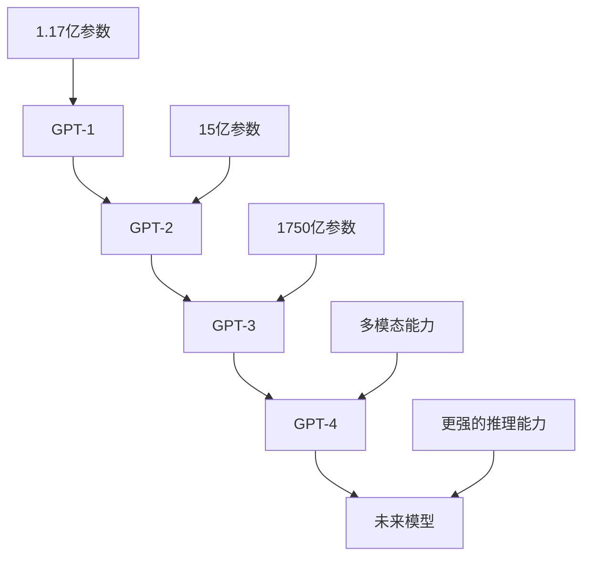
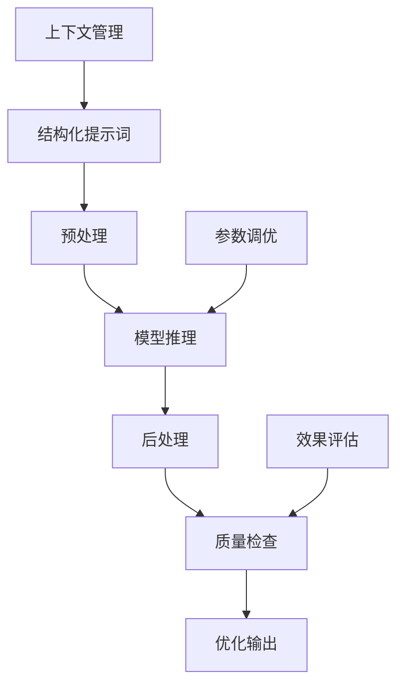
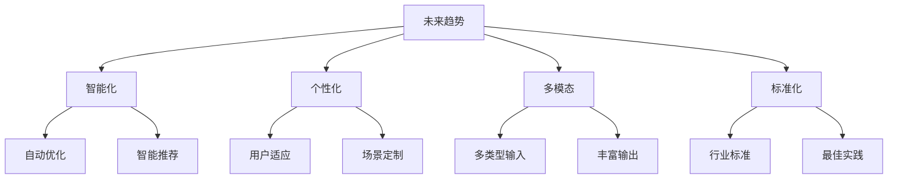

# 提示词工程发展历程

## 📅 发展时间线

### 早期阶段（2018-2020）
**技术背景**：GPT-1、GPT-2等早期语言模型出现

#### 关键事件
| 时间 | 事件 | 意义 | 影响 |
|------|------|------|------|
| 2018年6月 | GPT-1发布 | 首次展示语言模型潜力 | 开启预训练模型时代 |
| 2019年2月 | GPT-2发布 | 大幅提升模型能力 | 引发AI能力讨论 |
| 2020年5月 | GPT-3发布 | 突破性性能提升 | 推动提示词工程发展 |

#### 技术特点
- **模型规模**：从1.17亿参数到1750亿参数
- **能力提升**：从简单文本生成到复杂推理
- **应用探索**：开始探索实际应用场景

### 快速发展阶段（2021-2022）
**技术背景**：GPT-3广泛应用，提示词工程概念形成

#### 关键事件
| 时间 | 事件 | 意义 | 影响 |
|------|------|------|------|
| 2021年3月 | GPT-3 API开放 | 降低使用门槛 | 推动商业化应用 |
| 2021年12月 | 提示词工程概念提出 | 形成系统化方法 | 建立理论基础 |
| 2022年3月 | ChatGPT发布 | 改变交互方式 | 引发全球关注 |

#### 技术特点
- **方法体系**：形成系统化的提示词设计方法
- **应用扩展**：从文本生成扩展到多领域应用
- **工具发展**：出现专门的提示词管理工具

### 成熟应用阶段（2023-至今）
**技术背景**：GPT-4、Claude等大模型竞争，提示词工程标准化

#### 关键事件
| 时间 | 事件 | 意义 | 影响 |
|------|------|------|------|
| 2023年3月 | GPT-4发布 | 多模态能力突破 | 扩展应用边界 |
| 2023年4月 | Claude发布 | 竞争加剧 | 推动技术发展 |
| 2023年12月 | 提示词工程标准化 | 行业规范建立 | 促进技术普及 |

#### 技术特点
- **多模态**：支持文本、图像、音频等多种输入
- **标准化**：建立行业标准和最佳实践
- **工具化**：出现完整的工具链和平台

## 🔄 技术演进路径

### 模型能力演进


### 应用场景演进
| 发展阶段 | 主要应用 | 技术特点 | 用户群体 |
|----------|----------|----------|----------|
| **探索期** | 文本生成、问答 | 基础功能 | 技术爱好者 |
| **发展期** | 内容创作、代码生成 | 功能扩展 | 早期采用者 |
| **成熟期** | 多领域应用 | 专业化 | 广泛用户 |
| **未来期** | 智能助手、自动化 | 深度集成 | 全社会 |

## 🏗️ 技术架构发展

### 早期架构
```
简单提示词 → 模型 → 基础输出
```

### 现代架构


### 未来架构
```
多模态输入 → 智能理解 → 个性化输出 → 持续学习
```

## 📊 关键技术突破

### 1. 提示词设计方法
| 技术突破 | 时间 | 核心贡献 | 影响范围 |
|----------|------|----------|----------|
| **Few-shot Learning** | 2020 | 少样本学习 | 提升模型适应性 |
| **Chain of Thought** | 2022 | 思维链推理 | 改善复杂推理 |
| **Role Playing** | 2022 | 角色扮演 | 增强专业性 |
| **Multi-turn Dialogue** | 2023 | 多轮对话 | 支持复杂交互 |

### 2. 评估与优化技术
| 技术突破 | 时间 | 核心贡献 | 影响范围 |
|----------|------|----------|----------|
| **自动评估** | 2021 | 效果自动评估 | 提升优化效率 |
| **A/B测试** | 2022 | 对比实验方法 | 科学验证效果 |
| **持续优化** | 2023 | 迭代改进机制 | 保证长期效果 |

## 🌍 行业应用发展

### 教育领域
| 发展阶段 | 应用特点 | 典型案例 | 影响程度 |
|----------|----------|----------|----------|
| **早期** | 简单问答 | 在线答疑 | 低 |
| **发展** | 个性化辅导 | 智能导师 | 中 |
| **成熟** | 全流程支持 | 教育助手 | 高 |

### 商业领域
| 发展阶段 | 应用特点 | 典型案例 | 影响程度 |
|----------|----------|----------|----------|
| **早期** | 内容生成 | 营销文案 | 中 |
| **发展** | 数据分析 | 商业智能 | 高 |
| **成熟** | 决策支持 | 智能顾问 | 很高 |

### 技术领域
| 发展阶段 | 应用特点 | 典型案例 | 影响程度 |
|----------|----------|----------|----------|
| **早期** | 代码生成 | 编程助手 | 高 |
| **发展** | 系统设计 | 架构顾问 | 很高 |
| **成熟** | 全栈开发 | 开发平台 | 极高 |

## 🔮 未来发展趋势

### 技术趋势


### 应用趋势
| 趋势方向 | 具体表现 | 预期时间 | 影响程度 |
|----------|----------|----------|----------|
| **垂直化** | 深入特定行业 | 1-2年 | 高 |
| **平台化** | 构建服务平台 | 2-3年 | 很高 |
| **生态化** | 形成技术生态 | 3-5年 | 极高 |
| **普及化** | 全社会应用 | 5-10年 | 极高 |

## 🎯 关键里程碑

### 技术里程碑
- **2018年**：GPT-1发布，开启预训练模型时代
- **2020年**：GPT-3发布，展示强大能力
- **2022年**：ChatGPT发布，改变交互方式
- **2023年**：GPT-4发布，多模态能力突破

### 应用里程碑
- **2021年**：提示词工程概念形成
- **2022年**：商业化应用开始普及
- **2023年**：行业标准化进程启动
- **2024年**：多模态应用广泛部署

## 🎓 学习要点

### 历史启示
- 技术发展具有阶段性特征
- 应用场景不断扩展和深化
- 标准化是技术成熟的重要标志
- 用户需求驱动技术发展方向

### 未来展望
- 技术将更加智能化和个性化
- 应用将更加垂直化和专业化
- 生态将更加完善和开放
- 影响将更加广泛和深远

## 🔗 相关链接
- [[01-1-概念理解]] - 理解基本概念
- [[01-2-基本原理]] - 掌握技术原理
- [[05-2-1-技术发展趋势]] - 了解未来趋势
- [[05-2-4-未来展望]] - 展望发展前景
