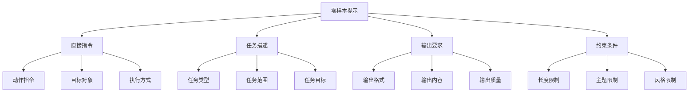
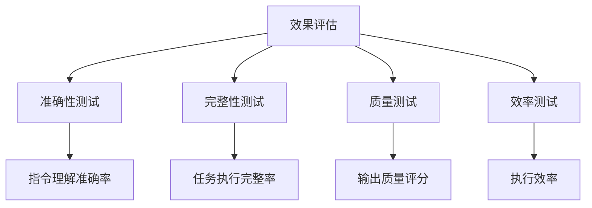

# 零样本提示

## 🎯 核心定义

### 什么是零样本提示？
零样本提示（Zero-shot Prompting）是指在没有提供任何示例的情况下，直接通过自然语言指令让AI模型执行特定任务的方法。

### 核心特点
- **无需示例**：不提供任何示例或样本
- **直接指令**：通过清晰的指令完成任务
- **通用性强**：适用于各种基础任务
- **简单高效**：操作简单，执行效率高

## 📊 零样本提示框架



## 🔍 设计要素

### 1. 直接指令
| 指令类型 | 设计要点 | 实现方法 | 应用场景 |
|----------|----------|----------|----------|
| **动作指令** | 明确执行动作 | 使用动词+名词结构 | 所有任务 |
| **目标对象** | 明确操作对象 | 使用具体名词 | 具体任务 |
| **执行方式** | 明确执行方式 | 使用方式描述 | 复杂任务 |

#### 设计模板
```markdown
基础模板：
请[动作][目标对象]

扩展模板：
请[动作][目标对象]，[执行方式]

完整模板：
请[动作][目标对象]，[执行方式]，[输出要求]
```

#### 示例对比
```markdown
❌ 指令不明确：
"处理这个数据"

✅ 指令明确：
"请分析销售数据，识别趋势，并提供改进建议"
```

### 2. 任务描述
| 描述类型 | 设计要点 | 实现方法 | 效果保证 |
|----------|----------|----------|----------|
| **任务类型** | 明确任务性质 | 使用任务分类 | 确保任务理解 |
| **任务范围** | 明确任务边界 | 使用范围描述 | 确保任务完整 |
| **任务目标** | 明确预期结果 | 使用目标描述 | 确保结果符合预期 |

#### 设计模板
```markdown
任务类型模板：
请执行[任务类型]：[具体描述]

任务范围模板：
请[任务描述]，范围包括[具体范围]

任务目标模板：
请[任务描述]，目标是[具体目标]
```

#### 示例对比
```markdown
❌ 任务描述不明确：
"写一篇文章"

✅ 任务描述明确：
"请写一篇关于人工智能发展的科普文章，目标读者是普通大众，目标是普及AI知识"
```

### 3. 输出要求
| 要求类型 | 设计要点 | 实现方法 | 效果体现 |
|----------|----------|----------|----------|
| **输出格式** | 明确输出格式 | 使用格式描述 | 确保结构化 |
| **输出内容** | 明确输出内容 | 使用内容清单 | 确保完整性 |
| **输出质量** | 明确质量标准 | 使用质量描述 | 确保质量达标 |

#### 设计模板
```markdown
输出格式模板：
请以[格式类型]输出结果

输出内容模板：
请输出以下内容：[内容清单]

输出质量模板：
请确保输出质量：[质量标准]
```

#### 示例对比
```markdown
❌ 输出要求不明确：
"分析这个市场"

✅ 输出要求明确：
"请以结构化报告形式分析市场，包含市场概况、竞争分析、机会识别三部分，确保内容准确、逻辑清晰"
```

### 4. 约束条件
| 约束类型 | 设计要点 | 实现方法 | 效果保证 |
|----------|----------|----------|----------|
| **长度限制** | 明确内容长度 | 使用字数限制 | 确保长度合适 |
| **主题限制** | 明确主题范围 | 使用主题描述 | 确保主题相关 |
| **风格限制** | 明确表达风格 | 使用风格描述 | 确保风格一致 |

#### 设计模板
```markdown
长度限制模板：
请确保输出长度在[字数范围]字以内

主题限制模板：
请确保内容主题围绕[具体主题]

风格限制模板：
请使用[具体风格]的表达方式
```

#### 示例对比
```markdown
❌ 约束条件不明确：
"写一个产品介绍"

✅ 约束条件明确：
"请写一个产品介绍，字数控制在300-500字，主题围绕产品功能特点，使用通俗易懂的语言"
```

## 🛠️ 实践技巧

### 技巧1：使用结构化指令
```markdown
模板：
请[主要动作][目标对象]：
1. [步骤1]：[具体要求]
2. [步骤2]：[具体要求]
3. [步骤3]：[具体要求]

示例：
请分析用户反馈：
1. 收集用户反馈数据
2. 分类整理反馈内容
3. 识别主要问题和建议
4. 提供改进方案
```

### 技巧2：明确输出格式
```markdown
模板：
请[任务描述]，输出格式如下：
[格式描述]

示例：
请分析销售数据，输出格式如下：
# 销售数据分析报告
## 1. 数据概览
- 总销售额：[数值]
- 增长率：[百分比]
## 2. 趋势分析
[趋势描述]
## 3. 改进建议
[建议内容]
```

### 技巧3：设置质量约束
```markdown
模板：
请[任务描述]，确保：
- [质量要求1]
- [质量要求2]
- [质量要求3]

示例：
请写一份市场分析报告，确保：
- 内容基于真实数据
- 分析逻辑清晰
- 建议具有可操作性
- 字数控制在1000字以内
```

## 📈 效果评估

### 评估维度
| 评估指标 | 评估标准 | 评估方法 | 改进方向 |
|----------|----------|----------|----------|
| **理解准确性** | 是否准确理解指令 | 输出结果对比 | 优化指令表达 |
| **执行完整性** | 是否完整执行任务 | 完成度检查 | 明确任务边界 |
| **输出质量** | 输出质量是否达标 | 质量评估 | 提高质量标准 |
| **效率** | 执行效率如何 | 时间效率测量 | 优化指令结构 |

### 评估方法


## 🎯 应用场景

### 场景1：基础任务
```markdown
应用：执行基础的信息处理任务
方法：使用简单的直接指令
效果：快速完成基础任务
```

### 场景2：内容生成
```markdown
应用：生成各种类型的内容
方法：明确内容类型和要求
效果：生成符合要求的内容
```

### 场景3：数据分析
```markdown
应用：执行基础的数据分析
方法：明确分析目标和输出格式
效果：提供结构化的分析结果
```

## ⚠️ 常见问题

### 问题1：指令过于简单
**表现**：指令描述不够详细
**解决**：增加具体的执行步骤和要求
**方法**：使用结构化指令模板

### 问题2：输出质量不稳定
**表现**：输出质量参差不齐
**解决**：增加质量约束和标准
**方法**：明确质量要求和评估标准

### 问题3：任务理解偏差
**表现**：模型理解与预期不符
**解决**：优化指令表达和结构
**方法**：使用更清晰的任务描述

## 🎓 学习要点

### 核心理解
- 零样本提示是基础但重要的提示方法
- 清晰的指令是成功的关键
- 适当的约束有助于提高输出质量
- 结构化设计有助于提高执行效率

### 实践建议
- 从简单任务开始练习零样本提示
- 使用结构化模板提高指令质量
- 通过测试验证提示效果
- 持续优化和改进指令设计

## 🔗 相关链接
- [[02-3-2-少样本提示]] - 学习少样本提示
- [[02-3-3-思维链提示]] - 学习思维链提示
- [[02-2-2-Task任务描述]] - 学习任务描述技巧
- [[03-1-1-文本生成应用]] - 实践应用场景
