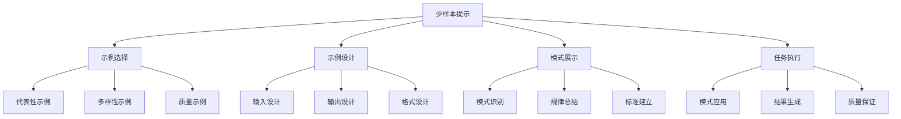
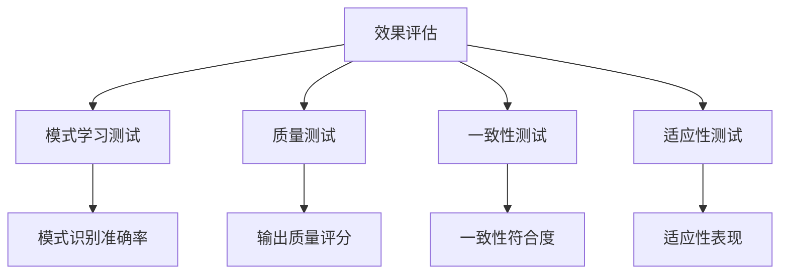

# 少样本提示

## 🎯 核心定义

### 什么是少样本提示？
少样本提示（Few-shot Prompting）是指在提示词中提供少量示例（通常1-5个），帮助AI模型理解任务模式和要求，从而更好地执行类似任务的方法。

### 核心特点
- **示例引导**：通过示例展示期望的输出模式
- **模式学习**：帮助模型学习任务模式
- **效果提升**：相比零样本提示效果更好
- **适用性强**：适用于各种复杂任务

## 📊 少样本提示框架



## 🔍 设计要素

### 1. 示例选择
| 选择标准 | 设计要点 | 实现方法 | 应用场景 |
|----------|----------|----------|----------|
| **代表性** | 选择典型示例 | 覆盖主要情况 | 通用任务 |
| **多样性** | 选择多样示例 | 展示不同变体 | 复杂任务 |
| **质量** | 选择高质量示例 | 确保示例正确 | 所有任务 |

#### 设计模板
```markdown
代表性示例模板：
请参考以下示例：
示例1：[典型情况]
示例2：[典型情况]
示例3：[典型情况]

多样性示例模板：
请参考以下不同情况的示例：
示例1：[情况A]
示例2：[情况B]
示例3：[情况C]

质量示例模板：
请参考以下高质量示例：
示例1：[高质量示例]
示例2：[高质量示例]
示例3：[高质量示例]
```

#### 示例对比
```markdown
❌ 示例选择不当：
"请参考以下示例：
示例1：写一个产品介绍
示例2：写一个产品介绍
示例3：写一个产品介绍"

✅ 示例选择恰当：
"请参考以下示例：
示例1：智能手表 - 功能全面，设计时尚，适合运动爱好者
示例2：学习平板 - 护眼屏幕，教育资源丰富，适合学生使用
示例3：智能音箱 - 语音控制，音质出色，适合家庭使用"
```

### 2. 示例设计
| 设计要素 | 设计要点 | 实现方法 | 效果保证 |
|----------|----------|----------|----------|
| **输入设计** | 设计清晰的输入 | 使用标准格式 | 确保理解准确 |
| **输出设计** | 设计期望的输出 | 使用目标格式 | 确保输出质量 |
| **格式设计** | 设计一致的格式 | 使用统一格式 | 确保格式一致 |

#### 设计模板
```markdown
输入设计模板：
输入：[具体输入内容]
输出：[期望输出内容]

输出设计模板：
请按以下格式输出：
输入：[输入格式]
输出：[输出格式]

格式设计模板：
请遵循以下格式：
输入：[统一格式]
输出：[统一格式]
```

#### 示例对比
```markdown
❌ 示例设计不清晰：
"示例1：产品A - 很好
示例2：产品B - 不错
示例3：产品C - 可以"

✅ 示例设计清晰：
"示例1：
输入：智能手表
输出：智能手表 - 功能全面，设计时尚，适合运动爱好者
示例2：
输入：学习平板
输出：学习平板 - 护眼屏幕，教育资源丰富，适合学生使用
示例3：
输入：智能音箱
输出：智能音箱 - 语音控制，音质出色，适合家庭使用"
```

### 3. 模式展示
| 展示方式 | 设计要点 | 实现方法 | 效果体现 |
|----------|----------|----------|----------|
| **模式识别** | 帮助识别模式 | 使用对比展示 | 提高模式识别 |
| **规律总结** | 总结输出规律 | 使用规律描述 | 提高规律理解 |
| **标准建立** | 建立输出标准 | 使用标准描述 | 提高标准一致性 |

#### 设计模板
```markdown
模式识别模板：
请观察以下示例的模式：
[示例展示]
模式：[模式描述]

规律总结模板：
请总结以下示例的规律：
[示例展示]
规律：[规律描述]

标准建立模板：
请建立以下示例的标准：
[示例展示]
标准：[标准描述]
```

#### 示例对比
```markdown
❌ 模式展示不明确：
"请参考这些示例"

✅ 模式展示明确：
"请观察以下示例的模式：
示例1：智能手表 - 功能全面，设计时尚，适合运动爱好者
示例2：学习平板 - 护眼屏幕，教育资源丰富，适合学生使用
示例3：智能音箱 - 语音控制，音质出色，适合家庭使用
模式：产品名称 - 主要特点1，主要特点2，目标用户群体"
```

### 4. 任务执行
| 执行要素 | 设计要点 | 实现方法 | 效果保证 |
|----------|----------|----------|----------|
| **模式应用** | 应用学习到的模式 | 使用模式指导 | 确保模式应用 |
| **结果生成** | 生成符合模式的结果 | 使用模式约束 | 确保结果质量 |
| **质量保证** | 保证输出质量 | 使用质量检查 | 确保质量达标 |

#### 设计模板
```markdown
模式应用模板：
请按照学习到的模式执行任务：
[任务描述]

结果生成模板：
请生成符合模式的结果：
[任务描述]

质量保证模板：
请确保输出质量：
[质量要求]
```

#### 示例对比
```markdown
❌ 任务执行不明确：
"现在请写一个产品介绍"

✅ 任务执行明确：
"请按照学习到的模式，为以下产品写介绍：
产品：无线耳机
要求：按照"产品名称 - 主要特点1，主要特点2，目标用户群体"的格式"
```

## 🛠️ 实践技巧

### 技巧1：示例数量控制
```markdown
模板：
请参考以下[数量]个示例：
[示例展示]
现在请[任务描述]

示例：
请参考以下3个示例：
示例1：[示例内容]
示例2：[示例内容]
示例3：[示例内容]
现在请为新产品写介绍
```

### 技巧2：示例质量保证
```markdown
模板：
请参考以下高质量示例：
[高质量示例展示]
请确保输出质量达到示例标准

示例：
请参考以下高质量示例：
示例1：智能手表 - 功能全面，设计时尚，适合运动爱好者
示例2：学习平板 - 护眼屏幕，教育资源丰富，适合学生使用
请确保输出质量达到示例标准
```

### 技巧3：模式总结
```markdown
模板：
请观察以下示例的模式：
[示例展示]
模式：[模式总结]
请按照此模式执行任务

示例：
请观察以下示例的模式：
示例1：智能手表 - 功能全面，设计时尚，适合运动爱好者
示例2：学习平板 - 护眼屏幕，教育资源丰富，适合学生使用
模式：产品名称 - 主要特点1，主要特点2，目标用户群体
请按照此模式为新产品写介绍
```

## 📈 效果评估

### 评估维度
| 评估指标 | 评估标准 | 评估方法 | 改进方向 |
|----------|----------|----------|----------|
| **模式学习** | 是否学会示例模式 | 模式一致性检查 | 优化示例设计 |
| **输出质量** | 输出质量是否达标 | 质量对比评估 | 提高示例质量 |
| **一致性** | 输出是否与示例一致 | 一致性检查 | 强化模式约束 |
| **适应性** | 是否适应新任务 | 适应性测试 | 增加示例多样性 |

### 评估方法


## 🎯 应用场景

### 场景1：格式转换
```markdown
应用：将内容转换为特定格式
方法：提供格式示例
效果：确保输出格式一致
```

### 场景2：风格模仿
```markdown
应用：模仿特定写作风格
方法：提供风格示例
效果：确保风格一致
```

### 场景3：分类任务
```markdown
应用：执行分类任务
方法：提供分类示例
效果：提高分类准确性
```

## ⚠️ 常见问题

### 问题1：示例数量不当
**表现**：示例过多或过少
**解决**：根据任务复杂度调整示例数量
**方法**：简单任务1-2个，复杂任务3-5个

### 问题2：示例质量不高
**表现**：示例质量参差不齐
**解决**：选择高质量、代表性强的示例
**方法**：确保示例正确、完整、典型

### 问题3：模式不清晰
**表现**：示例模式不明确
**解决**：明确展示示例模式
**方法**：使用模式总结和规律描述

## 🎓 学习要点

### 核心理解
- 少样本提示通过示例引导提高效果
- 示例质量直接影响输出质量
- 模式学习是少样本提示的核心
- 适当的示例数量有助于效果提升

### 实践建议
- 从简单任务开始练习少样本提示
- 选择高质量、代表性的示例
- 明确展示示例模式
- 通过测试验证提示效果

## 🔗 相关链接
- [[02-3-1-零样本提示]] - 回顾零样本提示
- [[02-3-3-思维链提示]] - 学习思维链提示
- [[02-3-4-角色扮演提示]] - 学习角色扮演提示
- [[03-1-3-内容创作应用]] - 实践应用场景
