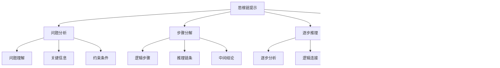
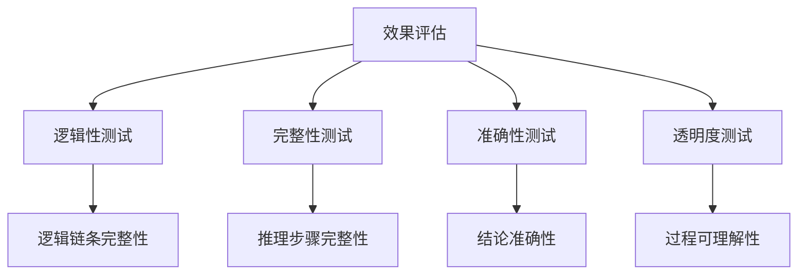

# 思维链提示

## 🎯 核心定义

### 什么是思维链提示？
思维链提示（Chain of Thought Prompting）是指通过引导AI模型展示其推理过程，逐步分析问题并得出结论的提示方法。这种方法特别适用于需要逻辑推理的复杂任务。

### 核心特点
- **逐步推理**：展示完整的推理过程
- **逻辑清晰**：每一步都有明确的逻辑关系
- **透明度高**：用户可以理解推理过程
- **准确性提升**：通过逐步推理提高准确性

## 📊 思维链提示框架



## 🔍 设计要素

### 1. 问题分析
| 分析要素 | 设计要点 | 实现方法 | 应用场景 |
|----------|----------|----------|----------|
| **问题理解** | 明确问题本质 | 使用问题重述 | 复杂问题 |
| **关键信息** | 识别关键信息 | 使用信息提取 | 信息处理 |
| **约束条件** | 明确约束条件 | 使用条件分析 | 约束优化 |

#### 设计模板
```markdown
问题理解模板：
首先，让我理解这个问题：
[问题重述]
这个问题的核心是：[核心问题]

关键信息模板：
从问题中提取的关键信息：
1. [关键信息1]
2. [关键信息2]
3. [关键信息3]

约束条件模板：
问题的约束条件包括：
- [约束1]
- [约束2]
- [约束3]
```

#### 示例对比
```markdown
❌ 问题分析不清晰：
"分析这个销售数据"

✅ 问题分析清晰：
"首先，让我理解这个问题：
需要分析2023年Q1-Q3的销售数据，识别销售趋势和问题。
从问题中提取的关键信息：
1. 时间范围：2023年Q1-Q3
2. 数据类型：销售数据
3. 分析目标：趋势识别和问题发现
问题的约束条件包括：
- 数据完整性要求
- 分析准确性要求
- 时间效率要求"
```

### 2. 步骤分解
| 分解要素 | 设计要点 | 实现方法 | 效果保证 |
|----------|----------|----------|----------|
| **逻辑步骤** | 明确推理步骤 | 使用步骤编号 | 确保逻辑性 |
| **推理链条** | 建立推理链条 | 使用逻辑连接 | 确保连贯性 |
| **中间结论** | 明确中间结论 | 使用结论标记 | 确保准确性 |

#### 设计模板
```markdown
逻辑步骤模板：
分析步骤：
步骤1：[具体步骤]
步骤2：[具体步骤]
步骤3：[具体步骤]

推理链条模板：
推理过程：
因为[原因1]，所以[结论1]
因为[原因2]，所以[结论2]
因为[原因3]，所以[结论3]

中间结论模板：
中间结论：
- 结论1：[具体结论]
- 结论2：[具体结论]
- 结论3：[具体结论]
```

#### 示例对比
```markdown
❌ 步骤分解不明确：
"分析销售趋势"

✅ 步骤分解明确：
"分析步骤：
步骤1：计算各季度销售额和增长率
步骤2：分析销售额变化趋势
步骤3：识别影响销售的关键因素
步骤4：预测未来销售趋势
推理过程：
因为Q1销售额为1000万，Q2为1200万，Q3为1100万，所以整体呈上升趋势
因为Q3相比Q2有所下降，所以需要分析下降原因
因为市场竞争加剧，所以可能是主要影响因素"
```

### 3. 逐步推理
| 推理要素 | 设计要点 | 实现方法 | 效果体现 |
|----------|----------|----------|----------|
| **逐步分析** | 逐步深入分析 | 使用递进分析 | 提高分析深度 |
| **逻辑连接** | 建立逻辑连接 | 使用逻辑词 | 确保逻辑性 |
| **证据支持** | 提供证据支持 | 使用数据支撑 | 确保可信度 |

#### 设计模板
```markdown
逐步分析模板：
逐步分析：
1. 首先分析[分析对象1]
2. 然后分析[分析对象2]
3. 接着分析[分析对象3]
4. 最后综合分析

逻辑连接模板：
逻辑关系：
- 由于[原因]，因此[结果]
- 基于[基础]，可以得出[结论]
- 考虑到[因素]，所以[判断]

证据支持模板：
证据支持：
- 数据证据：[具体数据]
- 事实证据：[具体事实]
- 逻辑证据：[逻辑推理]
```

#### 示例对比
```markdown
❌ 逐步推理不清晰：
"销售额下降是因为市场竞争"

✅ 逐步推理清晰：
"逐步分析：
1. 首先分析销售额变化：Q2为1200万，Q3为1100万，下降8.3%
2. 然后分析市场环境：竞争对手推出新产品，价格战加剧
3. 接着分析内部因素：产品更新滞后，营销投入不足
4. 最后综合分析：内外因素共同影响
逻辑关系：
- 由于竞争对手推出新产品，因此市场份额被抢占
- 基于价格战加剧，可以得出利润空间压缩
- 考虑到产品更新滞后，所以竞争力下降
证据支持：
- 数据证据：Q3市场份额从15%下降到12%
- 事实证据：3个主要竞争对手推出新产品
- 逻辑证据：产品生命周期进入成熟期"
```

### 4. 结论验证
| 验证要素 | 设计要点 | 实现方法 | 效果保证 |
|----------|----------|----------|----------|
| **结论总结** | 总结最终结论 | 使用结论归纳 | 确保完整性 |
| **逻辑验证** | 验证逻辑正确性 | 使用逻辑检查 | 确保正确性 |
| **结果确认** | 确认结果合理性 | 使用合理性检查 | 确保可行性 |

#### 设计模板
```markdown
结论总结模板：
最终结论：
基于以上分析，可以得出以下结论：
1. [结论1]
2. [结论2]
3. [结论3]

逻辑验证模板：
逻辑验证：
- 结论1的逻辑链条：[逻辑链条]
- 结论2的逻辑链条：[逻辑链条]
- 结论3的逻辑链条：[逻辑链条]

结果确认模板：
结果确认：
- 结论的合理性：[合理性分析]
- 结论的可行性：[可行性分析]
- 结论的完整性：[完整性检查]
```

#### 示例对比
```markdown
❌ 结论验证不完整：
"建议加强产品创新"

✅ 结论验证完整：
"最终结论：
基于以上分析，可以得出以下结论：
1. 销售额下降主要由于市场竞争加剧和产品竞争力不足
2. 需要加强产品创新和营销投入
3. 预计通过改进措施，Q4销售额可恢复到1200万
逻辑验证：
- 结论1的逻辑链条：市场环境变化→竞争加剧→销售额下降
- 结论2的逻辑链条：问题识别→解决方案→改进措施
- 结论3的逻辑链条：措施实施→效果预期→目标达成
结果确认：
- 结论的合理性：基于数据分析，逻辑合理
- 结论的可行性：措施具体，可操作性强
- 结论的完整性：覆盖问题、原因、解决方案"
```

## 🛠️ 实践技巧

### 技巧1：使用思维链模板
```markdown
模板：
请按以下步骤分析[问题]：
1. 问题理解：[理解问题]
2. 信息提取：[提取关键信息]
3. 逐步分析：[逐步分析]
4. 逻辑推理：[逻辑推理]
5. 结论总结：[总结结论]

示例：
请按以下步骤分析销售数据：
1. 问题理解：分析2023年销售趋势和问题
2. 信息提取：提取销售额、增长率、市场份额等关键数据
3. 逐步分析：分析各季度变化、影响因素、竞争态势
4. 逻辑推理：建立因果关系，分析影响机制
5. 结论总结：总结趋势、问题、建议
```

### 技巧2：逻辑连接词使用
```markdown
模板：
使用以下逻辑连接词：
- 因为...所以...
- 由于...因此...
- 基于...可以得出...
- 考虑到...所以...
- 首先...然后...接着...最后...

示例：
因为Q3销售额下降，所以需要分析原因
由于市场竞争加剧，因此需要调整策略
基于数据分析，可以得出改进方向
考虑到资源限制，所以需要优先重点
首先分析问题，然后制定方案，接着实施措施，最后评估效果
```

### 技巧3：证据支撑
```markdown
模板：
为每个结论提供证据支撑：
- 数据证据：[具体数据]
- 事实证据：[具体事实]
- 逻辑证据：[逻辑推理]
- 经验证据：[相关经验]

示例：
为销售额下降结论提供证据支撑：
- 数据证据：Q3销售额1100万，比Q2下降8.3%
- 事实证据：3个竞争对手推出新产品
- 逻辑证据：产品生命周期进入成熟期
- 经验证据：类似产品在成熟期通常面临竞争压力
```

## 📈 效果评估

### 评估维度
| 评估指标 | 评估标准 | 评估方法 | 改进方向 |
|----------|----------|----------|----------|
| **逻辑性** | 推理过程是否逻辑清晰 | 逻辑链条检查 | 优化推理结构 |
| **完整性** | 推理过程是否完整 | 步骤完整性检查 | 补充缺失步骤 |
| **准确性** | 推理结论是否准确 | 结论验证 | 提高推理准确性 |
| **透明度** | 推理过程是否透明 | 过程可理解性 | 提高过程清晰度 |

### 评估方法


## 🎯 应用场景

### 场景1：复杂问题分析
```markdown
应用：分析复杂的业务问题
方法：使用思维链逐步分析
效果：提供深入、准确的分析结果
```

### 场景2：决策支持
```markdown
应用：为决策提供逻辑支持
方法：展示完整的推理过程
效果：提高决策的科学性和可信度
```

### 场景3：问题解决
```markdown
应用：解决复杂的技术问题
方法：逐步分析问题原因和解决方案
效果：提供系统性的解决方案
```

## ⚠️ 常见问题

### 问题1：推理步骤跳跃
**表现**：推理过程存在逻辑跳跃
**解决**：补充中间步骤和逻辑连接
**方法**：使用逻辑连接词和中间结论

### 问题2：证据不足
**表现**：结论缺乏充分证据支持
**解决**：为每个结论提供证据支撑
**方法**：使用数据、事实、逻辑等多种证据

### 问题3：结论不准确
**表现**：推理结论与实际情况不符
**解决**：验证推理逻辑和结论合理性
**方法**：进行逻辑验证和结果确认

## 🎓 学习要点

### 核心理解
- 思维链提示通过展示推理过程提高准确性
- 逻辑清晰是思维链提示的关键
- 证据支撑有助于提高结论可信度
- 逐步推理有助于处理复杂问题

### 实践建议
- 从简单问题开始练习思维链提示
- 使用逻辑连接词提高推理清晰度
- 为每个结论提供证据支撑
- 通过验证确保推理准确性

## 🔗 相关链接
- [[02-3-2-少样本提示]] - 回顾少样本提示
- [[02-3-4-角色扮演提示]] - 学习角色扮演提示
- [[03-2-2-复杂任务分解]] - 实践应用场景
- [[04-1-1-提示词链式设计]] - 进阶应用技巧
