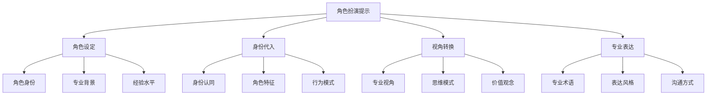
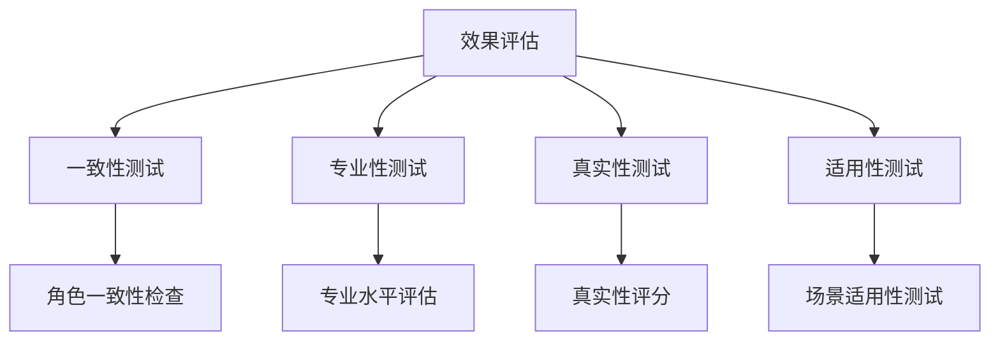

# 角色扮演提示

## 🎯 核心定义

### 什么是角色扮演提示？
角色扮演提示（Role-playing Prompting）是指通过让AI模型扮演特定角色，以该角色的身份、视角、知识和表达方式来执行任务的提示方法。

### 核心特点
- **身份代入**：完全代入特定角色身份
- **视角转换**：以角色视角看待问题
- **专业表达**：使用角色的专业语言
- **情境适应**：适应角色的工作环境

## 📊 角色扮演提示框架



## 🔍 设计要素

### 1. 角色设定
| 设定要素 | 设计要点 | 实现方法 | 应用场景 |
|----------|----------|----------|----------|
| **角色身份** | 明确具体角色 | 使用职业名称 | 专业咨询 |
| **专业背景** | 描述专业领域 | 使用专业描述 | 技术指导 |
| **经验水平** | 设定经验程度 | 使用经验描述 | 业务咨询 |

#### 设计模板
```markdown
基础角色模板：
你是一位[角色身份]，拥有[经验年限]年[专业领域]经验。

详细角色模板：
你是一位[角色身份]，拥有[经验年限]年[专业领域]经验，擅长[核心技能]，在[相关行业]有丰富经验。

专业角色模板：
你是一位资深[角色身份]，是[专业领域]的专家，拥有[经验年限]年经验，曾[相关成就]。
```

#### 示例对比
```markdown
❌ 角色设定不明确：
"帮我分析这个数据"

✅ 角色设定明确：
"你是一位资深的数据分析师，拥有10年大数据分析经验，擅长商业智能和预测分析，在电商、金融、教育等行业有丰富经验。"
```

### 2. 身份代入
| 代入要素 | 设计要点 | 实现方法 | 效果保证 |
|----------|----------|----------|----------|
| **身份认同** | 完全认同角色身份 | 使用身份描述 | 确保角色一致性 |
| **角色特征** | 体现角色特征 | 使用特征描述 | 确保角色真实性 |
| **行为模式** | 遵循角色行为模式 | 使用行为描述 | 确保行为一致性 |

#### 设计模板
```markdown
身份认同模板：
请完全以[角色身份]的身份思考和处理问题。

角色特征模板：
请体现[角色身份]的以下特征：
- [特征1]：[具体描述]
- [特征2]：[具体描述]
- [特征3]：[具体描述]

行为模式模板：
请遵循[角色身份]的行为模式：
- [行为1]：[具体描述]
- [行为2]：[具体描述]
- [行为3]：[具体描述]
```

#### 示例对比
```markdown
❌ 身份代入不充分：
"你是一个分析师，分析这个数据"

✅ 身份代入充分：
"请完全以资深数据分析师的身份思考和处理问题，体现以下特征：
- 严谨：基于数据事实进行分析
- 专业：使用专业术语和方法
- 洞察：提供深入的业务洞察
请遵循数据分析师的行为模式：
- 先理解业务背景
- 再分析数据特征
- 最后提供专业建议"
```

### 3. 视角转换
| 转换要素 | 设计要点 | 实现方法 | 效果体现 |
|----------|----------|----------|----------|
| **专业视角** | 以专业视角看待问题 | 使用专业描述 | 提供专业洞察 |
| **思维模式** | 使用角色思维模式 | 使用思维描述 | 确保思维一致性 |
| **价值观念** | 体现角色价值观念 | 使用价值描述 | 确保价值一致性 |

#### 设计模板
```markdown
专业视角模板：
请以[角色身份]的专业视角分析问题，关注[专业关注点]。

思维模式模板：
请使用[角色身份]的思维模式：
- [思维特点1]：[具体描述]
- [思维特点2]：[具体描述]
- [思维特点3]：[具体描述]

价值观念模板：
请体现[角色身份]的价值观念：
- [价值观1]：[具体描述]
- [价值观2]：[具体描述]
- [价值观3]：[具体描述]
```

#### 示例对比
```markdown
❌ 视角转换不充分：
"分析这个市场"

✅ 视角转换充分：
"请以资深市场分析师的视角分析问题，关注市场趋势、竞争格局、用户需求。
请使用市场分析师的思维模式：
- 系统性：从宏观到微观分析
- 数据驱动：基于数据得出结论
- 前瞻性：预测未来发展趋势
请体现市场分析师的价值观念：
- 客观：基于事实进行分析
- 创新：寻找新的市场机会
- 实用：提供可操作的建议"
```

### 4. 专业表达
| 表达要素 | 设计要点 | 实现方法 | 效果保证 |
|----------|----------|----------|----------|
| **专业术语** | 使用角色专业术语 | 使用术语描述 | 确保专业性 |
| **表达风格** | 使用角色表达风格 | 使用风格描述 | 确保风格一致 |
| **沟通方式** | 使用角色沟通方式 | 使用沟通描述 | 确保沟通有效 |

#### 设计模板
```markdown
专业术语模板：
请使用[角色身份]的专业术语，如[术语1]、[术语2]、[术语3]。

表达风格模板：
请使用[角色身份]的表达风格：
- [风格特点1]：[具体描述]
- [风格特点2]：[具体描述]
- [风格特点3]：[具体描述]

沟通方式模板：
请使用[角色身份]的沟通方式：
- [沟通特点1]：[具体描述]
- [沟通特点2]：[具体描述]
- [沟通特点3]：[具体描述]
```

#### 示例对比
```markdown
❌ 专业表达不充分：
"这个产品不错"

✅ 专业表达充分：
"请使用产品经理的专业术语，如用户画像、产品定位、功能矩阵、用户体验。
请使用产品经理的表达风格：
- 用户导向：从用户角度思考问题
- 数据支撑：用数据支持观点
- 简洁明了：表达清晰简洁
请使用产品经理的沟通方式：
- 结构化：逻辑清晰，层次分明
- 可视化：使用图表和模型
-  actionable：提供可执行的建议"
```

## 🛠️ 实践技巧

### 技巧1：角色深度设定
```markdown
模板：
你是一位[角色身份]，请完全代入这个角色：
- 身份背景：[详细背景]
- 专业能力：[专业能力]
- 工作环境：[工作环境]
- 价值观念：[价值观念]
- 表达风格：[表达风格]

示例：
你是一位资深的产品经理，请完全代入这个角色：
- 身份背景：在互联网公司工作8年，负责过多个成功产品
- 专业能力：用户研究、产品设计、数据分析、项目管理
- 工作环境：快节奏的互联网环境，注重用户体验和商业价值
- 价值观念：用户至上、数据驱动、持续创新
- 表达风格：简洁明了、逻辑清晰、 actionable
```

### 技巧2：多角色协作
```markdown
模板：
请从以下角色视角分析[问题]：
1. [角色1]：[角色描述]
2. [角色2]：[角色描述]
3. [角色3]：[角色描述]
请分别以每个角色的身份提供专业建议。

示例：
请从以下角色视角分析产品设计：
1. 用户体验设计师：关注用户交互和界面设计
2. 技术架构师：关注技术实现和系统架构
3. 商业分析师：关注商业价值和市场机会
请分别以每个角色的身份提供专业建议。
```

### 技巧3：角色情境化
```markdown
模板：
你是一位[角色身份]，现在面临以下情境：
[具体情境描述]
请以这个角色的身份，在这个情境下[执行任务]。

示例：
你是一位资深的数据分析师，现在面临以下情境：
公司CEO要求你在明天的董事会上汇报Q3销售数据分析结果，董事会成员包括技术背景和业务背景的高管。
请以数据分析师的身份，在这个情境下分析销售数据并提供汇报建议。
```

## 📈 效果评估

### 评估维度
| 评估指标 | 评估标准 | 评估方法 | 改进方向 |
|----------|----------|----------|----------|
| **角色一致性** | 是否保持角色一致性 | 角色特征检查 | 强化角色设定 |
| **专业性** | 是否体现专业水平 | 专业度评估 | 提高专业描述 |
| **真实性** | 是否真实可信 | 真实性评估 | 增强角色真实性 |
| **适用性** | 是否适用于目标场景 | 场景适用性测试 | 优化角色匹配 |

### 评估方法


## 🎯 应用场景

### 场景1：专业咨询
```markdown
应用：提供专业领域咨询
方法：设定相关专业角色
效果：确保建议的专业性和权威性
```

### 场景2：教育培训
```markdown
应用：提供教育培训内容
方法：设定教育专家角色
效果：确保内容的专业性和教学效果
```

### 场景3：创意设计
```markdown
应用：提供创意设计建议
方法：设定创意专家角色
效果：确保创意的专业性和创新性
```

## ⚠️ 常见问题

### 问题1：角色设定不充分
**表现**：角色描述不够详细
**解决**：增加详细的角色背景和特征
**方法**：使用角色深度设定模板

### 问题2：角色一致性不足
**表现**：输出与角色设定不符
**解决**：强化角色代入和一致性要求
**方法**：明确角色特征和行为模式

### 问题3：专业性不够
**表现**：缺乏专业深度
**解决**：增加专业背景和术语使用
**方法**：提供专业描述和术语指导

## 🎓 学习要点

### 核心理解
- 角色扮演提示通过身份代入提高专业性
- 充分的角色设定是成功的关键
- 视角转换有助于提供专业洞察
- 专业表达确保输出质量

### 实践建议
- 从熟悉的专业领域开始练习角色扮演
- 使用详细的角色设定模板
- 强化角色代入和一致性
- 通过测试验证角色扮演效果

## 🔗 相关链接
- [[02-3-3-思维链提示]] - 回顾思维链提示
- [[02-2-1-Role角色设定]] - 学习角色设定技巧
- [[02-1-4-角色设定原则]] - 学习角色设定原则
- [[03-3-1-教育领域案例]] - 实践应用场景
