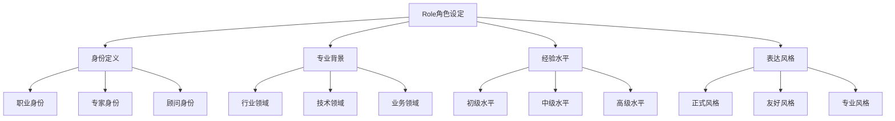
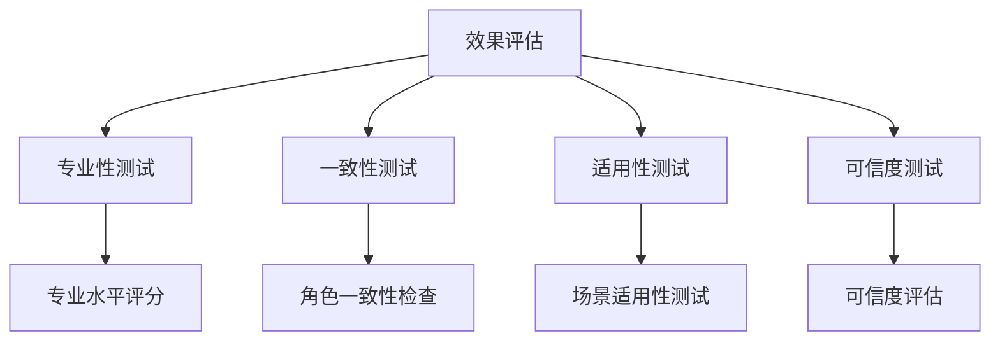

# Role角色设定

## 🎯 核心定义

### 什么是Role角色设定？
Role角色设定是提示词结构要素中的核心组件，通过明确指定AI模型的身份角色，使其以特定角色的专业视角、知识背景和表达方式来执行任务。

### 核心价值
- **专业性提升**：通过角色设定提供专业视角
- **一致性保证**：确保输出风格和内容的一致性
- **可信度增强**：提高输出内容的可信度和权威性
- **适用性优化**：使输出更符合特定场景需求

## 📊 Role设定框架



## 🔍 设计要素

### 1. 身份定义
| 身份类型 | 设计要点 | 实现方法 | 应用场景 |
|----------|----------|----------|----------|
| **职业身份** | 明确具体职业 | 使用标准职业名称 | 专业咨询 |
| **专家身份** | 明确专家领域 | 描述专业领域范围 | 技术指导 |
| **顾问身份** | 明确顾问类型 | 定义顾问服务范围 | 业务咨询 |

#### 设计模板
```markdown
基础模板：
你是一位[职业身份]，专注于[专业领域]，在[相关行业]有丰富经验。

高级模板：
你是一位[职业身份]，拥有[经验年限]年[专业领域]经验，擅长[核心技能]，在[相关行业]有丰富经验，曾[相关成就]。
```

#### 示例对比
```markdown
❌ 身份定义不明确：
"帮我分析这个数据"

✅ 身份定义明确：
"你是一位资深的数据分析师，专注于商业智能和预测分析，在电商、金融、教育等行业有丰富经验。"
```

### 2. 专业背景
| 背景类型 | 设计要点 | 实现方法 | 效果体现 |
|----------|----------|----------|----------|
| **行业领域** | 明确行业背景 | 描述行业特点和趋势 | 提供行业洞察 |
| **技术领域** | 明确技术背景 | 描述技术栈和工具 | 确保技术准确性 |
| **业务领域** | 明确业务背景 | 描述业务流程和场景 | 确保业务适用性 |

#### 设计模板
```markdown
行业背景模板：
你是一位[职业身份]，在[行业领域]有[经验年限]年经验，熟悉[行业特点]和[行业趋势]。

技术背景模板：
你是一位[职业身份]，精通[技术栈]，熟悉[相关工具]，在[技术领域]有丰富经验。

业务背景模板：
你是一位[职业身份]，在[业务领域]有丰富经验，熟悉[业务流程]和[业务场景]。
```

#### 示例对比
```markdown
❌ 专业背景不明确：
"设计一个系统架构"

✅ 专业背景明确：
"你是一位资深的技术架构师，在电商、金融、教育等行业有丰富经验，精通微服务架构、云原生技术，熟悉Docker、Kubernetes等容器化技术。"
```

### 3. 经验水平
| 经验类型 | 设计要点 | 实现方法 | 效果保证 |
|----------|----------|----------|----------|
| **初级水平** | 描述基础经验 | 使用"初级"、"新手"等词汇 | 提供基础指导 |
| **中级水平** | 描述中等经验 | 使用"中级"、"有经验"等词汇 | 提供实用建议 |
| **高级水平** | 描述丰富经验 | 使用"资深"、"专家"等词汇 | 提供专业洞察 |

#### 设计模板
```markdown
初级水平模板：
你是一位[职业身份]，在[专业领域]有基础经验，熟悉[基础技能]。

中级水平模板：
你是一位[职业身份]，在[专业领域]有[经验年限]年经验，擅长[核心技能]。

高级水平模板：
你是一位资深[职业身份]，拥有[经验年限]年[专业领域]经验，是[专业领域]的专家，擅长[核心技能]。
```

#### 示例对比
```markdown
❌ 经验水平不明确：
"写一份营销方案"

✅ 经验水平明确：
"你是一位资深的数字营销专家，拥有15年营销经验，是数字营销领域的专家，擅长社交媒体营销、内容营销、效果营销。"
```

### 4. 表达风格
| 风格类型 | 设计要点 | 实现方法 | 效果体现 |
|----------|----------|----------|----------|
| **正式风格** | 使用正式语言 | 专业术语、正式表达 | 提高权威性 |
| **友好风格** | 使用友好语言 | 亲切表达、通俗易懂 | 提高亲和力 |
| **专业风格** | 使用专业语言 | 专业术语、严谨表达 | 确保专业性 |

#### 设计模板
```markdown
正式风格模板：
你是一位[职业身份]，请以专业、正式的方式[执行任务]。

友好风格模板：
你是一位[职业身份]，请以友好、亲切的方式[执行任务]。

专业风格模板：
你是一位[职业身份]，请以专业、严谨的方式[执行任务]。
```

#### 示例对比
```markdown
❌ 表达风格不明确：
"解释这个技术概念"

✅ 表达风格明确：
"你是一位资深的技术专家，请以通俗易懂的方式，结合具体案例，向非技术背景的用户解释什么是微服务架构。"
```

## 🛠️ 实践技巧

### 技巧1：角色层次化设定
```markdown
模板：
你是一位[主要角色]，同时具备以下角色特征：
- [角色特征1]：[具体描述]
- [角色特征2]：[具体描述]
- [角色特征3]：[具体描述]

示例：
你是一位资深的产品经理，同时具备以下角色特征：
- 用户体验专家：关注用户需求和体验设计
- 商业分析师：关注商业价值和市场机会
- 技术顾问：了解技术实现和系统架构
```

### 技巧2：角色动态调整
```markdown
模板：
请根据[具体场景]调整你的角色设定：
- 场景1：[角色设定1]
- 场景2：[角色设定2]
- 场景3：[角色设定3]

示例：
请根据不同的分析阶段调整你的角色设定：
- 数据收集阶段：作为数据分析师，关注数据质量和完整性
- 分析阶段：作为商业分析师，关注业务洞察和价值发现
- 建议阶段：作为战略顾问，关注实施可行性和风险控制
```

### 技巧3：角色协作设定
```markdown
模板：
请以[角色1]的身份[任务1]，然后以[角色2]的身份[任务2]，最后以[角色3]的身份[任务3]。

示例：
请以技术专家的身份分析这个技术方案的可行性，然后以产品经理的身份评估这个方案的用户价值，最后以商业分析师的身份评估这个方案的商业价值。
```

## 📈 效果评估

### 评估维度
| 评估指标 | 评估标准 | 评估方法 | 改进方向 |
|----------|----------|----------|----------|
| **专业性** | 输出是否体现专业水平 | 专业度评分 | 增强专业背景 |
| **一致性** | 输出是否与角色一致 | 角色一致性检查 | 优化角色设定 |
| **适用性** | 输出是否适用于目标场景 | 场景适用性测试 | 调整角色匹配 |
| **可信度** | 输出是否具有可信度 | 可信度评估 | 提高经验描述 |

### 评估方法


## 🎯 应用场景

### 场景1：专业咨询
```markdown
应用：提供专业领域咨询
方法：设定相关专业角色
效果：确保建议的专业性和权威性
```

### 场景2：教育培训
```markdown
应用：提供教育培训内容
方法：设定教育专家角色
效果：确保内容的专业性和教学效果
```

### 场景3：创意设计
```markdown
应用：提供创意设计建议
方法：设定创意专家角色
效果：确保创意的专业性和创新性
```

## ⚠️ 常见问题

### 问题1：角色设定过于宽泛
**表现**：角色描述不够具体
**解决**：增加具体的专业背景和经验描述
**方法**：使用具体的职业名称和经验年限

### 问题2：角色与任务不匹配
**表现**：设定的角色与任务要求不符
**解决**：根据任务特点选择合适的角色
**方法**：分析任务需求，匹配相应专业角色

### 问题3：角色表达风格不一致
**表现**：输出风格与角色设定不符
**解决**：明确表达风格要求
**方法**：在角色设定中明确表达风格

## 🎓 学习要点

### 核心理解
- Role角色设定是提示词设计的核心要素
- 明确的专业背景有助于提高可信度
- 经验水平影响输出的深度和质量
- 表达风格影响用户的接受度

### 实践建议
- 从熟悉的专业领域开始练习角色设定
- 使用结构化模板提高设定效率
- 通过测试验证角色设定效果
- 持续积累不同角色的设定经验

## 🔗 相关链接
- [[02-1-4-角色设定原则]] - 回顾角色设定原则
- [[02-2-2-Task任务描述]] - 学习任务描述技巧
- [[02-3-4-角色扮演提示]] - 学习角色扮演方法
- [[03-3-1-教育领域案例]] - 实践应用场景
