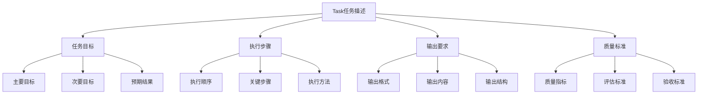
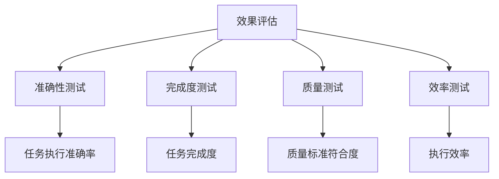

# Task任务描述

## 🎯 核心定义

### 什么是Task任务描述？
Task任务描述是提示词结构要素中的关键组件，通过明确、具体、可执行的指令来定义AI模型需要完成的具体任务，确保输出结果符合用户期望。

### 核心价值
- **目标明确**：清晰定义任务目标和期望结果
- **执行准确**：提供具体可执行的指令
- **结果可控**：确保输出结果符合预期
- **效率提升**：减少无效交互和重复尝试

## 📊 Task设定框架



## 🔍 设计要素

### 1. 任务目标
| 目标类型 | 设计要点 | 实现方法 | 应用场景 |
|----------|----------|----------|----------|
| **主要目标** | 明确核心任务 | 使用动词+名词结构 | 所有任务 |
| **次要目标** | 明确辅助任务 | 使用并列结构 | 复杂任务 |
| **预期结果** | 明确期望结果 | 使用结果导向描述 | 结果验证 |

#### 设计模板
```markdown
基础模板：
请[主要动作][目标对象]，[预期结果]。

高级模板：
请[主要动作][目标对象]：
1. [主要目标]：[具体描述]
2. [次要目标]：[具体描述]
3. [预期结果]：[具体描述]
```

#### 示例对比
```markdown
❌ 任务目标不明确：
"帮我处理这个数据"

✅ 任务目标明确：
"请分析销售数据，识别销售趋势，并提供改进建议。"
```

### 2. 执行步骤
| 步骤类型 | 设计要点 | 实现方法 | 效果保证 |
|----------|----------|----------|----------|
| **执行顺序** | 明确步骤顺序 | 使用编号或时间顺序 | 确保逻辑性 |
| **关键步骤** | 突出重要步骤 | 使用强调标记 | 确保完整性 |
| **执行方法** | 明确执行方式 | 使用具体方法描述 | 确保可操作性 |

#### 设计模板
```markdown
步骤模板：
请按以下步骤[执行任务]：
1. [步骤1]：[具体方法]
2. [步骤2]：[具体方法]
3. [步骤3]：[具体方法]

方法模板：
请使用[具体方法][执行任务]，重点关注[关键点]。
```

#### 示例对比
```markdown
❌ 执行步骤不明确：
"分析这个市场"

✅ 执行步骤明确：
"请按以下步骤分析市场：
1. 收集市场数据和竞争对手信息
2. 分析市场趋势和机会
3. 识别目标客户群体
4. 制定市场进入策略"
```

### 3. 输出要求
| 要求类型 | 设计要点 | 实现方法 | 效果体现 |
|----------|----------|----------|----------|
| **输出格式** | 明确输出格式 | 使用格式描述 | 确保结构化 |
| **输出内容** | 明确输出内容 | 使用内容清单 | 确保完整性 |
| **输出结构** | 明确输出结构 | 使用结构模板 | 确保逻辑性 |

#### 设计模板
```markdown
格式模板：
请以[格式类型]输出结果，包含[具体内容]。

内容模板：
请输出以下内容：
- [内容1]：[具体要求]
- [内容2]：[具体要求]
- [内容3]：[具体要求]

结构模板：
请按以下结构输出：
1. [结构1]：[内容要求]
2. [结构2]：[内容要求]
3. [结构3]：[内容要求]
```

#### 示例对比
```markdown
❌ 输出要求不明确：
"写一份报告"

✅ 输出要求明确：
"请以结构化报告形式输出，包含：
1. 执行摘要：200字以内
2. 详细分析：包含数据图表
3. 关键发现：3-5个要点
4. 建议措施：具体可操作的建议"
```

### 4. 质量标准
| 标准类型 | 设计要点 | 实现方法 | 效果保证 |
|----------|----------|----------|----------|
| **质量指标** | 明确质量要求 | 使用量化指标 | 确保质量达标 |
| **评估标准** | 明确评估方法 | 使用评估描述 | 确保可评估 |
| **验收标准** | 明确验收条件 | 使用验收清单 | 确保可验收 |

#### 设计模板
```markdown
质量模板：
请确保输出质量达到以下标准：
- [标准1]：[具体要求]
- [标准2]：[具体要求]
- [标准3]：[具体要求]

评估模板：
请按以下标准评估输出质量：
1. [评估维度1]：[评估标准]
2. [评估维度2]：[评估标准]
3. [评估维度3]：[评估标准]
```

#### 示例对比
```markdown
❌ 质量标准不明确：
"写一个高质量的产品介绍"

✅ 质量标准明确：
"请确保产品介绍达到以下标准：
- 内容准确：基于真实产品信息
- 表达清晰：使用通俗易懂的语言
- 结构完整：包含产品特点、优势、使用方法
- 字数控制：500-800字"
```

## 🛠️ 实践技巧

### 技巧1：使用SMART原则
```markdown
模板：
请[执行任务]，要求：
- Specific（具体）：[具体描述]
- Measurable（可测量）：[量化指标]
- Achievable（可实现）：[可行性要求]
- Relevant（相关）：[相关性要求]
- Time-bound（有时限）：[时间要求]

示例：
请分析用户反馈，要求：
- Specific：分析用户对产品功能的反馈
- Measurable：统计满意度评分和问题数量
- Achievable：基于现有数据进行分析
- Relevant：关注影响用户体验的关键问题
- Time-bound：2小时内完成分析
```

### 技巧2：任务分解
```markdown
模板：
请将[复杂任务]分解为以下子任务：
1. [子任务1]：[具体描述]
2. [子任务2]：[具体描述]
3. [子任务3]：[具体描述]

然后按顺序执行每个子任务。

示例：
请将市场分析分解为以下子任务：
1. 市场调研：收集行业数据和趋势
2. 竞争分析：分析主要竞争对手
3. 机会识别：识别市场机会和威胁
4. 策略制定：制定市场进入策略
```

### 技巧3：条件任务
```markdown
模板：
请根据[条件]执行[任务]：
- 如果[条件1]，则[任务1]
- 如果[条件2]，则[任务2]
- 如果[条件3]，则[任务3]

示例：
请根据数据分析结果执行相应任务：
- 如果销售额增长>10%，则分析增长原因
- 如果销售额下降>5%，则识别下降原因
- 如果销售额变化在±5%内，则分析市场趋势
```

## 📈 效果评估

### 评估维度
| 评估指标 | 评估标准 | 评估方法 | 改进方向 |
|----------|----------|----------|----------|
| **执行准确性** | 是否准确执行任务 | 结果对比验证 | 优化任务描述 |
| **完成度** | 是否完整完成任务 | 完成度检查 | 明确任务边界 |
| **质量达标** | 是否达到质量标准 | 质量评估 | 提高质量标准 |
| **效率** | 执行效率如何 | 时间效率测量 | 优化执行步骤 |

### 评估方法


## 🎯 应用场景

### 场景1：数据分析
```markdown
应用：执行数据分析任务
方法：明确分析目标、步骤和输出要求
效果：确保分析结果的准确性和完整性
```

### 场景2：内容创作
```markdown
应用：执行内容创作任务
方法：明确创作目标、结构和质量标准
效果：确保内容质量和用户满意度
```

### 场景3：问题解决
```markdown
应用：执行问题解决任务
方法：明确问题定义、解决步骤和验证标准
效果：确保问题得到有效解决
```

## ⚠️ 常见问题

### 问题1：任务描述过于宽泛
**表现**：任务描述不够具体
**解决**：增加具体的执行步骤和输出要求
**方法**：使用SMART原则优化任务描述

### 问题2：任务步骤不清晰
**表现**：执行步骤逻辑不清晰
**解决**：重新组织步骤顺序和逻辑
**方法**：使用结构化模板组织步骤

### 问题3：质量标准不明确
**表现**：缺乏明确的质量标准
**解决**：增加具体的质量指标和评估标准
**方法**：使用量化指标和评估清单

## 🎓 学习要点

### 核心理解
- Task任务描述是确保执行准确性的关键
- 明确的目标有助于提高执行效率
- 具体的步骤确保任务的可操作性
- 清晰的标准保证输出质量

### 实践建议
- 从简单任务开始练习任务描述
- 使用结构化模板提高描述效率
- 通过测试验证任务描述效果
- 持续优化和改进任务描述

## 🔗 相关链接
- [[02-2-1-Role角色设定]] - 回顾角色设定
- [[02-2-3-Context上下文信息]] - 学习上下文构建
- [[02-1-2-具体性原则]] - 学习具体性原则
- [[03-2-2-复杂任务分解]] - 实践应用场景
