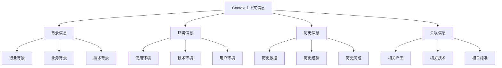
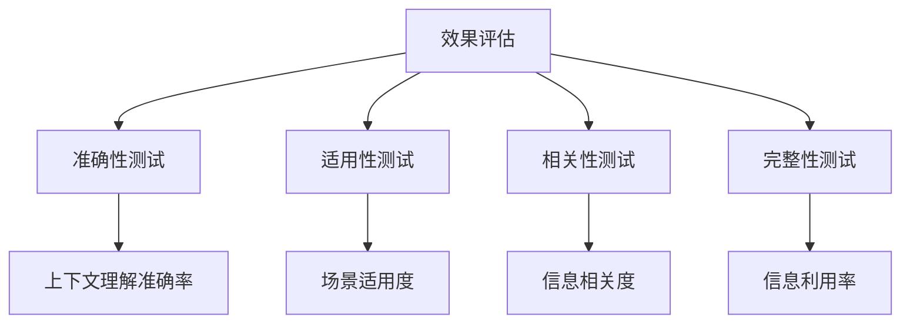

# Context上下文信息

## 🎯 核心定义

### 什么是Context上下文信息？
Context上下文信息是提示词结构要素中的重要组件，通过提供充分、相关、准确的背景信息，帮助AI模型更好地理解任务背景、用户需求和预期结果。

### 核心价值
- **理解增强**：提供充分背景信息增强理解
- **准确性提升**：确保输出符合具体场景需求
- **相关性保证**：保证输出内容与上下文相关
- **适用性优化**：使输出更适用于特定环境

## 📊 Context设定框架



## 🔍 设计要素

### 1. 背景信息
| 背景类型 | 设计要点 | 实现方法 | 应用场景 |
|----------|----------|----------|----------|
| **行业背景** | 提供行业相关信息 | 描述行业特点、趋势 | 行业分析 |
| **业务背景** | 提供业务相关信息 | 描述业务场景、流程 | 业务咨询 |
| **技术背景** | 提供技术相关信息 | 描述技术环境、架构 | 技术指导 |

#### 设计模板
```markdown
行业背景模板：
背景信息：当前处于[行业阶段]，主要特点是[行业特点]，发展趋势是[行业趋势]。

业务背景模板：
业务背景：公司主要业务是[业务描述]，目标客户是[客户群体]，核心价值是[价值主张]。

技术背景模板：
技术背景：当前技术栈包括[技术列表]，架构特点是[架构特点]，技术挑战是[技术挑战]。
```

#### 示例对比
```markdown
❌ 背景信息不足：
"设计一个用户管理系统"

✅ 背景信息充分：
"背景信息：
- 行业背景：在线教育平台，主要服务K12学生
- 业务背景：需要管理学生、教师、家长三类用户
- 技术背景：基于云原生架构，使用微服务设计"
```

### 2. 环境信息
| 环境类型 | 设计要点 | 实现方法 | 效果保证 |
|----------|----------|----------|----------|
| **使用环境** | 描述使用场景 | 具体环境描述 | 确保适用性 |
| **技术环境** | 描述技术条件 | 技术栈信息 | 确保技术可行性 |
| **用户环境** | 描述用户条件 | 用户特征描述 | 确保用户体验 |

#### 设计模板
```markdown
使用环境模板：
使用环境：[具体环境描述]，主要场景是[使用场景]，用户行为是[用户行为]。

技术环境模板：
技术环境：基于[技术栈]，运行在[运行环境]，数据存储在[数据存储]。

用户环境模板：
用户环境：用户主要使用[设备类型]，网络环境是[网络条件]，使用习惯是[使用习惯]。
```

#### 示例对比
```markdown
❌ 环境信息不足：
"优化网站性能"

✅ 环境信息充分：
"环境信息：
- 使用环境：70%用户来自移动端，主要使用场景是购物
- 技术环境：基于React + Node.js，部署在AWS云平台
- 用户环境：用户主要分布在二三线城市，网络环境参差不齐"
```

### 3. 历史信息
| 历史类型 | 设计要点 | 实现方法 | 效果体现 |
|----------|----------|----------|----------|
| **历史数据** | 提供相关历史数据 | 具体数据展示 | 支持决策分析 |
| **历史经验** | 提供相关历史经验 | 经验总结分享 | 避免重复错误 |
| **历史问题** | 提供相关历史问题 | 问题分析总结 | 预防问题发生 |

#### 设计模板
```markdown
历史数据模板：
历史数据：[具体数据描述]，变化趋势是[趋势描述]，关键指标是[关键指标]。

历史经验模板：
历史经验：在[类似场景]中，[成功经验]效果良好，[失败经验]需要避免。

历史问题模板：
历史问题：曾经遇到[问题描述]，原因是[问题原因]，解决方案是[解决方案]。
```

#### 示例对比
```markdown
❌ 历史信息不足：
"制定营销策略"

✅ 历史信息充分：
"历史信息：
- 历史数据：2023年营销投入500万，ROI为3.2，转化率为15%
- 历史经验：社交媒体营销效果最好，传统广告效果不佳
- 历史问题：曾经因为定位不准确导致营销效果差"
```

### 4. 关联信息
| 关联类型 | 设计要点 | 实现方法 | 效果保证 |
|----------|----------|----------|----------|
| **相关产品** | 提供相关产品信息 | 产品对比分析 | 确保产品一致性 |
| **相关技术** | 提供相关技术信息 | 技术栈信息 | 确保技术兼容性 |
| **相关标准** | 提供相关标准信息 | 标准要求说明 | 确保合规性 |

#### 设计模板
```markdown
相关产品模板：
相关产品：[产品列表]，主要差异是[差异描述]，集成要求是[集成要求]。

相关技术模板：
相关技术：[技术列表]，技术关系是[技术关系]，兼容性要求是[兼容性要求]。

相关标准模板：
相关标准：[标准列表]，合规要求是[合规要求]，质量要求是[质量要求]。
```

#### 示例对比
```markdown
❌ 关联信息不足：
"开发一个API接口"

✅ 关联信息充分：
"关联信息：
- 相关产品：与现有用户管理系统、订单系统集成
- 相关技术：使用RESTful架构，支持OAuth2.0认证
- 相关标准：遵循OpenAPI 3.0规范，符合数据保护法规"
```

## 🛠️ 实践技巧

### 技巧1：使用STAR框架
```markdown
模板：
上下文信息：
- Situation（情况）：[具体背景情况]
- Task（任务）：[具体任务要求]
- Action（行动）：[具体行动方案]
- Result（结果）：[预期结果]

示例：
上下文信息：
- Situation：在线教育平台用户流失率从15%上升到25%
- Task：分析流失原因并提出解决方案
- Action：分析用户行为数据，进行用户调研
- Result：降低用户流失率至10%以下
```

### 技巧2：多维度上下文
```markdown
模板：
上下文信息：
- 业务上下文：[业务相关信息]
- 技术上下文：[技术相关信息]
- 用户上下文：[用户相关信息]
- 市场上下文：[市场相关信息]

示例：
上下文信息：
- 业务上下文：电商平台，主要销售电子产品
- 技术上下文：基于机器学习的推荐算法
- 用户上下文：用户年龄25-40岁，偏好性价比高的产品
- 市场上下文：竞争激烈，需要提升用户粘性
```

### 技巧3：时间线上下文
```markdown
模板：
上下文信息：
- 过去：[历史情况]
- 现在：[当前情况]
- 未来：[预期情况]

示例：
上下文信息：
- 过去：产品已运营2年，用户增长缓慢
- 现在：面临激烈竞争，需要差异化定位
- 未来：计划3年内成为行业前三
```

## 📈 效果评估

### 评估维度
| 评估指标 | 评估标准 | 评估方法 | 改进方向 |
|----------|----------|----------|----------|
| **理解准确性** | 是否准确理解上下文 | 输出结果对比 | 增加更多背景信息 |
| **适用性** | 输出是否适用于具体场景 | 场景测试验证 | 优化环境描述 |
| **相关性** | 输出是否与上下文相关 | 相关性评分 | 提高信息相关性 |
| **完整性** | 是否充分利用上下文 | 信息利用率分析 | 优化信息组织 |

### 评估方法


## 🎯 应用场景

### 场景1：专业咨询
```markdown
应用：提供专业领域咨询
方法：提供充分的行业背景和专业信息
效果：确保建议的专业性和适用性
```

### 场景2：产品设计
```markdown
应用：指导产品功能设计
方法：描述具体用户场景和使用环境
效果：确保产品符合用户需求
```

### 场景3：问题解决
```markdown
应用：解决复杂业务问题
方法：提供完整的问题背景和历史信息
效果：确保解决方案的针对性和有效性
```

## ⚠️ 常见问题

### 问题1：上下文信息过载
**表现**：提供过多无关信息导致混淆
**解决**：筛选和优化相关信息
**方法**：突出关键信息，简化次要信息

### 问题2：上下文信息不足
**表现**：缺乏必要的背景信息
**解决**：补充关键背景信息
**方法**：使用结构化框架确保信息完整

### 问题3：上下文信息不准确
**表现**：提供错误或过时的信息
**解决**：验证和更新信息准确性
**方法**：建立信息验证机制

## 🎓 学习要点

### 核心理解
- Context上下文信息是确保理解准确性的关键
- 充分的背景信息有助于提高输出质量
- 环境信息确保解决方案的适用性
- 历史信息有助于避免重复错误

### 实践建议
- 从简单场景开始练习上下文构建
- 使用结构化框架提高信息组织效率
- 通过测试验证上下文效果
- 持续积累上下文构建经验

## 🔗 相关链接
- [[02-2-2-Task任务描述]] - 回顾任务描述
- [[02-2-4-Format输出格式]] - 学习输出格式控制
- [[02-1-3-上下文原则]] - 学习上下文原则
- [[03-2-1-多轮对话设计]] - 实践应用场景
