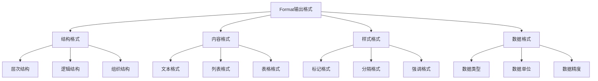
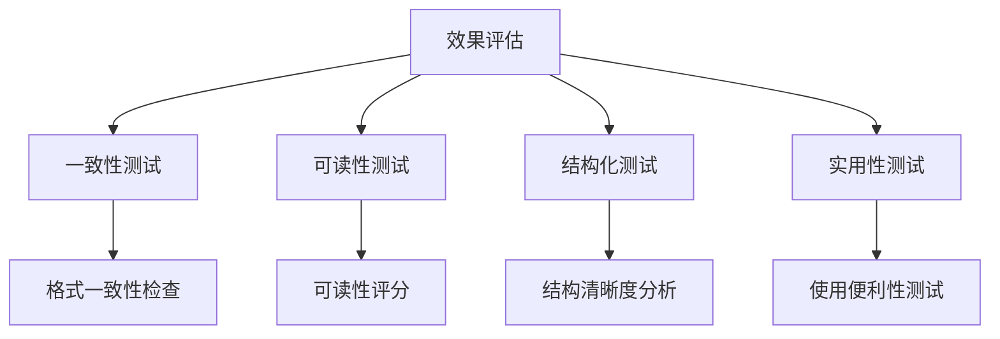

# Format输出格式

## 🎯 核心定义

### 什么是Format输出格式？
Format输出格式是提示词结构要素中的关键组件，通过明确指定AI模型输出内容的结构、格式和样式，确保输出结果符合用户的使用需求和展示要求。

### 核心价值
- **结构化输出**：确保输出内容结构清晰、层次分明
- **标准化展示**：提供统一的输出格式和样式
- **易读性提升**：提高输出内容的可读性和理解性
- **后续处理**：便于后续的数据处理和分析

## 📊 Format设定框架



## 🔍 设计要素

### 1. 结构格式
| 结构类型 | 设计要点 | 实现方法 | 应用场景 |
|----------|----------|----------|----------|
| **层次结构** | 明确信息层次 | 使用标题和编号 | 复杂内容组织 |
| **逻辑结构** | 明确逻辑关系 | 使用逻辑连接词 | 分析报告 |
| **组织结构** | 明确组织方式 | 使用分类和分组 | 信息整理 |

#### 设计模板
```markdown
层次结构模板：
请按以下层次结构输出：
# 一级标题
## 二级标题
### 三级标题
- 要点1
- 要点2

逻辑结构模板：
请按以下逻辑结构输出：
1. 问题分析
2. 原因分析
3. 解决方案
4. 实施建议

组织结构模板：
请按以下组织结构输出：
- 类别1：[内容]
- 类别2：[内容]
- 类别3：[内容]
```

#### 示例对比
```markdown
❌ 结构格式不明确：
"分析这个市场"

✅ 结构格式明确：
"请按以下结构分析市场：
# 市场分析报告
## 1. 市场概况
### 1.1 市场规模
### 1.2 市场趋势
## 2. 竞争分析
### 2.1 主要竞争对手
### 2.2 竞争格局
## 3. 机会分析
### 3.1 市场机会
### 3.2 进入策略"
```

### 2. 内容格式
| 格式类型 | 设计要点 | 实现方法 | 效果保证 |
|----------|----------|----------|----------|
| **文本格式** | 明确文本样式 | 使用段落和换行 | 提高可读性 |
| **列表格式** | 明确列表样式 | 使用有序或无序列表 | 提高条理性 |
| **表格格式** | 明确表格样式 | 使用表格结构 | 提高对比性 |

#### 设计模板
```markdown
文本格式模板：
请以段落形式输出，每个段落包含一个主要观点。

列表格式模板：
请以列表形式输出：
- 要点1：[具体内容]
- 要点2：[具体内容]
- 要点3：[具体内容]

表格格式模板：
请以表格形式输出：
| 列1 | 列2 | 列3 |
|-----|-----|-----|
| 数据1 | 数据2 | 数据3 |
```

#### 示例对比
```markdown
❌ 内容格式不明确：
"列出产品特点"

✅ 内容格式明确：
"请以表格形式列出产品特点：
| 特点类别 | 具体特点 | 优势说明 |
|----------|----------|----------|
| 功能特点 | 智能推荐 | 提高用户体验 |
| 性能特点 | 快速响应 | 提升使用效率 |
| 设计特点 | 简洁界面 | 降低学习成本 |"
```

### 3. 样式格式
| 样式类型 | 设计要点 | 实现方法 | 效果体现 |
|----------|----------|----------|----------|
| **标记格式** | 明确标记方式 | 使用加粗、斜体等 | 突出重点信息 |
| **分隔格式** | 明确分隔方式 | 使用分隔线、空行 | 提高可读性 |
| **强调格式** | 明确强调方式 | 使用颜色、大小写 | 吸引注意力 |

#### 设计模板
```markdown
标记格式模板：
请使用以下标记格式：
- **重要信息**：使用加粗
- *关键概念*：使用斜体
- `代码内容`：使用代码标记

分隔格式模板：
请使用以下分隔格式：
---
章节分隔
---
段落之间使用空行分隔

强调格式模板：
请使用以下强调格式：
- 重要：使用大写字母
- 警告：使用感叹号
- 注意：使用特殊符号
```

#### 示例对比
```markdown
❌ 样式格式不明确：
"写一份重要报告"

✅ 样式格式明确：
"请使用以下样式格式：
- **重要信息**：使用加粗标记
- *关键概念*：使用斜体标记
- 章节之间使用---分隔
- 重要警告使用！标记"
```

### 4. 数据格式
| 数据类型 | 设计要点 | 实现方法 | 效果保证 |
|----------|----------|----------|----------|
| **数据类型** | 明确数据类型 | 使用具体类型描述 | 确保数据准确性 |
| **数据单位** | 明确数据单位 | 使用标准单位 | 确保数据一致性 |
| **数据精度** | 明确数据精度 | 使用精度描述 | 确保数据可靠性 |

#### 设计模板
```markdown
数据类型模板：
请使用以下数据格式：
- 数字：使用阿拉伯数字
- 百分比：使用%符号
- 货币：使用货币符号
- 日期：使用YYYY-MM-DD格式

数据单位模板：
请使用以下数据单位：
- 长度：米(m)、厘米(cm)
- 重量：千克(kg)、克(g)
- 时间：小时(h)、分钟(min)
- 容量：升(L)、毫升(ml)

数据精度模板：
请使用以下数据精度：
- 整数：不保留小数
- 小数：保留2位小数
- 百分比：保留1位小数
- 货币：保留2位小数
```

#### 示例对比
```markdown
❌ 数据格式不明确：
"提供销售数据"

✅ 数据格式明确：
"请使用以下数据格式：
- 销售额：使用人民币符号，保留2位小数
- 增长率：使用百分比，保留1位小数
- 日期：使用YYYY-MM-DD格式
- 数量：使用整数，不保留小数"
```

## 🛠️ 实践技巧

### 技巧1：使用格式模板
```markdown
模板：
请按以下格式输出[内容]：
[格式描述]

示例：
请按以下格式输出产品分析：
# 产品分析报告
## 1. 产品概述
- 产品名称：[产品名]
- 产品类型：[产品类型]
- 目标用户：[用户群体]
## 2. 功能分析
| 功能模块 | 功能描述 | 用户价值 |
|----------|----------|----------|
| [模块1] | [描述] | [价值] |
| [模块2] | [描述] | [价值] |
## 3. 改进建议
1. [建议1]
2. [建议2]
3. [建议3]
```

### 技巧2：格式层次化
```markdown
模板：
请使用以下格式层次：
- 一级标题：# 标题
- 二级标题：## 标题
- 三级标题：### 标题
- 要点列表：- 要点
- 编号列表：1. 项目
- 表格：| 列1 | 列2 |
- 强调：**重要信息**

示例：
请使用以下格式层次输出分析结果：
# 分析结果
## 1. 数据概览
### 1.1 总体情况
- 关键指标1：[数值]
- 关键指标2：[数值]
## 2. 详细分析
| 分析维度 | 结果 | 说明 |
|----------|------|------|
| [维度1] | [结果] | [说明] |
## 3. 结论建议
1. **重要发现**：[发现内容]
2. **改进建议**：[建议内容]
```

### 技巧3：格式标准化
```markdown
模板：
请遵循以下格式标准：
- 标题：使用#标记，层级清晰
- 段落：使用空行分隔
- 列表：使用-或1.标记
- 表格：使用|分隔列
- 强调：使用**加粗**或*斜体*
- 代码：使用`代码标记`

示例：
请遵循以下格式标准输出技术文档：
# 技术文档
## 概述
[概述内容]

## 技术架构
- 前端：[技术栈]
- 后端：[技术栈]
- 数据库：[数据库类型]

## 接口说明
| 接口名称 | 请求方法 | 功能描述 |
|----------|----------|----------|
| [接口1] | GET | [描述] |
| [接口2] | POST | [描述] |

## 注意事项
**重要**：请确保数据安全
*注意*：请遵循API规范
```

## 📈 效果评估

### 评估维度
| 评估指标 | 评估标准 | 评估方法 | 改进方向 |
|----------|----------|----------|----------|
| **格式一致性** | 输出格式是否一致 | 格式检查 | 优化格式规范 |
| **可读性** | 输出内容是否易读 | 可读性评分 | 改善格式设计 |
| **结构化程度** | 输出结构是否清晰 | 结构分析 | 优化结构设计 |
| **实用性** | 输出格式是否实用 | 使用测试 | 提高格式实用性 |

### 评估方法


## 🎯 应用场景

### 场景1：报告生成
```markdown
应用：生成结构化报告
方法：使用层次化格式和表格
效果：确保报告结构清晰、内容完整
```

### 场景2：数据展示
```markdown
应用：展示结构化数据
方法：使用表格和列表格式
效果：提高数据的可读性和对比性
```

### 场景3：文档编写
```markdown
应用：编写技术文档
方法：使用标准化格式和标记
效果：确保文档的专业性和可读性
```

## ⚠️ 常见问题

### 问题1：格式过于复杂
**表现**：格式设计过于复杂难以理解
**解决**：简化格式设计，使用标准格式
**方法**：采用常见的格式模板和标准

### 问题2：格式不一致
**表现**：输出格式不统一
**解决**：建立格式规范和模板
**方法**：使用格式检查工具和模板

### 问题3：格式不实用
**表现**：格式设计不符合实际需求
**解决**：根据实际需求调整格式
**方法**：进行用户测试和反馈收集

## 🎓 学习要点

### 核心理解
- Format输出格式是确保输出质量的关键
- 结构化格式有助于提高可读性
- 标准化格式便于后续处理
- 格式设计需要考虑实际使用需求

### 实践建议
- 从简单格式开始练习格式设计
- 使用格式模板提高设计效率
- 通过测试验证格式效果
- 持续优化和改进格式设计

## 🔗 相关链接
- [[02-2-3-Context上下文信息]] - 回顾上下文信息
- [[02-2-5-Constraints约束条件]] - 学习约束条件
- [[02-1-1-清晰性原则]] - 学习清晰性原则
- [[03-1-1-文本生成应用]] - 实践应用场景
