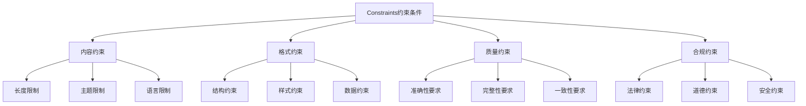
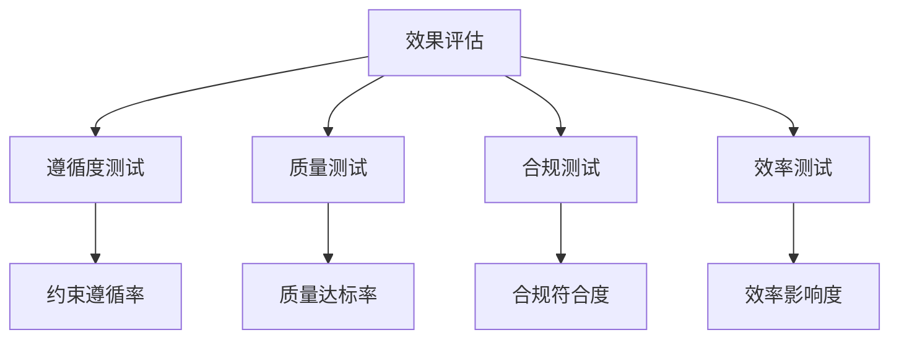

# Constraints约束条件

## 🎯 核心定义

### 什么是Constraints约束条件？
Constraints约束条件是提示词结构要素中的重要组件，通过明确指定输出内容的限制条件、边界范围和执行标准，确保AI模型输出结果符合特定要求和约束。

### 核心价值
- **范围控制**：明确输出内容的范围和边界
- **质量保证**：确保输出质量符合标准要求
- **合规性**：确保输出内容符合相关规范
- **效率优化**：通过约束提高输出效率

## 📊 Constraints设定框架



## 🔍 设计要素

### 1. 内容约束
| 约束类型 | 设计要点 | 实现方法 | 应用场景 |
|----------|----------|----------|----------|
| **长度限制** | 明确内容长度 | 使用字数或字符数 | 内容创作 |
| **主题限制** | 明确主题范围 | 使用主题描述 | 专业写作 |
| **语言限制** | 明确语言要求 | 使用语言标识 | 多语言环境 |

#### 设计模板
```markdown
长度限制模板：
请确保输出内容：
- 总字数：[具体字数]字以内
- 段落数：[具体数量]段以内
- 句子数：[具体数量]句以内

主题限制模板：
请确保输出内容：
- 主题范围：[具体主题]
- 不涉及：[禁止主题]
- 重点突出：[重点主题]

语言限制模板：
请确保输出内容：
- 使用语言：[具体语言]
- 语言风格：[具体风格]
- 术语使用：[术语要求]
```

#### 示例对比
```markdown
❌ 内容约束不明确：
"写一篇文章"

✅ 内容约束明确：
"请写一篇文章，约束条件：
- 总字数：800-1000字
- 主题范围：人工智能在教育领域的应用
- 不涉及：政治敏感话题
- 使用语言：中文，正式文体"
```

### 2. 格式约束
| 约束类型 | 设计要点 | 实现方法 | 效果保证 |
|----------|----------|----------|----------|
| **结构约束** | 明确结构要求 | 使用结构描述 | 确保结构化 |
| **样式约束** | 明确样式要求 | 使用样式描述 | 确保一致性 |
| **数据约束** | 明确数据要求 | 使用数据格式 | 确保准确性 |

#### 设计模板
```markdown
结构约束模板：
请确保输出结构：
- 标题层级：[具体层级]
- 段落结构：[具体结构]
- 列表格式：[具体格式]

样式约束模板：
请确保输出样式：
- 字体要求：[具体字体]
- 颜色要求：[具体颜色]
- 排版要求：[具体排版]

数据约束模板：
请确保输出数据：
- 数据格式：[具体格式]
- 数据精度：[具体精度]
- 数据单位：[具体单位]
```

#### 示例对比
```markdown
❌ 格式约束不明确：
"生成一个报告"

✅ 格式约束明确：
"请生成一个报告，格式约束：
- 结构：使用三级标题，包含摘要、正文、结论
- 样式：使用标准字体，黑色文字
- 数据：使用表格格式，保留2位小数"
```

### 3. 质量约束
| 约束类型 | 设计要点 | 实现方法 | 效果体现 |
|----------|----------|----------|----------|
| **准确性要求** | 明确准确性标准 | 使用准确性描述 | 确保内容准确 |
| **完整性要求** | 明确完整性标准 | 使用完整性描述 | 确保内容完整 |
| **一致性要求** | 明确一致性标准 | 使用一致性描述 | 确保内容一致 |

#### 设计模板
```markdown
准确性要求模板：
请确保输出准确性：
- 事实准确：基于真实数据
- 逻辑准确：逻辑关系正确
- 表达准确：语言表达准确

完整性要求模板：
请确保输出完整性：
- 内容完整：包含所有必要信息
- 结构完整：结构层次完整
- 功能完整：功能描述完整

一致性要求模板：
请确保输出一致性：
- 风格一致：表达风格统一
- 格式一致：格式规范统一
- 标准一致：质量标准统一
```

#### 示例对比
```markdown
❌ 质量约束不明确：
"分析这个数据"

✅ 质量约束明确：
"请分析这个数据，质量约束：
- 准确性：基于真实数据，逻辑关系正确
- 完整性：包含数据概览、趋势分析、结论建议
- 一致性：使用统一的分析方法和表达风格"
```

### 4. 合规约束
| 约束类型 | 设计要点 | 实现方法 | 效果保证 |
|----------|----------|----------|----------|
| **法律约束** | 明确法律要求 | 使用法律描述 | 确保合法性 |
| **道德约束** | 明确道德要求 | 使用道德描述 | 确保道德性 |
| **安全约束** | 明确安全要求 | 使用安全描述 | 确保安全性 |

#### 设计模板
```markdown
法律约束模板：
请确保输出合法性：
- 不违反：[具体法律]
- 遵守：[具体法规]
- 保护：[具体权益]

道德约束模板：
请确保输出道德性：
- 不包含：[不当内容]
- 尊重：[具体价值观]
- 促进：[正面价值]

安全约束模板：
请确保输出安全性：
- 不泄露：[敏感信息]
- 保护：[隐私数据]
- 防范：[安全风险]
```

#### 示例对比
```markdown
❌ 合规约束不明确：
"生成用户数据报告"

✅ 合规约束明确：
"请生成用户数据报告，合规约束：
- 法律：遵守数据保护法规，不泄露个人隐私
- 道德：尊重用户权益，不包含歧视性内容
- 安全：保护敏感数据，防范安全风险"
```

## 🛠️ 实践技巧

### 技巧1：使用约束清单
```markdown
模板：
请确保输出内容满足以下约束条件：
- [约束1]：[具体要求]
- [约束2]：[具体要求]
- [约束3]：[具体要求]

示例：
请确保输出内容满足以下约束条件：
- 长度：500-800字
- 主题：人工智能应用
- 格式：使用Markdown格式
- 质量：内容准确、逻辑清晰
- 合规：不涉及敏感话题
```

### 技巧2：分层约束
```markdown
模板：
请按以下层次设置约束：
1. 基础约束：[基础要求]
2. 质量约束：[质量要求]
3. 高级约束：[高级要求]

示例：
请按以下层次设置约束：
1. 基础约束：字数500-800字，使用中文
2. 质量约束：内容准确，逻辑清晰
3. 高级约束：具有创新性，实用性强
```

### 技巧3：动态约束
```markdown
模板：
请根据[条件]调整约束：
- 如果[条件1]，则[约束1]
- 如果[条件2]，则[约束2]
- 如果[条件3]，则[约束3]

示例：
请根据内容类型调整约束：
- 如果是技术文档，则使用专业术语
- 如果是用户手册，则使用通俗语言
- 如果是学术论文，则使用严谨表达
```

## 📈 效果评估

### 评估维度
| 评估指标 | 评估标准 | 评估方法 | 改进方向 |
|----------|----------|----------|----------|
| **约束遵循度** | 是否遵循所有约束 | 约束检查 | 优化约束设计 |
| **质量达标率** | 是否达到质量要求 | 质量评估 | 提高质量标准 |
| **合规性** | 是否符合相关规范 | 合规检查 | 完善合规要求 |
| **效率影响** | 约束对效率的影响 | 效率测试 | 平衡约束与效率 |

### 评估方法


## 🎯 应用场景

### 场景1：内容审核
```markdown
应用：内容质量控制和审核
方法：设置内容、格式、质量约束
效果：确保内容符合标准要求
```

### 场景2：合规检查
```markdown
应用：确保输出内容合规
方法：设置法律、道德、安全约束
效果：防范合规风险
```

### 场景3：质量保证
```markdown
应用：保证输出质量
方法：设置准确性、完整性、一致性约束
效果：确保输出质量稳定
```

## ⚠️ 常见问题

### 问题1：约束过于严格
**表现**：约束条件过于严格影响输出质量
**解决**：适当放宽约束条件
**方法**：在质量保证和灵活性之间找到平衡

### 问题2：约束冲突
**表现**：不同约束条件之间存在冲突
**解决**：明确约束优先级
**方法**：建立约束层次和优先级体系

### 问题3：约束不完整
**表现**：缺乏必要的约束条件
**解决**：补充关键约束条件
**方法**：使用约束清单确保完整性

## 🎓 学习要点

### 核心理解
- Constraints约束条件是确保输出质量的关键
- 合理的约束有助于提高输出质量
- 约束设计需要考虑实际需求
- 约束与灵活性需要平衡

### 实践建议
- 从简单约束开始练习约束设计
- 使用约束清单提高设计效率
- 通过测试验证约束效果
- 持续优化和改进约束设计

## 🔗 相关链接
- [[02-2-4-Format输出格式]] - 回顾输出格式
- [[02-4-核心理解总结]] - 学习核心理解总结
- [[02-1-1-清晰性原则]] - 学习清晰性原则
- [[04-2-3-质量保证流程]] - 实践应用场景
