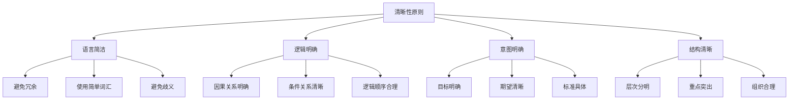
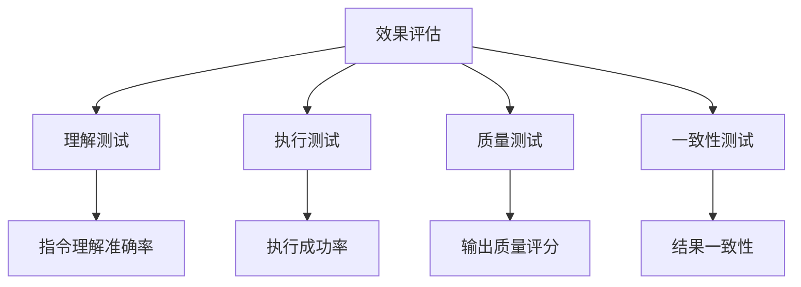

# 清晰性原则

## 🎯 核心定义

### 什么是清晰性原则？
清晰性原则是指在设计提示词时，使用简洁明了、逻辑清晰的语言，确保AI模型能够准确理解指令意图。

### 核心要素
- **语言简洁**：避免冗余和复杂的表达
- **逻辑明确**：确保指令的逻辑结构清晰
- **意图明确**：准确传达期望的输出结果
- **结构清晰**：合理组织信息层次

## 📊 清晰性原则框架



## 🔍 设计要点

### 1. 语言简洁
| 设计要素 | 具体要求 | 实现方法 | 效果体现 |
|----------|----------|----------|----------|
| **词汇选择** | 使用简单、准确的词汇 | 避免专业术语 | 提高理解度 |
| **句式结构** | 使用简单句式 | 避免复杂从句 | 减少歧义 |
| **表达方式** | 直接表达意图 | 避免委婉表达 | 提高准确性 |

#### 示例对比
```markdown
❌ 不清晰的表达：
"请你在考虑到各种可能性的情况下，尽可能全面地分析这个问题，并给出一个既实用又具有创新性的解决方案"

✅ 清晰的表达：
"请分析这个问题并给出实用的解决方案"
```

### 2. 逻辑明确
| 逻辑类型 | 设计要点 | 实现方法 | 应用场景 |
|----------|----------|----------|----------|
| **因果关系** | 明确原因和结果 | 使用"因为...所以" | 问题分析 |
| **条件关系** | 明确条件和结果 | 使用"如果...那么" | 条件判断 |
| **时间关系** | 明确时间顺序 | 使用"首先...然后" | 流程描述 |

#### 示例对比
```markdown
❌ 逻辑不明确：
"分析数据，给出建议，考虑各种因素"

✅ 逻辑明确：
"首先分析数据趋势，然后识别关键问题，最后给出具体建议"
```

### 3. 意图明确
| 意图类型 | 表达方式 | 实现方法 | 效果保证 |
|----------|----------|----------|----------|
| **目标意图** | 明确最终目标 | 使用"目标是..." | 确保方向正确 |
| **期望意图** | 明确期望结果 | 使用"期望得到..." | 确保输出符合预期 |
| **标准意图** | 明确质量标准 | 使用"要求是..." | 确保质量达标 |

#### 示例对比
```markdown
❌ 意图不明确：
"写一篇文章"

✅ 意图明确：
"写一篇关于人工智能发展的科普文章，目标读者是普通大众，要求通俗易懂"
```

### 4. 结构清晰
| 结构要素 | 设计原则 | 实现方法 | 效果体现 |
|----------|----------|----------|----------|
| **层次分明** | 信息分层组织 | 使用标题和编号 | 提高可读性 |
| **重点突出** | 强调关键信息 | 使用加粗和标记 | 确保重点不被忽略 |
| **组织合理** | 逻辑顺序安排 | 按照重要性排序 | 提高理解效率 |

#### 示例对比
```markdown
❌ 结构不清晰：
"分析数据，写报告，包含图表，总结要点，给出建议"

✅ 结构清晰：
"请按以下结构分析数据并写报告：
1. 数据概览
2. 关键发现
3. 图表展示
4. 总结要点
5. 改进建议"
```

## 🛠️ 实践技巧

### 技巧1：使用结构化表达
```markdown
模板：
请[具体任务]：
1. [第一步]
2. [第二步]
3. [第三步]

示例：
请分析销售数据：
1. 计算各产品销售额
2. 分析销售趋势
3. 识别增长机会
```

### 技巧2：明确输出要求
```markdown
模板：
请[任务描述]，要求：
- [要求1]
- [要求2]
- [要求3]

示例：
请写一份市场分析报告，要求：
- 字数控制在1000字以内
- 包含数据图表
- 提供具体建议
```

### 技巧3：使用关键词标记
```markdown
模板：
请[任务描述]：
**重点**：[重点内容]
**注意**：[注意事项]
**目标**：[预期目标]

示例：
请分析用户反馈：
**重点**：识别主要问题
**注意**：区分真实问题和噪音
**目标**：提供改进建议
```

## 📈 效果评估

### 评估维度
| 评估指标 | 评估标准 | 评估方法 | 改进方向 |
|----------|----------|----------|----------|
| **理解准确性** | 模型是否准确理解指令 | 输出结果对比 | 简化表达 |
| **执行效率** | 是否快速准确执行 | 响应时间测量 | 优化结构 |
| **输出质量** | 输出是否符合预期 | 质量评分 | 明确标准 |
| **一致性** | 多次执行结果是否一致 | 重复测试 | 标准化表达 |

### 评估方法


## 🎯 应用场景

### 场景1：复杂任务分解
```markdown
应用：将复杂任务分解为清晰步骤
方法：使用编号和标题组织
效果：提高任务执行准确性
```

### 场景2：专业领域应用
```markdown
应用：在专业领域提供清晰指导
方法：使用专业术语但保持简洁
效果：确保专业性和准确性
```

### 场景3：多语言环境
```markdown
应用：在不同语言环境下保持清晰
方法：使用通用表达方式
效果：提高跨语言理解度
```

## ⚠️ 常见问题

### 问题1：过度简化
**表现**：为了简洁而丢失重要信息
**解决**：在简洁和完整之间找到平衡
**方法**：使用分层表达，核心信息简洁，细节信息补充

### 问题2：逻辑混乱
**表现**：指令逻辑不清晰
**解决**：重新组织逻辑结构
**方法**：使用逻辑连接词，明确因果关系

### 问题3：意图模糊
**表现**：期望结果不明确
**解决**：明确具体的目标和标准
**方法**：使用具体描述，提供明确标准

## 🎓 学习要点

### 核心理解
- 清晰性是提示词设计的基础原则
- 简洁不等于简单，要平衡简洁和完整
- 逻辑结构是清晰性的重要保障
- 明确意图是确保效果的关键

### 实践建议
- 从简单场景开始练习清晰表达
- 使用结构化模板提高表达效率
- 通过测试验证清晰性效果
- 持续优化和改进表达方式

## 🔗 相关链接
- [[02-1-2-具体性原则]] - 学习具体性原则
- [[02-1-3-上下文原则]] - 学习上下文原则
- [[02-2-2-Task任务描述]] - 学习任务描述技巧
- [[03-1-1-文本生成应用]] - 实践应用场景
