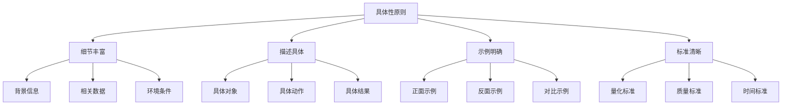
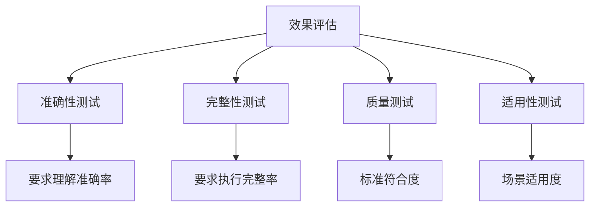

# 具体性原则

## 🎯 核心定义

### 什么是具体性原则？
具体性原则是指在设计提示词时，提供详细、具体的信息和描述，避免模糊和抽象的表达，确保AI模型能够准确理解并执行任务。

### 核心要素
- **细节丰富**：提供充分的细节信息
- **描述具体**：使用具体的描述而非抽象概念
- **示例明确**：提供具体的示例和参考
- **标准清晰**：明确具体的执行标准

## 📊 具体性原则框架



## 🔍 设计要点

### 1. 细节丰富
| 细节类型 | 具体要求 | 实现方法 | 效果体现 |
|----------|----------|----------|----------|
| **背景信息** | 提供充分的背景 | 描述相关环境 | 提高理解准确性 |
| **相关数据** | 提供具体数据 | 使用数字和事实 | 增强说服力 |
| **环境条件** | 明确执行环境 | 描述具体条件 | 确保适用性 |

#### 示例对比
```markdown
❌ 缺乏细节：
"分析市场趋势"

✅ 细节丰富：
"分析2023年Q1-Q3中国智能手机市场的销售趋势，包括：
- 各品牌市场份额变化
- 价格区间分布
- 消费者偏好变化
- 技术发展趋势"
```

### 2. 描述具体
| 描述维度 | 具体要求 | 实现方法 | 应用场景 |
|----------|----------|----------|----------|
| **具体对象** | 明确操作对象 | 使用具体名词 | 避免歧义 |
| **具体动作** | 明确执行动作 | 使用具体动词 | 确保可执行 |
| **具体结果** | 明确期望结果 | 描述具体输出 | 确保符合预期 |

#### 示例对比
```markdown
❌ 描述抽象：
"优化用户体验"

✅ 描述具体：
"优化电商网站的用户体验，具体包括：
- 缩短页面加载时间至3秒以内
- 简化购物流程至3步完成
- 提高移动端适配性
- 增加用户反馈功能"
```

### 3. 示例明确
| 示例类型 | 设计要点 | 实现方法 | 效果保证 |
|----------|----------|----------|----------|
| **正面示例** | 展示正确做法 | 提供标准示例 | 明确期望结果 |
| **反面示例** | 展示错误做法 | 提供错误示例 | 避免常见错误 |
| **对比示例** | 展示差异对比 | 提供对比案例 | 突出关键差异 |

#### 示例对比
```markdown
❌ 缺乏示例：
"写一个产品介绍"

✅ 示例明确：
"写一个产品介绍，参考以下格式：
产品名称：[具体产品名]
核心功能：[3-5个主要功能]
目标用户：[具体用户群体]
使用场景：[具体应用场景]
价格信息：[具体价格]

示例：
产品名称：智能手环
核心功能：健康监测、运动记录、消息提醒
目标用户：25-40岁健康意识强的上班族
使用场景：日常健康管理、运动健身、工作生活
价格信息：299元"
```

### 4. 标准清晰
| 标准类型 | 具体要求 | 实现方法 | 效果体现 |
|----------|----------|----------|----------|
| **量化标准** | 使用具体数字 | 提供数值范围 | 确保可测量 |
| **质量标准** | 明确质量要求 | 描述具体标准 | 确保质量达标 |
| **时间标准** | 明确时间要求 | 提供具体时间 | 确保时效性 |

#### 示例对比
```markdown
❌ 标准模糊：
"写一份高质量的报告"

✅ 标准清晰：
"写一份高质量的市场分析报告，要求：
- 字数：2000-3000字
- 结构：包含执行摘要、市场概况、竞争分析、趋势预测、建议措施
- 数据：使用2023年最新数据，包含至少5个图表
- 时间：2小时内完成
- 格式：使用Word文档，字体12号，行距1.5倍"
```

## 🛠️ 实践技巧

### 技巧1：使用5W1H框架
```markdown
模板：
请[任务描述]：
- What（什么）：[具体内容]
- Who（谁）：[具体对象]
- When（何时）：[具体时间]
- Where（何地）：[具体地点]
- Why（为什么）：[具体原因]
- How（如何）：[具体方法]

示例：
请设计一个用户调研方案：
- What：用户满意度调研
- Who：现有用户和潜在用户
- When：2024年Q1
- Where：线上和线下渠道
- Why：了解用户需求，改进产品
- How：问卷调查、深度访谈、焦点小组
```

### 技巧2：提供具体数据
```markdown
模板：
请[任务描述]，基于以下数据：
- 数据1：[具体数值]
- 数据2：[具体数值]
- 数据3：[具体数值]

示例：
请分析销售业绩，基于以下数据：
- 2023年总销售额：5000万元
- 同比增长率：15%
- 主要产品贡献率：80%
- 客户满意度：4.2/5.0
```

### 技巧3：使用具体场景
```markdown
模板：
请[任务描述]，场景如下：
场景描述：[具体场景]
用户角色：[具体角色]
使用环境：[具体环境]
预期结果：[具体结果]

示例：
请设计一个在线学习平台，场景如下：
场景描述：企业员工技能培训
用户角色：HR管理员、部门经理、普通员工
使用环境：办公室、家庭、移动设备
预期结果：提高员工技能水平，降低培训成本
```

## 📈 效果评估

### 评估维度
| 评估指标 | 评估标准 | 评估方法 | 改进方向 |
|----------|----------|----------|----------|
| **理解准确性** | 是否准确理解具体要求 | 输出结果对比 | 增加更多细节 |
| **执行完整性** | 是否完整执行所有要求 | 检查清单验证 | 明确遗漏点 |
| **输出质量** | 输出是否符合具体标准 | 标准对比评估 | 提高标准清晰度 |
| **适用性** | 输出是否适用于具体场景 | 场景测试验证 | 优化场景描述 |

### 评估方法


## 🎯 应用场景

### 场景1：专业报告撰写
```markdown
应用：撰写专业分析报告
方法：提供具体数据、明确格式要求
效果：确保报告专业性和完整性
```

### 场景2：产品设计指导
```markdown
应用：指导产品功能设计
方法：描述具体用户场景、明确功能要求
效果：确保产品符合用户需求
```

### 场景3：流程优化建议
```markdown
应用：提供流程优化建议
方法：分析具体流程环节、提供具体改进措施
效果：确保建议可操作性强
```

## ⚠️ 常见问题

### 问题1：过度具体化
**表现**：提供过多细节导致信息冗余
**解决**：在具体和简洁之间找到平衡
**方法**：突出关键信息，简化次要细节

### 问题2：具体性不足
**表现**：描述过于抽象，缺乏可操作性
**解决**：增加具体细节和明确标准
**方法**：使用具体数据、提供明确示例

### 问题3：标准冲突
**表现**：不同标准之间存在冲突
**解决**：明确优先级和权衡标准
**方法**：建立标准层次，明确主次关系

## 🎓 学习要点

### 核心理解
- 具体性是确保执行准确性的关键
- 细节丰富有助于提高理解准确性
- 明确标准是保证质量的基础
- 具体示例是提高效果的有效方法

### 实践建议
- 从简单场景开始练习具体化表达
- 使用结构化框架提高表达效率
- 通过测试验证具体性效果
- 持续积累具体化表达经验

## 🔗 相关链接
- [[02-1-1-清晰性原则]] - 回顾清晰性原则
- [[02-1-3-上下文原则]] - 学习上下文原则
- [[02-2-3-Context上下文信息]] - 学习上下文构建
- [[03-1-3-内容创作应用]] - 实践应用场景
