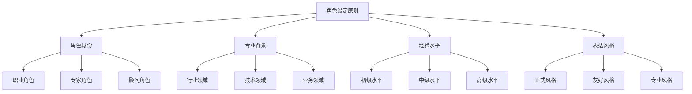
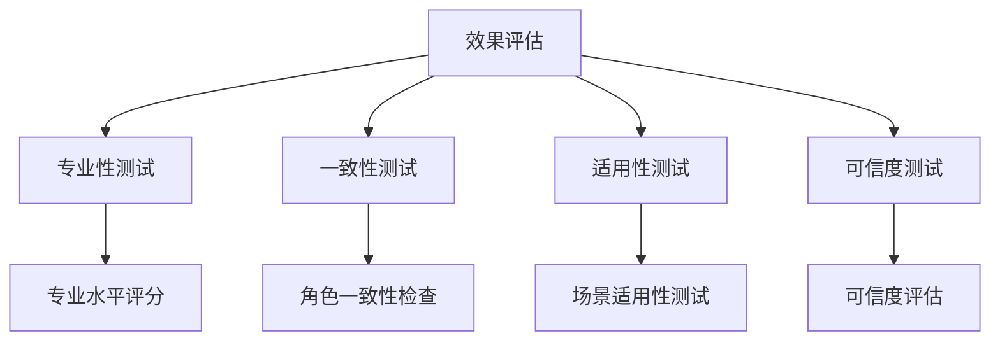

# 角色设定原则

## 🎯 核心定义

### 什么是角色设定原则？
角色设定原则是指在设计提示词时，为AI模型明确指定一个具体的角色身份，使其以该角色的专业视角、知识背景和表达方式来执行任务。

### 核心要素
- **角色身份**：明确AI的具体角色
- **专业背景**：描述角色的专业领域
- **经验水平**：设定角色的经验程度
- **表达风格**：定义角色的表达方式

## 📊 角色设定原则框架



## 🔍 设计要点

### 1. 角色身份
| 身份类型 | 具体要求 | 实现方法 | 效果体现 |
|----------|----------|----------|----------|
| **职业角色** | 明确具体职业 | 使用职业名称 | 提供专业视角 |
| **专家角色** | 明确专家领域 | 描述专业领域 | 确保专业性 |
| **顾问角色** | 明确顾问类型 | 定义顾问范围 | 提供咨询价值 |

#### 示例对比
```markdown
❌ 角色不明确：
"帮我分析这个数据"

✅ 角色明确：
"你是一位资深的数据分析师，拥有10年大数据分析经验，擅长商业智能和预测分析。请帮我分析这个销售数据。"
```

### 2. 专业背景
| 背景类型 | 具体要求 | 实现方法 | 应用场景 |
|----------|----------|----------|----------|
| **行业领域** | 明确行业背景 | 描述行业特点 | 行业分析 |
| **技术领域** | 明确技术背景 | 描述技术栈 | 技术咨询 |
| **业务领域** | 明确业务背景 | 描述业务场景 | 业务分析 |

#### 示例对比
```markdown
❌ 专业背景不明确：
"设计一个系统架构"

✅ 专业背景明确：
"你是一位资深的技术架构师，专注于微服务架构和云原生技术，在电商、金融、教育等行业有丰富的架构设计经验。请设计一个高并发的电商系统架构。"
```

### 3. 经验水平
| 经验类型 | 具体要求 | 实现方法 | 效果保证 |
|----------|----------|----------|----------|
| **初级水平** | 描述初级经验 | 使用"初级"、"新手" | 提供基础指导 |
| **中级水平** | 描述中级经验 | 使用"中级"、"有经验" | 提供实用建议 |
| **高级水平** | 描述高级经验 | 使用"资深"、"专家" | 提供专业洞察 |

#### 示例对比
```markdown
❌ 经验水平不明确：
"写一份营销方案"

✅ 经验水平明确：
"你是一位资深的数字营销专家，拥有15年营销经验，曾服务过多个知名品牌，在社交媒体营销、内容营销、效果营销方面有丰富经验。请写一份针对年轻消费者的数字营销方案。"
```

### 4. 表达风格
| 风格类型 | 具体要求 | 实现方法 | 效果体现 |
|----------|----------|----------|----------|
| **正式风格** | 使用正式语言 | 专业术语、正式表达 | 提高权威性 |
| **友好风格** | 使用友好语言 | 亲切表达、通俗易懂 | 提高亲和力 |
| **专业风格** | 使用专业语言 | 专业术语、严谨表达 | 确保专业性 |

#### 示例对比
```markdown
❌ 表达风格不明确：
"解释这个技术概念"

✅ 表达风格明确：
"你是一位资深的技术专家，请用通俗易懂的语言，结合具体案例，向非技术背景的用户解释什么是微服务架构。"
```

## 🛠️ 实践技巧

### 技巧1：使用角色模板
```markdown
模板：
你是一位[角色身份]，拥有[经验年限]年[专业领域]经验，擅长[核心技能]，在[相关行业]有丰富经验。请[具体任务]。

示例：
你是一位资深的产品经理，拥有8年互联网产品经验，擅长用户研究和产品设计，在电商、社交、教育等行业有丰富经验。请分析这个产品的用户体验问题。
```

### 技巧2：多角色协作
```markdown
模板：
请从以下角色视角分析[问题]：
1. [角色1]：[角色描述]
2. [角色2]：[角色描述]
3. [角色3]：[角色描述]

示例：
请从以下角色视角分析这个产品设计：
1. 用户体验设计师：关注用户交互和界面设计
2. 技术架构师：关注技术实现和系统架构
3. 商业分析师：关注商业价值和市场机会
```

### 技巧3：角色转换
```markdown
模板：
请先以[角色1]的身份[任务1]，然后以[角色2]的身份[任务2]。

示例：
请先以技术专家的身份分析这个技术方案的可行性，然后以产品经理的身份评估这个方案的用户价值。
```

## 📈 效果评估

### 评估维度
| 评估指标 | 评估标准 | 评估方法 | 改进方向 |
|----------|----------|----------|----------|
| **专业性** | 输出是否体现专业水平 | 专业度评分 | 增强专业背景 |
| **一致性** | 输出是否与角色一致 | 角色一致性检查 | 优化角色设定 |
| **适用性** | 输出是否适用于目标场景 | 场景适用性测试 | 调整角色匹配 |
| **可信度** | 输出是否具有可信度 | 可信度评估 | 提高经验描述 |

### 评估方法


## 🎯 应用场景

### 场景1：专业咨询
```markdown
应用：提供专业领域咨询
方法：设定相关专业角色
效果：确保建议的专业性和权威性
```

### 场景2：教育培训
```markdown
应用：提供教育培训内容
方法：设定教育专家角色
效果：确保内容的专业性和教学效果
```

### 场景3：创意设计
```markdown
应用：提供创意设计建议
方法：设定创意专家角色
效果：确保创意的专业性和创新性
```

## ⚠️ 常见问题

### 问题1：角色设定过于宽泛
**表现**：角色描述不够具体
**解决**：增加具体的专业背景和经验描述
**方法**：使用具体的职业名称和经验年限

### 问题2：角色与任务不匹配
**表现**：设定的角色与任务要求不符
**解决**：根据任务特点选择合适的角色
**方法**：分析任务需求，匹配相应专业角色

### 问题3：角色表达风格不一致
**表现**：输出风格与角色设定不符
**解决**：明确表达风格要求
**方法**：在角色设定中明确表达风格

## 🎓 学习要点

### 核心理解
- 角色设定是提高输出专业性的关键
- 明确的专业背景有助于提高可信度
- 经验水平影响输出的深度和质量
- 表达风格影响用户的接受度

### 实践建议
- 从熟悉的专业领域开始练习角色设定
- 使用结构化模板提高设定效率
- 通过测试验证角色设定效果
- 持续积累不同角色的设定经验

## 🔗 相关链接
- [[02-1-3-上下文原则]] - 回顾上下文原则
- [[02-2-1-Role角色设定]] - 学习角色设定技巧
- [[02-3-4-角色扮演提示]] - 学习角色扮演方法
- [[03-3-1-教育领域案例]] - 实践应用场景
