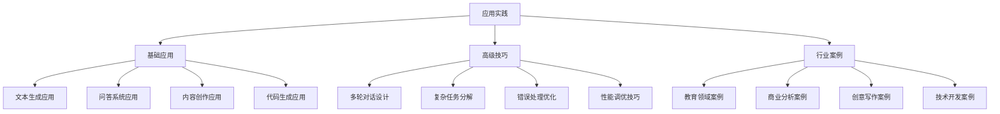
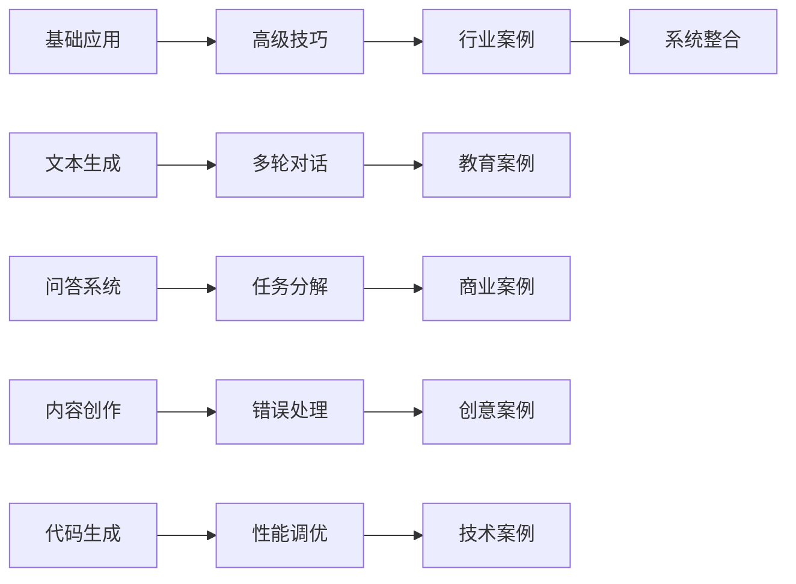

# 应用实践总结

## 📋 知识回顾

### 核心概念体系

## 🎯 关键知识点

### 1. 基础应用要点
| 应用类型 | 核心技能 | 实际价值 | 应用场景 |
|----------|----------|----------|----------|
| **文本生成应用** | 结构化生成、模板化设计 | 提高内容创作效率 | 文章写作、报告生成 |
| **问答系统应用** | 问题理解、答案生成 | 提供智能问答服务 | 客服系统、知识问答 |
| **内容创作应用** | 创意激发、个性化创作 | 提升内容质量和吸引力 | 营销文案、社交媒体 |
| **代码生成应用** | 代码规范、质量保证 | 提高开发效率 | 软件开发、自动化脚本 |

### 2. 高级技巧要点
| 技巧类型 | 核心方法 | 应用价值 | 实践指导 |
|----------|----------|----------|----------|
| **多轮对话设计** | 上下文管理、状态控制 | 支持复杂交互 | 智能客服、教育辅导 |
| **复杂任务分解** | 任务分析、依赖管理 | 提高任务执行效率 | 项目管理、系统开发 |
| **错误处理优化** | 错误检测、自动修复 | 提高系统稳定性 | 系统运维、质量保证 |
| **性能调优技巧** | 参数优化、架构优化 | 提升系统性能 | 系统优化、用户体验 |

### 3. 行业案例要点
| 行业领域 | 核心应用 | 关键价值 | 学习重点 |
|----------|----------|----------|----------|
| **教育领域** | 个性化学习、智能辅导 | 提升教学效果 | 教育理论、个性化设计 |
| **商业分析** | 数据洞察、决策支持 | 支持商业决策 | 数据分析、商业理解 |
| **创意写作** | 创意激发、风格多样 | 提高创作效率 | 创意技巧、写作技能 |
| **技术开发** | 代码生成、系统设计 | 提高开发效率 | 技术能力、工程实践 |

## 🔍 知识关联

### 概念关联图

### 学习路径关联
| 当前模块 | 下一模块 | 关联要点 | 学习重点 |
|----------|----------|----------|----------|
| **应用实践** | **进阶优化** | 从实践到优化 | 技术深度提升 |
| **基础应用** | **高级技巧** | 从基础到高级 | 技能进阶训练 |
| **高级技巧** | **行业案例** | 从技巧到应用 | 实际应用训练 |
| **行业案例** | **系统整合** | 从应用到系统 | 系统化思维 |

## 📊 知识检验

### 基础应用检验
- [ ] 能够设计有效的文本生成提示词
- [ ] 掌握问答系统的设计方法
- [ ] 理解内容创作的核心技巧
- [ ] 能够生成高质量的代码

### 高级技巧检验
- [ ] 能够设计多轮对话系统
- [ ] 掌握复杂任务分解方法
- [ ] 理解错误处理优化策略
- [ ] 能够进行系统性能调优

### 行业案例检验
- [ ] 能够应用教育领域的最佳实践
- [ ] 掌握商业分析的应用方法
- [ ] 理解创意写作的核心技巧
- [ ] 能够应用技术开发的实践方法

## 🎯 学习成果

### 知识收获
1. **应用技能**：掌握了提示词工程的核心应用技能
2. **实践方法**：学会了各种实践方法和技巧
3. **行业理解**：深入理解了不同行业的应用特点
4. **系统思维**：建立了系统化的应用思维

### 能力提升
1. **设计能力**：能够设计复杂的提示词应用系统
2. **实践能力**：能够将理论知识应用到实际场景
3. **优化能力**：能够优化和改进应用效果
4. **创新能力**：能够创新性地解决实际问题

## 🚀 下一步学习

### 学习重点转移
从**应用实践**转向**进阶优化**，重点学习：
- [[04-1-1-提示词链式设计]] - 学习链式设计技巧
- [[04-1-2-动态提示词生成]] - 学习动态生成方法
- [[04-1-3-多模态提示词]] - 学习多模态应用
- [[04-1-4-提示词版本管理]] - 学习版本管理策略

### 学习方法建议
1. **深度实践**：深入实践各种应用场景
2. **效果评估**：建立完善的效果评估体系
3. **持续优化**：持续优化和改进应用效果
4. **创新探索**：探索新的应用领域和方法

### 实践准备
1. **项目实践**：选择实际项目进行实践
2. **效果监控**：建立效果监控和评估机制
3. **经验积累**：积累实践经验和方法
4. **知识分享**：分享实践经验和最佳实践

## 💡 学习心得

### 关键洞察
- 应用实践是提示词工程的核心价值体现
- 不同行业有不同的应用特点和要求
- 高级技巧是提升应用效果的关键
- 持续优化是保持竞争力的重要方法

### 实践启示
- 从简单应用开始，逐步提升复杂度
- 注重效果评估和持续优化
- 积累行业经验和最佳实践
- 关注技术发展趋势和创新应用

## 🔗 相关链接

### 回顾链接
- [[03-1-1-文本生成应用]] - 回顾文本生成应用
- [[03-1-2-问答系统应用]] - 回顾问答系统应用
- [[03-1-3-内容创作应用]] - 回顾内容创作应用
- [[03-1-4-代码生成应用]] - 回顾代码生成应用
- [[03-2-1-多轮对话设计]] - 回顾多轮对话设计
- [[03-2-2-复杂任务分解]] - 回顾复杂任务分解
- [[03-2-3-错误处理优化]] - 回顾错误处理优化
- [[03-2-4-性能调优技巧]] - 回顾性能调优技巧
- [[03-3-1-教育领域案例]] - 回顾教育领域案例
- [[03-3-2-商业分析案例]] - 回顾商业分析案例
- [[03-3-3-创意写作案例]] - 回顾创意写作案例
- [[03-3-4-技术开发案例]] - 回顾技术开发案例

### 进阶链接
- [[04-1-1-提示词链式设计]] - 开始进阶优化学习
- [[04-4-进阶优化总结]] - 进阶优化模块总结
- [[05-3-系统整合总结]] - 系统整合模块总结

### 资源链接
- [[项目1-基础提示词练习]] - 基础练习项目
- [[项目2-进阶技巧练习]] - 进阶练习项目
- [[项目3-综合应用练习]] - 综合应用项目
- [[数字营销/00-总览导航/学习进度追踪]] - 记录学习进度
