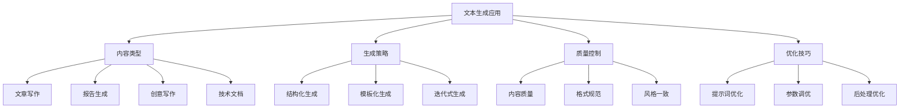
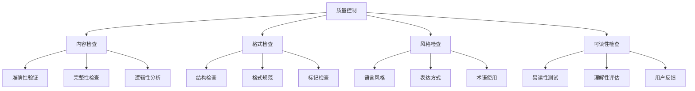

# 文本生成应用

## 🎯 核心定义

### 什么是文本生成应用？
文本生成应用是指使用提示词工程技术，引导AI模型生成各种类型的文本内容，包括文章、报告、创意写作、技术文档等。

### 核心价值
- **内容创作**：快速生成高质量文本内容
- **效率提升**：大幅提高内容创作效率
- **质量保证**：确保生成内容的质量和一致性
- **创意激发**：提供创意灵感和写作思路

## 📊 文本生成应用框架



## 🔍 应用场景

### 1. 文章写作
| 文章类型 | 核心特点 | 提示词设计 | 应用价值 |
|----------|----------|----------|----------|
| **新闻文章** | 客观、及时、准确 | 5W1H框架 | 快速新闻生产 |
| **博客文章** | 个人化、深度、互动 | 故事化叙述 | 内容营销 |
| **学术论文** | 严谨、逻辑、引用 | 结构化论证 | 学术研究 |
| **产品介绍** | 吸引、清晰、说服 | 卖点突出 | 产品营销 |

#### 设计模板
```markdown
文章写作模板：
你是一位资深的内容创作者，请写一篇关于[主题]的[文章类型]：
- 目标读者：[读者群体]
- 文章长度：[字数要求]
- 写作风格：[风格要求]
- 核心要点：[关键内容]
- 输出格式：[格式要求]

示例：
你是一位资深的内容创作者，请写一篇关于人工智能发展的科普文章：
- 目标读者：普通大众
- 文章长度：800-1000字
- 写作风格：通俗易懂，生动有趣
- 核心要点：AI发展历程、现状、未来趋势
- 输出格式：包含标题、引言、正文、结论
```

### 2. 报告生成
| 报告类型 | 核心特点 | 提示词设计 | 应用价值 |
|----------|----------|----------|----------|
| **分析报告** | 数据驱动、逻辑清晰 | 结构化分析 | 决策支持 |
| **调研报告** | 全面、客观、深入 | 多维度分析 | 市场洞察 |
| **总结报告** | 简洁、重点突出 | 要点归纳 | 信息整理 |
| **建议报告** | 实用、可操作 | 方案导向 | 行动指导 |

#### 设计模板
```markdown
报告生成模板：
你是一位专业的[领域]分析师，请生成一份关于[主题]的[报告类型]：
- 报告目的：[具体目的]
- 数据来源：[数据信息]
- 分析维度：[分析角度]
- 报告结构：[结构要求]
- 输出格式：[格式规范]

示例：
你是一位专业的市场分析师，请生成一份关于智能手机市场的分析报告：
- 报告目的：为产品策略制定提供参考
- 数据来源：2023年市场数据
- 分析维度：市场规模、竞争格局、用户需求、技术趋势
- 报告结构：执行摘要、市场概况、竞争分析、机会识别、建议措施
- 输出格式：使用标题、图表、数据表格
```

### 3. 创意写作
| 创意类型 | 核心特点 | 提示词设计 | 应用价值 |
|----------|----------|----------|----------|
| **故事创作** | 情节、人物、冲突 | 故事结构 | 娱乐内容 |
| **诗歌创作** | 韵律、意象、情感 | 诗歌技巧 | 艺术表达 |
| **广告文案** | 吸引、说服、行动 | 营销策略 | 商业推广 |
| **剧本创作** | 对话、场景、冲突 | 戏剧结构 | 影视制作 |

#### 设计模板
```markdown
创意写作模板：
你是一位富有创意的[创作类型]作家，请创作一个[作品类型]：
- 主题：[创作主题]
- 风格：[创作风格]
- 长度：[作品长度]
- 目标：[创作目标]
- 要求：[特殊要求]

示例：
你是一位富有创意的故事作家，请创作一个科幻短篇小说：
- 主题：人工智能与人类的未来
- 风格：悬疑、思考、未来感
- 长度：2000-3000字
- 目标：引发读者对AI发展的思考
- 要求：包含完整的情节发展和人物塑造
```

### 4. 技术文档
| 文档类型 | 核心特点 | 提示词设计 | 应用价值 |
|----------|----------|----------|----------|
| **API文档** | 准确、完整、易用 | 技术规范 | 开发支持 |
| **用户手册** | 清晰、易懂、实用 | 用户导向 | 产品支持 |
| **技术规范** | 严谨、标准、详细 | 标准格式 | 技术标准 |
| **操作指南** | 步骤化、可操作 | 流程导向 | 操作支持 |

#### 设计模板
```markdown
技术文档模板：
你是一位资深的技术文档工程师，请编写一份[文档类型]：
- 技术栈：[技术信息]
- 目标用户：[用户群体]
- 文档结构：[结构要求]
- 详细程度：[详细要求]
- 格式规范：[格式标准]

示例：
你是一位资深的技术文档工程师，请编写一份API接口文档：
- 技术栈：RESTful API，使用JSON格式
- 目标用户：前端开发者和第三方开发者
- 文档结构：概述、认证、接口列表、错误码、示例
- 详细程度：包含完整的参数说明和示例代码
- 格式规范：使用Markdown格式，包含代码块
```

## 🛠️ 实践技巧

### 技巧1：结构化生成
```markdown
模板：
请按以下结构生成[内容类型]：
1. [结构1]：[内容要求]
2. [结构2]：[内容要求]
3. [结构3]：[内容要求]
4. [结构4]：[内容要求]

示例：
请按以下结构生成产品介绍：
1. 产品概述：产品名称、定位、核心价值
2. 功能特点：主要功能、技术优势、创新点
3. 用户价值：解决的问题、带来的好处
4. 使用场景：适用场景、目标用户
```

### 技巧2：模板化生成
```markdown
模板：
请使用以下模板生成[内容类型]：
[模板内容]

示例：
请使用以下模板生成新闻稿：
标题：[吸引人的标题]
导语：[简洁的导语，包含5W1H]
正文：[详细内容，分段叙述]
结尾：[总结或展望]
```

### 技巧3：迭代式生成
```markdown
模板：
请分步骤生成[内容类型]：
步骤1：[第一步内容]
步骤2：[基于第一步的第二步]
步骤3：[基于前两步的第三步]

示例：
请分步骤生成技术方案：
步骤1：需求分析和问题定义
步骤2：基于需求的技术选型
步骤3：基于技术选型的架构设计
步骤4：基于架构的实施方案
```

## 📈 质量控制

### 质量维度
| 质量指标 | 评估标准 | 控制方法 | 改进策略 |
|----------|----------|----------|----------|
| **内容质量** | 准确性、完整性、逻辑性 | 内容检查 | 优化提示词 |
| **格式规范** | 结构清晰、格式统一 | 格式检查 | 明确格式要求 |
| **风格一致** | 语言风格、表达方式 | 风格检查 | 统一风格要求 |
| **可读性** | 易读性、理解性 | 可读性测试 | 优化表达方式 |

### 控制方法


## 🎯 优化技巧

### 技巧1：提示词优化
```markdown
优化策略：
1. 明确目标：清晰定义生成目标
2. 提供上下文：充分背景信息
3. 设定约束：明确长度、风格等要求
4. 使用示例：提供参考示例
5. 迭代改进：根据结果优化提示词

示例：
优化前：写一篇文章
优化后：你是一位资深的内容创作者，请写一篇关于人工智能发展的科普文章，目标读者是普通大众，字数800-1000字，风格通俗易懂，包含发展历程、现状分析、未来趋势三部分
```

### 技巧2：参数调优
```markdown
调优策略：
1. 温度设置：创意内容用高温度，技术文档用低温度
2. 长度控制：根据内容类型设置合适长度
3. 重复惩罚：避免内容重复
4. 频率惩罚：控制词汇使用频率

示例：
- 创意写作：温度0.8，长度2000，重复惩罚1.1
- 技术文档：温度0.3，长度1500，重复惩罚1.0
- 新闻文章：温度0.5，长度1000，重复惩罚1.05
```

### 技巧3：后处理优化
```markdown
优化策略：
1. 内容编辑：修正错误，优化表达
2. 格式调整：统一格式，优化结构
3. 风格统一：保持风格一致性
4. 质量检查：最终质量验证

示例：
后处理步骤：
1. 检查语法和拼写错误
2. 调整段落结构和逻辑
3. 统一术语和表达方式
4. 验证内容准确性和完整性
```

## ⚠️ 常见问题

### 问题1：内容质量不稳定
**表现**：生成内容质量参差不齐
**解决**：优化提示词设计，增加质量约束
**方法**：使用结构化模板，明确质量要求

### 问题2：风格不一致
**表现**：生成内容风格不统一
**解决**：统一风格要求，使用风格示例
**方法**：在提示词中明确风格要求

### 问题3：内容重复
**表现**：生成内容存在重复
**解决**：调整参数设置，优化提示词
**方法**：使用重复惩罚，增加多样性要求

## 🎓 学习要点

### 核心理解
- 文本生成是提示词工程的重要应用
- 结构化设计有助于提高生成质量
- 质量控制是确保效果的关键
- 持续优化是提升效果的方法

### 实践建议
- 从简单场景开始练习文本生成
- 使用结构化模板提高生成效率
- 建立质量控制流程
- 持续优化和改进生成效果

## 🔗 相关链接
- [[02-1-1-清晰性原则]] - 学习清晰性原则
- [[02-1-2-具体性原则]] - 学习具体性原则
- [[02-2-4-Format输出格式]] - 学习输出格式控制
- [[03-1-2-问答系统应用]] - 学习问答系统应用
