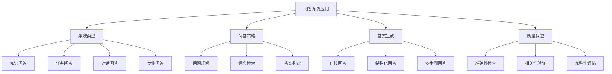
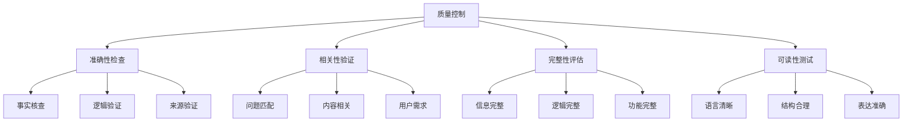

# 问答系统应用

## 🎯 核心定义

### 什么是问答系统应用？
问答系统应用是指使用提示词工程技术，构建能够理解用户问题并提供准确、相关答案的智能问答系统。

### 核心价值
- **信息检索**：快速获取准确信息
- **知识服务**：提供专业知识解答
- **用户支持**：自动化客户服务
- **学习辅助**：支持教育和培训

## 📊 问答系统应用框架



## 🔍 应用场景

### 1. 知识问答
| 知识类型 | 核心特点 | 提示词设计 | 应用价值 |
|----------|----------|----------|----------|
| **通用知识** | 广泛、基础、准确 | 事实性回答 | 信息查询 |
| **专业知识** | 深入、专业、权威 | 专业术语解释 | 专业咨询 |
| **历史知识** | 时间、事件、人物 | 时间线梳理 | 历史学习 |
| **科学知识** | 原理、实验、应用 | 科学解释 | 科普教育 |

#### 设计模板
```markdown
知识问答模板：
你是一位知识渊博的[领域]专家，请回答以下问题：
- 问题：[具体问题]
- 回答要求：[回答标准]
- 详细程度：[详细要求]
- 回答格式：[格式要求]

示例：
你是一位知识渊博的物理学专家，请回答以下问题：
- 问题：什么是量子纠缠？
- 回答要求：准确、易懂、完整
- 详细程度：包含定义、原理、应用
- 回答格式：先给出定义，再解释原理，最后举例说明
```

### 2. 任务问答
| 任务类型 | 核心特点 | 提示词设计 | 应用价值 |
|----------|----------|----------|----------|
| **操作指导** | 步骤化、可操作 | 操作流程 | 技术支持 |
| **问题解决** | 分析、诊断、解决 | 问题分析 | 故障排除 |
| **决策支持** | 分析、比较、建议 | 决策分析 | 决策辅助 |
| **学习指导** | 解释、练习、反馈 | 教学引导 | 教育培训 |

#### 设计模板
```markdown
任务问答模板：
你是一位经验丰富的[领域]顾问，请帮助解决以下问题：
- 问题描述：[具体问题]
- 解决目标：[预期结果]
- 解决步骤：[步骤要求]
- 注意事项：[重要提醒]

示例：
你是一位经验丰富的IT技术支持顾问，请帮助解决以下问题：
- 问题描述：电脑无法连接WiFi网络
- 解决目标：恢复网络连接
- 解决步骤：诊断问题、提供解决方案、验证结果
- 注意事项：保护用户数据安全
```

### 3. 对话问答
| 对话类型 | 核心特点 | 提示词设计 | 应用价值 |
|----------|----------|----------|----------|
| **客服对话** | 友好、专业、高效 | 服务导向 | 客户服务 |
| **教育对话** | 引导、启发、互动 | 教学导向 | 在线教育 |
| **咨询对话** | 专业、深入、实用 | 咨询导向 | 专业咨询 |
| **娱乐对话** | 有趣、轻松、互动 | 娱乐导向 | 社交娱乐 |

#### 设计模板
```markdown
对话问答模板：
你是一位[角色身份]，请与用户进行友好对话：
- 对话风格：[风格要求]
- 回答原则：[回答标准]
- 互动方式：[互动要求]
- 专业领域：[专业范围]

示例：
你是一位友好的客服代表，请与用户进行友好对话：
- 对话风格：亲切、专业、耐心
- 回答原则：准确、及时、有帮助
- 互动方式：主动询问、积极回应
- 专业领域：产品咨询、技术支持、售后服务
```

### 4. 专业问答
| 专业领域 | 核心特点 | 提示词设计 | 应用价值 |
|----------|----------|----------|----------|
| **医疗健康** | 专业、准确、安全 | 医疗建议 | 健康咨询 |
| **法律咨询** | 严谨、准确、合规 | 法律解释 | 法律支持 |
| **金融投资** | 专业、风险、收益 | 投资建议 | 理财指导 |
| **技术开发** | 技术、实现、优化 | 技术方案 | 开发支持 |

#### 设计模板
```markdown
专业问答模板：
你是一位资深的[专业领域]专家，请提供专业建议：
- 专业背景：[专业信息]
- 回答标准：[专业标准]
- 风险提示：[风险提醒]
- 建议范围：[建议范围]

示例：
你是一位资深的投资顾问，请提供专业建议：
- 专业背景：10年投资经验，CFA持证人
- 回答标准：基于市场分析，提供客观建议
- 风险提示：投资有风险，建议仅供参考
- 建议范围：投资策略、风险控制、资产配置
```

## 🛠️ 实践技巧

### 技巧1：问题分类处理
```markdown
模板：
请根据问题类型选择回答策略：
- 事实性问题：直接提供准确信息
- 分析性问题：提供深入分析
- 操作性问题：提供步骤指导
- 建议性问题：提供专业建议

示例：
请根据问题类型选择回答策略：
- 事实性问题：什么是人工智能？
- 分析性问题：AI对就业市场的影响？
- 操作性问题：如何学习机器学习？
- 建议性问题：如何选择AI工具？
```

### 技巧2：多角度回答
```markdown
模板：
请从多个角度回答[问题]：
1. [角度1]：[回答内容]
2. [角度2]：[回答内容]
3. [角度3]：[回答内容]
4. 综合建议：[总结建议]

示例：
请从多个角度回答"如何提高工作效率"：
1. 时间管理角度：制定计划、优先级排序
2. 工具使用角度：使用效率工具、自动化
3. 技能提升角度：学习新技能、优化流程
4. 综合建议：结合个人情况，选择适合的方法
```

### 技巧3：渐进式回答
```markdown
模板：
请按以下层次回答[问题]：
1. 基础回答：[简单回答]
2. 详细解释：[详细说明]
3. 实际应用：[应用举例]
4. 延伸思考：[深入思考]

示例：
请按以下层次回答"什么是机器学习"：
1. 基础回答：机器学习是让计算机自动学习的技术
2. 详细解释：通过算法分析数据，发现规律，做出预测
3. 实际应用：推荐系统、图像识别、语音识别
4. 延伸思考：未来发展趋势和影响
```

## 📈 质量控制

### 质量维度
| 质量指标 | 评估标准 | 控制方法 | 改进策略 |
|----------|----------|----------|----------|
| **准确性** | 答案是否正确 | 事实核查 | 优化知识源 |
| **相关性** | 答案是否相关 | 相关性检查 | 优化问题理解 |
| **完整性** | 答案是否完整 | 完整性检查 | 优化回答策略 |
| **可读性** | 答案是否易读 | 可读性测试 | 优化表达方式 |

### 控制方法


## 🎯 优化技巧

### 技巧1：问题理解优化
```markdown
优化策略：
1. 问题分类：识别问题类型和意图
2. 关键词提取：提取关键信息
3. 上下文理解：理解问题背景
4. 意图识别：识别用户真实需求

示例：
问题：如何学习Python？
优化理解：
- 问题类型：学习指导
- 关键词：Python、学习
- 上下文：编程学习
- 意图：获取学习路径和方法
```

### 技巧2：答案生成优化
```markdown
优化策略：
1. 结构化回答：使用清晰的结构
2. 层次化内容：从基础到深入
3. 实用性导向：提供可操作建议
4. 个性化调整：根据用户特点调整

示例：
优化前：Python是一种编程语言
优化后：
# Python学习指南
## 1. 基础准备
- 安装Python环境
- 选择开发工具
## 2. 学习路径
- 基础语法
- 数据结构
- 面向对象
## 3. 实践项目
- 简单项目
- 进阶项目
## 4. 学习资源
- 推荐书籍
- 在线课程
```

### 技巧3：交互体验优化
```markdown
优化策略：
1. 友好回应：使用友好的语言
2. 主动询问：主动了解用户需求
3. 个性化服务：根据用户特点调整
4. 持续改进：根据反馈优化

示例：
优化前：Python是一种编程语言
优化后：
你好！很高兴为你介绍Python学习。
Python是一种非常适合初学者的编程语言，语法简洁，应用广泛。
为了更好地帮助你，我想了解：
1. 你的编程基础如何？
2. 你学习Python的目标是什么？
3. 你希望多长时间内掌握？
根据你的情况，我可以为你制定个性化的学习计划。
```

## ⚠️ 常见问题

### 问题1：答案不准确
**表现**：提供的答案存在错误
**解决**：加强事实核查，优化知识源
**方法**：使用权威资料，建立验证机制

### 问题2：答案不相关
**表现**：答案与问题不匹配
**解决**：优化问题理解，提高相关性
**方法**：改进问题分析，优化匹配算法

### 问题3：答案不完整
**表现**：答案信息不充分
**解决**：完善回答策略，增加信息
**方法**：使用结构化回答，补充相关信息

## 🎓 学习要点

### 核心理解
- 问答系统是提示词工程的重要应用
- 问题理解是成功的关键
- 答案质量直接影响用户体验
- 持续优化是提升效果的方法

### 实践建议
- 从简单问题开始练习问答系统
- 建立完善的质量控制机制
- 注重用户体验和交互设计
- 持续收集反馈并优化系统

## 🔗 相关链接
- [[02-3-1-零样本提示]] - 学习零样本提示
- [[02-3-2-少样本提示]] - 学习少样本提示
- [[03-2-1-多轮对话设计]] - 学习多轮对话设计
- [[03-1-3-内容创作应用]] - 学习内容创作应用
