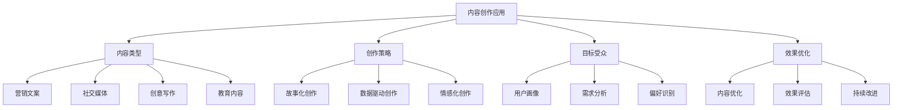
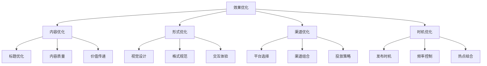

# 内容创作应用

## 🎯 核心定义

### 什么是内容创作应用？
内容创作应用是指使用提示词工程技术，引导AI模型生成各种类型的内容，包括营销文案、社交媒体内容、创意写作、教育内容等。

### 核心价值
- **创意激发**：提供创意灵感和写作思路
- **效率提升**：大幅提高内容创作效率
- **质量保证**：确保内容质量和一致性
- **个性化**：根据目标受众定制内容

## 📊 内容创作应用框架



## 🔍 应用场景

### 1. 营销文案
| 文案类型 | 核心特点 | 提示词设计 | 应用价值 |
|----------|----------|----------|----------|
| **产品介绍** | 吸引、清晰、说服 | 卖点突出 | 产品推广 |
| **广告文案** | 创意、记忆、行动 | 情感共鸣 | 品牌营销 |
| **邮件营销** | 个性化、相关、转化 | 精准定位 | 客户维护 |
| **落地页** | 转化、简洁、信任 | 行动导向 | 销售转化 |

#### 设计模板
```markdown
营销文案模板：
你是一位资深的营销文案专家，请为[产品/服务]创作[文案类型]：
- 目标受众：[用户群体]
- 核心卖点：[产品优势]
- 情感诉求：[情感连接]
- 行动号召：[期望行动]
- 文案风格：[风格要求]

示例：
你是一位资深的营销文案专家，请为智能手表创作产品介绍：
- 目标受众：25-35岁健康意识强的上班族
- 核心卖点：24小时健康监测、智能提醒、时尚设计
- 情感诉求：关注健康、追求品质生活
- 行动号召：立即购买，开启健康生活
- 文案风格：专业、可信、有吸引力
```

### 2. 社交媒体内容
| 平台类型 | 核心特点 | 提示词设计 | 应用价值 |
|----------|----------|----------|----------|
| **微博** | 简短、热点、互动 | 话题导向 | 品牌曝光 |
| **微信** | 深度、价值、分享 | 内容价值 | 用户粘性 |
| **抖音** | 创意、视觉、传播 | 创意表达 | 病毒传播 |
| **小红书** | 真实、分享、种草 | 体验分享 | 产品推荐 |

#### 设计模板
```markdown
社交媒体模板：
你是一位社交媒体内容专家，请为[品牌/产品]创作[平台]内容：
- 平台特点：[平台特色]
- 内容主题：[主题内容]
- 目标效果：[期望效果]
- 互动策略：[互动方式]
- 发布时机：[最佳时间]

示例：
你是一位社交媒体内容专家，请为健身品牌创作抖音内容：
- 平台特点：短视频、创意表达、年轻用户
- 内容主题：健身小技巧、励志故事
- 目标效果：提高品牌知名度、吸引潜在用户
- 互动策略：挑战话题、用户参与
- 发布时机：晚上7-9点，周末上午
```

### 3. 创意写作
| 创意类型 | 核心特点 | 提示词设计 | 应用价值 |
|----------|----------|----------|----------|
| **故事创作** | 情节、人物、冲突 | 故事结构 | 娱乐内容 |
| **诗歌创作** | 韵律、意象、情感 | 诗歌技巧 | 艺术表达 |
| **剧本创作** | 对话、场景、冲突 | 戏剧结构 | 影视制作 |
| **小说创作** | 情节、人物、世界观 | 叙事技巧 | 文学创作 |

#### 设计模板
```markdown
创意写作模板：
你是一位富有创意的[创作类型]作家，请创作一个[作品类型]：
- 创作主题：[主题内容]
- 目标受众：[读者群体]
- 作品风格：[风格特点]
- 情感基调：[情感色彩]
- 创作要求：[特殊要求]

示例：
你是一位富有创意的故事作家，请创作一个科幻短篇小说：
- 创作主题：人工智能与人类的未来关系
- 目标受众：科幻爱好者、科技关注者
- 作品风格：悬疑、思考、未来感
- 情感基调：思考、希望、警示
- 创作要求：包含完整的情节发展和人物塑造
```

### 4. 教育内容
| 教育类型 | 核心特点 | 提示词设计 | 应用价值 |
|----------|----------|----------|----------|
| **课程内容** | 系统、逻辑、实用 | 知识体系 | 教育培训 |
| **学习资料** | 清晰、易懂、完整 | 学习导向 | 知识传播 |
| **考试辅导** | 重点、技巧、练习 | 考试导向 | 学习支持 |
| **科普内容** | 通俗、准确、有趣 | 科普导向 | 知识普及 |

#### 设计模板
```markdown
教育内容模板：
你是一位资深的教育内容专家，请为[学科/主题]创作[内容类型]：
- 学习目标：[教学目标]
- 目标学员：[学员群体]
- 内容深度：[难度级别]
- 教学方法：[教学策略]
- 评估方式：[考核方法]

示例：
你是一位资深的教育内容专家，请为Python编程创作课程内容：
- 学习目标：掌握Python基础语法和编程思维
- 目标学员：编程初学者、非计算机专业学生
- 内容深度：入门级，循序渐进
- 教学方法：理论结合实践，项目驱动
- 评估方式：编程练习、项目作品
```

## 🛠️ 实践技巧

### 技巧1：目标受众分析
```markdown
模板：
请分析目标受众特征：
- 基本信息：[年龄、性别、职业等]
- 兴趣爱好：[兴趣领域、偏好等]
- 需求痛点：[主要需求、面临问题]
- 消费习惯：[购买行为、决策因素]
- 内容偏好：[喜欢的内容类型]

示例：
请分析目标受众特征：
- 基本信息：25-35岁，男女比例均衡，白领为主
- 兴趣爱好：健康生活、科技产品、运动健身
- 需求痛点：工作压力大、缺乏运动时间、健康意识强
- 消费习惯：注重品质、愿意为健康投资、理性消费
- 内容偏好：实用性强、有数据支撑、视觉效果好
```

### 技巧2：情感化创作
```markdown
模板：
请运用情感化创作技巧：
- 情感触发：[触发情感的元素]
- 情感共鸣：[引起共鸣的内容]
- 情感转化：[情感转化为行动]
- 情感延续：[情感持续影响]

示例：
请运用情感化创作技巧：
- 情感触发：健康危机、时间紧迫、生活压力
- 情感共鸣：同龄人的成功案例、相似经历
- 情感转化：从焦虑到行动，从被动到主动
- 情感延续：持续的健康关注、生活方式改变
```

### 技巧3：故事化表达
```markdown
模板：
请使用故事化表达：
- 故事结构：[起承转合]
- 人物设定：[主角、配角]
- 冲突设置：[主要冲突]
- 解决方案：[问题解决]
- 价值传递：[核心价值]

示例：
请使用故事化表达：
- 故事结构：问题出现→寻找解决方案→尝试改变→获得成功
- 人物设定：忙碌的上班族小王，健康意识觉醒
- 冲突设置：工作与健康的矛盾，时间与精力的限制
- 解决方案：智能手表帮助管理健康，科学运动
- 价值传递：健康是最大的财富，科技让生活更美好
```

## 📈 效果优化

### 优化维度
| 优化指标 | 评估标准 | 优化方法 | 改进策略 |
|----------|----------|----------|----------|
| **吸引力** | 内容是否吸引目标受众 | 标题优化、视觉设计 | 提高创意度 |
| **相关性** | 内容是否与受众相关 | 精准定位、需求匹配 | 提高针对性 |
| **转化率** | 内容是否促进转化 | 行动引导、价值传递 | 提高转化效果 |
| **传播性** | 内容是否易于传播 | 分享机制、话题性 | 提高传播效果 |

### 优化方法


## 🎯 创作策略

### 策略1：数据驱动创作
```markdown
策略要点：
1. 用户数据分析：了解受众特征和偏好
2. 内容效果分析：分析高效果内容特点
3. 竞品分析：研究竞争对手内容策略
4. 趋势分析：把握内容创作趋势
5. 数据反馈：根据数据调整创作策略

实施方法：
- 建立用户画像数据库
- 分析历史内容表现数据
- 监控竞品内容策略
- 跟踪行业趋势变化
- 建立数据反馈机制
```

### 策略2：个性化创作
```markdown
策略要点：
1. 用户细分：根据特征细分用户群体
2. 内容定制：为不同群体定制内容
3. 个性化推荐：基于偏好推荐内容
4. 动态调整：根据反馈动态调整
5. 持续优化：不断优化个性化效果

实施方法：
- 建立用户细分模型
- 开发内容定制工具
- 实现个性化推荐算法
- 建立动态调整机制
- 持续优化个性化策略
```

### 策略3：跨平台创作
```markdown
策略要点：
1. 平台特性分析：了解各平台特点
2. 内容适配：适配不同平台要求
3. 统一品牌：保持品牌一致性
4. 协同效应：发挥平台协同作用
5. 效果最大化：实现整体效果最优

实施方法：
- 分析各平台用户特征
- 开发内容适配工具
- 建立品牌统一标准
- 实现跨平台协同
- 优化整体投放策略
```

## ⚠️ 常见问题

### 问题1：内容缺乏创意
**表现**：内容同质化，缺乏新意
**解决**：增加创意元素，使用创新表达
**方法**：故事化表达、情感化创作、视觉化呈现

### 问题2：目标受众不明确
**表现**：内容泛化，缺乏针对性
**解决**：明确目标受众，精准定位
**方法**：用户画像分析、需求调研、内容定制

### 问题3：效果难以衡量
**表现**：无法准确评估内容效果
**解决**：建立效果评估体系
**方法**：设定KPI指标、数据监控、效果分析

## 🎓 学习要点

### 核心理解
- 内容创作是提示词工程的重要应用
- 目标受众分析是成功的关键
- 情感化和故事化是有效的创作技巧
- 持续优化是提升效果的方法

### 实践建议
- 从简单场景开始练习内容创作
- 建立完善的目标受众分析体系
- 注重创意和情感表达
- 持续收集反馈并优化内容

## 🔗 相关链接
- [[02-1-2-具体性原则]] - 学习具体性原则
- [[02-3-4-角色扮演提示]] - 学习角色扮演提示
- [[03-1-1-文本生成应用]] - 学习文本生成应用
- [[03-3-3-创意写作案例]] - 学习创意写作案例
