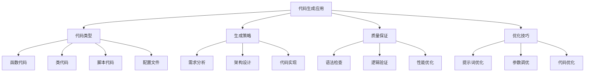
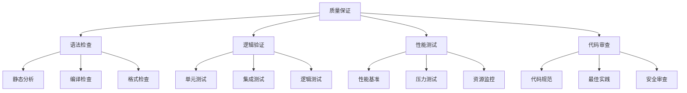

# 代码生成应用

## 🎯 核心定义

### 什么是代码生成应用？
代码生成应用是指使用提示词工程技术，引导AI模型生成各种类型的代码，包括函数、类、脚本、配置文件等，提高软件开发效率。

### 核心价值
- **开发效率**：大幅提高代码编写效率
- **代码质量**：生成高质量、规范的代码
- **学习辅助**：帮助开发者学习编程
- **错误减少**：减少语法错误和逻辑错误

## 📊 代码生成应用框架



## 🔍 应用场景

### 1. 函数代码生成
| 函数类型 | 核心特点 | 提示词设计 | 应用价值 |
|----------|----------|----------|----------|
| **工具函数** | 通用、可复用、简洁 | 功能明确 | 代码复用 |
| **业务函数** | 业务逻辑、数据处理 | 业务导向 | 业务实现 |
| **算法函数** | 算法实现、性能优化 | 算法导向 | 算法应用 |
| **API函数** | 接口封装、数据交互 | 接口导向 | 系统集成 |

#### 设计模板
```markdown
函数代码模板：
你是一位资深的[编程语言]开发工程师，请生成一个[函数类型]函数：
- 函数功能：[具体功能描述]
- 输入参数：[参数类型和说明]
- 返回值：[返回值类型和说明]
- 代码规范：[编码规范要求]
- 注释要求：[注释详细程度]

示例：
你是一位资深的Python开发工程师，请生成一个工具函数：
- 函数功能：计算两个日期之间的天数差
- 输入参数：start_date(字符串格式日期), end_date(字符串格式日期)
- 返回值：整数(天数差)
- 代码规范：遵循PEP 8规范
- 注释要求：包含函数说明、参数说明、返回值说明
```

### 2. 类代码生成
| 类类型 | 核心特点 | 提示词设计 | 应用价值 |
|----------|----------|----------|----------|
| **数据类** | 数据封装、属性管理 | 数据结构 | 数据建模 |
| **业务类** | 业务逻辑、流程控制 | 业务导向 | 业务实现 |
| **工具类** | 通用功能、静态方法 | 功能导向 | 工具封装 |
| **接口类** | 接口定义、抽象方法 | 接口导向 | 系统设计 |

#### 设计模板
```markdown
类代码模板：
你是一位资深的[编程语言]开发工程师，请生成一个[类类型]类：
- 类功能：[类的核心功能]
- 主要属性：[属性列表和类型]
- 主要方法：[方法列表和功能]
- 设计模式：[使用的设计模式]
- 代码规范：[编码规范要求]

示例：
你是一位资深的Python开发工程师，请生成一个用户管理类：
- 类功能：管理用户信息，包括增删改查操作
- 主要属性：user_id, username, email, created_at
- 主要方法：create_user, get_user, update_user, delete_user
- 设计模式：使用单例模式
- 代码规范：遵循PEP 8规范，包含类型提示
```

### 3. 脚本代码生成
| 脚本类型 | 核心特点 | 提示词设计 | 应用价值 |
|----------|----------|----------|----------|
| **数据处理** | 数据清洗、转换、分析 | 数据导向 | 数据分析 |
| **自动化** | 任务自动化、流程控制 | 自动化导向 | 效率提升 |
| **部署脚本** | 环境配置、服务部署 | 部署导向 | 运维自动化 |
| **测试脚本** | 单元测试、集成测试 | 测试导向 | 质量保证 |

#### 设计模板
```markdown
脚本代码模板：
你是一位资深的[编程语言]开发工程师，请生成一个[脚本类型]脚本：
- 脚本功能：[脚本的主要功能]
- 输入要求：[输入数据格式]
- 输出要求：[输出结果格式]
- 错误处理：[错误处理策略]
- 性能要求：[性能优化要求]

示例：
你是一位资深的Python开发工程师，请生成一个数据处理脚本：
- 脚本功能：读取CSV文件，清洗数据，生成统计报告
- 输入要求：CSV文件路径，包含用户行为数据
- 输出要求：生成HTML格式的统计报告
- 错误处理：处理文件不存在、数据格式错误等情况
- 性能要求：处理10万条数据在30秒内完成
```

### 4. 配置文件生成
| 配置类型 | 核心特点 | 提示词设计 | 应用价值 |
|----------|----------|----------|----------|
| **应用配置** | 应用参数、环境设置 | 配置导向 | 应用部署 |
| **数据库配置** | 连接参数、性能设置 | 数据库导向 | 数据管理 |
| **服务配置** | 服务参数、监控设置 | 服务导向 | 服务管理 |
| **部署配置** | 环境变量、部署参数 | 部署导向 | 自动化部署 |

#### 设计模板
```markdown
配置文件模板：
你是一位资深的DevOps工程师，请生成一个[配置类型]配置文件：
- 配置环境：[开发/测试/生产环境]
- 服务类型：[服务类型和版本]
- 配置参数：[主要配置参数]
- 安全要求：[安全配置要求]
- 格式要求：[配置文件格式]

示例：
你是一位资深的DevOps工程师，请生成一个Docker配置文件：
- 配置环境：生产环境
- 服务类型：Web应用，使用Nginx + Python
- 配置参数：端口映射、环境变量、资源限制
- 安全要求：非root用户运行，最小权限原则
- 格式要求：Docker Compose YAML格式
```

## 🛠️ 实践技巧

### 技巧1：需求分析
```markdown
模板：
请分析代码生成需求：
- 功能需求：[具体功能要求]
- 性能需求：[性能指标要求]
- 安全需求：[安全要求]
- 兼容性需求：[兼容性要求]
- 维护需求：[可维护性要求]

示例：
请分析代码生成需求：
- 功能需求：实现用户登录验证功能
- 性能需求：支持1000并发用户
- 安全需求：密码加密存储，防止SQL注入
- 兼容性需求：支持Python 3.8+
- 维护需求：代码结构清晰，易于扩展
```

### 技巧2：架构设计
```markdown
模板：
请设计代码架构：
- 整体架构：[架构模式选择]
- 模块划分：[功能模块划分]
- 接口设计：[接口定义]
- 数据流：[数据处理流程]
- 错误处理：[错误处理策略]

示例：
请设计代码架构：
- 整体架构：MVC模式，分层架构
- 模块划分：控制器层、服务层、数据层
- 接口设计：RESTful API，JSON格式
- 数据流：请求→验证→处理→响应
- 错误处理：统一异常处理，错误码规范
```

### 技巧3：代码优化
```markdown
模板：
请优化生成的代码：
- 性能优化：[性能优化策略]
- 代码质量：[代码质量提升]
- 可读性：[可读性改进]
- 可维护性：[可维护性提升]
- 安全性：[安全性加强]

示例：
请优化生成的代码：
- 性能优化：使用缓存、数据库索引、异步处理
- 代码质量：添加类型提示、单元测试、代码审查
- 可读性：清晰命名、详细注释、结构优化
- 可维护性：模块化设计、配置外部化、日志记录
- 安全性：输入验证、权限控制、数据加密
```

## 📈 质量保证

### 质量维度
| 质量指标 | 评估标准 | 控制方法 | 改进策略 |
|----------|----------|----------|----------|
| **语法正确性** | 代码语法是否正确 | 语法检查 | 使用语法检查工具 |
| **逻辑正确性** | 代码逻辑是否正确 | 逻辑验证 | 单元测试 |
| **性能效率** | 代码性能是否达标 | 性能测试 | 性能优化 |
| **可维护性** | 代码是否易于维护 | 代码审查 | 重构优化 |

### 控制方法


## 🎯 优化技巧

### 技巧1：提示词优化
```markdown
优化策略：
1. 明确需求：清晰描述功能需求
2. 提供上下文：给出相关背景信息
3. 指定规范：明确编码规范和标准
4. 示例引导：提供代码示例
5. 迭代改进：根据结果优化提示词

示例：
优化前：写一个排序函数
优化后：你是一位资深的Python开发工程师，请生成一个快速排序函数，要求：
- 输入：整数列表
- 输出：排序后的列表
- 时间复杂度：O(n log n)
- 空间复杂度：O(log n)
- 代码规范：遵循PEP 8，包含类型提示
- 注释要求：详细注释，包含算法说明
```

### 技巧2：参数调优
```markdown
调优策略：
1. 温度设置：代码生成用低温度(0.1-0.3)
2. 长度控制：根据代码复杂度设置长度
3. 重复惩罚：避免代码重复
4. 频率惩罚：控制关键词使用频率

示例：
- 简单函数：温度0.1，长度500
- 复杂类：温度0.2，长度1500
- 脚本代码：温度0.3，长度2000
- 配置文件：温度0.1，长度800
```

### 技巧3：代码优化
```markdown
优化策略：
1. 性能优化：算法优化、数据结构选择
2. 代码质量：规范检查、最佳实践
3. 安全性：输入验证、权限控制
4. 可维护性：模块化、文档化

示例：
优化步骤：
1. 检查代码语法和规范
2. 优化算法和数据结构
3. 添加错误处理和验证
4. 完善注释和文档
5. 进行单元测试
```

## ⚠️ 常见问题

### 问题1：代码语法错误
**表现**：生成的代码存在语法错误
**解决**：优化提示词，明确语法要求
**方法**：使用语法检查工具，提供语法示例

### 问题2：逻辑错误
**表现**：代码逻辑不正确
**解决**：加强逻辑描述，提供测试用例
**方法**：详细描述业务逻辑，添加单元测试

### 问题3：性能问题
**表现**：代码性能不达标
**解决**：优化算法，改进数据结构
**方法**：性能测试，算法优化

## 🎓 学习要点

### 核心理解
- 代码生成是提示词工程的重要应用
- 需求分析是成功的关键
- 质量保证是确保效果的基础
- 持续优化是提升效果的方法

### 实践建议
- 从简单函数开始练习代码生成
- 建立完善的质量控制机制
- 注重代码规范和最佳实践
- 持续收集反馈并优化生成效果

## 🔗 相关链接
- [[02-3-1-零样本提示]] - 学习零样本提示
- [[02-3-2-少样本提示]] - 学习少样本提示
- [[03-2-2-复杂任务分解]] - 学习复杂任务分解
- [[03-3-4-技术开发案例]] - 学习技术开发案例
