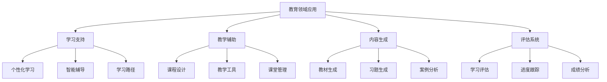
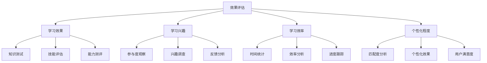

# 教育领域案例

## 🎯 核心定义

### 什么是教育领域应用？
教育领域应用是指使用提示词工程技术，在教育场景中构建智能教学系统，包括个性化学习、智能辅导、内容生成、评估系统等。

### 核心价值
- **个性化学习**：根据学生特点提供个性化学习方案
- **智能辅导**：提供24/7的智能学习辅导
- **内容生成**：自动生成教学内容和学习材料
- **学习评估**：智能评估学习效果和进度

## 📊 教育领域应用框架



## 🔍 应用场景

### 1. 个性化学习
| 学习类型 | 核心特点 | 提示词设计 | 应用价值 |
|----------|----------|----------|----------|
| **自适应学习** | 根据学习进度调整内容 | 个性化提示 | 提高学习效率 |
| **差异化教学** | 针对不同学生特点教学 | 差异化提示 | 满足个体需求 |
| **学习路径** | 个性化学习路径规划 | 路径规划提示 | 优化学习体验 |
| **学习推荐** | 智能推荐学习内容 | 推荐系统提示 | 提高学习兴趣 |

#### 设计模板
```markdown
个性化学习模板：
你是一位资深的教育专家，请为[学生类型]设计个性化学习方案：
- 学生特点：[学习特点分析]
- 学习目标：[学习目标设定]
- 学习内容：[内容选择策略]
- 学习方式：[学习方式建议]
- 评估方法：[评估策略]

示例：
你是一位资深的教育专家，请为初中生设计个性化学习方案：
- 学生特点：数学基础较好，英语较弱，喜欢动手实践
- 学习目标：提高英语成绩，保持数学优势，培养科学兴趣
- 学习内容：英语基础强化，数学拓展，科学实验
- 学习方式：游戏化学习，实践操作，小组合作
- 评估方法：形成性评估，项目评估，同伴评估
```

### 2. 智能辅导
| 辅导类型 | 核心特点 | 提示词设计 | 应用价值 |
|----------|----------|----------|----------|
| **作业辅导** | 解答作业问题 | 问题解答提示 | 提高作业质量 |
| **知识点讲解** | 详细讲解知识点 | 知识讲解提示 | 加深理解 |
| **学习方法指导** | 指导学习方法 | 方法指导提示 | 提高学习效率 |
| **心理辅导** | 学习心理支持 | 心理支持提示 | 缓解学习压力 |

#### 设计模板
```markdown
智能辅导模板：
你是一位耐心的学习导师，请为[学生]提供[辅导类型]：
- 学生问题：[具体问题描述]
- 知识背景：[学生知识水平]
- 辅导目标：[辅导目标设定]
- 辅导方式：[辅导方法选择]
- 效果评估：[效果评估方法]

示例：
你是一位耐心的学习导师，请为高中生提供数学辅导：
- 学生问题：函数概念理解困难，解题思路不清晰
- 知识背景：基础数学知识掌握，但函数部分薄弱
- 辅导目标：理解函数概念，掌握解题方法
- 辅导方式：概念解释，例题演示，练习指导
- 效果评估：通过练习题检验理解程度
```

### 3. 内容生成
| 内容类型 | 核心特点 | 提示词设计 | 应用价值 |
|----------|----------|----------|----------|
| **教材生成** | 生成教学材料 | 教材生成提示 | 丰富教学内容 |
| **习题生成** | 生成练习题 | 习题生成提示 | 提供练习资源 |
| **案例分析** | 生成教学案例 | 案例生成提示 | 增强教学效果 |
| **实验设计** | 设计实验方案 | 实验设计提示 | 支持实践教学 |

#### 设计模板
```markdown
内容生成模板：
你是一位资深的教学内容专家，请生成[内容类型]：
- 教学目标：[教学目标设定]
- 目标受众：[学生群体特征]
- 内容要求：[内容质量标准]
- 格式要求：[输出格式要求]
- 难度控制：[难度级别设定]

示例：
你是一位资深的教学内容专家，请生成物理实验设计：
- 教学目标：理解光的折射原理，掌握实验方法
- 目标受众：初中二年级学生，物理基础一般
- 内容要求：实验步骤清晰，安全可靠，易于操作
- 格式要求：包含实验目的、器材、步骤、注意事项
- 难度控制：适合初中生水平，操作简单
```

### 4. 评估系统
| 评估类型 | 核心特点 | 提示词设计 | 应用价值 |
|----------|----------|----------|----------|
| **学习评估** | 评估学习效果 | 评估提示 | 了解学习状况 |
| **能力测评** | 测评学生能力 | 测评提示 | 识别能力水平 |
| **进步跟踪** | 跟踪学习进步 | 跟踪提示 | 监控学习进展 |
| **成绩分析** | 分析成绩数据 | 分析提示 | 提供改进建议 |

#### 设计模板
```markdown
评估系统模板：
你是一位专业的教育评估专家，请设计[评估类型]：
- 评估目标：[评估目标设定]
- 评估内容：[评估内容范围]
- 评估方法：[评估方法选择]
- 评估标准：[评估标准设定]
- 结果应用：[结果应用方式]

示例：
你是一位专业的教育评估专家，请设计学习评估系统：
- 评估目标：全面评估学生学习效果和能力发展
- 评估内容：知识掌握、技能运用、思维能力、学习态度
- 评估方法：测试评估、观察评估、作品评估、自我评估
- 评估标准：基于课程标准和学生发展水平
- 结果应用：为教学改进和个性化指导提供依据
```

## 🛠️ 实践技巧

### 技巧1：学生画像分析
```markdown
模板：
请分析学生画像：
- 基本信息：[年龄、年级、学科等]
- 学习特点：[学习风格、兴趣、能力等]
- 学习需求：[学习目标、困难、期望等]
- 学习环境：[家庭、学校、社会等]
- 个性化建议：[针对性的建议]

示例：
请分析学生画像：
- 基本信息：14岁，初二学生，数学和物理较好
- 学习特点：逻辑思维强，喜欢探究，但英语较弱
- 学习需求：提高英语成绩，保持理科优势
- 学习环境：家庭支持，学校资源丰富
- 个性化建议：英语学习采用游戏化方式，理科学习注重实践
```

### 技巧2：学习路径设计
```markdown
模板：
请设计学习路径：
- 起点分析：[当前水平评估]
- 目标设定：[学习目标确定]
- 路径规划：[学习路径设计]
- 里程碑：[关键节点设定]
- 调整机制：[动态调整策略]

示例：
请设计学习路径：
- 起点分析：英语水平相当于小学六年级
- 目标设定：达到初中毕业水平
- 路径规划：基础词汇→语法结构→阅读理解→写作表达
- 里程碑：每月设定一个学习目标
- 调整机制：根据学习效果调整学习计划
```

### 技巧3：互动教学设计
```markdown
模板：
请设计互动教学：
- 互动目标：[互动目标设定]
- 互动方式：[互动方式选择]
- 互动内容：[互动内容设计]
- 互动评估：[互动效果评估]
- 互动优化：[互动改进策略]

示例：
请设计互动教学：
- 互动目标：提高学生参与度，增强学习效果
- 互动方式：问答互动、小组讨论、游戏竞赛
- 互动内容：结合课程内容设计互动环节
- 互动评估：观察学生参与情况，收集反馈
- 互动优化：根据评估结果优化互动设计
```

## 📈 效果评估

### 评估维度
| 评估指标 | 评估标准 | 评估方法 | 改进策略 |
|----------|----------|----------|----------|
| **学习效果** | 知识掌握程度 | 测试评估 | 优化教学内容 |
| **学习兴趣** | 学习参与度 | 观察评估 | 增强内容趣味性 |
| **学习效率** | 学习时间效率 | 时间分析 | 优化学习路径 |
| **个性化程度** | 个性化匹配度 | 匹配分析 | 完善个性化算法 |

### 评估方法


## 🎯 优化策略

### 策略1：个性化优化
```markdown
优化策略：
1. 数据收集：收集学生学习数据
2. 画像更新：动态更新学生画像
3. 内容适配：根据画像调整内容
4. 效果反馈：收集效果反馈
5. 持续优化：基于反馈持续优化

实施方法：
- 建立学生学习数据收集机制
- 开发学生画像动态更新算法
- 实现内容自动适配功能
- 建立效果反馈收集系统
- 设计持续优化流程
```

### 策略2：内容质量优化
```markdown
优化策略：
1. 内容审核：建立内容质量审核机制
2. 专家验证：邀请教育专家验证内容
3. 用户反馈：收集用户使用反馈
4. 效果评估：评估内容使用效果
5. 持续改进：基于评估结果改进内容

实施方法：
- 建立内容质量审核标准
- 邀请教育专家参与内容验证
- 开发用户反馈收集系统
- 建立内容效果评估机制
- 设计内容持续改进流程
```

### 策略3：技术优化
```markdown
优化策略：
1. 系统性能：优化系统响应速度
2. 用户体验：改善用户交互体验
3. 功能完善：完善系统功能
4. 稳定性：提高系统稳定性
5. 安全性：加强数据安全保护

实施方法：
- 优化系统架构和性能
- 改进用户界面和交互设计
- 完善系统功能和特性
- 加强系统监控和维护
- 建立数据安全保护机制
```

## ⚠️ 常见问题

### 问题1：个性化效果不明显
**表现**：个性化学习效果不显著
**解决**：完善学生画像，优化个性化算法
**方法**：收集更多学生数据，改进画像模型

### 问题2：内容质量参差不齐
**表现**：生成的教学内容质量不稳定
**解决**：建立内容质量审核机制
**方法**：邀请专家审核，建立质量标准

### 问题3：学生参与度不高
**表现**：学生使用系统的积极性不高
**解决**：增强内容趣味性，改善用户体验
**方法**：游戏化设计，优化交互体验

## 🎓 学习要点

### 核心理解
- 教育领域应用需要深入理解教育规律
- 个性化是教育应用的核心价值
- 内容质量直接影响教学效果
- 持续优化是提升效果的关键

### 实践建议
- 深入了解教育理论和实践
- 注重学生需求和学习特点
- 建立完善的质量保证机制
- 持续收集反馈并优化系统

## 🔗 相关链接
- [[02-3-4-角色扮演提示]] - 学习角色扮演提示
- [[03-1-3-内容创作应用]] - 学习内容创作应用
- [[03-2-1-多轮对话设计]] - 学习多轮对话设计
- [[04-2-1-效果评估指标]] - 学习效果评估
