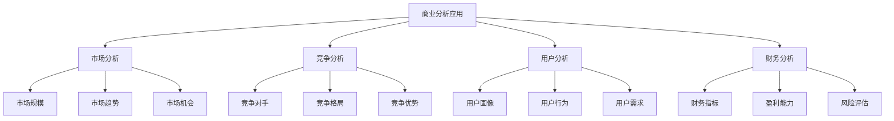
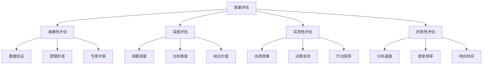

# 商业分析案例

## 🎯 核心定义

### 什么是商业分析应用？
商业分析应用是指使用提示词工程技术，在商业场景中构建智能分析系统，包括市场分析、竞争分析、用户分析、财务分析等，为商业决策提供数据支持。

### 核心价值
- **数据洞察**：从海量数据中提取商业洞察
- **决策支持**：为商业决策提供科学依据
- **趋势预测**：预测市场趋势和商业机会
- **效率提升**：提高商业分析效率

## 📊 商业分析应用框架



## 🔍 应用场景

### 1. 市场分析
| 分析类型 | 核心特点 | 提示词设计 | 应用价值 |
|----------|----------|----------|----------|
| **市场规模分析** | 分析市场容量和增长 | 数据分析提示 | 了解市场潜力 |
| **市场趋势分析** | 分析市场发展趋势 | 趋势分析提示 | 把握市场方向 |
| **市场细分分析** | 分析市场细分机会 | 细分分析提示 | 发现细分市场 |
| **市场机会分析** | 识别市场机会 | 机会识别提示 | 抓住商业机会 |

#### 设计模板
```markdown
市场分析模板：
你是一位资深的市场分析师，请分析[市场领域]：
- 分析目标：[分析目标设定]
- 数据来源：[数据来源说明]
- 分析维度：[分析角度选择]
- 分析方法：[分析方法选择]
- 输出要求：[输出格式要求]

示例：
你是一位资深的市场分析师，请分析智能手机市场：
- 分析目标：了解市场现状，识别增长机会
- 数据来源：2023年市场数据，包含销量、价格、品牌份额
- 分析维度：市场规模、增长趋势、竞争格局、用户需求
- 分析方法：定量分析、趋势分析、对比分析
- 输出要求：结构化报告，包含数据图表和结论建议
```

### 2. 竞争分析
| 分析类型 | 核心特点 | 提示词设计 | 应用价值 |
|----------|----------|----------|----------|
| **竞争对手分析** | 分析主要竞争对手 | 竞争分析提示 | 了解竞争态势 |
| **竞争格局分析** | 分析整体竞争格局 | 格局分析提示 | 把握竞争环境 |
| **竞争优势分析** | 分析自身竞争优势 | 优势分析提示 | 发挥自身优势 |
| **竞争策略分析** | 制定竞争策略 | 策略分析提示 | 制定应对策略 |

#### 设计模板
```markdown
竞争分析模板：
你是一位资深的竞争分析专家，请分析[行业]竞争情况：
- 分析范围：[分析范围界定]
- 竞争对手：[主要竞争对手]
- 分析重点：[分析重点内容]
- 分析方法：[分析方法选择]
- 输出要求：[输出格式要求]

示例：
你是一位资深的竞争分析专家，请分析电商行业竞争情况：
- 分析范围：中国电商市场，主要平台
- 竞争对手：淘宝、京东、拼多多、抖音电商
- 分析重点：市场份额、用户规模、商业模式、竞争优势
- 分析方法：SWOT分析、波特五力模型、对比分析
- 输出要求：竞争分析报告，包含竞争格局图和策略建议
```

### 3. 用户分析
| 分析类型 | 核心特点 | 提示词设计 | 应用价值 |
|----------|----------|----------|----------|
| **用户画像分析** | 构建用户画像 | 画像分析提示 | 了解目标用户 |
| **用户行为分析** | 分析用户行为 | 行为分析提示 | 优化用户体验 |
| **用户需求分析** | 分析用户需求 | 需求分析提示 | 满足用户需求 |
| **用户价值分析** | 分析用户价值 | 价值分析提示 | 提升用户价值 |

#### 设计模板
```markdown
用户分析模板：
你是一位资深的用户研究专家，请分析[产品/服务]用户：
- 分析目标：[分析目标设定]
- 用户群体：[目标用户群体]
- 分析维度：[分析角度选择]
- 数据来源：[数据来源说明]
- 输出要求：[输出格式要求]

示例：
你是一位资深的用户研究专家，请分析在线教育平台用户：
- 分析目标：了解用户特征，优化产品体验
- 用户群体：K12学生、大学生、职场人士
- 分析维度：用户画像、行为特征、需求偏好、价值贡献
- 数据来源：用户行为数据、调研数据、反馈数据
- 输出要求：用户分析报告，包含用户画像和行为洞察
```

### 4. 财务分析
| 分析类型 | 核心特点 | 提示词设计 | 应用价值 |
|----------|----------|----------|----------|
| **财务指标分析** | 分析关键财务指标 | 指标分析提示 | 了解财务状况 |
| **盈利能力分析** | 分析盈利能力 | 盈利分析提示 | 评估盈利水平 |
| **风险评估分析** | 分析财务风险 | 风险分析提示 | 识别财务风险 |
| **投资价值分析** | 分析投资价值 | 价值分析提示 | 评估投资价值 |

#### 设计模板
```markdown
财务分析模板：
你是一位资深的财务分析师，请分析[公司/项目]财务状况：
- 分析目标：[分析目标设定]
- 分析期间：[分析时间范围]
- 分析重点：[分析重点内容]
- 分析方法：[分析方法选择]
- 输出要求：[输出格式要求]

示例：
你是一位资深的财务分析师，请分析某科技公司财务状况：
- 分析目标：评估公司财务健康度和投资价值
- 分析期间：2022-2023年财务数据
- 分析重点：盈利能力、偿债能力、运营效率、成长性
- 分析方法：比率分析、趋势分析、对比分析
- 输出要求：财务分析报告，包含关键指标和投资建议
```

## 🛠️ 实践技巧

### 技巧1：数据驱动分析
```markdown
模板：
请进行数据驱动分析：
- 数据收集：[数据来源和收集方法]
- 数据清洗：[数据清洗和预处理]
- 数据分析：[分析方法和工具]
- 结果解释：[结果解释和洞察]
- 行动建议：[基于分析结果的建议]

示例：
请进行数据驱动分析：
- 数据收集：收集销售数据、用户数据、市场数据
- 数据清洗：处理缺失值、异常值、重复值
- 数据分析：使用统计分析和机器学习方法
- 结果解释：解释分析结果，提取关键洞察
- 行动建议：基于分析结果制定具体的行动建议
```

### 技巧2：多维度分析
```markdown
模板：
请进行多维度分析：
- 时间维度：[时间趋势分析]
- 空间维度：[地域分布分析]
- 产品维度：[产品表现分析]
- 用户维度：[用户群体分析]
- 综合维度：[综合分析结论]

示例：
请进行多维度分析：
- 时间维度：分析销售趋势、季节性变化
- 空间维度：分析不同地区的市场表现
- 产品维度：分析各产品的销售情况
- 用户维度：分析不同用户群体的行为
- 综合维度：综合分析市场机会和挑战
```

### 技巧3：预测分析
```markdown
模板：
请进行预测分析：
- 预测目标：[预测目标设定]
- 预测方法：[预测方法选择]
- 预测模型：[预测模型构建]
- 预测结果：[预测结果展示]
- 预测应用：[预测结果应用]

示例：
请进行预测分析：
- 预测目标：预测未来6个月的销售趋势
- 预测方法：时间序列分析、回归分析
- 预测模型：构建ARIMA模型和线性回归模型
- 预测结果：展示预测趋势和置信区间
- 预测应用：为库存管理和营销策略提供依据
```

## 📈 效果评估

### 评估维度
| 评估指标 | 评估标准 | 评估方法 | 改进策略 |
|----------|----------|----------|----------|
| **分析准确性** | 分析结果是否准确 | 结果验证 | 优化分析方法 |
| **洞察深度** | 洞察是否深入 | 专家评估 | 深化分析维度 |
| **实用性** | 分析结果是否实用 | 应用效果 | 提高实用性 |
| **时效性** | 分析是否及时 | 时间评估 | 提高分析效率 |

### 评估方法


## 🎯 优化策略

### 策略1：分析方法优化
```markdown
优化策略：
1. 方法选择：选择最适合的分析方法
2. 工具优化：使用先进的分析工具
3. 模型改进：不断改进分析模型
4. 验证机制：建立结果验证机制
5. 持续学习：持续学习新的分析方法

实施方法：
- 评估不同分析方法的适用性
- 引入先进的数据分析工具
- 建立模型评估和改进机制
- 建立结果验证和反馈机制
- 定期培训和学习新的分析方法
```

### 策略2：数据质量优化
```markdown
优化策略：
1. 数据收集：优化数据收集方法
2. 数据清洗：完善数据清洗流程
3. 数据验证：建立数据验证机制
4. 数据更新：及时更新数据
5. 数据安全：保护数据安全

实施方法：
- 优化数据收集流程和工具
- 建立完善的数据清洗标准
- 实现数据质量自动检查
- 建立数据更新和同步机制
- 加强数据安全保护措施
```

### 策略3：结果应用优化
```markdown
优化策略：
1. 结果解释：清晰解释分析结果
2. 可视化：使用图表展示结果
3. 行动建议：提供具体行动建议
4. 跟踪反馈：跟踪应用效果
5. 持续改进：基于反馈持续改进

实施方法：
- 建立结果解释和沟通机制
- 开发可视化工具和模板
- 制定行动建议生成标准
- 建立效果跟踪和反馈机制
- 设计持续改进流程
```

## ⚠️ 常见问题

### 问题1：数据质量不高
**表现**：分析结果不准确，缺乏可信度
**解决**：提高数据质量，建立数据验证机制
**方法**：优化数据收集，加强数据清洗

### 问题2：分析深度不够
**表现**：分析结果表面化，缺乏深度洞察
**解决**：深化分析维度，使用更高级的分析方法
**方法**：多维度分析，引入高级分析技术

### 问题3：结果应用性差
**表现**：分析结果难以应用到实际业务
**解决**：提高结果实用性，提供具体行动建议
**方法**：结合业务场景，提供可操作的建议

## 🎓 学习要点

### 核心理解
- 商业分析需要深入理解业务逻辑
- 数据质量是分析准确性的基础
- 多维度分析有助于全面理解问题
- 结果应用是分析价值的体现

### 实践建议
- 深入了解业务领域和行业特点
- 建立完善的数据质量管理体系
- 掌握多种分析方法和工具
- 注重分析结果的实际应用

## 🔗 相关链接
- [[02-3-3-思维链提示]] - 学习思维链提示
- [[03-1-1-文本生成应用]] - 学习文本生成应用
- [[03-2-2-复杂任务分解]] - 学习复杂任务分解
- [[04-2-1-效果评估指标]] - 学习效果评估
