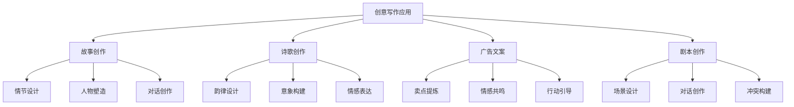
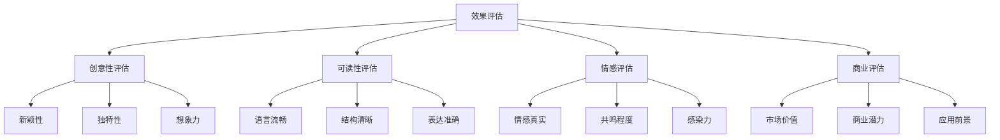

# 创意写作案例

## 🎯 核心定义

### 什么是创意写作应用？
创意写作应用是指使用提示词工程技术，在创意写作场景中构建智能创作系统，包括故事创作、诗歌创作、广告文案、剧本创作等，激发创意灵感，提高创作效率。

### 核心价值
- **创意激发**：提供创意灵感和写作思路
- **效率提升**：大幅提高创作效率
- **质量保证**：确保创作质量和一致性
- **风格多样**：支持多种创作风格和类型

## 📊 创意写作应用框架



## 🔍 应用场景

### 1. 故事创作
| 故事类型 | 核心特点 | 提示词设计 | 应用价值 |
|----------|----------|----------|----------|
| **短篇小说** | 情节紧凑、主题突出 | 故事结构提示 | 快速创作 |
| **长篇小说** | 情节复杂、人物丰富 | 章节规划提示 | 长篇创作 |
| **科幻小说** | 想象力丰富、逻辑严谨 | 科幻设定提示 | 科幻创作 |
| **悬疑小说** | 情节曲折、逻辑严密 | 悬疑设计提示 | 悬疑创作 |

#### 设计模板
```markdown
故事创作模板：
你是一位富有创意的故事作家，请创作一个[故事类型]：
- 创作主题：[主题内容]
- 故事背景：[背景设定]
- 主要人物：[人物设定]
- 情节要求：[情节要求]
- 创作风格：[风格要求]

示例：
你是一位富有创意的故事作家，请创作一个科幻短篇小说：
- 创作主题：人工智能与人类的未来关系
- 故事背景：2050年，AI技术高度发达
- 主要人物：AI研究员、智能机器人、普通人类
- 情节要求：包含冲突、转折、高潮、结局
- 创作风格：悬疑、思考、未来感
```

### 2. 诗歌创作
| 诗歌类型 | 核心特点 | 提示词设计 | 应用价值 |
|----------|----------|----------|----------|
| **现代诗** | 自由表达、情感丰富 | 情感表达提示 | 情感抒发 |
| **古体诗** | 格律严谨、意境深远 | 格律要求提示 | 传统文化 |
| **爱情诗** | 情感细腻、浪漫唯美 | 浪漫表达提示 | 情感表达 |
| **哲理诗** | 思想深刻、寓意丰富 | 哲理思考提示 | 思想表达 |

#### 设计模板
```markdown
诗歌创作模板：
你是一位才华横溢的诗人，请创作一首[诗歌类型]：
- 创作主题：[主题内容]
- 情感基调：[情感色彩]
- 诗歌风格：[风格特点]
- 韵律要求：[韵律要求]
- 长度要求：[长度要求]

示例：
你是一位才华横溢的诗人，请创作一首现代爱情诗：
- 创作主题：思念与等待
- 情感基调：温柔、深情、略带忧伤
- 诗歌风格：现代自由体，语言优美
- 韵律要求：自然流畅，富有节奏感
- 长度要求：20-30行
```

### 3. 广告文案
| 文案类型 | 核心特点 | 提示词设计 | 应用价值 |
|----------|----------|----------|----------|
| **产品广告** | 突出卖点、吸引购买 | 卖点突出提示 | 产品推广 |
| **品牌广告** | 塑造形象、传递价值 | 品牌价值提示 | 品牌建设 |
| **活动广告** | 吸引参与、促进转化 | 活动吸引提示 | 活动推广 |
| **公益广告** | 传递理念、引发思考 | 理念传递提示 | 社会价值 |

#### 设计模板
```markdown
广告文案模板：
你是一位资深的广告文案专家，请为[产品/品牌]创作[文案类型]：
- 目标受众：[受众群体]
- 核心卖点：[产品优势]
- 情感诉求：[情感连接]
- 行动号召：[期望行动]
- 文案风格：[风格要求]

示例：
你是一位资深的广告文案专家，请为智能手表创作产品广告：
- 目标受众：25-35岁健康意识强的上班族
- 核心卖点：24小时健康监测、智能提醒、时尚设计
- 情感诉求：关注健康、追求品质生活
- 行动号召：立即购买，开启健康生活
- 文案风格：专业、可信、有吸引力
```

### 4. 剧本创作
| 剧本类型 | 核心特点 | 提示词设计 | 应用价值 |
|----------|----------|----------|----------|
| **电影剧本** | 视觉冲击、情节紧凑 | 视觉化提示 | 影视制作 |
| **电视剧本** | 情节连续、人物丰富 | 连续性提示 | 电视剧制作 |
| **舞台剧本** | 对话精彩、冲突激烈 | 对话提示 | 舞台演出 |
| **微电影剧本** | 短小精悍、主题突出 | 精炼提示 | 微电影制作 |

#### 设计模板
```markdown
剧本创作模板：
你是一位经验丰富的编剧，请创作一个[剧本类型]：
- 故事主题：[主题内容]
- 故事背景：[背景设定]
- 主要人物：[人物设定]
- 情节结构：[结构要求]
- 创作要求：[特殊要求]

示例：
你是一位经验丰富的编剧，请创作一个微电影剧本：
- 故事主题：青春与梦想
- 故事背景：现代都市，大学校园
- 主要人物：大学生、导师、朋友
- 情节结构：起承转合，15分钟时长
- 创作要求：对话自然，情节紧凑，主题突出
```

## 🛠️ 实践技巧

### 技巧1：创意激发
```markdown
模板：
请激发创意灵感：
- 主题选择：[主题方向]
- 灵感来源：[灵感来源]
- 创意方法：[创意技巧]
- 灵感记录：[记录方法]
- 灵感应用：[应用策略]

示例：
请激发创意灵感：
- 主题选择：选择感兴趣或熟悉的主题
- 灵感来源：生活经历、新闻事件、文学作品
- 创意方法：头脑风暴、思维导图、自由写作
- 灵感记录：及时记录灵感，建立灵感库
- 灵感应用：将灵感转化为具体的创作内容
```

### 技巧2：人物塑造
```markdown
模板：
请塑造人物形象：
- 人物设定：[基本设定]
- 性格特征：[性格特点]
- 背景故事：[背景经历]
- 行为模式：[行为特点]
- 发展变化：[人物成长]

示例：
请塑造人物形象：
- 人物设定：25岁，程序员，内向但聪明
- 性格特征：理性、专注、不善表达
- 背景故事：从小喜欢编程，大学计算机专业
- 行为模式：遇到问题喜欢独自思考解决
- 发展变化：通过经历逐渐学会与人沟通
```

### 技巧3：情节设计
```markdown
模板：
请设计故事情节：
- 故事结构：[结构框架]
- 冲突设置：[冲突类型]
- 转折点：[关键转折]
- 高潮设计：[高潮情节]
- 结局安排：[结局设计]

示例：
请设计故事情节：
- 故事结构：三幕式结构，起承转合
- 冲突设置：人物内心冲突、人物间冲突
- 转折点：发现真相、做出选择
- 高潮设计：矛盾激化，面临抉择
- 结局安排：问题解决，人物成长
```

## 📈 效果评估

### 评估维度
| 评估指标 | 评估标准 | 评估方法 | 改进策略 |
|----------|----------|----------|----------|
| **创意性** | 创意是否新颖独特 | 创意评估 | 增强创意训练 |
| **可读性** | 内容是否易读易懂 | 可读性测试 | 优化语言表达 |
| **情感共鸣** | 是否引起情感共鸣 | 情感评估 | 增强情感表达 |
| **商业价值** | 是否具有商业价值 | 商业评估 | 提高商业意识 |

### 评估方法


## 🎯 优化策略

### 策略1：创意训练
```markdown
优化策略：
1. 创意练习：定期进行创意练习
2. 灵感积累：建立灵感素材库
3. 技巧学习：学习创意技巧
4. 实践应用：将创意应用到实际创作
5. 反馈改进：根据反馈改进创意

实施方法：
- 每天进行创意练习
- 建立灵感收集和整理系统
- 学习各种创意技巧和方法
- 将创意应用到实际创作中
- 收集反馈并持续改进
```

### 策略2：写作技巧
```markdown
优化策略：
1. 技巧学习：学习写作技巧
2. 风格培养：培养个人写作风格
3. 语言优化：优化语言表达
4. 结构改进：改进文章结构
5. 持续练习：持续练习写作

实施方法：
- 学习各种写作技巧
- 分析优秀作品，培养风格
- 优化语言表达，提高准确性
- 改进文章结构，增强逻辑性
- 坚持每日写作练习
```

### 策略3：市场适应
```markdown
优化策略：
1. 市场研究：研究市场需求
2. 受众分析：分析目标受众
3. 内容调整：调整内容方向
4. 风格适应：适应市场风格
5. 价值提升：提升内容价值

实施方法：
- 研究市场趋势和需求
- 分析目标受众特点
- 根据市场需求调整内容
- 适应市场偏好的风格
- 提升内容的商业价值
```

## ⚠️ 常见问题

### 问题1：创意枯竭
**表现**：缺乏创意灵感，创作困难
**解决**：建立创意激发机制
**方法**：多角度思考，积累素材，练习创意技巧

### 问题2：风格单一
**表现**：创作风格单一，缺乏变化
**解决**：尝试不同风格和类型
**方法**：学习多种风格，模仿优秀作品，实验新风格

### 问题3：商业价值不高
**表现**：创作内容缺乏商业价值
**解决**：提高商业意识和市场敏感度
**方法**：研究市场需求，分析成功案例，提升商业价值

## 🎓 学习要点

### 核心理解
- 创意写作需要丰富的想象力和创造力
- 技巧训练是提高创作水平的基础
- 市场适应是商业成功的关键
- 持续练习是提升创作能力的根本

### 实践建议
- 保持创意思维，多角度思考问题
- 学习各种写作技巧和创作方法
- 关注市场需求，提高商业意识
- 坚持每日练习，持续提升创作能力

## 🔗 相关链接
- [[02-3-4-角色扮演提示]] - 学习角色扮演提示
- [[03-1-3-内容创作应用]] - 学习内容创作应用
- [[03-2-1-多轮对话设计]] - 学习多轮对话设计
- [[04-1-2-动态提示词生成]] - 学习动态提示词生成
