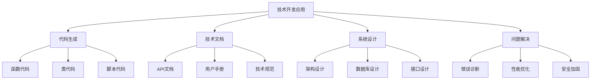
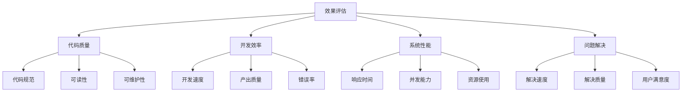

# 技术开发案例

## 🎯 核心定义

### 什么是技术开发应用？
技术开发应用是指使用提示词工程技术，在技术开发场景中构建智能开发系统，包括代码生成、技术文档、系统设计、问题解决等，提高开发效率和质量。

### 核心价值
- **开发效率**：大幅提高代码编写效率
- **代码质量**：生成高质量、规范的代码
- **技术文档**：自动生成技术文档
- **问题解决**：快速解决技术问题

## 📊 技术开发应用框架



## 🔍 应用场景

### 1. 代码生成
| 代码类型 | 核心特点 | 提示词设计 | 应用价值 |
|----------|----------|----------|----------|
| **函数代码** | 功能明确、可复用 | 函数生成提示 | 提高开发效率 |
| **类代码** | 面向对象、封装性 | 类设计提示 | 代码组织 |
| **脚本代码** | 自动化、批处理 | 脚本生成提示 | 自动化任务 |
| **配置文件** | 系统配置、环境设置 | 配置生成提示 | 环境管理 |

#### 设计模板
```markdown
代码生成模板：
你是一位资深的[编程语言]开发工程师，请生成[代码类型]：
- 功能需求：[具体功能描述]
- 技术要求：[技术规范要求]
- 代码规范：[编码规范标准]
- 注释要求：[注释详细程度]
- 测试要求：[测试覆盖要求]

示例：
你是一位资深的Python开发工程师，请生成数据处理函数：
- 功能需求：读取CSV文件，清洗数据，生成统计报告
- 技术要求：使用pandas库，支持大数据处理
- 代码规范：遵循PEP 8规范，包含类型提示
- 注释要求：详细注释，包含函数说明和参数说明
- 测试要求：包含单元测试，测试覆盖率>90%
```

### 2. 技术文档
| 文档类型 | 核心特点 | 提示词设计 | 应用价值 |
|----------|----------|----------|----------|
| **API文档** | 接口说明、参数描述 | API文档提示 | 接口使用 |
| **用户手册** | 操作指南、使用说明 | 用户手册提示 | 用户支持 |
| **技术规范** | 开发规范、标准要求 | 技术规范提示 | 开发标准 |
| **部署文档** | 部署步骤、环境配置 | 部署文档提示 | 系统部署 |

#### 设计模板
```markdown
技术文档模板：
你是一位资深的技术文档工程师，请编写[文档类型]：
- 文档目标：[文档目标设定]
- 目标用户：[用户群体特征]
- 内容要求：[内容详细程度]
- 格式要求：[文档格式标准]
- 更新要求：[更新维护要求]

示例：
你是一位资深的技术文档工程师，请编写API接口文档：
- 文档目标：为前端开发者提供完整的API使用指南
- 目标用户：前端开发工程师，具备基础编程知识
- 内容要求：包含接口说明、参数描述、示例代码、错误码
- 格式要求：使用Markdown格式，包含代码块和表格
- 更新要求：随API变更及时更新，保持文档同步
```

### 3. 系统设计
| 设计类型 | 核心特点 | 提示词设计 | 应用价值 |
|----------|----------|----------|----------|
| **架构设计** | 系统架构、技术选型 | 架构设计提示 | 系统规划 |
| **数据库设计** | 数据模型、表结构 | 数据库设计提示 | 数据管理 |
| **接口设计** | API设计、数据交互 | 接口设计提示 | 系统集成 |
| **安全设计** | 安全策略、防护措施 | 安全设计提示 | 系统安全 |

#### 设计模板
```markdown
系统设计模板：
你是一位资深的系统架构师，请设计[系统类型]：
- 系统需求：[功能需求分析]
- 技术栈：[技术选型要求]
- 性能要求：[性能指标要求]
- 安全要求：[安全标准要求]
- 扩展要求：[扩展性要求]

示例：
你是一位资深的系统架构师，请设计电商系统：
- 系统需求：用户管理、商品管理、订单管理、支付系统
- 技术栈：微服务架构，Spring Boot，MySQL，Redis
- 性能要求：支持1000并发用户，响应时间<2秒
- 安全要求：数据加密、身份认证、权限控制
- 扩展要求：支持水平扩展，模块化设计
```

### 4. 问题解决
| 问题类型 | 核心特点 | 提示词设计 | 应用价值 |
|----------|----------|----------|----------|
| **错误诊断** | 错误分析、原因定位 | 错误诊断提示 | 问题排查 |
| **性能优化** | 性能分析、优化建议 | 性能优化提示 | 系统优化 |
| **安全加固** | 安全评估、加固措施 | 安全加固提示 | 安全提升 |
| **兼容性处理** | 兼容性问题、解决方案 | 兼容性提示 | 系统兼容 |

#### 设计模板
```markdown
问题解决模板：
你是一位资深的技术专家，请解决[问题类型]：
- 问题描述：[具体问题描述]
- 环境信息：[系统环境信息]
- 错误信息：[错误日志信息]
- 解决目标：[解决目标设定]
- 解决要求：[解决标准要求]

示例：
你是一位资深的技术专家，请解决性能优化问题：
- 问题描述：系统响应时间过长，用户反馈卡顿
- 环境信息：Java应用，Tomcat服务器，MySQL数据库
- 错误信息：平均响应时间5秒，数据库查询慢
- 解决目标：响应时间降低到2秒以内
- 解决要求：不影响系统稳定性，提供优化方案
```

## 🛠️ 实践技巧

### 技巧1：代码质量保证
```markdown
模板：
请保证代码质量：
- 代码规范：[编码规范要求]
- 性能优化：[性能优化要求]
- 安全考虑：[安全要求]
- 可维护性：[可维护性要求]
- 测试覆盖：[测试要求]

示例：
请保证代码质量：
- 代码规范：遵循PEP 8规范，使用类型提示
- 性能优化：避免N+1查询，使用缓存机制
- 安全考虑：输入验证，SQL注入防护
- 可维护性：模块化设计，清晰注释
- 测试覆盖：单元测试覆盖率>90%，集成测试
```

### 技巧2：技术选型
```markdown
模板：
请进行技术选型：
- 需求分析：[技术需求分析]
- 技术对比：[技术方案对比]
- 选型标准：[选型标准设定]
- 选型结果：[最终选型结果]
- 选型理由：[选型理由说明]

示例：
请进行技术选型：
- 需求分析：高并发、高可用、易扩展的Web应用
- 技术对比：Spring Boot vs Django，MySQL vs PostgreSQL
- 选型标准：性能、生态、学习成本、团队经验
- 选型结果：Spring Boot + MySQL + Redis
- 选型理由：团队熟悉Java，Spring生态成熟，MySQL稳定可靠
```

### 技巧3：系统优化
```markdown
模板：
请进行系统优化：
- 性能分析：[性能瓶颈分析]
- 优化策略：[优化方案制定]
- 实施计划：[优化实施计划]
- 效果评估：[优化效果评估]
- 持续改进：[持续优化机制]

示例：
请进行系统优化：
- 性能分析：数据库查询慢，缓存命中率低，接口响应时间长
- 优化策略：数据库索引优化，Redis缓存，接口异步化
- 实施计划：分阶段实施，先优化数据库，再优化缓存
- 效果评估：响应时间降低60%，并发能力提升3倍
- 持续改进：建立性能监控，定期优化评估
```

## 📈 效果评估

### 评估维度
| 评估指标 | 评估标准 | 评估方法 | 改进策略 |
|----------|----------|----------|----------|
| **代码质量** | 代码规范性、可读性 | 代码审查 | 优化编码规范 |
| **开发效率** | 开发速度、产出质量 | 效率统计 | 优化开发流程 |
| **系统性能** | 响应时间、并发能力 | 性能测试 | 优化系统架构 |
| **问题解决** | 解决速度、解决质量 | 问题统计 | 优化解决流程 |

### 评估方法


## 🎯 优化策略

### 策略1：开发流程优化
```markdown
优化策略：
1. 需求分析：完善需求分析流程
2. 设计阶段：优化系统设计方法
3. 开发阶段：提高开发效率
4. 测试阶段：完善测试体系
5. 部署阶段：优化部署流程

实施方法：
- 建立需求分析模板和流程
- 使用设计模式和最佳实践
- 引入代码生成和自动化工具
- 建立完善的测试体系
- 实现自动化部署和监控
```

### 策略2：技术栈优化
```markdown
优化策略：
1. 技术选型：选择合适的技术栈
2. 版本管理：管理技术版本
3. 依赖管理：优化依赖关系
4. 性能优化：优化技术性能
5. 安全加固：加强技术安全

实施方法：
- 定期评估技术栈适用性
- 建立版本管理和升级策略
- 优化依赖管理和冲突解决
- 持续优化技术性能
- 加强安全防护和漏洞修复
```

### 策略3：团队协作优化
```markdown
优化策略：
1. 代码规范：统一代码规范
2. 开发工具：统一开发工具
3. 协作流程：优化协作流程
4. 知识分享：促进知识分享
5. 持续改进：建立改进机制

实施方法：
- 制定统一的代码规范
- 使用统一的开发工具和平台
- 建立高效的协作流程
- 定期组织技术分享
- 建立持续改进机制
```

## ⚠️ 常见问题

### 问题1：代码质量不高
**表现**：代码不规范，可读性差
**解决**：建立代码规范，加强代码审查
**方法**：使用代码检查工具，建立审查流程

### 问题2：开发效率低
**表现**：开发速度慢，重复工作多
**解决**：优化开发流程，使用自动化工具
**方法**：引入代码生成，建立模板库

### 问题3：系统性能差
**表现**：响应时间长，并发能力低
**解决**：优化系统架构，提升性能
**方法**：性能分析，架构优化，缓存策略

## 🎓 学习要点

### 核心理解
- 技术开发需要扎实的技术基础
- 代码质量是系统稳定性的基础
- 系统设计影响整体性能
- 持续优化是提升效果的关键

### 实践建议
- 掌握多种编程语言和技术栈
- 注重代码质量和规范
- 学习系统设计和架构模式
- 持续学习新技术和最佳实践

## 🔗 相关链接
- [[02-3-1-零样本提示]] - 学习零样本提示
- [[03-1-4-代码生成应用]] - 学习代码生成应用
- [[03-2-2-复杂任务分解]] - 学习复杂任务分解
- [[04-1-4-提示词版本管理]] - 学习版本管理
