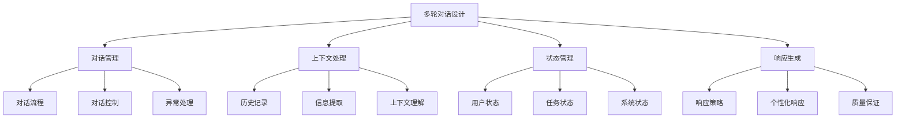
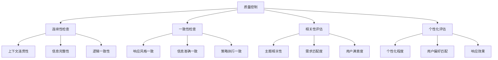

# 多轮对话设计

## 🎯 核心定义

### 什么是多轮对话设计？
多轮对话设计是指使用提示词工程技术，构建能够保持上下文、理解对话历史、进行连续交互的智能对话系统。

### 核心价值
- **上下文保持**：维持对话的连续性和一致性
- **深度交互**：支持复杂的多步骤交互
- **个性化服务**：根据对话历史提供个性化响应
- **用户体验**：提供自然流畅的对话体验

## 📊 多轮对话设计框架



## 🔍 设计要素

### 1. 对话管理
| 管理要素 | 设计要点 | 实现方法 | 应用场景 |
|----------|----------|----------|----------|
| **对话流程** | 设计对话路径 | 流程图设计 | 复杂任务 |
| **对话控制** | 控制对话方向 | 条件判断 | 流程控制 |
| **异常处理** | 处理异常情况 | 错误处理 | 系统稳定 |

#### 设计模板
```markdown
对话管理模板：
请设计一个多轮对话系统：
- 对话目标：[具体目标]
- 对话流程：[流程步骤]
- 控制逻辑：[控制条件]
- 异常处理：[异常策略]
- 结束条件：[结束标准]

示例：
请设计一个多轮对话系统：
- 对话目标：帮助用户选择合适的产品
- 对话流程：需求了解→产品推荐→详细说明→购买决策
- 控制逻辑：根据用户回答调整推荐策略
- 异常处理：处理用户不明确回答、话题偏离等情况
- 结束条件：用户做出购买决定或明确表示不感兴趣
```

### 2. 上下文处理
| 处理要素 | 设计要点 | 实现方法 | 效果保证 |
|----------|----------|----------|----------|
| **历史记录** | 保存对话历史 | 数据结构设计 | 确保连续性 |
| **信息提取** | 提取关键信息 | 信息识别算法 | 确保准确性 |
| **上下文理解** | 理解对话语境 | 语义分析 | 确保相关性 |

#### 设计模板
```markdown
上下文处理模板：
请设计上下文处理机制：
- 历史记录：[记录方式]
- 信息提取：[提取策略]
- 上下文理解：[理解方法]
- 信息更新：[更新机制]
- 信息清理：[清理策略]

示例：
请设计上下文处理机制：
- 历史记录：保存最近10轮对话，包含用户输入、系统响应、时间戳
- 信息提取：提取用户偏好、需求信息、决策因素
- 上下文理解：分析对话主题、用户意图、情感状态
- 信息更新：根据新信息更新用户画像
- 信息清理：定期清理过期信息，保持数据新鲜度
```

### 3. 状态管理
| 状态类型 | 设计要点 | 实现方法 | 效果体现 |
|----------|----------|----------|----------|
| **用户状态** | 跟踪用户状态 | 状态机设计 | 个性化服务 |
| **任务状态** | 跟踪任务进度 | 进度管理 | 任务完成 |
| **系统状态** | 跟踪系统状态 | 状态监控 | 系统稳定 |

#### 设计模板
```markdown
状态管理模板：
请设计状态管理系统：
- 用户状态：[状态类型]
- 任务状态：[状态类型]
- 系统状态：[状态类型]
- 状态转换：[转换规则]
- 状态持久化：[持久化策略]

示例：
请设计状态管理系统：
- 用户状态：新用户、活跃用户、沉默用户、流失用户
- 任务状态：开始、进行中、暂停、完成、取消
- 系统状态：正常、繁忙、维护、错误
- 状态转换：定义状态间的转换条件和规则
- 状态持久化：使用数据库保存状态信息
```

### 4. 响应生成
| 生成要素 | 设计要点 | 实现方法 | 效果保证 |
|----------|----------|----------|----------|
| **响应策略** | 选择响应策略 | 策略选择算法 | 确保合适性 |
| **个性化响应** | 个性化内容 | 个性化算法 | 确保相关性 |
| **质量保证** | 保证响应质量 | 质量检查机制 | 确保质量 |

#### 设计模板
```markdown
响应生成模板：
请设计响应生成机制：
- 响应策略：[策略类型]
- 个性化：[个性化方法]
- 质量保证：[质量检查]
- 响应格式：[格式要求]
- 响应时间：[时间要求]

示例：
请设计响应生成机制：
- 响应策略：根据用户状态和对话阶段选择策略
- 个性化：基于用户画像和历史偏好生成个性化响应
- 质量保证：检查响应相关性、准确性、完整性
- 响应格式：结构化响应，包含文本、选项、建议
- 响应时间：确保响应在3秒内生成
```

## 🛠️ 实践技巧

### 技巧1：对话流程设计
```markdown
模板：
请设计对话流程：
1. [阶段1]：[目标、步骤、输出]
2. [阶段2]：[目标、步骤、输出]
3. [阶段3]：[目标、步骤、输出]
4. [阶段4]：[目标、步骤、输出]

示例：
请设计产品推荐对话流程：
1. 需求了解阶段：了解用户需求、预算、偏好
2. 产品筛选阶段：根据需求筛选合适产品
3. 产品介绍阶段：详细介绍推荐产品特点
4. 决策支持阶段：帮助用户做出购买决策
```

### 技巧2：上下文保持
```markdown
模板：
请设计上下文保持机制：
- 对话历史：[保存方式]
- 关键信息：[提取方法]
- 上下文理解：[理解策略]
- 信息更新：[更新机制]

示例：
请设计上下文保持机制：
- 对话历史：保存完整对话记录，包含用户输入和系统响应
- 关键信息：提取用户姓名、需求、偏好、决策因素
- 上下文理解：分析当前对话主题、用户意图、情感状态
- 信息更新：根据新信息实时更新用户画像和推荐策略
```

### 技巧3：个性化响应
```markdown
模板：
请设计个性化响应机制：
- 用户画像：[画像维度]
- 个性化策略：[策略类型]
- 响应生成：[生成方法]
- 效果评估：[评估指标]

示例：
请设计个性化响应机制：
- 用户画像：年龄、性别、职业、兴趣、消费习惯
- 个性化策略：基于画像调整语言风格、推荐内容、交互方式
- 响应生成：结合用户画像和对话历史生成个性化响应
- 效果评估：通过用户满意度、完成率等指标评估效果
```

## 📈 质量控制

### 质量维度
| 质量指标 | 评估标准 | 控制方法 | 改进策略 |
|----------|----------|----------|----------|
| **连续性** | 对话是否连续 | 上下文检查 | 优化上下文处理 |
| **一致性** | 响应是否一致 | 一致性检查 | 统一响应策略 |
| **相关性** | 响应是否相关 | 相关性评估 | 优化理解算法 |
| **个性化** | 响应是否个性化 | 个性化评估 | 改进个性化算法 |

### 控制方法


## 🎯 优化技巧

### 技巧1：对话策略优化
```markdown
优化策略：
1. 策略选择：根据对话阶段选择合适策略
2. 策略调整：根据用户反馈调整策略
3. 策略组合：组合多种策略提高效果
4. 策略学习：从对话数据中学习优化策略

示例：
优化步骤：
1. 分析对话数据，识别高效果策略
2. 根据用户类型调整策略选择
3. 实现策略动态调整机制
4. 建立策略效果评估体系
```

### 技巧2：上下文优化
```markdown
优化策略：
1. 信息筛选：筛选重要信息，减少噪音
2. 信息压缩：压缩历史信息，提高效率
3. 信息更新：及时更新信息，保持新鲜度
4. 信息清理：定期清理过期信息

示例：
优化步骤：
1. 实现信息重要性评分机制
2. 开发信息压缩算法
3. 建立信息更新策略
4. 设计信息清理规则
```

### 技巧3：响应质量优化
```markdown
优化策略：
1. 响应生成：优化响应生成算法
2. 质量检查：加强质量检查机制
3. 用户反馈：收集用户反馈优化响应
4. 持续改进：建立持续改进机制

示例：
优化步骤：
1. 优化响应生成模型
2. 实现多维度质量检查
3. 建立用户反馈收集机制
4. 设计持续改进流程
```

## ⚠️ 常见问题

### 问题1：上下文丢失
**表现**：对话中丢失重要上下文信息
**解决**：优化上下文处理机制
**方法**：改进信息提取和存储策略

### 问题2：响应不一致
**表现**：不同轮次响应风格不一致
**解决**：统一响应策略和风格
**方法**：建立响应模板和规范

### 问题3：个性化不足
**表现**：响应缺乏个性化特征
**解决**：加强个性化算法
**方法**：完善用户画像和个性化策略

## 🎓 学习要点

### 核心理解
- 多轮对话设计是复杂的系统工程
- 上下文处理是成功的关键
- 状态管理确保对话的连续性
- 个性化响应提升用户体验

### 实践建议
- 从简单场景开始练习多轮对话设计
- 建立完善的状态管理机制
- 注重上下文处理和保持
- 持续优化对话策略和响应质量

## 🔗 相关链接
- [[02-2-3-Context上下文信息]] - 学习上下文信息处理
- [[02-3-3-思维链提示]] - 学习思维链提示
- [[03-1-2-问答系统应用]] - 学习问答系统应用
- [[04-1-1-提示词链式设计]] - 学习链式设计技巧
