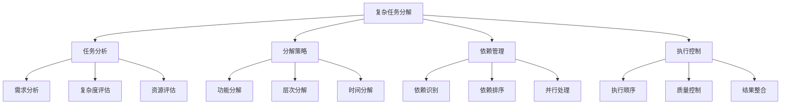
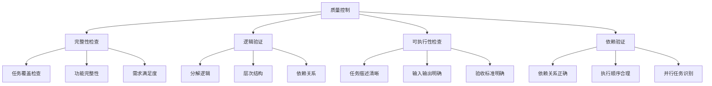

# 复杂任务分解

## 🎯 核心定义

### 什么是复杂任务分解？
复杂任务分解是指使用提示词工程技术，将复杂的任务分解为多个简单、可管理的子任务，通过逐步执行和组合完成整体目标。

### 核心价值
- **任务简化**：将复杂任务简化为可管理的小任务
- **逻辑清晰**：明确任务间的逻辑关系和依赖
- **执行高效**：提高任务执行效率和成功率
- **质量保证**：确保每个子任务的质量

## 📊 复杂任务分解框架



## 🔍 设计要素

### 1. 任务分析
| 分析要素 | 设计要点 | 实现方法 | 应用场景 |
|----------|----------|----------|----------|
| **需求分析** | 明确任务需求 | 需求调研 | 所有任务 |
| **复杂度评估** | 评估任务复杂度 | 复杂度模型 | 复杂项目 |
| **资源评估** | 评估所需资源 | 资源分析 | 资源规划 |

#### 设计模板
```markdown
任务分析模板：
请分析以下复杂任务：
- 任务描述：[具体任务描述]
- 需求分析：[需求详细分析]
- 复杂度评估：[复杂度评估结果]
- 资源评估：[资源需求评估]
- 约束条件：[任务约束条件]

示例：
请分析以下复杂任务：
- 任务描述：开发一个电商网站
- 需求分析：用户注册登录、商品展示、购物车、订单管理、支付系统
- 复杂度评估：高复杂度，涉及前端、后端、数据库、支付等多个技术栈
- 资源评估：需要3-5名开发人员，3-6个月开发时间
- 约束条件：预算限制、时间要求、技术栈要求
```

### 2. 分解策略
| 策略类型 | 设计要点 | 实现方法 | 效果保证 |
|----------|----------|----------|----------|
| **功能分解** | 按功能模块分解 | 功能分析 | 确保功能完整 |
| **层次分解** | 按层次结构分解 | 层次分析 | 确保结构清晰 |
| **时间分解** | 按时间阶段分解 | 时间规划 | 确保进度可控 |

#### 设计模板
```markdown
分解策略模板：
请采用[分解策略]分解任务：
- 分解原则：[分解原则]
- 分解层次：[分解层次]
- 分解粒度：[分解粒度]
- 分解标准：[分解标准]
- 分解验证：[验证方法]

示例：
请采用功能分解策略分解任务：
- 分解原则：高内聚、低耦合、功能独立
- 分解层次：系统级→模块级→功能级→操作级
- 分解粒度：每个子任务可在1-3天内完成
- 分解标准：功能明确、输入输出清晰、可测试
- 分解验证：检查分解完整性和逻辑性
```

### 3. 依赖管理
| 管理要素 | 设计要点 | 实现方法 | 效果体现 |
|----------|----------|----------|----------|
| **依赖识别** | 识别任务依赖 | 依赖分析 | 确保依赖清晰 |
| **依赖排序** | 确定执行顺序 | 拓扑排序 | 确保顺序正确 |
| **并行处理** | 识别并行任务 | 并行分析 | 提高执行效率 |

#### 设计模板
```markdown
依赖管理模板：
请管理任务依赖关系：
- 依赖识别：[依赖识别方法]
- 依赖类型：[依赖类型分类]
- 执行顺序：[执行顺序规划]
- 并行任务：[并行任务识别]
- 依赖监控：[依赖监控机制]

示例：
请管理任务依赖关系：
- 依赖识别：分析任务间的输入输出关系
- 依赖类型：数据依赖、功能依赖、资源依赖
- 执行顺序：数据库设计→后端开发→前端开发→测试
- 并行任务：UI设计可与后端开发并行进行
- 依赖监控：实时监控依赖状态，及时处理阻塞
```

### 4. 执行控制
| 控制要素 | 设计要点 | 实现方法 | 效果保证 |
|----------|----------|----------|----------|
| **执行顺序** | 控制执行顺序 | 顺序控制 | 确保逻辑正确 |
| **质量控制** | 控制任务质量 | 质量检查 | 确保质量达标 |
| **结果整合** | 整合执行结果 | 结果合并 | 确保结果完整 |

#### 设计模板
```markdown
执行控制模板：
请控制任务执行过程：
- 执行顺序：[顺序控制策略]
- 质量控制：[质量检查机制]
- 进度监控：[进度监控方法]
- 异常处理：[异常处理策略]
- 结果整合：[结果整合方法]

示例：
请控制任务执行过程：
- 执行顺序：按依赖关系顺序执行，支持并行执行
- 质量控制：每个子任务完成后进行质量检查
- 进度监控：实时监控任务进度，及时调整计划
- 异常处理：识别和处理执行异常，确保任务继续
- 结果整合：按预定规则整合各子任务结果
```

## 🛠️ 实践技巧

### 技巧1：WBS工作分解结构
```markdown
模板：
请使用WBS方法分解任务：
1. [一级任务]：[任务描述]
   1.1 [二级任务]：[任务描述]
       1.1.1 [三级任务]：[任务描述]
       1.1.2 [三级任务]：[任务描述]
   1.2 [二级任务]：[任务描述]
       1.2.1 [三级任务]：[任务描述]
2. [一级任务]：[任务描述]
   2.1 [二级任务]：[任务描述]

示例：
请使用WBS方法分解电商网站开发任务：
1. 需求分析
   1.1 用户需求调研
   1.2 功能需求分析
   1.3 非功能需求分析
2. 系统设计
   2.1 架构设计
   2.2 数据库设计
   2.3 接口设计
3. 系统开发
   3.1 后端开发
   3.2 前端开发
   3.3 数据库开发
```

### 技巧2：关键路径法
```markdown
模板：
请使用关键路径法分析任务：
- 任务列表：[所有任务列表]
- 任务时间：[每个任务的时间]
- 依赖关系：[任务间的依赖关系]
- 关键路径：[识别关键路径]
- 时间优化：[时间优化策略]

示例：
请使用关键路径法分析电商网站开发：
- 任务列表：需求分析、系统设计、后端开发、前端开发、测试、部署
- 任务时间：需求分析(2周)、系统设计(1周)、后端开发(4周)、前端开发(3周)、测试(2周)、部署(1周)
- 依赖关系：需求分析→系统设计→后端开发→测试→部署，前端开发可与后端开发并行
- 关键路径：需求分析→系统设计→后端开发→测试→部署(10周)
- 时间优化：优化关键路径上的任务，缩短整体时间
```

### 技巧3：敏捷分解
```markdown
模板：
请使用敏捷方法分解任务：
- 用户故事：[用户故事列表]
- 故事点：[故事点估算]
- 迭代规划：[迭代规划]
- 优先级：[优先级排序]
- 验收标准：[验收标准]

示例：
请使用敏捷方法分解电商网站开发：
- 用户故事：用户注册、商品浏览、购物车、订单管理、支付
- 故事点：用户注册(3点)、商品浏览(5点)、购物车(8点)、订单管理(13点)、支付(8点)
- 迭代规划：第1迭代(用户注册+商品浏览)、第2迭代(购物车)、第3迭代(订单管理+支付)
- 优先级：高优先级(用户注册、商品浏览)、中优先级(购物车、支付)、低优先级(订单管理)
- 验收标准：每个用户故事都有明确的验收标准
```

## 📈 质量控制

### 质量维度
| 质量指标 | 评估标准 | 控制方法 | 改进策略 |
|----------|----------|----------|----------|
| **分解完整性** | 分解是否完整 | 完整性检查 | 补充遗漏任务 |
| **逻辑正确性** | 分解逻辑是否正确 | 逻辑验证 | 优化分解逻辑 |
| **可执行性** | 子任务是否可执行 | 可执行性检查 | 细化任务描述 |
| **依赖准确性** | 依赖关系是否准确 | 依赖验证 | 修正依赖关系 |

### 控制方法


## 🎯 优化技巧

### 技巧1：分解粒度优化
```markdown
优化策略：
1. 粒度控制：控制分解粒度，避免过细或过粗
2. 时间平衡：平衡子任务的时间复杂度
3. 资源平衡：平衡子任务的资源需求
4. 质量平衡：平衡子任务的质量要求

示例：
优化步骤：
1. 分析任务复杂度，确定合适粒度
2. 调整子任务大小，确保时间平衡
3. 分配资源，确保资源平衡
4. 设定质量标准，确保质量平衡
```

### 技巧2：依赖优化
```markdown
优化策略：
1. 依赖最小化：减少不必要的依赖
2. 并行最大化：增加并行执行任务
3. 关键路径优化：优化关键路径上的任务
4. 资源优化：优化资源分配

示例：
优化步骤：
1. 分析依赖关系，消除冗余依赖
2. 识别并行任务，增加并行度
3. 优化关键路径，缩短整体时间
4. 调整资源分配，提高效率
```

### 技巧3：执行优化
```markdown
优化策略：
1. 执行策略：优化执行策略和顺序
2. 质量控制：加强质量控制机制
3. 异常处理：完善异常处理机制
4. 结果整合：优化结果整合方法

示例：
优化步骤：
1. 优化执行顺序，提高执行效率
2. 加强质量检查，确保任务质量
3. 完善异常处理，提高系统稳定性
4. 优化结果整合，确保结果完整性
```

## ⚠️ 常见问题

### 问题1：分解不完整
**表现**：遗漏重要任务或功能
**解决**：完善分解方法，补充遗漏任务
**方法**：使用系统化分解方法，建立检查清单

### 问题2：依赖关系错误
**表现**：依赖关系不准确或遗漏
**解决**：仔细分析依赖关系，修正错误
**方法**：使用依赖分析工具，验证依赖关系

### 问题3：执行效率低
**表现**：任务执行效率不高
**解决**：优化分解策略，提高并行度
**方法**：使用关键路径法，优化执行顺序

## 🎓 学习要点

### 核心理解
- 复杂任务分解是项目管理的重要技能
- 分解策略直接影响执行效果
- 依赖管理是确保成功的关键
- 持续优化是提升效果的方法

### 实践建议
- 从简单项目开始练习任务分解
- 使用系统化的分解方法
- 注重依赖关系分析
- 持续优化分解策略和执行效率

## 🔗 相关链接
- [[02-3-3-思维链提示]] - 学习思维链提示
- [[03-2-1-多轮对话设计]] - 学习多轮对话设计
- [[04-1-1-提示词链式设计]] - 学习链式设计技巧
- [[05-1-1-提示词工程流程]] - 学习工程化流程
