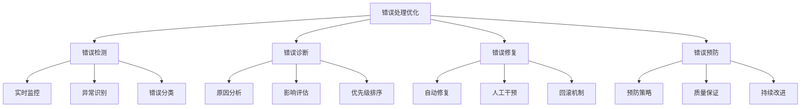
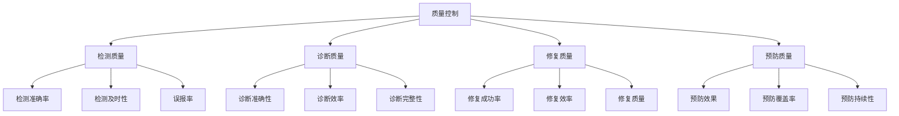

# 错误处理优化

## 🎯 核心定义

### 什么是错误处理优化？
错误处理优化是指使用提示词工程技术，设计有效的错误检测、诊断、修复和预防机制，确保AI系统能够优雅地处理各种异常情况。

### 核心价值
- **系统稳定**：提高系统的稳定性和可靠性
- **用户体验**：改善用户体验，减少错误影响
- **问题诊断**：快速诊断和定位问题
- **预防机制**：建立错误预防机制

## 📊 错误处理优化框架



## 🔍 设计要素

### 1. 错误检测
| 检测要素 | 设计要点 | 实现方法 | 应用场景 |
|----------|----------|----------|----------|
| **实时监控** | 实时监控系统状态 | 监控系统 | 所有系统 |
| **异常识别** | 识别异常行为 | 异常检测算法 | 复杂系统 |
| **错误分类** | 分类错误类型 | 分类算法 | 错误管理 |

#### 设计模板
```markdown
错误检测模板：
请设计错误检测机制：
- 监控对象：[监控目标]
- 检测方法：[检测策略]
- 阈值设置：[阈值标准]
- 告警机制：[告警策略]
- 分类标准：[分类规则]

示例：
请设计错误检测机制：
- 监控对象：AI模型输出质量、响应时间、错误率
- 检测方法：实时监控、统计分析、异常检测
- 阈值设置：错误率>5%、响应时间>10秒、质量评分<0.8
- 告警机制：实时告警、分级告警、告警升级
- 分类标准：系统错误、逻辑错误、数据错误、用户错误
```

### 2. 错误诊断
| 诊断要素 | 设计要点 | 实现方法 | 效果保证 |
|----------|----------|----------|----------|
| **原因分析** | 分析错误原因 | 根因分析 | 确保准确性 |
| **影响评估** | 评估错误影响 | 影响分析 | 确保完整性 |
| **优先级排序** | 确定处理优先级 | 优先级算法 | 确保效率 |

#### 设计模板
```markdown
错误诊断模板：
请设计错误诊断机制：
- 诊断方法：[诊断策略]
- 分析维度：[分析角度]
- 影响评估：[评估方法]
- 优先级：[优先级标准]
- 诊断报告：[报告格式]

示例：
请设计错误诊断机制：
- 诊断方法：日志分析、性能分析、用户反馈分析
- 分析维度：技术层面、业务层面、用户层面
- 影响评估：影响范围、影响程度、影响时间
- 优先级：高(系统崩溃)、中(功能异常)、低(性能下降)
- 诊断报告：包含问题描述、原因分析、影响评估、解决建议
```

### 3. 错误修复
| 修复要素 | 设计要点 | 实现方法 | 效果体现 |
|----------|----------|----------|----------|
| **自动修复** | 自动修复错误 | 自动修复算法 | 提高效率 |
| **人工干预** | 人工处理复杂错误 | 人工处理流程 | 确保质量 |
| **回滚机制** | 回滚到稳定状态 | 版本控制 | 确保稳定 |

#### 设计模板
```markdown
错误修复模板：
请设计错误修复机制：
- 修复策略：[修复方法]
- 自动修复：[自动化程度]
- 人工干预：[人工处理]
- 回滚机制：[回滚策略]
- 验证机制：[验证方法]

示例：
请设计错误修复机制：
- 修复策略：自动修复、人工修复、混合修复
- 自动修复：简单错误自动修复，复杂错误人工处理
- 人工干预：严重错误需要人工确认和处理
- 回滚机制：修复失败时回滚到上一个稳定版本
- 验证机制：修复后进行功能测试和性能测试
```

### 4. 错误预防
| 预防要素 | 设计要点 | 实现方法 | 效果保证 |
|----------|----------|----------|----------|
| **预防策略** | 制定预防策略 | 预防措施 | 减少错误 |
| **质量保证** | 保证系统质量 | 质量检查 | 确保质量 |
| **持续改进** | 持续改进机制 | 改进流程 | 持续优化 |

#### 设计模板
```markdown
错误预防模板：
请设计错误预防机制：
- 预防策略：[预防措施]
- 质量保证：[质量检查]
- 风险评估：[风险分析]
- 改进机制：[改进流程]
- 知识积累：[知识管理]

示例：
请设计错误预防机制：
- 预防策略：输入验证、边界检查、异常处理、容错设计
- 质量保证：代码审查、测试覆盖、性能监控、用户反馈
- 风险评估：定期风险评估、风险识别、风险控制
- 改进机制：错误分析、经验总结、流程优化、技术升级
- 知识积累：错误知识库、最佳实践、经验分享
```

## 🛠️ 实践技巧

### 技巧1：分层错误处理
```markdown
模板：
请设计分层错误处理机制：
1. [第一层]：[处理策略]
2. [第二层]：[处理策略]
3. [第三层]：[处理策略]
4. [第四层]：[处理策略]

示例：
请设计分层错误处理机制：
1. 输入层：输入验证、格式检查、范围检查
2. 处理层：逻辑检查、异常捕获、错误处理
3. 输出层：输出验证、格式转换、错误提示
4. 用户层：友好提示、错误解释、解决建议
```

### 技巧2：错误恢复策略
```markdown
模板：
请设计错误恢复策略：
- 恢复类型：[恢复方式]
- 恢复步骤：[恢复流程]
- 恢复验证：[验证方法]
- 恢复通知：[通知机制]
- 恢复记录：[记录要求]

示例：
请设计错误恢复策略：
- 恢复类型：自动恢复、手动恢复、混合恢复
- 恢复步骤：错误检测→原因分析→恢复执行→结果验证
- 恢复验证：功能测试、性能测试、用户确认
- 恢复通知：实时通知、状态更新、结果反馈
- 恢复记录：详细记录恢复过程和结果
```

### 技巧3：错误学习机制
```markdown
模板：
请设计错误学习机制：
- 学习目标：[学习内容]
- 学习方法：[学习策略]
- 知识积累：[知识管理]
- 应用机制：[应用方法]
- 效果评估：[评估指标]

示例：
请设计错误学习机制：
- 学习目标：错误模式、错误原因、解决方案
- 学习方法：错误分析、模式识别、经验总结
- 知识积累：错误知识库、解决方案库、最佳实践
- 应用机制：自动应用、智能推荐、人工参考
- 效果评估：错误减少率、处理效率、用户满意度
```

## 📈 质量控制

### 质量维度
| 质量指标 | 评估标准 | 控制方法 | 改进策略 |
|----------|----------|----------|----------|
| **检测准确性** | 错误检测是否准确 | 检测率统计 | 优化检测算法 |
| **诊断效率** | 错误诊断是否高效 | 诊断时间统计 | 优化诊断流程 |
| **修复成功率** | 错误修复是否成功 | 修复成功率统计 | 优化修复策略 |
| **预防效果** | 错误预防是否有效 | 错误率统计 | 优化预防措施 |

### 控制方法


## 🎯 优化技巧

### 技巧1：智能错误处理
```markdown
优化策略：
1. 智能检测：使用AI技术提高错误检测准确性
2. 智能诊断：使用机器学习分析错误原因
3. 智能修复：使用自动化技术提高修复效率
4. 智能预防：使用预测分析预防错误发生

示例：
优化步骤：
1. 训练错误检测模型，提高检测准确性
2. 开发错误诊断算法，快速定位问题
3. 实现自动修复机制，减少人工干预
4. 建立预测模型，提前预防错误
```

### 技巧2：用户体验优化
```markdown
优化策略：
1. 友好提示：提供用户友好的错误提示
2. 解决建议：提供具体的解决方案建议
3. 状态透明：让用户了解错误处理状态
4. 快速恢复：提供快速恢复机制

示例：
优化步骤：
1. 设计友好的错误提示界面
2. 提供详细的解决方案指导
3. 实现实时状态更新机制
4. 开发一键恢复功能
```

### 技巧3：系统性能优化
```markdown
优化策略：
1. 性能监控：实时监控系统性能
2. 资源优化：优化资源使用效率
3. 负载均衡：实现负载均衡
4. 缓存机制：使用缓存提高性能

示例：
优化步骤：
1. 建立性能监控体系
2. 优化资源分配策略
3. 实现负载均衡机制
4. 开发智能缓存系统
```

## ⚠️ 常见问题

### 问题1：错误检测不准确
**表现**：误报率高，漏报率高
**解决**：优化检测算法，调整阈值
**方法**：使用机器学习，建立检测模型

### 问题2：错误诊断效率低
**表现**：诊断时间长，准确性低
**解决**：优化诊断流程，提高自动化程度
**方法**：使用智能诊断，建立知识库

### 问题3：错误修复不彻底
**表现**：修复后问题复发
**解决**：深入分析根本原因
**方法**：使用根因分析，建立预防机制

## 🎓 学习要点

### 核心理解
- 错误处理是系统稳定性的重要保障
- 分层处理是有效的错误处理策略
- 预防胜于治疗，建立预防机制
- 持续改进是提升效果的关键

### 实践建议
- 从简单错误开始练习错误处理
- 建立完善的错误处理流程
- 注重用户体验和系统性能
- 持续优化和改进错误处理机制

## 🔗 相关链接
- [[02-2-5-Constraints约束条件]] - 学习约束条件
- [[03-2-4-性能调优技巧]] - 学习性能调优
- [[04-2-3-质量保证流程]] - 学习质量保证
- [[05-1-4-质量管控体系]] - 学习质量管控
