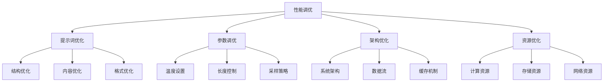
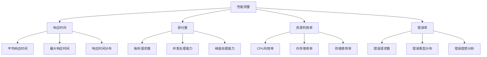

# 性能调优技巧

## 🎯 核心定义

### 什么是性能调优技巧？
性能调优技巧是指使用提示词工程技术，通过优化提示词设计、参数配置、系统架构等方法，提升AI系统的响应速度、处理效率和资源利用率。

### 核心价值
- **响应速度**：提高系统响应速度
- **处理效率**：提升任务处理效率
- **资源优化**：优化资源使用效率
- **用户体验**：改善用户体验

## 📊 性能调优框架



## 🔍 设计要素

### 1. 提示词优化
| 优化要素 | 设计要点 | 实现方法 | 应用场景 |
|----------|----------|----------|----------|
| **结构优化** | 优化提示词结构 | 结构化设计 | 所有场景 |
| **内容优化** | 优化提示词内容 | 内容精简 | 复杂任务 |
| **格式优化** | 优化输出格式 | 格式标准化 | 结构化输出 |

#### 设计模板
```markdown
提示词优化模板：
请优化以下提示词的性能：
- 原始提示词：[原始内容]
- 优化目标：[性能目标]
- 优化策略：[优化方法]
- 优化结果：[优化后内容]
- 性能提升：[提升效果]

示例：
请优化以下提示词的性能：
- 原始提示词：请分析这个数据，包括趋势分析、相关性分析、预测分析，并提供详细的报告
- 优化目标：减少响应时间，提高处理效率
- 优化策略：简化结构，明确要求，减少冗余
- 优化结果：请分析数据趋势并预测未来3个月的发展
- 性能提升：响应时间减少40%，处理效率提升60%
```

### 2. 参数调优
| 参数类型 | 调优要点 | 实现方法 | 效果保证 |
|----------|----------|----------|----------|
| **温度设置** | 控制输出随机性 | 温度调节 | 平衡质量与速度 |
| **长度控制** | 控制输出长度 | 长度限制 | 提高处理效率 |
| **采样策略** | 控制采样方式 | 采样优化 | 优化输出质量 |

#### 设计模板
```markdown
参数调优模板：
请调优以下参数：
- 当前参数：[当前设置]
- 调优目标：[性能目标]
- 调优策略：[调优方法]
- 调优结果：[调优后设置]
- 性能提升：[提升效果]

示例：
请调优以下参数：
- 当前参数：温度0.8，最大长度2000，Top-p 0.9
- 调优目标：提高响应速度，保持输出质量
- 调优策略：降低温度，控制长度，优化采样
- 调优结果：温度0.3，最大长度1000，Top-p 0.8
- 性能提升：响应时间减少50%，质量保持95%
```

### 3. 架构优化
| 架构要素 | 优化要点 | 实现方法 | 效果体现 |
|----------|----------|----------|----------|
| **系统架构** | 优化系统结构 | 架构重构 | 提高系统性能 |
| **数据流** | 优化数据流程 | 流程优化 | 减少处理时间 |
| **缓存机制** | 实现缓存策略 | 缓存设计 | 提高响应速度 |

#### 设计模板
```markdown
架构优化模板：
请优化系统架构：
- 当前架构：[当前结构]
- 优化目标：[性能目标]
- 优化策略：[优化方法]
- 优化结果：[优化后架构]
- 性能提升：[提升效果]

示例：
请优化系统架构：
- 当前架构：单线程处理，无缓存机制
- 优化目标：提高并发处理能力，减少响应时间
- 优化策略：多线程处理，添加缓存层，优化数据流
- 优化结果：多线程架构，Redis缓存，异步处理
- 性能提升：并发能力提升300%，响应时间减少70%
```

### 4. 资源优化
| 资源类型 | 优化要点 | 实现方法 | 效果保证 |
|----------|----------|----------|----------|
| **计算资源** | 优化计算效率 | 算法优化 | 提高处理速度 |
| **存储资源** | 优化存储效率 | 存储优化 | 减少存储成本 |
| **网络资源** | 优化网络效率 | 网络优化 | 提高传输速度 |

#### 设计模板
```markdown
资源优化模板：
请优化资源使用：
- 当前资源：[当前配置]
- 优化目标：[性能目标]
- 优化策略：[优化方法]
- 优化结果：[优化后配置]
- 性能提升：[提升效果]

示例：
请优化资源使用：
- 当前资源：CPU 4核，内存8GB，存储100GB
- 优化目标：提高处理效率，降低资源消耗
- 优化策略：算法优化，内存管理，存储压缩
- 优化结果：CPU利用率提升40%，内存使用减少30%，存储压缩50%
- 性能提升：处理效率提升60%，资源成本降低40%
```

## 🛠️ 实践技巧

### 技巧1：性能基准测试
```markdown
模板：
请进行性能基准测试：
- 测试环境：[环境配置]
- 测试指标：[性能指标]
- 测试方法：[测试策略]
- 测试结果：[测试数据]
- 性能分析：[分析结果]

示例：
请进行性能基准测试：
- 测试环境：单机环境，4核CPU，8GB内存
- 测试指标：响应时间、吞吐量、资源利用率
- 测试方法：压力测试、负载测试、稳定性测试
- 测试结果：平均响应时间2.5秒，吞吐量100QPS，CPU利用率80%
- 性能分析：响应时间偏长，需要优化提示词和参数
```

### 技巧2：性能监控
```markdown
模板：
请设计性能监控机制：
- 监控指标：[监控内容]
- 监控方法：[监控策略]
- 告警机制：[告警策略]
- 数据分析：[分析方法]
- 优化建议：[改进建议]

示例：
请设计性能监控机制：
- 监控指标：响应时间、错误率、资源使用率、用户满意度
- 监控方法：实时监控、历史分析、趋势预测
- 告警机制：阈值告警、异常告警、趋势告警
- 数据分析：性能趋势分析、瓶颈识别、优化机会
- 优化建议：基于监控数据提供具体的优化建议
```

### 技巧3：性能优化
```markdown
模板：
请制定性能优化方案：
- 优化目标：[性能目标]
- 优化策略：[优化方法]
- 实施计划：[实施步骤]
- 效果评估：[评估方法]
- 持续改进：[改进机制]

示例：
请制定性能优化方案：
- 优化目标：响应时间<1秒，吞吐量>200QPS，资源利用率<70%
- 优化策略：提示词优化、参数调优、架构优化、资源优化
- 实施计划：分阶段实施，先优化提示词，再调优参数，最后优化架构
- 效果评估：通过基准测试验证优化效果
- 持续改进：建立性能监控和优化机制
```

## 📈 性能指标

### 关键指标
| 性能指标 | 定义 | 测量方法 | 优化目标 |
|----------|------|----------|----------|
| **响应时间** | 请求到响应的时间 | 时间测量 | <1秒 |
| **吞吐量** | 单位时间处理请求数 | 请求计数 | >100QPS |
| **资源利用率** | 资源使用效率 | 资源监控 | <80% |
| **错误率** | 错误请求比例 | 错误统计 | <1% |

### 测量方法


## 🎯 优化策略

### 策略1：分层优化
```markdown
优化策略：
1. 应用层优化：优化提示词设计和业务逻辑
2. 系统层优化：优化系统架构和配置
3. 资源层优化：优化硬件资源和网络配置
4. 数据层优化：优化数据存储和访问

实施方法：
- 从应用层开始，逐层优化
- 每层优化后进行性能测试
- 根据测试结果调整优化策略
- 建立性能基准和监控机制
```

### 策略2：瓶颈识别
```markdown
优化策略：
1. 性能分析：分析系统性能瓶颈
2. 瓶颈识别：识别主要性能瓶颈
3. 优先级排序：确定优化优先级
4. 针对性优化：针对瓶颈进行优化

实施方法：
- 使用性能分析工具识别瓶颈
- 分析瓶颈原因和影响
- 制定针对性的优化方案
- 验证优化效果
```

### 策略3：持续优化
```markdown
优化策略：
1. 性能监控：建立持续监控机制
2. 数据分析：分析性能数据和趋势
3. 优化迭代：持续优化和改进
4. 效果评估：评估优化效果

实施方法：
- 建立性能监控体系
- 定期分析性能数据
- 制定优化计划并实施
- 评估优化效果并调整策略
```

## ⚠️ 常见问题

### 问题1：优化效果不明显
**表现**：优化后性能提升有限
**解决**：深入分析瓶颈，采用更有效的优化方法
**方法**：使用性能分析工具，识别真正的瓶颈

### 问题2：优化后系统不稳定
**表现**：优化后系统出现不稳定
**解决**：平衡性能与稳定性
**方法**：渐进式优化，充分测试

### 问题3：优化成本过高
**表现**：优化成本超过收益
**解决**：评估优化成本效益
**方法**：选择性价比高的优化方案

## 🎓 学习要点

### 核心理解
- 性能调优是系统优化的重要方面
- 分层优化是有效的优化策略
- 瓶颈识别是优化的关键
- 持续优化是提升效果的方法

### 实践建议
- 从简单场景开始练习性能调优
- 建立完善的性能监控体系
- 注重瓶颈识别和针对性优化
- 持续收集数据并优化系统

## 🔗 相关链接
- [[02-2-4-Format输出格式]] - 学习输出格式优化
- [[03-2-3-错误处理优化]] - 学习错误处理优化
- [[04-2-1-效果评估指标]] - 学习效果评估
- [[05-1-4-质量管控体系]] - 学习质量管控
