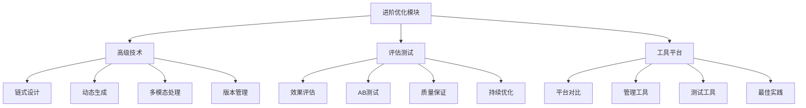

# 进阶优化总结

## 🎯 模块概述

### 进阶优化模块核心价值
进阶优化模块是提示词工程的高级阶段，专注于提升提示词的技术水平、管理效率和业务价值。通过高级技术、评估测试、工具平台三个维度的系统化优化，实现提示词工程的工程化和专业化。

### 学习目标达成
- **技术提升**：掌握高级提示词技术和优化方法
- **质量保证**：建立完善的评估测试体系
- **工具应用**：熟练使用专业工具和平台
- **工程化实践**：实现提示词工程的工程化管理

## 📊 知识体系回顾



## 🔍 核心知识点总结

### 1. 高级技术维度
| 技术领域 | 核心概念 | 关键技能 | 应用价值 |
|----------|----------|----------|----------|
| **链式设计** | 任务分解、数据传递、流程控制 | 复杂任务处理、系统化设计 | 提高处理复杂任务能力 |
| **动态生成** | 用户分析、上下文感知、智能优化 | 个性化定制、智能适配 | 提升用户体验和效果 |
| **多模态处理** | 模态融合、跨模态理解、统一输出 | 多类型数据处理、综合理解 | 扩展应用场景和能力 |
| **版本管理** | 版本控制、变更管理、质量保证 | 工程化管理、团队协作 | 确保质量和稳定性 |

#### 技术要点总结
```markdown
高级技术核心要点：

1. 链式设计技术
   - 核心：将复杂任务分解为可管理的步骤
   - 关键：数据传递机制、流程控制策略
   - 价值：处理复杂任务，提高系统化程度
   - 应用：复杂业务逻辑、多步骤处理

2. 动态生成技术
   - 核心：根据用户和上下文动态调整提示词
   - 关键：用户画像分析、上下文感知
   - 价值：个性化体验，提高适配性
   - 应用：个性化服务、智能推荐

3. 多模态处理技术
   - 核心：处理文本、图像、音频等多种模态
   - 关键：模态融合、跨模态理解
   - 价值：扩展应用场景，提高理解能力
   - 应用：多媒体处理、综合理解

4. 版本管理技术
   - 核心：全生命周期版本控制和管理
   - 关键：变更管理、质量保证
   - 价值：工程化管理，确保质量
   - 应用：团队协作、生产环境管理
```

### 2. 评估测试维度
| 评估领域 | 核心概念 | 关键技能 | 应用价值 |
|----------|----------|----------|----------|
| **效果评估** | 多维度指标、量化评估、结果分析 | 指标体系设计、评估方法选择 | 客观评估提示词效果 |
| **AB测试** | 实验设计、统计分析、结果解读 | 科学实验、数据驱动决策 | 验证优化效果 |
| **质量保证** | 全流程质量控制、标准化管理 | 质量体系建立、流程优化 | 确保提示词质量 |
| **持续优化** | 监控分析、持续改进、反馈循环 | 优化策略制定、效果跟踪 | 持续提升效果 |

#### 评估要点总结
```markdown
评估测试核心要点：

1. 效果评估体系
   - 核心：建立多维度评估指标体系
   - 关键：质量指标、性能指标、用户体验指标
   - 价值：客观评估，数据驱动决策
   - 应用：效果验证、优化指导

2. AB测试方法
   - 核心：科学实验验证优化效果
   - 关键：实验设计、统计分析、结果解读
   - 价值：验证假设，降低风险
   - 应用：优化验证、决策支持

3. 质量保证流程
   - 核心：全生命周期质量控制
   - 关键：质量标准、检查机制、改进流程
   - 价值：确保质量，降低风险
   - 应用：生产环境、团队协作

4. 持续优化策略
   - 核心：建立持续改进机制
   - 关键：监控分析、优化实施、效果跟踪
   - 价值：持续提升，保持竞争力
   - 应用：长期运营、业务发展
```

### 3. 工具平台维度
| 工具领域 | 核心概念 | 关键技能 | 应用价值 |
|----------|----------|----------|----------|
| **平台对比** | 技术能力、服务特性、成本效益 | 平台选择、技术评估 | 选择最适合的技术平台 |
| **管理工具** | 开发工具、管理工具、协作平台 | 工具选择、流程优化 | 提高开发和管理效率 |
| **测试工具** | 功能测试、性能测试、质量测试 | 测试策略、工具应用 | 确保质量和性能 |
| **最佳实践** | 经验总结、方法分享、持续改进 | 实践应用、经验积累 | 提升整体水平 |

#### 工具要点总结
```markdown
工具平台核心要点：

1. AI平台选择
   - 核心：根据需求选择最适合的AI平台
   - 关键：技术能力、成本效益、生态支持
   - 价值：技术支撑，成本控制
   - 应用：技术选型、平台迁移

2. 管理工具应用
   - 核心：使用专业工具提高管理效率
   - 关键：工具选择、流程优化、团队协作
   - 价值：提高效率，降低成本
   - 应用：项目管理、团队协作

3. 测试工具使用
   - 核心：建立自动化测试体系
   - 关键：测试策略、工具集成、质量保证
   - 价值：确保质量，提高效率
   - 应用：质量保证、持续集成

4. 最佳实践分享
   - 核心：总结和分享成功经验
   - 关键：经验总结、方法提炼、知识分享
   - 价值：提升水平，避免重复错误
   - 应用：团队培训、经验积累
```

## 🛠️ 实践应用指南

### 应用场景分析
| 应用场景 | 技术需求 | 工具选择 | 实施策略 |
|----------|----------|----------|----------|
| **企业级应用** | 高稳定性、可扩展性、安全性 | 企业级平台、管理工具 | 工程化实施、质量保证 |
| **快速原型** | 开发效率、迭代速度、成本控制 | 开发工具、测试工具 | 敏捷开发、快速验证 |
| **大规模部署** | 性能优化、监控运维、故障处理 | 性能工具、监控平台 | 系统化部署、持续优化 |
| **团队协作** | 版本管理、协作工具、知识共享 | 协作平台、管理工具 | 流程规范、团队培训 |

### 实施路径规划
```markdown
进阶优化实施路径：

阶段1：技术能力建设（1-2个月）
- 学习高级技术：链式设计、动态生成、多模态处理
- 掌握版本管理：Git工作流、变更管理、质量保证
- 实践项目：完成1-2个高级技术项目

阶段2：评估体系建立（1-2个月）
- 建立评估指标：质量、性能、用户体验指标
- 实施AB测试：设计实验、统计分析、结果应用
- 建立质量保证：流程规范、检查机制、改进策略

阶段3：工具平台应用（1-2个月）
- 平台选择：评估和选择最适合的AI平台
- 工具集成：建立工具生态，提高工作效率
- 最佳实践：总结和分享成功经验

阶段4：工程化实践（2-3个月）
- 系统集成：整合技术、评估、工具三个维度
- 团队协作：建立团队协作机制和流程
- 持续优化：建立持续改进和优化机制
```

## 📈 效果评估与改进

### 学习效果评估
| 评估维度 | 评估指标 | 评估方法 | 改进策略 |
|----------|----------|----------|----------|
| **技术掌握** | 技术理解度、实践能力、创新能力 | 项目评估、技术测试 | 加强实践、深化理解 |
| **工具应用** | 工具熟练度、应用效果、效率提升 | 使用统计、效果评估 | 加强培训、优化使用 |
| **质量意识** | 质量观念、评估能力、改进意识 | 质量检查、改进跟踪 | 强化培训、建立文化 |
| **工程化能力** | 系统思维、流程管理、团队协作 | 项目评估、团队反馈 | 系统培训、实践锻炼 |

### 持续改进机制
```markdown
持续改进机制：

1. 定期评估
   - 每月技术能力评估
   - 每季度工具使用效果评估
   - 每半年整体水平评估
   - 年度总结和改进计划

2. 反馈收集
   - 项目反馈收集
   - 团队反馈收集
   - 用户反馈收集
   - 行业趋势跟踪

3. 改进实施
   - 技术能力提升
   - 工具使用优化
   - 流程改进实施
   - 最佳实践更新

4. 效果验证
   - 改进效果评估
   - 目标达成检查
   - 持续优化调整
   - 经验总结分享
```

## 🎯 关键成功因素

### 成功要素分析
```markdown
进阶优化成功要素：

1. 技术基础
   - 扎实的基础知识
   - 丰富的实践经验
   - 持续的学习能力
   - 创新的思维方式

2. 工具应用
   - 合适的工具选择
   - 熟练的工具使用
   - 有效的工具集成
   - 持续的工具优化

3. 质量意识
   - 强烈的质量意识
   - 完善的评估体系
   - 严格的质量控制
   - 持续的改进机制

4. 团队协作
   - 良好的沟通能力
   - 有效的协作机制
   - 共享的知识文化
   - 持续的学习氛围
```

### 风险控制策略
```markdown
风险控制策略：

1. 技术风险
   - 技术选型风险：多方案对比，渐进式实施
   - 技术更新风险：持续学习，保持技术敏感度
   - 技术依赖风险：建立多技术栈，降低单一依赖

2. 管理风险
   - 流程风险：建立标准化流程，定期评估优化
   - 人员风险：加强培训，建立知识传承机制
   - 质量风险：建立质量保证体系，实施严格管控

3. 业务风险
   - 需求变化风险：建立敏捷响应机制，快速适应
   - 竞争风险：保持技术领先，建立差异化优势
   - 合规风险：关注法规变化，确保合规运营
```

## 🎓 学习成果总结

### 核心能力提升
```markdown
通过进阶优化模块学习，您将获得：

1. 高级技术能力
   - 掌握链式设计、动态生成、多模态处理等高级技术
   - 具备复杂问题分析和解决能力
   - 能够设计和实现工程化的提示词系统

2. 评估测试能力
   - 建立完善的评估测试体系
   - 掌握AB测试和统计分析技能
   - 具备质量保证和持续优化能力

3. 工具平台应用能力
   - 熟练使用各种专业工具和平台
   - 具备工具选择和集成能力
   - 能够总结和分享最佳实践

4. 工程化实践能力
   - 具备系统化思维和工程化管理能力
   - 能够建立团队协作和知识管理机制
   - 具备持续改进和创新能力
```

### 职业发展价值
```markdown
进阶优化模块的职业价值：

1. 技术专家
   - 成为提示词工程领域的技术专家
   - 具备解决复杂技术问题的能力
   - 能够指导团队进行技术选型和实施

2. 项目管理
   - 具备工程化项目管理能力
   - 能够建立质量保证和风险控制机制
   - 具备团队协作和知识管理能力

3. 产品创新
   - 具备产品创新和技术创新能力
   - 能够将技术转化为商业价值
   - 具备市场敏感度和用户洞察能力

4. 行业影响
   - 成为行业内的意见领袖
   - 能够分享和传播最佳实践
   - 具备推动行业发展的能力
```

## 🔗 相关链接
- [[03-4-应用实践总结]] - 回顾应用实践模块
- [[05-1-1-提示词工程流程]] - 学习系统整合模块
- [[06-1-常见问题FAQ]] - 查看问题解决模块
- [[07-1-学习目标检查清单]] - 进行学习评估
