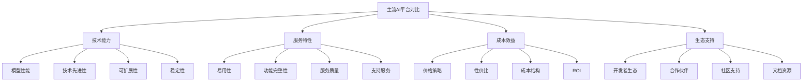
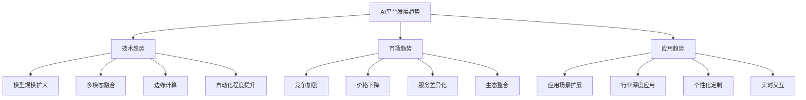

# 主流AI平台对比

## 🎯 核心定义

### 什么是AI平台？
AI平台是指提供人工智能服务的基础设施和工具集合，包括模型服务、开发工具、部署环境等，为提示词工程提供技术支撑。

### 核心价值
- **技术支撑**：为提示词工程提供技术基础
- **开发效率**：提高提示词开发和部署效率
- **成本控制**：降低AI应用开发和运营成本
- **技术更新**：提供最新的AI技术和模型

## 📊 平台对比框架



## 🔍 平台对比

### 1. OpenAI平台
| 对比维度 | 优势 | 劣势 | 适用场景 |
|----------|------|------|----------|
| **模型性能** | GPT-4性能领先，理解能力强 | 成本较高，API限制 | 高质量文本生成 |
| **技术先进性** | 技术最先进，创新能力强 | 技术封闭，定制化有限 | 前沿应用开发 |
| **易用性** | API简单易用，文档完善 | 功能相对单一 | 快速原型开发 |
| **成本效益** | 性能优秀但成本高 | 不适合大规模应用 | 高质量要求场景 |

#### OpenAI平台详情
```markdown
OpenAI平台特点：
- 核心产品：GPT-4、GPT-3.5、DALL-E、Whisper
- 技术优势：自然语言理解能力强，生成质量高
- 服务特点：API服务，支持多种编程语言
- 价格策略：按token计费，GPT-4价格较高
- 适用场景：高质量文本生成、对话系统、内容创作

技术规格：
- 模型规模：GPT-4约1.7万亿参数
- 上下文长度：GPT-4支持32K tokens
- 响应速度：平均2-5秒
- 准确率：在多项基准测试中表现优秀

开发支持：
- API文档：详细完善的API文档
- SDK支持：支持Python、JavaScript、Go等
- 社区支持：活跃的开发者社区
- 技术支持：提供技术支持服务
```

### 2. Google AI平台
| 对比维度 | 优势 | 劣势 | 适用场景 |
|----------|------|------|----------|
| **模型性能** | PaLM 2性能优秀，多模态能力强 | 在某些任务上不如GPT-4 | 多模态应用 |
| **技术先进性** | 技术先进，研究实力强 | 产品化程度相对较低 | 研究和实验 |
| **易用性** | 集成Google生态，使用方便 | 学习曲线较陡 | Google生态应用 |
| **成本效益** | 性价比相对较高 | 功能相对分散 | 企业级应用 |

#### Google AI平台详情
```markdown
Google AI平台特点：
- 核心产品：PaLM 2、Bard、Vertex AI、AutoML
- 技术优势：多模态能力强，集成Google生态
- 服务特点：云服务集成，支持企业级应用
- 价格策略：灵活的定价模式，支持企业定制
- 适用场景：企业级AI应用、多模态处理、云集成

技术规格：
- 模型规模：PaLM 2约3400亿参数
- 上下文长度：支持多种上下文长度
- 响应速度：优化后响应速度较快
- 准确率：在特定任务上表现优秀

开发支持：
- 云集成：深度集成Google Cloud
- 工具支持：提供完整的开发工具链
- 企业支持：强大的企业级支持
- 生态优势：与Google产品深度集成
```

### 3. 微软Azure AI平台
| 对比维度 | 优势 | 劣势 | 适用场景 |
|----------|------|------|----------|
| **模型性能** | 集成OpenAI模型，性能优秀 | 依赖第三方模型 | 企业级应用 |
| **技术先进性** | 企业级技术，稳定性好 | 创新性相对较弱 | 企业数字化转型 |
| **易用性** | 企业级易用性，集成度高 | 学习成本较高 | 企业级部署 |
| **成本效益** | 企业级性价比，长期成本可控 | 初期投入较大 | 大型企业应用 |

#### 微软Azure AI平台详情
```markdown
微软Azure AI平台特点：
- 核心产品：Azure OpenAI Service、Cognitive Services、Bot Framework
- 技术优势：企业级稳定性，集成OpenAI技术
- 服务特点：企业级服务，支持私有部署
- 价格策略：企业级定价，支持长期合约
- 适用场景：企业级AI应用、数字化转型、私有云部署

技术规格：
- 模型支持：GPT-4、GPT-3.5、Codex等
- 部署方式：支持公有云、私有云、混合云
- 安全特性：企业级安全，符合合规要求
- 集成能力：与Microsoft 365深度集成

开发支持：
- 企业支持：专业的企业级技术支持
- 合规认证：符合各种行业合规要求
- 培训服务：提供专业的培训服务
- 合作伙伴：丰富的合作伙伴生态
```

### 4. 百度文心平台
| 对比维度 | 优势 | 劣势 | 适用场景 |
|----------|------|------|----------|
| **模型性能** | 中文理解能力强，本土化好 | 英文能力相对较弱 | 中文应用场景 |
| **技术先进性** | 技术先进，本土化创新 | 国际影响力有限 | 中国市场应用 |
| **易用性** | 中文界面，本土化体验好 | 国际化程度有限 | 中文用户群体 |
| **成本效益** | 本土化成本优势，性价比高 | 功能相对有限 | 中小企业应用 |

#### 百度文心平台详情
```markdown
百度文心平台特点：
- 核心产品：文心大模型、百度智能云、PaddlePaddle
- 技术优势：中文理解能力强，本土化程度高
- 服务特点：中文服务，本土化支持
- 价格策略：本土化定价，性价比高
- 适用场景：中文AI应用、本土化服务、中小企业

技术规格：
- 模型规模：文心大模型参数规模较大
- 中文能力：在中文理解和生成方面表现优秀
- 响应速度：针对中文优化，响应速度较快
- 准确率：在中文任务上准确率较高

开发支持：
- 中文支持：完整的中文开发支持
- 本土服务：本土化的技术支持
- 社区生态：活跃的中文开发者社区
- 政策支持：符合中国相关政策和法规
```

### 5. 阿里云AI平台
| 对比维度 | 优势 | 劣势 | 适用场景 |
|----------|------|------|----------|
| **模型性能** | 通义千问性能优秀，中文能力强 | 英文能力相对较弱 | 中文商业应用 |
| **技术先进性** | 技术先进，商业化程度高 | 开源程度有限 | 商业级应用 |
| **易用性** | 企业级易用性，集成度高 | 学习曲线较陡 | 企业级部署 |
| **成本效益** | 企业级性价比，长期成本可控 | 初期投入较大 | 大型企业应用 |

#### 阿里云AI平台详情
```markdown
阿里云AI平台特点：
- 核心产品：通义千问、阿里云机器学习、DataWorks
- 技术优势：商业化程度高，企业级稳定性
- 服务特点：企业级服务，支持大规模部署
- 价格策略：企业级定价，支持弹性计费
- 适用场景：企业级AI应用、商业智能、大数据分析

技术规格：
- 模型规模：通义千问参数规模较大
- 商业能力：在商业应用方面表现优秀
- 部署能力：支持大规模企业级部署
- 集成能力：与阿里云生态深度集成

开发支持：
- 企业支持：专业的企业级技术支持
- 商业服务：完整的商业化服务支持
- 培训认证：提供专业的培训和认证
- 生态合作：丰富的合作伙伴生态
```

## 🛠️ 选择指南

### 选择标准
| 选择因素 | 权重 | 评估标准 | 选择建议 |
|----------|------|----------|----------|
| **技术需求** | 30% | 模型性能、技术先进性 | 根据具体技术需求选择 |
| **成本预算** | 25% | 价格策略、性价比 | 平衡性能与成本 |
| **应用场景** | 20% | 适用场景、功能匹配 | 选择最适合的平台 |
| **技术支持** | 15% | 文档质量、社区支持 | 考虑长期支持 |
| **生态集成** | 10% | 生态兼容性、集成度 | 考虑现有技术栈 |

### 选择建议
```markdown
平台选择建议：

1. 高质量要求场景
   - 推荐：OpenAI、Google AI
   - 理由：技术最先进，性能最优
   - 适用：高质量文本生成、前沿应用

2. 企业级应用场景
   - 推荐：微软Azure AI、阿里云AI
   - 理由：企业级稳定性，支持私有部署
   - 适用：大型企业、合规要求高的场景

3. 中文应用场景
   - 推荐：百度文心、阿里云AI
   - 理由：中文理解能力强，本土化支持
   - 适用：中文内容生成、本土化服务

4. 成本敏感场景
   - 推荐：百度文心、开源方案
   - 理由：性价比高，成本可控
   - 适用：中小企业、个人开发者

5. 多模态应用场景
   - 推荐：Google AI、OpenAI
   - 理由：多模态能力强，技术先进
   - 适用：图像生成、视频处理、多模态交互
```

## 📈 发展趋势

### 技术趋势


### 未来展望
```markdown
AI平台未来发展趋势：

1. 技术发展方向
   - 模型规模持续扩大，性能不断提升
   - 多模态能力增强，支持更多数据类型
   - 边缘计算普及，降低延迟和成本
   - 自动化程度提高，降低使用门槛

2. 市场发展态势
   - 竞争加剧，价格持续下降
   - 服务差异化，专业化程度提高
   - 生态整合，平台间合作增多
   - 标准化程度提高，互操作性增强

3. 应用发展趋势
   - 应用场景不断扩展，覆盖更多领域
   - 行业深度应用，垂直化程度提高
   - 个性化定制需求增加
   - 实时交互能力增强

4. 发展建议
   - 关注技术发展趋势，及时更新技术栈
   - 选择适合的平台，平衡性能与成本
   - 建立多平台策略，降低依赖风险
   - 注重生态建设，提高集成能力
```

## 🎯 最佳实践

### 实践建议
```markdown
AI平台使用最佳实践：

1. 平台选择策略
   - 根据具体需求选择最适合的平台
   - 建立多平台策略，降低单一依赖
   - 考虑长期发展，选择有持续支持的平台
   - 平衡性能与成本，选择性价比最优的方案

2. 开发实践
   - 充分利用平台提供的工具和资源
   - 遵循平台最佳实践和规范
   - 建立完善的测试和验证机制
   - 注重代码质量和可维护性

3. 部署实践
   - 选择合适的部署方式（云、本地、混合）
   - 建立完善的监控和运维体系
   - 注重安全性和合规性
   - 建立灾难恢复和备份机制

4. 优化实践
   - 持续监控和优化性能
   - 根据使用情况调整资源配置
   - 关注平台更新和新功能
   - 建立持续学习和改进机制
```

## ⚠️ 注意事项

### 风险提示
```markdown
AI平台使用风险提示：

1. 技术风险
   - 模型性能可能不稳定
   - API限制可能影响使用
   - 技术更新可能导致兼容性问题
   - 数据安全和隐私保护风险

2. 商业风险
   - 价格策略可能发生变化
   - 服务可用性可能受到影响
   - 供应商依赖风险
   - 合规和法规风险

3. 风险缓解
   - 建立多平台策略，降低单一依赖
   - 建立完善的监控和告警机制
   - 注重数据安全和隐私保护
   - 建立应急响应和恢复机制
```

## 🎓 学习要点

### 核心理解
- AI平台是提示词工程的重要技术支撑
- 不同平台有各自的优势和适用场景
- 平台选择需要综合考虑多个因素
- 持续关注技术发展趋势和平台更新

### 实践建议
- 深入了解各平台的特点和优势
- 根据具体需求选择最适合的平台
- 建立多平台策略，提高系统可靠性
- 注重平台生态建设和集成能力

## 🔗 相关链接
- [[04-3-2-提示词管理工具]] - 学习提示词管理工具
- [[04-3-3-自动化测试工具]] - 学习自动化测试工具
- [[04-3-4-最佳实践分享]] - 学习最佳实践
- [[05-2-1-技术发展趋势]] - 了解技术发展趋势
