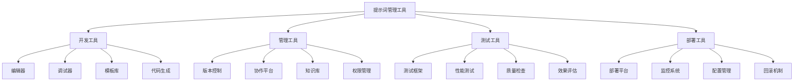
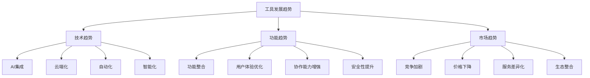

# 提示词管理工具

## 🎯 核心定义

### 什么是提示词管理工具？
提示词管理工具是指专门用于管理、组织、版本控制和优化提示词的软件工具，帮助开发者高效地管理提示词生命周期。

### 核心价值
- **集中管理**：统一管理所有提示词
- **版本控制**：跟踪提示词变更历史
- **协作开发**：支持团队协作开发
- **效果优化**：持续优化提示词效果

## 📊 工具分类框架



## 🔍 工具详解

### 1. 开发工具
| 工具类型 | 工具名称 | 主要功能 | 适用场景 |
|----------|----------|----------|----------|
| **编辑器** | PromptPerfect、PromptBase | 提示词编辑、格式化 | 日常开发 |
| **调试器** | PromptDebugger、PromptTester | 提示词调试、测试 | 开发调试 |
| **模板库** | PromptTemplate、PromptHub | 模板管理、复用 | 快速开发 |
| **代码生成** | PromptGenerator、AutoPrompt | 自动生成提示词 | 批量生成 |

#### 开发工具详情
```markdown
开发工具特点：

1. PromptPerfect
   - 功能：智能提示词编辑器，支持语法高亮、自动补全
   - 优势：界面友好，功能丰富，支持多种格式
   - 适用：日常提示词开发和编辑
   - 价格：免费版+付费版

2. PromptDebugger
   - 功能：提示词调试工具，支持实时测试和调试
   - 优势：调试功能强大，支持多种测试场景
   - 适用：提示词开发和问题排查
   - 价格：开源免费

3. PromptTemplate
   - 功能：提示词模板库，提供丰富的模板资源
   - 优势：模板丰富，分类清晰，易于使用
   - 适用：快速开发和模板复用
   - 价格：免费+付费模板

4. PromptGenerator
   - 功能：自动生成提示词，支持多种生成策略
   - 优势：生成效率高，支持批量生成
   - 适用：批量提示词生成和快速原型
   - 价格：按使用量计费
```

### 2. 管理工具
| 工具类型 | 工具名称 | 主要功能 | 适用场景 |
|----------|----------|----------|----------|
| **版本控制** | PromptGit、PromptVersion | 版本管理、变更跟踪 | 团队协作 |
| **协作平台** | PromptCollab、PromptTeam | 团队协作、权限管理 | 团队开发 |
| **知识库** | PromptWiki、PromptKB | 知识管理、文档存储 | 知识积累 |
| **权限管理** | PromptAuth、PromptAccess | 访问控制、权限管理 | 企业级应用 |

#### 管理工具详情
```markdown
管理工具特点：

1. PromptGit
   - 功能：基于Git的提示词版本控制系统
   - 优势：版本控制功能完善，支持分支合并
   - 适用：团队协作和版本管理
   - 价格：开源免费

2. PromptCollab
   - 功能：团队协作平台，支持实时协作
   - 优势：协作功能强大，支持多人同时编辑
   - 适用：团队开发和协作
   - 价格：免费版+企业版

3. PromptWiki
   - 功能：提示词知识库，支持文档管理
   - 优势：知识管理功能完善，支持搜索和分类
   - 适用：知识积累和文档管理
   - 价格：免费版+付费版

4. PromptAuth
   - 功能：权限管理系统，支持细粒度权限控制
   - 优势：权限控制精确，支持多种认证方式
   - 适用：企业级应用和安全管理
   - 价格：企业级定价
```

### 3. 测试工具
| 工具类型 | 工具名称 | 主要功能 | 适用场景 |
|----------|----------|----------|----------|
| **测试框架** | PromptTest、PromptQA | 自动化测试、质量保证 | 质量测试 |
| **性能测试** | PromptBench、PromptPerf | 性能测试、压力测试 | 性能优化 |
| **质量检查** | PromptCheck、PromptLint | 质量检查、规范验证 | 质量保证 |
| **效果评估** | PromptEval、PromptScore | 效果评估、评分系统 | 效果优化 |

#### 测试工具详情
```markdown
测试工具特点：

1. PromptTest
   - 功能：自动化测试框架，支持多种测试类型
   - 优势：测试功能完善，支持持续集成
   - 适用：自动化测试和质量保证
   - 价格：开源免费

2. PromptBench
   - 功能：性能测试工具，支持负载测试
   - 优势：性能测试功能强大，支持多种测试场景
   - 适用：性能测试和优化
   - 价格：免费版+付费版

3. PromptCheck
   - 功能：质量检查工具，支持规范验证
   - 优势：检查规则丰富，支持自定义规则
   - 适用：质量检查和规范验证
   - 价格：开源免费

4. PromptEval
   - 功能：效果评估工具，支持多种评估指标
   - 优势：评估指标全面，支持自定义评估
   - 适用：效果评估和优化
   - 价格：按使用量计费
```

### 4. 部署工具
| 工具类型 | 工具名称 | 主要功能 | 适用场景 |
|----------|----------|----------|----------|
| **部署平台** | PromptDeploy、PromptCloud | 自动化部署、云服务 | 生产部署 |
| **监控系统** | PromptMonitor、PromptWatch | 实时监控、告警系统 | 运维监控 |
| **配置管理** | PromptConfig、PromptEnv | 配置管理、环境管理 | 环境配置 |
| **回滚机制** | PromptRollback、PromptRecover | 版本回滚、故障恢复 | 故障处理 |

#### 部署工具详情
```markdown
部署工具特点：

1. PromptDeploy
   - 功能：自动化部署平台，支持多种部署方式
   - 优势：部署流程自动化，支持蓝绿部署
   - 适用：生产环境部署
   - 价格：按资源使用量计费

2. PromptMonitor
   - 功能：实时监控系统，支持性能监控
   - 优势：监控功能完善，支持告警和通知
   - 适用：生产环境监控
   - 价格：免费版+付费版

3. PromptConfig
   - 功能：配置管理工具，支持多环境配置
   - 优势：配置管理功能强大，支持版本控制
   - 适用：环境配置管理
   - 价格：开源免费

4. PromptRollback
   - 功能：版本回滚工具，支持快速回滚
   - 优势：回滚速度快，支持数据恢复
   - 适用：故障处理和版本回滚
   - 价格：企业级定价
```

## 🛠️ 工具选择指南

### 选择标准
| 选择因素 | 权重 | 评估标准 | 选择建议 |
|----------|------|----------|----------|
| **功能需求** | 35% | 功能完整性、适用性 | 根据具体需求选择 |
| **易用性** | 25% | 界面友好、学习成本 | 选择易用的工具 |
| **成本效益** | 20% | 价格合理、性价比高 | 平衡功能与成本 |
| **技术支持** | 15% | 文档质量、社区支持 | 考虑长期支持 |
| **集成能力** | 5% | 与现有工具集成 | 考虑工具生态 |

### 选择建议
```markdown
工具选择建议：

1. 个人开发者
   - 推荐：PromptPerfect + PromptGit + PromptTest
   - 理由：功能完整，成本低，易于使用
   - 适用：个人项目和小型团队

2. 小型团队
   - 推荐：PromptCollab + PromptVersion + PromptEval
   - 理由：协作功能强，版本管理完善
   - 适用：5-20人的开发团队

3. 大型企业
   - 推荐：PromptAuth + PromptDeploy + PromptMonitor
   - 理由：企业级功能，安全性和稳定性高
   - 适用：大型企业和复杂项目

4. 开源项目
   - 推荐：PromptGit + PromptTest + PromptCheck
   - 理由：开源免费，社区支持好
   - 适用：开源项目和非盈利组织

5. 快速原型
   - 推荐：PromptGenerator + PromptTemplate + PromptDebugger
   - 理由：开发效率高，快速迭代
   - 适用：快速原型和概念验证
```

## 📈 工具发展趋势

### 技术趋势


### 未来展望
```markdown
工具发展趋势：

1. 技术发展方向
   - AI集成：工具集成AI能力，提供智能辅助
   - 云端化：工具向云端迁移，提供SaaS服务
   - 自动化：自动化程度提高，减少人工操作
   - 智能化：工具智能化程度提升，提供智能建议

2. 功能发展趋势
   - 功能整合：工具功能整合，提供一站式服务
   - 用户体验优化：界面和交互体验持续优化
   - 协作能力增强：团队协作功能不断完善
   - 安全性提升：安全性和隐私保护能力增强

3. 市场发展趋势
   - 竞争加剧：工具竞争加剧，功能差异化
   - 价格下降：工具价格下降，普及程度提高
   - 服务差异化：服务差异化程度提高
   - 生态整合：工具生态整合，互操作性增强

4. 发展建议
   - 关注技术发展趋势，及时更新工具
   - 选择适合的工具，建立工具生态
   - 注重工具集成，提高工作效率
   - 建立工具管理策略，优化工具使用
```

## 🎯 最佳实践

### 实践建议
```markdown
工具使用最佳实践：

1. 工具选择策略
   - 根据具体需求选择最适合的工具
   - 建立工具生态，避免工具孤岛
   - 考虑工具集成和互操作性
   - 平衡功能与成本，选择性价比最优的方案

2. 工具管理实践
   - 建立工具使用规范和标准
   - 定期评估工具效果和成本
   - 建立工具培训和知识分享机制
   - 注重工具安全和权限管理

3. 工具集成实践
   - 选择支持集成的工具
   - 建立工具集成架构和标准
   - 实现工具间数据共享和同步
   - 建立工具集成监控和维护机制

4. 工具优化实践
   - 持续监控工具使用情况
   - 根据使用反馈优化工具配置
   - 关注工具更新和新功能
   - 建立工具优化和改进机制
```

## ⚠️ 注意事项

### 风险提示
```markdown
工具使用风险提示：

1. 技术风险
   - 工具兼容性问题
   - 数据安全和隐私风险
   - 工具依赖和供应商风险
   - 技术更新和迁移风险

2. 商业风险
   - 工具价格变化风险
   - 服务可用性风险
   - 供应商变更风险
   - 合规和法规风险

3. 风险缓解
   - 建立多工具策略，降低单一依赖
   - 注重数据安全和隐私保护
   - 建立工具备份和迁移机制
   - 建立应急响应和恢复机制
```

## 🎓 学习要点

### 核心理解
- 工具是提示词工程的重要支撑
- 不同工具有各自的优势和适用场景
- 工具选择需要综合考虑多个因素
- 工具管理是提高效率的关键

### 实践建议
- 深入了解各工具的特点和优势
- 根据具体需求选择最适合的工具
- 建立工具生态，提高工作效率
- 注重工具集成和管理

## 🔗 相关链接
- [[04-3-1-主流AI平台对比]] - 学习AI平台对比
- [[04-3-3-自动化测试工具]] - 学习自动化测试工具
- [[04-3-4-最佳实践分享]] - 学习最佳实践
- [[05-1-2-团队协作规范]] - 学习团队协作规范
