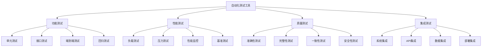
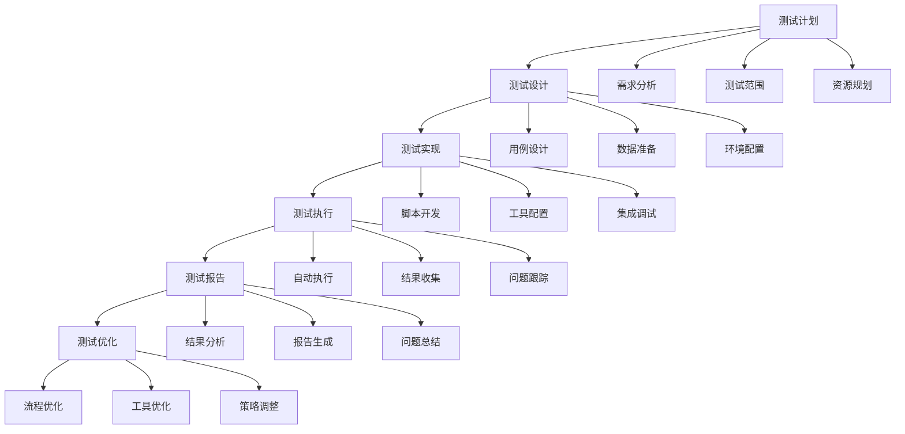

# 自动化测试工具

## 🎯 核心定义

### 什么是自动化测试工具？
自动化测试工具是指用于自动化执行提示词测试、验证和评估的软件工具，通过自动化测试提高测试效率、准确性和覆盖率。

### 核心价值
- **提高效率**：自动化执行测试，减少人工操作
- **保证质量**：确保测试的一致性和准确性
- **降低成本**：减少测试人力成本和时间成本
- **持续集成**：支持持续集成和持续部署

## 📊 测试工具框架



## 🔍 工具分类

### 1. 功能测试工具
| 工具类型 | 工具名称 | 主要功能 | 适用场景 |
|----------|----------|----------|----------|
| **单元测试** | PromptUnit、PromptTest | 单个提示词测试 | 开发阶段 |
| **接口测试** | PromptAPI、PromptRest | API接口测试 | 接口开发 |
| **端到端测试** | PromptE2E、PromptFlow | 完整流程测试 | 系统测试 |
| **回归测试** | PromptRegression、PromptCI | 回归测试 | 版本发布 |

#### 功能测试工具详情
```markdown
功能测试工具特点：

1. PromptUnit
   - 功能：提示词单元测试框架
   - 优势：测试粒度细，执行速度快
   - 适用：开发阶段的单元测试
   - 价格：开源免费

2. PromptAPI
   - 功能：API接口测试工具
   - 优势：支持多种API协议，测试功能完善
   - 适用：API接口开发和测试
   - 价格：免费版+付费版

3. PromptE2E
   - 功能：端到端测试工具
   - 优势：测试覆盖完整，模拟真实用户场景
   - 适用：系统级测试和验收测试
   - 价格：按使用量计费

4. PromptRegression
   - 功能：回归测试工具
   - 优势：自动化程度高，支持持续集成
   - 适用：版本发布和持续集成
   - 价格：企业级定价
```

### 2. 性能测试工具
| 工具类型 | 工具名称 | 主要功能 | 适用场景 |
|----------|----------|----------|----------|
| **负载测试** | PromptLoad、PromptJMeter | 负载性能测试 | 性能优化 |
| **压力测试** | PromptStress、PromptGatling | 压力极限测试 | 容量规划 |
| **性能监控** | PromptMonitor、PromptAPM | 实时性能监控 | 生产监控 |
| **基准测试** | PromptBenchmark、PromptK6 | 性能基准测试 | 性能对比 |

#### 性能测试工具详情
```markdown
性能测试工具特点：

1. PromptLoad
   - 功能：负载测试工具
   - 优势：支持大规模并发测试，结果分析详细
   - 适用：系统负载能力测试
   - 价格：开源免费

2. PromptStress
   - 功能：压力测试工具
   - 优势：压力测试功能强大，支持极限测试
   - 适用：系统极限能力测试
   - 价格：免费版+付费版

3. PromptMonitor
   - 功能：性能监控工具
   - 优势：实时监控，告警功能完善
   - 适用：生产环境性能监控
   - 价格：按监控规模计费

4. PromptBenchmark
   - 功能：基准测试工具
   - 优势：基准测试标准化，结果可比较
   - 适用：性能基准建立和对比
   - 价格：开源免费
```

### 3. 质量测试工具
| 工具类型 | 工具名称 | 主要功能 | 适用场景 |
|----------|----------|----------|----------|
| **准确性测试** | PromptAccuracy、PromptQA | 输出准确性测试 | 质量保证 |
| **完整性测试** | PromptComplete、PromptCheck | 输出完整性测试 | 质量检查 |
| **一致性测试** | PromptConsistent、PromptStable | 输出一致性测试 | 稳定性测试 |
| **安全性测试** | PromptSecurity、PromptAudit | 安全性测试 | 安全审计 |

#### 质量测试工具详情
```markdown
质量测试工具特点：

1. PromptAccuracy
   - 功能：准确性测试工具
   - 优势：测试指标全面，评估方法科学
   - 适用：输出质量准确性测试
   - 价格：按测试量计费

2. PromptComplete
   - 功能：完整性测试工具
   - 优势：完整性检查规则丰富，支持自定义
   - 适用：输出完整性验证
   - 价格：开源免费

3. PromptConsistent
   - 功能：一致性测试工具
   - 优势：一致性检查算法先进，结果可靠
   - 适用：输出稳定性测试
   - 价格：免费版+付费版

4. PromptSecurity
   - 功能：安全性测试工具
   - 优势：安全测试覆盖全面，漏洞检测准确
   - 适用：安全审计和合规检查
   - 价格：企业级定价
```

### 4. 集成测试工具
| 工具类型 | 工具名称 | 主要功能 | 适用场景 |
|----------|----------|----------|----------|
| **系统集成** | PromptSystem、PromptIntegration | 系统集成测试 | 系统集成 |
| **API集成** | PromptAPITest、PromptGateway | API集成测试 | API集成 |
| **数据集成** | PromptData、PromptETL | 数据集成测试 | 数据处理 |
| **部署集成** | PromptDeploy、PromptCI | 部署集成测试 | 持续部署 |

#### 集成测试工具详情
```markdown
集成测试工具特点：

1. PromptSystem
   - 功能：系统集成测试工具
   - 优势：集成测试覆盖全面，支持复杂场景
   - 适用：系统级集成测试
   - 价格：企业级定价

2. PromptAPITest
   - 功能：API集成测试工具
   - 优势：API测试功能完善，支持多种协议
   - 适用：API集成和测试
   - 价格：免费版+付费版

3. PromptData
   - 功能：数据集成测试工具
   - 优势：数据测试功能强大，支持大数据量
   - 适用：数据集成和ETL测试
   - 价格：按数据量计费

4. PromptDeploy
   - 功能：部署集成测试工具
   - 优势：部署测试自动化，支持多种环境
   - 适用：持续部署和发布
   - 价格：按部署次数计费
```

## 🛠️ 测试策略

### 测试策略设计
```markdown
测试策略设计模板：
请设计自动化测试策略：
- 测试目标：[测试目标设定]
- 测试范围：[测试范围定义]
- 测试类型：[测试类型选择]
- 测试工具：[测试工具选择]

策略要素：
- 测试优先级：[测试优先级设定]
- 测试频率：[测试频率设定]
- 测试环境：[测试环境配置]
- 测试数据：[测试数据准备]

示例：
请设计自动化测试策略：
- 测试目标：确保提示词质量，提高系统稳定性
- 测试范围：覆盖功能、性能、质量、集成各个方面
- 测试类型：单元测试、集成测试、性能测试、质量测试
- 测试工具：PromptUnit + PromptAPI + PromptLoad + PromptAccuracy

策略要素：
- 测试优先级：功能测试>质量测试>性能测试>集成测试
- 测试频率：单元测试每日，集成测试每周，性能测试每月
- 测试环境：开发环境、测试环境、预生产环境
- 测试数据：真实数据+模拟数据+边界数据
```

### 测试流程设计


## 📈 测试效果评估

### 评估指标
| 评估维度 | 评估指标 | 评估方法 | 改进策略 |
|----------|----------|----------|----------|
| **测试效率** | 测试执行时间、自动化率 | 时间统计 | 优化测试流程 |
| **测试质量** | 测试覆盖率、缺陷发现率 | 质量分析 | 提高测试质量 |
| **测试成本** | 测试成本、ROI | 成本分析 | 降低测试成本 |
| **测试稳定性** | 测试成功率、稳定性 | 稳定性测试 | 提高测试稳定性 |

### 评估方法
```markdown
测试效果评估方法：

1. 测试效率评估
   - 指标：测试执行时间、自动化率、测试频率
   - 方法：时间统计、自动化程度分析
   - 目标：提高测试效率，减少测试时间

2. 测试质量评估
   - 指标：测试覆盖率、缺陷发现率、测试准确性
   - 方法：覆盖率分析、缺陷统计、质量检查
   - 目标：提高测试质量，确保测试有效性

3. 测试成本评估
   - 指标：测试成本、人力成本、工具成本
   - 方法：成本统计、ROI分析
   - 目标：降低测试成本，提高成本效益

4. 测试稳定性评估
   - 指标：测试成功率、测试稳定性、工具可靠性
   - 方法：稳定性测试、可靠性分析
   - 目标：提高测试稳定性，确保测试可靠性
```

## 🎯 最佳实践

### 实践建议
```markdown
自动化测试最佳实践：

1. 测试策略制定
   - 根据项目特点制定测试策略
   - 平衡测试覆盖率和测试成本
   - 建立测试优先级和风险控制
   - 定期评估和调整测试策略

2. 工具选择和使用
   - 选择适合的测试工具
   - 建立工具使用规范和标准
   - 注重工具集成和互操作性
   - 定期评估工具效果和成本

3. 测试流程优化
   - 建立标准化的测试流程
   - 实现测试流程自动化
   - 建立测试质量保证机制
   - 持续优化测试流程

4. 团队协作和培训
   - 建立测试团队协作机制
   - 提供测试技能培训
   - 建立知识分享和经验积累
   - 注重测试文化建设
```

## ⚠️ 注意事项

### 风险提示
```markdown
自动化测试风险提示：

1. 技术风险
   - 工具兼容性和稳定性风险
   - 测试数据安全和隐私风险
   - 测试环境依赖和配置风险
   - 测试脚本维护和更新风险

2. 管理风险
   - 测试策略不当风险
   - 测试资源不足风险
   - 测试质量失控风险
   - 测试成本超支风险

3. 风险缓解
   - 建立多工具策略，降低单一依赖
   - 注重测试数据安全和隐私保护
   - 建立测试环境管理和备份机制
   - 建立测试质量监控和控制机制
```

## 🎓 学习要点

### 核心理解
- 自动化测试是提高测试效率的关键
- 不同测试工具有各自的优势和适用场景
- 测试策略设计是自动化测试成功的基础
- 持续优化是保持测试效果的关键

### 实践建议
- 深入了解各测试工具的特点和优势
- 根据项目需求制定合适的测试策略
- 建立完善的测试流程和质量保证机制
- 注重测试效果评估和持续优化

## 🔗 相关链接
- [[04-3-1-主流AI平台对比]] - 学习AI平台对比
- [[04-3-2-提示词管理工具]] - 学习管理工具
- [[04-3-4-最佳实践分享]] - 学习最佳实践
- [[04-2-1-效果评估指标]] - 学习效果评估
