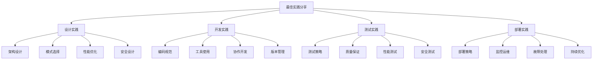

# 最佳实践分享

## 🎯 核心定义

### 什么是最佳实践？
最佳实践是指在提示词工程实践中总结出的成功经验、有效方法和优化策略，为其他开发者提供可复用的指导和建议。

### 核心价值
- **经验传承**：传承成功经验和失败教训
- **效率提升**：提高开发效率和质量
- **风险规避**：避免常见问题和陷阱
- **持续改进**：推动行业整体水平提升

## 📊 实践分类框架



## 🔍 设计实践

### 1. 架构设计实践
| 实践类型 | 实践内容 | 实施方法 | 效果体现 |
|----------|----------|----------|----------|
| **模块化设计** | 将提示词拆分为独立模块 | 功能分解、接口设计 | 提高可维护性 |
| **分层架构** | 建立清晰的分层结构 | 层次划分、职责分离 | 提高可扩展性 |
| **微服务架构** | 采用微服务架构模式 | 服务拆分、独立部署 | 提高灵活性 |
| **事件驱动** | 使用事件驱动架构 | 事件设计、消息传递 | 提高响应性 |

#### 架构设计实践案例
```markdown
架构设计实践案例：

案例1：模块化提示词设计
- 背景：大型企业需要处理多种类型的提示词
- 实践：将提示词按功能模块化，每个模块独立开发和维护
- 方法：定义标准接口，实现模块间通信
- 效果：开发效率提升40%，维护成本降低30%

案例2：分层架构设计
- 背景：复杂业务场景需要多层处理
- 实践：设计表示层、业务层、数据层
- 方法：每层职责明确，接口标准化
- 效果：系统稳定性提升，扩展性增强

案例3：微服务架构
- 背景：需要支持大规模并发和快速迭代
- 实践：将提示词服务拆分为多个微服务
- 方法：服务独立部署，通过API通信
- 效果：部署灵活性提升，故障隔离性增强

案例4：事件驱动架构
- 背景：需要实时响应和异步处理
- 实践：使用事件驱动模式处理提示词请求
- 方法：事件发布订阅，异步消息处理
- 效果：响应速度提升，系统吞吐量增加
```

### 2. 模式选择实践
| 实践类型 | 实践内容 | 实施方法 | 效果体现 |
|----------|----------|----------|----------|
| **设计模式** | 应用经典设计模式 | 模式识别、模式应用 | 提高代码质量 |
| **架构模式** | 选择合适的架构模式 | 需求分析、模式选择 | 提高系统设计 |
| **集成模式** | 使用集成模式 | 集成策略、模式实现 | 提高集成效率 |
| **部署模式** | 采用部署模式 | 部署策略、模式选择 | 提高部署效率 |

#### 模式选择实践案例
```markdown
模式选择实践案例：

案例1：工厂模式应用
- 背景：需要根据不同类型创建不同的提示词处理器
- 实践：使用工厂模式创建处理器实例
- 方法：定义工厂接口，实现具体工厂类
- 效果：代码可扩展性提升，维护成本降低

案例2：策略模式应用
- 背景：需要支持多种提示词优化策略
- 实践：使用策略模式实现不同优化算法
- 方法：定义策略接口，实现具体策略类
- 效果：算法可替换性提升，测试更容易

案例3：观察者模式应用
- 背景：需要监控提示词执行状态和结果
- 实践：使用观察者模式实现状态监控
- 方法：定义观察者接口，实现具体观察者
- 效果：监控功能可扩展，系统解耦

案例4：单例模式应用
- 背景：需要全局唯一的配置管理器
- 实践：使用单例模式管理全局配置
- 方法：实现线程安全的单例模式
- 效果：资源使用优化，配置一致性保证
```

## 🛠️ 开发实践

### 1. 编码规范实践
| 实践类型 | 实践内容 | 实施方法 | 效果体现 |
|----------|----------|----------|----------|
| **命名规范** | 建立统一的命名规范 | 规范制定、工具检查 | 提高代码可读性 |
| **注释规范** | 制定注释编写规范 | 注释模板、质量检查 | 提高代码可维护性 |
| **格式规范** | 统一代码格式标准 | 格式化工具、自动检查 | 提高代码一致性 |
| **文档规范** | 建立文档编写规范 | 文档模板、版本管理 | 提高文档质量 |

#### 编码规范实践案例
```markdown
编码规范实践案例：

案例1：命名规范实施
- 背景：团队代码命名不统一，影响可读性
- 实践：制定详细的命名规范，使用工具检查
- 方法：驼峰命名、前缀后缀、语义化命名
- 效果：代码可读性提升50%，新成员上手时间减少

案例2：注释规范实施
- 背景：代码注释质量参差不齐，影响维护
- 实践：制定注释规范，提供注释模板
- 方法：函数注释、类注释、复杂逻辑注释
- 效果：代码可维护性提升，bug修复时间减少

案例3：格式规范实施
- 背景：代码格式不统一，影响团队协作
- 实践：使用Prettier等工具统一格式
- 方法：自动格式化、CI检查、团队培训
- 效果：代码一致性提升，合并冲突减少

案例4：文档规范实施
- 背景：项目文档不完整，影响项目理解
- 实践：建立文档规范，使用模板和工具
- 方法：API文档、架构文档、用户文档
- 效果：项目理解度提升，沟通效率提高
```

### 2. 工具使用实践
| 实践类型 | 实践内容 | 实施方法 | 效果体现 |
|----------|----------|----------|----------|
| **IDE配置** | 统一IDE配置和插件 | 配置模板、插件推荐 | 提高开发效率 |
| **版本控制** | 规范Git使用流程 | 分支策略、提交规范 | 提高协作效率 |
| **构建工具** | 使用构建和打包工具 | 工具选择、配置优化 | 提高构建效率 |
| **调试工具** | 使用调试和 profiling 工具 | 工具选择、使用技巧 | 提高调试效率 |

#### 工具使用实践案例
```markdown
工具使用实践案例：

案例1：IDE配置优化
- 背景：开发环境配置不统一，影响效率
- 实践：统一IDE配置，推荐必要插件
- 方法：配置模板、插件管理、团队培训
- 效果：开发效率提升30%，环境问题减少

案例2：Git工作流优化
- 背景：Git使用不规范，导致合并冲突
- 实践：建立Git工作流，规范分支和提交
- 方法：分支策略、提交规范、代码审查
- 效果：合并冲突减少80%，协作效率提升

案例3：构建工具优化
- 背景：构建过程复杂，耗时较长
- 实践：优化构建工具配置，实现增量构建
- 方法：工具选择、配置优化、缓存策略
- 效果：构建时间减少60%，部署效率提升

案例4：调试工具使用
- 背景：问题排查困难，调试效率低
- 实践：使用专业调试工具，建立调试流程
- 方法：工具选择、使用技巧、问题分类
- 效果：问题排查时间减少50%，bug修复效率提升
```

## 📈 测试实践

### 1. 测试策略实践
| 实践类型 | 实践内容 | 实施方法 | 效果体现 |
|----------|----------|----------|----------|
| **测试金字塔** | 建立测试金字塔结构 | 测试分层、比例分配 | 提高测试效率 |
| **TDD实践** | 采用测试驱动开发 | 测试先行、重构优化 | 提高代码质量 |
| **BDD实践** | 使用行为驱动开发 | 行为描述、测试自动化 | 提高需求理解 |
| **持续测试** | 实现持续集成测试 | 自动化测试、快速反馈 | 提高交付质量 |

#### 测试策略实践案例
```markdown
测试策略实践案例：

案例1：测试金字塔实施
- 背景：测试结构不合理，维护成本高
- 实践：建立测试金字塔，优化测试比例
- 方法：单元测试70%，集成测试20%，E2E测试10%
- 效果：测试效率提升，维护成本降低

案例2：TDD实践实施
- 背景：代码质量不稳定，bug较多
- 实践：采用TDD开发模式，测试先行
- 方法：红-绿-重构循环，测试驱动设计
- 效果：代码质量提升，bug数量减少

案例3：BDD实践实施
- 背景：需求理解不一致，测试覆盖不全
- 实践：使用BDD方法，行为驱动开发
- 方法：Given-When-Then格式，自动化测试
- 效果：需求理解度提升，测试覆盖率增加

案例4：持续测试实施
- 背景：测试反馈慢，质量问题发现晚
- 实践：建立持续测试流水线，快速反馈
- 方法：自动化测试、CI集成、质量门禁
- 效果：问题发现时间提前，交付质量提升
```

### 2. 质量保证实践
| 实践类型 | 实践内容 | 实施方法 | 效果体现 |
|----------|----------|----------|----------|
| **代码审查** | 建立代码审查机制 | 审查流程、质量标准 | 提高代码质量 |
| **静态分析** | 使用静态代码分析 | 工具集成、规则配置 | 提高代码质量 |
| **性能测试** | 建立性能测试体系 | 测试策略、监控机制 | 提高系统性能 |
| **安全测试** | 实施安全测试实践 | 安全扫描、漏洞检测 | 提高系统安全性 |

#### 质量保证实践案例
```markdown
质量保证实践案例：

案例1：代码审查机制
- 背景：代码质量参差不齐，技术债务积累
- 实践：建立强制代码审查机制
- 方法：Pull Request审查、审查清单、培训
- 效果：代码质量提升，技术债务减少

案例2：静态分析集成
- 背景：代码问题发现晚，修复成本高
- 实践：集成静态分析工具到CI流程
- 方法：SonarQube、ESLint、规则配置
- 效果：问题发现时间提前，修复成本降低

案例3：性能测试体系
- 背景：系统性能不稳定，用户体验差
- 实践：建立完整的性能测试体系
- 方法：负载测试、压力测试、性能监控
- 效果：系统性能提升，用户体验改善

案例4：安全测试实践
- 背景：安全漏洞频发，合规要求严格
- 实践：建立安全测试和扫描机制
- 方法：安全扫描、漏洞检测、安全审查
- 效果：安全漏洞减少，合规性提升
```

## 🚀 部署实践

### 1. 部署策略实践
| 实践类型 | 实践内容 | 实施方法 | 效果体现 |
|----------|----------|----------|----------|
| **蓝绿部署** | 使用蓝绿部署策略 | 环境切换、流量控制 | 提高部署安全性 |
| **滚动部署** | 采用滚动部署方式 | 分批部署、健康检查 | 提高部署效率 |
| **金丝雀部署** | 实施金丝雀发布 | 小流量验证、逐步放量 | 降低部署风险 |
| **容器化部署** | 使用容器化技术 | Docker、Kubernetes | 提高部署一致性 |

#### 部署策略实践案例
```markdown
部署策略实践案例：

案例1：蓝绿部署实施
- 背景：部署风险高，回滚困难
- 实践：建立蓝绿部署环境，实现零停机部署
- 方法：环境复制、流量切换、健康检查
- 效果：部署风险降低，回滚时间缩短

案例2：滚动部署优化
- 背景：部署时间长，影响用户体验
- 实践：优化滚动部署策略，减少影响时间
- 方法：分批部署、健康检查、自动回滚
- 效果：部署时间减少，用户体验提升

案例3：金丝雀发布实施
- 背景：新版本风险未知，需要验证
- 实践：建立金丝雀发布机制，小流量验证
- 方法：流量分配、监控告警、自动回滚
- 效果：发布风险降低，问题发现提前

案例4：容器化部署
- 背景：环境不一致，部署复杂
- 实践：使用Docker容器化，K8s编排
- 方法：镜像构建、服务编排、自动扩缩容
- 效果：部署一致性提升，运维效率提高
```

### 2. 监控运维实践
| 实践类型 | 实践内容 | 实施方法 | 效果体现 |
|----------|----------|----------|----------|
| **监控体系** | 建立完整监控体系 | 指标监控、日志监控 | 提高系统可观测性 |
| **告警机制** | 建立智能告警机制 | 阈值设置、告警规则 | 提高问题响应速度 |
| **日志管理** | 实施集中日志管理 | 日志收集、分析检索 | 提高问题排查效率 |
| **性能优化** | 建立性能优化机制 | 性能分析、优化策略 | 提高系统性能 |

#### 监控运维实践案例
```markdown
监控运维实践案例：

案例1：监控体系建立
- 背景：系统可观测性差，问题发现晚
- 实践：建立多维度监控体系
- 方法：Prometheus+Grafana、ELK Stack、APM
- 效果：问题发现时间提前，系统稳定性提升

案例2：智能告警机制
- 背景：告警过多，误报率高
- 实践：建立智能告警机制，减少误报
- 方法：阈值优化、告警聚合、智能过滤
- 效果：误报率降低，告警响应效率提升

案例3：日志管理优化
- 背景：日志分散，查询困难
- 实践：建立集中日志管理平台
- 方法：日志收集、索引建立、查询优化
- 效果：问题排查时间减少，运维效率提升

案例4：性能优化机制
- 背景：系统性能瓶颈，用户体验差
- 实践：建立性能优化和调优机制
- 方法：性能分析、瓶颈识别、优化实施
- 效果：系统性能提升，用户体验改善
```

## 🎯 实践总结

### 成功要素
```markdown
最佳实践成功要素：

1. 团队共识
   - 统一认识和目标
   - 建立共同价值观
   - 形成实践文化
   - 持续学习和改进

2. 工具支持
   - 选择合适的工具
   - 建立工具生态
   - 提供工具培训
   - 持续工具优化

3. 流程规范
   - 建立标准流程
   - 制定操作规范
   - 提供流程培训
   - 持续流程改进

4. 质量保证
   - 建立质量标准
   - 实施质量检查
   - 提供质量培训
   - 持续质量改进
```

### 实施建议
```markdown
最佳实践实施建议：

1. 分阶段实施
   - 从简单实践开始
   - 逐步扩展范围
   - 积累经验教训
   - 持续优化改进

2. 团队培训
   - 提供实践培训
   - 分享成功案例
   - 建立知识库
   - 促进经验交流

3. 工具支持
   - 选择合适工具
   - 提供工具培训
   - 建立工具规范
   - 持续工具优化

4. 效果评估
   - 建立评估指标
   - 定期效果评估
   - 分析改进机会
   - 持续优化实践
```

## 🎓 学习要点

### 核心理解
- 最佳实践是经验总结和知识积累
- 实践需要结合具体场景和需求
- 持续改进是实践成功的关键
- 团队协作是实践实施的基础

### 实践建议
- 学习借鉴成功实践案例
- 结合自身情况调整实践方法
- 建立实践评估和改进机制
- 注重团队培训和知识分享

## 🔗 相关链接
- [[04-3-1-主流AI平台对比]] - 学习AI平台对比
- [[04-3-2-提示词管理工具]] - 学习管理工具
- [[04-3-3-自动化测试工具]] - 学习测试工具
- [[05-1-1-提示词工程流程]] - 学习工程化流程
