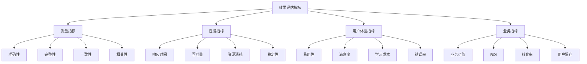
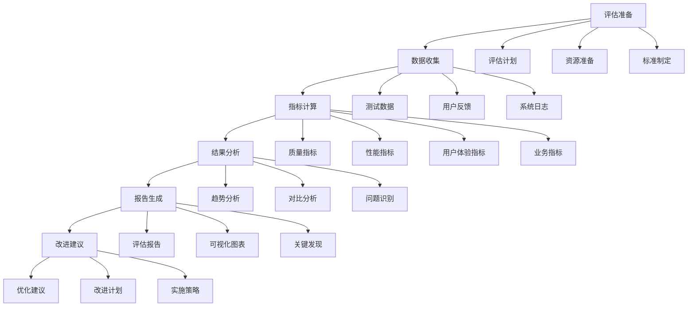

# 效果评估指标

## 🎯 核心定义

### 什么是效果评估指标？
效果评估指标是指用于衡量和评估提示词性能、质量和效果的一系列量化指标和评估标准，通过系统化的指标体系来客观评估提示词的实际表现。

### 核心价值
- **客观评估**：提供客观、量化的评估标准
- **质量保证**：确保提示词质量和效果
- **持续改进**：为优化提供数据支持
- **决策支持**：为决策提供科学依据

## 📊 评估指标体系



## 🔍 核心指标

### 1. 质量指标
| 指标类型 | 指标定义 | 计算方法 | 评估标准 |
|----------|----------|----------|----------|
| **准确性** | 输出结果的正确程度 | 正确结果数/总结果数 | >90%为优秀 |
| **完整性** | 输出结果的完整程度 | 完整结果数/总结果数 | >95%为优秀 |
| **一致性** | 多次输出结果的一致性 | 一致性结果数/总结果数 | >85%为优秀 |
| **相关性** | 输出结果与输入的相关程度 | 相关性评分/总分 | >80%为优秀 |

#### 质量指标模板
```markdown
质量指标评估模板：
请评估提示词质量指标：
- 准确性评估：[准确性测试结果]
- 完整性评估：[完整性测试结果]
- 一致性评估：[一致性测试结果]
- 相关性评估：[相关性测试结果]

评估方法：
- 测试样本：[测试样本数量和质量]
- 评估标准：[评估标准定义]
- 评分方法：[评分方法说明]
- 结果分析：[结果分析方法]

示例：
请评估提示词质量指标：
- 准确性评估：在100个测试样本中，92个结果正确，准确性92%
- 完整性评估：在100个测试样本中，96个结果完整，完整性96%
- 一致性评估：在100个测试样本中，88个结果一致，一致性88%
- 相关性评估：在100个测试样本中，平均相关性评分82分，相关性82%

评估方法：
- 测试样本：使用100个代表性测试样本
- 评估标准：准确性>90%，完整性>95%，一致性>85%，相关性>80%
- 评分方法：专家评分+自动化评分
- 结果分析：统计分析+趋势分析
```

### 2. 性能指标
| 指标类型 | 指标定义 | 计算方法 | 评估标准 |
|----------|----------|----------|----------|
| **响应时间** | 从输入到输出的时间 | 平均响应时间 | <2秒为优秀 |
| **吞吐量** | 单位时间处理请求数 | 请求数/时间 | >100/分钟为优秀 |
| **资源消耗** | CPU、内存等资源使用 | 资源使用率 | <80%为优秀 |
| **稳定性** | 系统稳定运行程度 | 正常运行时间/总时间 | >99%为优秀 |

#### 性能指标模板
```markdown
性能指标评估模板：
请评估提示词性能指标：
- 响应时间：[响应时间测试结果]
- 吞吐量：[吞吐量测试结果]
- 资源消耗：[资源消耗测试结果]
- 稳定性：[稳定性测试结果]

测试方法：
- 负载测试：[负载测试方法]
- 压力测试：[压力测试方法]
- 稳定性测试：[稳定性测试方法]
- 资源监控：[资源监控方法]

示例：
请评估提示词性能指标：
- 响应时间：平均响应时间1.5秒，95%请求在2秒内完成
- 吞吐量：每分钟处理120个请求，峰值150个请求
- 资源消耗：CPU使用率65%，内存使用率70%
- 稳定性：7x24小时运行，可用性99.5%

测试方法：
- 负载测试：模拟正常负载进行测试
- 压力测试：逐步增加负载直到系统极限
- 稳定性测试：长时间运行测试系统稳定性
- 资源监控：实时监控系统资源使用情况
```

### 3. 用户体验指标
| 指标类型 | 指标定义 | 计算方法 | 评估标准 |
|----------|----------|----------|----------|
| **易用性** | 用户使用提示词的容易程度 | 易用性评分/总分 | >8分为优秀 |
| **满意度** | 用户对提示词的满意程度 | 满意度评分/总分 | >8分为优秀 |
| **学习成本** | 用户学习使用提示词的成本 | 学习时间/标准时间 | <1.5倍为优秀 |
| **错误率** | 用户使用过程中的错误率 | 错误次数/总使用次数 | <5%为优秀 |

#### 用户体验指标模板
```markdown
用户体验指标评估模板：
请评估提示词用户体验指标：
- 易用性：[易用性测试结果]
- 满意度：[满意度测试结果]
- 学习成本：[学习成本测试结果]
- 错误率：[错误率测试结果]

测试方法：
- 用户测试：[用户测试方法]
- 问卷调查：[问卷调查方法]
- 行为分析：[行为分析方法]
- 反馈收集：[反馈收集方法]

示例：
请评估提示词用户体验指标：
- 易用性：用户易用性评分8.2分（满分10分）
- 满意度：用户满意度评分8.5分（满分10分）
- 学习成本：平均学习时间1.2小时，为标准时间的1.2倍
- 错误率：用户错误率3.5%，低于5%的标准

测试方法：
- 用户测试：邀请20名用户进行实际使用测试
- 问卷调查：收集用户使用体验和反馈
- 行为分析：分析用户使用行为和模式
- 反馈收集：收集用户意见和建议
```

### 4. 业务指标
| 指标类型 | 指标定义 | 计算方法 | 评估标准 |
|----------|----------|----------|----------|
| **业务价值** | 提示词对业务的价值贡献 | 价值量化评估 | 正向价值为优秀 |
| **ROI** | 投资回报率 | (收益-成本)/成本 | >200%为优秀 |
| **转化率** | 用户转化率 | 转化用户数/总用户数 | >15%为优秀 |
| **用户留存** | 用户留存率 | 留存用户数/总用户数 | >80%为优秀 |

#### 业务指标模板
```markdown
业务指标评估模板：
请评估提示词业务指标：
- 业务价值：[业务价值评估结果]
- ROI：[ROI计算结果]
- 转化率：[转化率统计结果]
- 用户留存：[用户留存统计结果]

评估方法：
- 价值分析：[价值分析方法]
- 成本分析：[成本分析方法]
- 收益分析：[收益分析方法]
- 趋势分析：[趋势分析方法]

示例：
请评估提示词业务指标：
- 业务价值：提高工作效率30%，减少错误率50%
- ROI：投资回报率250%，超过200%的优秀标准
- 转化率：用户转化率18%，超过15%的优秀标准
- 用户留存：30天用户留存率85%，超过80%的优秀标准

评估方法：
- 价值分析：量化分析提示词对业务的价值贡献
- 成本分析：分析提示词开发和维护成本
- 收益分析：分析提示词带来的收益和效益
- 趋势分析：分析指标变化趋势和预测
```

## 🛠️ 评估方法

### 方法1：自动化评估
```markdown
模板：
请设计自动化评估方案：
- 评估工具：[评估工具选择]
- 评估流程：[评估流程设计]
- 评估标准：[评估标准定义]
- 结果输出：[结果输出格式]

实现策略：
- 工具集成：[工具集成策略]
- 流程自动化：[流程自动化策略]
- 标准统一：[标准统一策略]
- 结果可视化：[结果可视化策略]

示例：
请设计自动化评估方案：
- 评估工具：使用自动化测试工具和评估框架
- 评估流程：数据准备→测试执行→结果分析→报告生成
- 评估标准：定义统一的评估标准和阈值
- 结果输出：生成详细的评估报告和可视化图表

实现策略：
- 工具集成：集成多种评估工具和平台
- 流程自动化：实现评估流程的自动化执行
- 标准统一：建立统一的评估标准和规范
- 结果可视化：实现评估结果的可视化展示
```

### 方法2：人工评估
```markdown
模板：
请设计人工评估方案：
- 评估人员：[评估人员选择]
- 评估标准：[评估标准定义]
- 评估流程：[评估流程设计]
- 质量控制：[质量控制机制]

实施策略：
- 人员培训：[人员培训策略]
- 标准制定：[标准制定策略]
- 流程优化：[流程优化策略]
- 质量保证：[质量保证策略]

示例：
请设计人工评估方案：
- 评估人员：选择有经验的专家和用户代表
- 评估标准：制定详细的评估标准和评分规则
- 评估流程：设计标准化的评估流程和操作指南
- 质量控制：建立评估质量控制和验证机制

实施策略：
- 人员培训：培训评估人员，确保评估质量
- 标准制定：制定详细的评估标准和操作规范
- 流程优化：持续优化评估流程，提高效率
- 质量保证：建立质量保证和验证机制
```

### 方法3：混合评估
```markdown
模板：
请设计混合评估方案：
- 自动化部分：[自动化评估部分]
- 人工部分：[人工评估部分]
- 融合策略：[融合策略设计]
- 质量控制：[质量控制机制]

实施策略：
- 分工明确：[分工明确策略]
- 结果融合：[结果融合策略]
- 质量保证：[质量保证策略]
- 持续优化：[持续优化策略]

示例：
请设计混合评估方案：
- 自动化部分：性能指标、基础质量指标
- 人工部分：用户体验指标、业务价值指标
- 融合策略：自动化结果作为基础，人工评估作为补充
- 质量控制：建立多层次的质量控制机制

实施策略：
- 分工明确：明确自动化和人工评估的分工
- 结果融合：设计结果融合算法和策略
- 质量保证：建立质量保证和验证机制
- 持续优化：持续优化评估方法和流程
```

## 📈 评估流程

### 流程设计


### 实施步骤
```markdown
评估实施步骤：
1. 评估准备
   - 制定评估计划
   - 准备评估资源
   - 制定评估标准

2. 数据收集
   - 收集测试数据
   - 收集用户反馈
   - 收集系统日志

3. 指标计算
   - 计算质量指标
   - 计算性能指标
   - 计算用户体验指标
   - 计算业务指标

4. 结果分析
   - 进行趋势分析
   - 进行对比分析
   - 识别问题和机会

5. 报告生成
   - 生成评估报告
   - 创建可视化图表
   - 总结关键发现

6. 改进建议
   - 提出优化建议
   - 制定改进计划
   - 设计实施策略
```

## 🎯 优化策略

### 策略1：指标体系优化
```markdown
优化策略：
1. 指标完善：完善指标体系，覆盖所有重要方面
2. 标准优化：优化评估标准，提高评估准确性
3. 方法改进：改进评估方法，提高评估效率
4. 工具升级：升级评估工具，提高评估质量
5. 流程优化：优化评估流程，提高评估效果

实施方法：
- 定期审查和更新指标体系
- 优化评估标准和阈值设定
- 改进评估方法和工具
- 升级评估工具和技术
- 优化评估流程和操作
```

### 策略2：评估效率优化
```markdown
优化策略：
1. 自动化提升：提高评估自动化程度
2. 流程简化：简化评估流程，提高效率
3. 工具优化：优化评估工具，提高性能
4. 资源优化：优化评估资源，提高利用率
5. 质量保证：保证评估质量，提高准确性

实施方法：
- 实现更多评估环节的自动化
- 简化评估流程，减少不必要的环节
- 优化评估工具的性能和功能
- 合理配置和利用评估资源
- 建立质量保证和验证机制
```

### 策略3：结果应用优化
```markdown
优化策略：
1. 结果可视化：实现评估结果的可视化展示
2. 决策支持：为决策提供更好的数据支持
3. 改进指导：为改进提供更具体的指导
4. 趋势预测：实现趋势预测和预警
5. 持续优化：建立持续优化机制

实施方法：
- 开发可视化工具和仪表板
- 建立决策支持系统和工具
- 提供具体的改进建议和指导
- 实现趋势分析和预测功能
- 建立持续优化和改进机制
```

## ⚠️ 常见问题

### 问题1：指标不全面
**表现**：评估指标覆盖不全面，遗漏重要方面
**解决**：完善指标体系，增加重要指标
**方法**：定期审查和更新指标体系

### 问题2：评估标准不统一
**表现**：不同评估使用不同标准，结果不可比
**解决**：统一评估标准，建立标准规范
**方法**：制定统一的评估标准和操作规范

### 问题3：评估结果不准确
**表现**：评估结果与实际效果不符
**解决**：改进评估方法，提高评估准确性
**方法**：优化评估算法和验证机制

## 🎓 学习要点

### 核心理解
- 评估指标是提示词质量的重要保障
- 多维度评估确保全面了解提示词效果
- 自动化评估提高评估效率和准确性
- 持续优化评估体系是必要的

### 实践建议
- 建立完善的评估指标体系
- 实现自动化和人工评估的结合
- 建立持续优化和改进机制
- 注重评估结果的应用和反馈

## 🔗 相关链接
- [[04-2-2-AB测试方法]] - 学习AB测试方法
- [[04-2-3-质量保证流程]] - 学习质量保证流程
- [[04-2-4-持续优化策略]] - 学习持续优化策略
- [[05-1-4-质量管控体系]] - 学习质量管控体系
