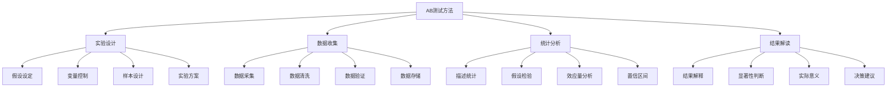
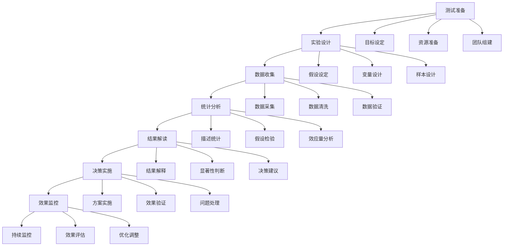

# AB测试方法

## 🎯 核心定义

### 什么是AB测试？
AB测试是一种科学的实验方法，通过对比不同版本的提示词效果，确定哪个版本表现更好，为提示词优化提供数据支持。

### 核心价值
- **科学决策**：基于数据做出优化决策
- **风险控制**：降低优化风险，确保稳定性
- **效果验证**：验证优化效果，避免主观判断
- **持续改进**：建立持续优化的数据驱动机制

## 📊 AB测试框架



## 🔍 测试要素

### 1. 实验设计
| 设计要素 | 设计内容 | 实现方法 | 质量保证 |
|----------|----------|----------|----------|
| **假设设定** | 明确测试假设和目标 | 假设陈述 | 确保假设可验证 |
| **变量控制** | 控制无关变量，确保实验有效性 | 变量隔离 | 确保实验内部有效性 |
| **样本设计** | 确定样本大小和分配方式 | 统计功效分析 | 确保统计功效 |
| **实验方案** | 制定详细的实验执行方案 | 方案文档化 | 确保实验可重复 |

#### 实验设计模板
```markdown
AB测试实验设计模板：
请设计AB测试实验：
- 测试目标：[测试目标说明]
- 测试假设：[测试假设陈述]
- 变量设计：[自变量和因变量设计]
- 样本设计：[样本大小和分配方式]

实验方案：
- 实验组：[实验组设计]
- 对照组：[对照组设计]
- 测试周期：[测试时间安排]
- 成功指标：[成功指标定义]

示例：
请设计AB测试实验：
- 测试目标：测试新版本提示词是否提高用户满意度
- 测试假设：新版本提示词能显著提高用户满意度
- 变量设计：自变量（提示词版本），因变量（用户满意度）
- 样本设计：每组1000个用户，随机分配

实验方案：
- 实验组：使用新版本提示词
- 对照组：使用原版本提示词
- 测试周期：连续测试2周
- 成功指标：用户满意度评分提高0.5分以上
```

### 2. 数据收集
| 收集阶段 | 收集内容 | 收集方法 | 质量保证 |
|----------|----------|----------|----------|
| **数据采集** | 收集实验数据 | 自动化采集 | 确保数据完整性 |
| **数据清洗** | 清洗和预处理数据 | 数据清洗算法 | 确保数据质量 |
| **数据验证** | 验证数据有效性 | 数据验证规则 | 确保数据准确性 |
| **数据存储** | 存储和管理数据 | 数据管理系统 | 确保数据安全 |

#### 数据收集模板
```markdown
数据收集模板：
请设计数据收集方案：
- 数据源：[数据来源说明]
- 采集方法：[数据采集方法]
- 数据格式：[数据格式要求]
- 存储方案：[数据存储方案]

质量控制：
- 数据验证：[数据验证规则]
- 异常处理：[异常数据处理]
- 备份策略：[数据备份策略]
- 安全保护：[数据安全保护]

示例：
请设计数据收集方案：
- 数据源：用户交互数据、系统日志、用户反馈
- 采集方法：实时采集、批量采集、API接口
- 数据格式：JSON格式，包含时间戳、用户ID、交互数据
- 存储方案：分布式数据库，支持高并发访问

质量控制：
- 数据验证：检查数据完整性、格式正确性
- 异常处理：识别和处理异常数据
- 备份策略：每日备份，保留30天历史数据
- 安全保护：数据加密、访问控制、审计日志
```

### 3. 统计分析
| 分析类型 | 分析内容 | 分析方法 | 结果解释 |
|----------|----------|----------|----------|
| **描述统计** | 数据基本特征描述 | 均值、标准差、分布 | 了解数据特征 |
| **假设检验** | 检验统计假设 | t检验、卡方检验 | 判断显著性 |
| **效应量分析** | 分析实际效应大小 | Cohen's d、效应量 | 评估实际意义 |
| **置信区间** | 估计参数置信区间 | 置信区间计算 | 评估估计精度 |

#### 统计分析模板
```markdown
统计分析模板：
请设计统计分析方案：
- 描述统计：[描述统计方法]
- 假设检验：[假设检验方法]
- 效应量分析：[效应量分析方法]
- 置信区间：[置信区间计算方法]

分析流程：
- 数据探索：[数据探索分析]
- 假设检验：[假设检验执行]
- 效应量计算：[效应量计算]
- 结果解释：[结果解释方法]

示例：
请设计统计分析方案：
- 描述统计：计算均值、标准差、分布特征
- 假设检验：使用t检验比较两组均值差异
- 效应量分析：计算Cohen's d评估效应大小
- 置信区间：计算95%置信区间

分析流程：
- 数据探索：探索数据分布、异常值、缺失值
- 假设检验：执行t检验，判断显著性
- 效应量计算：计算效应量，评估实际意义
- 结果解释：解释统计结果和实际意义
```

### 4. 结果解读
| 解读维度 | 解读内容 | 解读方法 | 决策支持 |
|----------|----------|----------|----------|
| **结果解释** | 解释统计结果含义 | 结果解释框架 | 理解结果意义 |
| **显著性判断** | 判断结果是否显著 | 显著性水平设定 | 判断统计意义 |
| **实际意义** | 评估实际业务意义 | 业务价值评估 | 评估实际价值 |
| **决策建议** | 提供决策建议 | 决策框架 | 支持决策制定 |

#### 结果解读模板
```markdown
结果解读模板：
请解读AB测试结果：
- 统计结果：[统计结果描述]
- 显著性判断：[显著性判断结果]
- 效应量评估：[效应量评估结果]
- 置信区间：[置信区间结果]

解读分析：
- 结果解释：[结果解释说明]
- 实际意义：[实际意义评估]
- 风险评估：[风险评估分析]
- 决策建议：[决策建议提供]

示例：
请解读AB测试结果：
- 统计结果：实验组满意度8.2分，对照组7.8分，差异0.4分
- 显著性判断：p=0.03，在0.05水平上显著
- 效应量评估：Cohen's d=0.3，中等效应
- 置信区间：95%置信区间[0.1, 0.7]

解读分析：
- 结果解释：新版本提示词显著提高用户满意度
- 实际意义：满意度提高0.4分，具有实际业务价值
- 风险评估：风险较低，可以推广使用
- 决策建议：建议推广新版本提示词
```

## 🛠️ 实践技巧

### 技巧1：实验设计优化
```markdown
模板：
请优化AB测试实验设计：
- 当前设计：[当前实验设计]
- 优化目标：[优化目标说明]
- 优化策略：[优化策略选择]
- 预期效果：[预期优化效果]

优化方法：
- 样本优化：[样本大小优化]
- 变量优化：[变量控制优化]
- 周期优化：[测试周期优化]
- 指标优化：[成功指标优化]

示例：
请优化AB测试实验设计：
- 当前设计：每组500个用户，测试1周
- 优化目标：提高统计功效，减少测试时间
- 优化策略：增加样本大小，优化测试指标
- 预期效果：统计功效从80%提高到90%

优化方法：
- 样本优化：将样本大小增加到1000个用户
- 变量优化：严格控制无关变量，确保实验有效性
- 周期优化：保持1周测试周期，但增加数据收集频率
- 指标优化：使用更敏感的成功指标
```

### 技巧2：数据质量保证
```markdown
模板：
请设计数据质量保证方案：
- 数据源：[数据源说明]
- 质量要求：[质量要求定义]
- 检查方法：[检查方法选择]
- 处理策略：[处理策略设计]

质量保证：
- 实时监控：[实时监控机制]
- 异常检测：[异常检测方法]
- 数据修复：[数据修复策略]
- 质量报告：[质量报告生成]

示例：
请设计数据质量保证方案：
- 数据源：用户交互数据、系统日志、用户反馈
- 质量要求：完整性>99%，准确性>95%，及时性<1小时
- 检查方法：自动化检查+人工抽检
- 处理策略：自动修复+人工干预

质量保证：
- 实时监控：实时监控数据质量指标
- 异常检测：自动检测数据异常和问题
- 数据修复：自动修复常见问题，人工处理复杂问题
- 质量报告：每日生成数据质量报告
```

### 技巧3：结果应用优化
```markdown
模板：
请设计结果应用优化方案：
- 结果类型：[结果类型说明]
- 应用场景：[应用场景定义]
- 应用策略：[应用策略选择]
- 效果评估：[效果评估方法]

应用优化：
- 结果可视化：[结果可视化设计]
- 决策支持：[决策支持系统]
- 实施指导：[实施指导提供]
- 持续监控：[持续监控机制]

示例：
请设计结果应用优化方案：
- 结果类型：AB测试结果、用户满意度提升
- 应用场景：提示词优化、产品改进、用户体验提升
- 应用策略：渐进式推广、A/B测试验证、持续优化
- 效果评估：用户反馈、业务指标、系统性能

应用优化：
- 结果可视化：创建交互式仪表板展示结果
- 决策支持：提供决策建议和实施计划
- 实施指导：提供详细的实施步骤和注意事项
- 持续监控：建立持续监控和反馈机制
```

## 📈 测试流程

### 流程设计


### 实施步骤
```markdown
AB测试实施步骤：
1. 测试准备
   - 明确测试目标和假设
   - 准备测试资源和工具
   - 组建测试团队

2. 实验设计
   - 设定测试假设
   - 设计变量和样本
   - 制定实验方案

3. 数据收集
   - 设置数据采集系统
   - 执行数据收集
   - 进行数据质量控制

4. 统计分析
   - 进行描述统计分析
   - 执行假设检验
   - 计算效应量和置信区间

5. 结果解读
   - 解释统计结果
   - 判断显著性
   - 评估实际意义

6. 决策实施
   - 制定实施计划
   - 执行决策方案
   - 验证实施效果

7. 效果监控
   - 持续监控效果
   - 评估实施结果
   - 进行优化调整
```

## 🎯 优化策略

### 策略1：实验设计优化
```markdown
优化策略：
1. 假设优化：优化测试假设，提高假设质量
2. 变量优化：优化变量设计，提高实验有效性
3. 样本优化：优化样本设计，提高统计功效
4. 方案优化：优化实验方案，提高实验效率
5. 工具优化：优化实验工具，提高实验质量

实施方法：
- 改进假设设定方法和标准
- 优化变量控制和测量方法
- 改进样本大小计算和分配方法
- 优化实验方案设计和执行
- 升级实验工具和技术平台
```

### 策略2：数据分析优化
```markdown
优化策略：
1. 方法优化：优化统计分析方法
2. 工具优化：优化分析工具和平台
3. 流程优化：优化分析流程和步骤
4. 质量优化：优化分析质量控制
5. 效率优化：优化分析效率和速度

实施方法：
- 采用更先进的统计分析方法
- 升级分析工具和技术平台
- 简化分析流程，提高效率
- 加强分析质量控制和验证
- 实现分析自动化和智能化
```

### 策略3：结果应用优化
```markdown
优化策略：
1. 可视化优化：优化结果可视化展示
2. 解释优化：优化结果解释和说明
3. 决策优化：优化决策支持和建议
4. 实施优化：优化实施指导和执行
5. 监控优化：优化效果监控和评估

实施方法：
- 开发更好的可视化工具和界面
- 改进结果解释框架和方法
- 建立决策支持系统和工具
- 提供更详细的实施指导
- 建立持续监控和评估机制
```

## ⚠️ 常见问题

### 问题1：样本不足
**表现**：样本大小不足，统计功效低
**解决**：增加样本大小，提高统计功效
**方法**：使用统计功效分析确定合适样本大小

### 问题2：变量控制不当
**表现**：无关变量影响实验结果
**解决**：加强变量控制，确保实验有效性
**方法**：使用随机化和匹配方法控制变量

### 问题3：结果解释错误
**表现**：错误解释统计结果
**解决**：提高统计素养，正确解释结果
**方法**：建立结果解释标准和培训

## 🎓 学习要点

### 核心理解
- AB测试是科学决策的重要工具
- 实验设计是AB测试成功的关键
- 统计分析是AB测试的核心
- 结果应用是AB测试的最终目标

### 实践建议
- 掌握AB测试的基本原理和方法
- 注重实验设计的科学性和有效性
- 建立完善的数据收集和分析体系
- 提高结果解释和应用能力

## 🔗 相关链接
- [[04-2-1-效果评估指标]] - 学习效果评估指标
- [[04-2-3-质量保证流程]] - 学习质量保证流程
- [[04-2-4-持续优化策略]] - 学习持续优化策略
- [[05-1-1-提示词工程流程]] - 学习工程化流程
