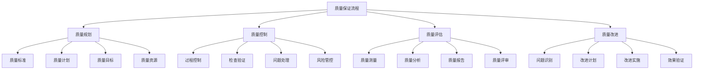
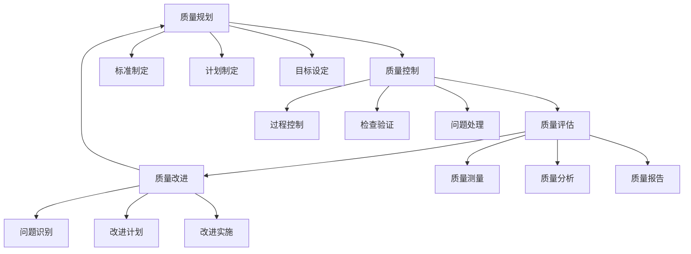

# 质量保证流程

## 🎯 核心定义

### 什么是质量保证流程？
质量保证流程是指为确保提示词质量而建立的一套系统化、标准化的流程体系，通过全生命周期的质量控制，确保提示词达到预期的质量标准。

### 核心价值
- **质量保障**：确保提示词质量和效果
- **风险控制**：降低质量风险，提高稳定性
- **标准化**：建立统一的质量标准
- **持续改进**：建立持续优化的质量机制

## 📊 质量保证框架



## 🔍 流程要素

### 1. 质量规划
| 规划要素 | 规划内容 | 实现方法 | 质量保证 |
|----------|----------|----------|----------|
| **质量标准** | 定义质量标准和规范 | 标准制定 | 确保标准明确 |
| **质量计划** | 制定质量保证计划 | 计划制定 | 确保计划完整 |
| **质量目标** | 设定质量目标和指标 | 目标设定 | 确保目标可测 |
| **质量资源** | 配置质量保证资源 | 资源分配 | 确保资源充足 |

#### 质量规划模板
```markdown
质量规划模板：
请制定质量保证规划：
- 质量标准：[质量标准定义]
- 质量计划：[质量计划制定]
- 质量目标：[质量目标设定]
- 质量资源：[质量资源配置]

规划要素：
- 质量范围：[质量保证范围]
- 质量责任：[质量责任分配]
- 质量时间：[质量时间安排]
- 质量成本：[质量成本预算]

示例：
请制定质量保证规划：
- 质量标准：准确性>95%，完整性>98%，一致性>90%
- 质量计划：设计阶段质量检查，开发阶段质量控制，测试阶段质量验证
- 质量目标：零重大缺陷，用户满意度>8.5分
- 质量资源：质量工程师2名，测试人员3名，工具和平台

规划要素：
- 质量范围：覆盖提示词设计、开发、测试、部署全生命周期
- 质量责任：质量工程师负责质量规划，开发人员负责质量控制
- 质量时间：每个阶段都有质量检查点，总质量时间占比20%
- 质量成本：质量保证成本占总项目成本的15%
```

### 2. 质量控制
| 控制环节 | 控制内容 | 控制方法 | 效果验证 |
|----------|----------|----------|----------|
| **过程控制** | 控制开发过程质量 | 过程监控 | 确保过程合规 |
| **检查验证** | 检查验证产品质量 | 检查验证 | 确保产品合格 |
| **问题处理** | 处理质量问题 | 问题管理 | 确保问题解决 |
| **风险管控** | 管控质量风险 | 风险管理 | 确保风险可控 |

#### 质量控制模板
```markdown
质量控制模板：
请设计质量控制方案：
- 过程控制：[过程控制方法]
- 检查验证：[检查验证方法]
- 问题处理：[问题处理方法]
- 风险管控：[风险管控方法]

控制机制：
- 控制点：[质量控制点设置]
- 控制方法：[控制方法选择]
- 控制标准：[控制标准定义]
- 控制频率：[控制频率设定]

示例：
请设计质量控制方案：
- 过程控制：使用代码审查、同行评审、过程审计
- 检查验证：使用自动化测试、人工测试、用户验收测试
- 问题处理：建立问题跟踪系统，分级处理，及时解决
- 风险管控：识别质量风险，制定应对措施，持续监控

控制机制：
- 控制点：需求分析、设计评审、代码审查、测试验证、发布检查
- 控制方法：检查清单、评审会议、测试用例、质量度量
- 控制标准：基于质量标准的检查标准
- 控制频率：每日检查、每周评审、每月审计
```

### 3. 质量评估
| 评估类型 | 评估内容 | 评估方法 | 结果应用 |
|----------|----------|----------|----------|
| **质量测量** | 测量质量指标 | 质量度量 | 了解质量现状 |
| **质量分析** | 分析质量问题 | 质量分析 | 识别质量趋势 |
| **质量报告** | 生成质量报告 | 报告生成 | 提供质量信息 |
| **质量评审** | 评审质量结果 | 质量评审 | 确认质量状态 |

#### 质量评估模板
```markdown
质量评估模板：
请设计质量评估方案：
- 质量测量：[质量测量方法]
- 质量分析：[质量分析方法]
- 质量报告：[质量报告生成]
- 质量评审：[质量评审方法]

评估流程：
- 数据收集：[质量数据收集]
- 数据分析：[质量数据分析]
- 结果生成：[评估结果生成]
- 结果应用：[评估结果应用]

示例：
请设计质量评估方案：
- 质量测量：使用质量度量工具测量准确性、完整性、一致性
- 质量分析：使用统计分析、趋势分析、根因分析
- 质量报告：生成质量报告，包含质量指标、问题分析、改进建议
- 质量评审：定期进行质量评审，确认质量状态和改进方向

评估流程：
- 数据收集：收集质量数据、用户反馈、测试结果
- 数据分析：分析质量趋势、问题模式、改进机会
- 结果生成：生成质量评估报告和改进建议
- 结果应用：将评估结果应用于质量改进和决策制定
```

### 4. 质量改进
| 改进阶段 | 改进内容 | 改进方法 | 效果验证 |
|----------|----------|----------|----------|
| **问题识别** | 识别质量问题 | 问题识别 | 确保问题发现 |
| **改进计划** | 制定改进计划 | 计划制定 | 确保计划可行 |
| **改进实施** | 实施改进措施 | 改进实施 | 确保措施有效 |
| **效果验证** | 验证改进效果 | 效果验证 | 确保改进成功 |

#### 质量改进模板
```markdown
质量改进模板：
请设计质量改进方案：
- 问题识别：[问题识别方法]
- 改进计划：[改进计划制定]
- 改进实施：[改进实施方法]
- 效果验证：[效果验证方法]

改进流程：
- 问题分析：[问题分析过程]
- 方案设计：[改进方案设计]
- 方案实施：[方案实施过程]
- 效果评估：[效果评估过程]

示例：
请设计质量改进方案：
- 问题识别：通过质量评估、用户反馈、测试结果识别问题
- 改进计划：制定改进计划，包括改进目标、措施、时间、资源
- 改进实施：按照计划实施改进措施，监控实施过程
- 效果验证：验证改进效果，确认问题解决和改进目标达成

改进流程：
- 问题分析：分析问题原因、影响范围、改进机会
- 方案设计：设计改进方案，包括技术方案、管理方案
- 方案实施：实施改进方案，监控实施进度和效果
- 效果评估：评估改进效果，确认改进成功和持续改进
```

## 🛠️ 实践技巧

### 技巧1：质量标准制定
```markdown
模板：
请制定质量标准：
- 质量维度：[质量维度定义]
- 质量指标：[质量指标设定]
- 质量阈值：[质量阈值设定]
- 质量方法：[质量方法选择]

标准要素：
- 可测量性：[指标可测量性]
- 可达成性：[目标可达成性]
- 相关性：[指标相关性]
- 时效性：[标准时效性]

示例：
请制定质量标准：
- 质量维度：功能性、可靠性、易用性、性能、安全性
- 质量指标：准确性、完整性、一致性、响应时间、错误率
- 质量阈值：准确性>95%，完整性>98%，一致性>90%，响应时间<2秒
- 质量方法：自动化测试、人工测试、用户验收测试

标准要素：
- 可测量性：所有指标都可以量化测量
- 可达成性：质量标准在现有条件下可以达成
- 相关性：指标与业务目标高度相关
- 时效性：标准定期更新，保持时效性
```

### 技巧2：质量控制实施
```markdown
模板：
请设计质量控制实施：
- 控制策略：[控制策略选择]
- 控制工具：[控制工具选择]
- 控制流程：[控制流程设计]
- 控制人员：[控制人员配置]

实施要素：
- 控制时机：[控制时机选择]
- 控制频率：[控制频率设定]
- 控制深度：[控制深度设定]
- 控制反馈：[控制反馈机制]

示例：
请设计质量控制实施：
- 控制策略：预防性控制+检测性控制+纠正性控制
- 控制工具：代码审查工具、测试工具、质量度量工具
- 控制流程：设计评审→代码审查→测试验证→发布检查
- 控制人员：质量工程师、开发人员、测试人员、用户代表

实施要素：
- 控制时机：在关键节点进行质量控制
- 控制频率：每日检查、每周评审、每月审计
- 控制深度：全面控制+重点控制+抽样控制
- 控制反馈：及时反馈控制结果，快速响应问题
```

### 技巧3：质量改进优化
```markdown
模板：
请设计质量改进优化：
- 改进目标：[改进目标设定]
- 改进策略：[改进策略选择]
- 改进措施：[改进措施制定]
- 改进评估：[改进评估方法]

优化要素：
- 改进优先级：[改进优先级设定]
- 改进资源：[改进资源配置]
- 改进时间：[改进时间安排]
- 改进风险：[改进风险评估]

示例：
请设计质量改进优化：
- 改进目标：提高准确性到98%，降低错误率到2%以下
- 改进策略：技术改进+流程改进+人员改进
- 改进措施：优化算法、改进流程、加强培训
- 改进评估：使用质量指标评估改进效果

优化要素：
- 改进优先级：优先解决影响用户的关键问题
- 改进资源：合理配置技术、人力、时间资源
- 改进时间：制定改进时间表，分阶段实施
- 改进风险：评估改进风险，制定应对措施
```

## 📈 流程实施

### 实施流程


### 实施步骤
```markdown
质量保证流程实施步骤：
1. 质量规划
   - 制定质量标准
   - 制定质量计划
   - 设定质量目标
   - 配置质量资源

2. 质量控制
   - 实施过程控制
   - 进行检查验证
   - 处理质量问题
   - 管控质量风险

3. 质量评估
   - 进行质量测量
   - 进行质量分析
   - 生成质量报告
   - 进行质量评审

4. 质量改进
   - 识别质量问题
   - 制定改进计划
   - 实施改进措施
   - 验证改进效果
```

## 🎯 优化策略

### 策略1：流程优化
```markdown
优化策略：
1. 流程简化：简化质量保证流程，提高效率
2. 自动化提升：提高质量保证自动化程度
3. 标准化改进：改进质量标准和规范
4. 工具升级：升级质量保证工具和技术
5. 人员培训：加强质量保证人员培训

实施方法：
- 简化流程步骤，减少不必要的环节
- 实现质量保证的自动化和智能化
- 更新和完善质量标准和规范
- 升级质量保证工具和技术平台
- 加强质量保证人员的技能培训
```

### 策略2：质量控制优化
```markdown
优化策略：
1. 控制点优化：优化质量控制点设置
2. 控制方法优化：优化质量控制方法
3. 控制频率优化：优化质量控制频率
4. 控制效果优化：优化质量控制效果
5. 控制成本优化：优化质量控制成本

实施方法：
- 重新设计质量控制点，提高控制效果
- 改进质量控制方法，提高控制效率
- 调整质量控制频率，平衡效果和成本
- 优化质量控制效果，提高质量水平
- 降低质量控制成本，提高成本效益
```

### 策略3：质量改进优化
```markdown
优化策略：
1. 改进速度优化：提高质量改进速度
2. 改进效果优化：提高质量改进效果
3. 改进成本优化：降低质量改进成本
4. 改进持续性优化：提高质量改进持续性
5. 改进创新性优化：提高质量改进创新性

实施方法：
- 加快质量改进速度，快速响应质量问题
- 提高质量改进效果，确保改进目标达成
- 降低质量改进成本，提高成本效益
- 建立持续改进机制，保持改进动力
- 鼓励质量改进创新，探索新的改进方法
```

## ⚠️ 常见问题

### 问题1：质量标准不明确
**表现**：质量标准定义不清晰，难以执行
**解决**：明确质量标准，制定详细规范
**方法**：建立标准制定和更新机制

### 问题2：质量控制不到位
**表现**：质量控制执行不严格，效果不佳
**解决**：加强质量控制，提高执行力度
**方法**：建立质量控制监督和考核机制

### 问题3：质量改进不及时
**表现**：质量问题发现后改进不及时
**解决**：建立快速响应机制，及时改进
**方法**：建立问题跟踪和改进机制

## 🎓 学习要点

### 核心理解
- 质量保证是提示词工程的重要保障
- 全生命周期质量保证确保质量稳定
- 持续改进是质量保证的核心
- 标准化和自动化提高质量保证效率

### 实践建议
- 建立完善的质量保证体系
- 实现质量保证的标准化和自动化
- 建立持续改进机制
- 加强质量保证人员培训

## 🔗 相关链接
- [[04-2-1-效果评估指标]] - 学习效果评估指标
- [[04-2-2-AB测试方法]] - 学习AB测试方法
- [[04-2-4-持续优化策略]] - 学习持续优化策略
- [[05-1-4-质量管控体系]] - 学习质量管控体系
