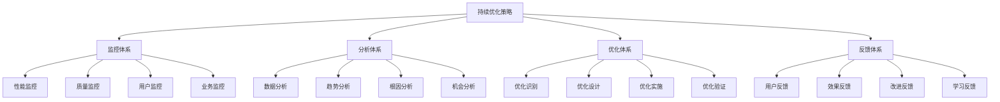
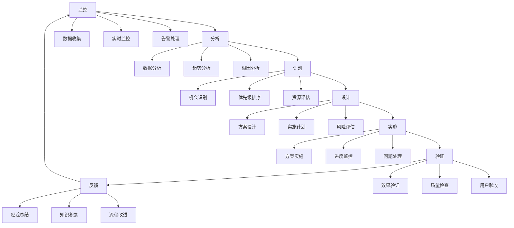

# 持续优化策略

## 🎯 核心定义

### 什么是持续优化策略？
持续优化策略是指建立一套系统化、数据驱动的优化机制，通过持续监控、分析、改进，不断提升提示词的质量、性能和效果。

### 核心价值
- **持续改进**：建立持续改进的机制和文化
- **数据驱动**：基于数据做出优化决策
- **效果提升**：不断提升提示词效果
- **竞争优势**：保持技术领先和竞争优势

## 📊 持续优化框架



## 🔍 优化要素

### 1. 监控体系
| 监控维度 | 监控内容 | 监控方法 | 监控频率 |
|----------|----------|----------|----------|
| **性能监控** | 响应时间、吞吐量、资源使用 | 实时监控 | 持续监控 |
| **质量监控** | 准确性、完整性、一致性 | 质量检查 | 每日检查 |
| **用户监控** | 用户行为、满意度、反馈 | 用户分析 | 每周分析 |
| **业务监控** | 业务指标、ROI、转化率 | 业务分析 | 每月分析 |

#### 监控体系模板
```markdown
监控体系模板：
请设计持续优化监控体系：
- 性能监控：[性能监控方案]
- 质量监控：[质量监控方案]
- 用户监控：[用户监控方案]
- 业务监控：[业务监控方案]

监控机制：
- 监控工具：[监控工具选择]
- 监控指标：[监控指标定义]
- 监控频率：[监控频率设定]
- 告警机制：[告警机制设计]

示例：
请设计持续优化监控体系：
- 性能监控：监控响应时间、吞吐量、CPU使用率、内存使用率
- 质量监控：监控准确性、完整性、一致性、错误率
- 用户监控：监控用户行为、满意度评分、使用频率、反馈内容
- 业务监控：监控业务指标、ROI、转化率、用户留存率

监控机制：
- 监控工具：使用Prometheus、Grafana、ELK Stack
- 监控指标：定义关键性能指标(KPI)和关键质量指标(KQI)
- 监控频率：实时监控+定期分析
- 告警机制：设置阈值告警，及时通知问题
```

### 2. 分析体系
| 分析类型 | 分析内容 | 分析方法 | 分析频率 |
|----------|----------|----------|----------|
| **数据分析** | 数据统计、分布分析 | 统计分析 | 每日分析 |
| **趋势分析** | 趋势识别、预测分析 | 时间序列分析 | 每周分析 |
| **根因分析** | 问题根因、影响分析 | 根因分析 | 问题发生时 |
| **机会分析** | 优化机会、改进点 | 机会识别 | 每月分析 |

#### 分析体系模板
```markdown
分析体系模板：
请设计持续优化分析体系：
- 数据分析：[数据分析方案]
- 趋势分析：[趋势分析方案]
- 根因分析：[根因分析方案]
- 机会分析：[机会分析方案]

分析机制：
- 分析工具：[分析工具选择]
- 分析方法：[分析方法选择]
- 分析流程：[分析流程设计]
- 分析输出：[分析输出格式]

示例：
请设计持续优化分析体系：
- 数据分析：统计分析用户行为数据、性能数据、质量数据
- 趋势分析：分析性能趋势、质量趋势、用户满意度趋势
- 根因分析：分析问题根因，识别影响因子
- 机会分析：识别优化机会，分析改进潜力

分析机制：
- 分析工具：使用Python、R、Tableau、Power BI
- 分析方法：统计分析、机器学习、数据挖掘
- 分析流程：数据收集→数据清洗→数据分析→结果解释
- 分析输出：分析报告、可视化图表、改进建议
```

### 3. 优化体系
| 优化阶段 | 优化内容 | 优化方法 | 优化频率 |
|----------|----------|----------|----------|
| **优化识别** | 识别优化机会 | 机会识别 | 持续识别 |
| **优化设计** | 设计优化方案 | 方案设计 | 按需设计 |
| **优化实施** | 实施优化措施 | 方案实施 | 按计划实施 |
| **优化验证** | 验证优化效果 | 效果验证 | 实施后验证 |

#### 优化体系模板
```markdown
优化体系模板：
请设计持续优化体系：
- 优化识别：[优化识别方法]
- 优化设计：[优化设计方案]
- 优化实施：[优化实施方法]
- 优化验证：[优化验证方法]

优化机制：
- 优化流程：[优化流程设计]
- 优化工具：[优化工具选择]
- 优化标准：[优化标准定义]
- 优化评估：[优化评估方法]

示例：
请设计持续优化体系：
- 优化识别：通过监控数据、用户反馈、业务分析识别优化机会
- 优化设计：设计优化方案，包括技术方案、实施计划、预期效果
- 优化实施：按照计划实施优化措施，监控实施过程
- 优化验证：验证优化效果，确认优化目标达成

优化机制：
- 优化流程：识别→设计→实施→验证→反馈
- 优化工具：使用A/B测试、性能分析工具、质量评估工具
- 优化标准：定义优化成功标准和评估指标
- 优化评估：使用定量和定性方法评估优化效果
```

### 4. 反馈体系
| 反馈类型 | 反馈内容 | 反馈方法 | 反馈频率 |
|----------|----------|----------|----------|
| **用户反馈** | 用户意见、建议 | 用户调研 | 每月收集 |
| **效果反馈** | 优化效果、性能变化 | 效果评估 | 优化后评估 |
| **改进反馈** | 改进建议、经验总结 | 经验分享 | 持续收集 |
| **学习反馈** | 学习成果、知识积累 | 知识管理 | 持续积累 |

#### 反馈体系模板
```markdown
反馈体系模板：
请设计持续优化反馈体系：
- 用户反馈：[用户反馈收集]
- 效果反馈：[效果反馈收集]
- 改进反馈：[改进反馈收集]
- 学习反馈：[学习反馈收集]

反馈机制：
- 反馈渠道：[反馈渠道设计]
- 反馈处理：[反馈处理方法]
- 反馈应用：[反馈应用方法]
- 反馈跟踪：[反馈跟踪机制]

示例：
请设计持续优化反馈体系：
- 用户反馈：通过用户调研、反馈表单、用户访谈收集用户意见
- 效果反馈：通过效果评估、性能测试、质量检查收集效果反馈
- 改进反馈：通过团队讨论、经验分享、最佳实践收集改进建议
- 学习反馈：通过知识管理、经验总结、培训学习收集学习成果

反馈机制：
- 反馈渠道：建立多渠道反馈收集机制
- 反馈处理：建立反馈处理流程和标准
- 反馈应用：将反馈应用于优化改进
- 反馈跟踪：跟踪反馈处理结果和应用效果
```

## 🛠️ 实践技巧

### 技巧1：监控体系建立
```markdown
模板：
请建立持续优化监控体系：
- 监控目标：[监控目标设定]
- 监控范围：[监控范围定义]
- 监控指标：[监控指标选择]
- 监控工具：[监控工具选择]

建立策略：
- 分阶段实施：[分阶段实施策略]
- 工具集成：[工具集成策略]
- 人员培训：[人员培训策略]
- 持续改进：[持续改进策略]

示例：
请建立持续优化监控体系：
- 监控目标：全面监控提示词性能、质量、用户体验
- 监控范围：覆盖开发、测试、生产全环境
- 监控指标：响应时间、准确率、用户满意度、业务指标
- 监控工具：Prometheus、Grafana、ELK Stack、自定义工具

建立策略：
- 分阶段实施：先建立基础监控，再逐步完善
- 工具集成：集成多种监控工具，形成统一监控平台
- 人员培训：培训监控人员，提高监控能力
- 持续改进：根据监控效果持续改进监控体系
```

### 技巧2：分析体系优化
```markdown
模板：
请优化持续优化分析体系：
- 分析目标：[分析目标设定]
- 分析方法：[分析方法选择]
- 分析工具：[分析工具选择]
- 分析流程：[分析流程优化]

优化策略：
- 方法升级：[分析方法升级]
- 工具升级：[分析工具升级]
- 流程优化：[分析流程优化]
- 能力提升：[分析能力提升]

示例：
请优化持续优化分析体系：
- 分析目标：深度分析数据，识别优化机会
- 分析方法：统计分析、机器学习、数据挖掘
- 分析工具：Python、R、Tableau、Power BI
- 分析流程：数据收集→清洗→分析→解释→应用

优化策略：
- 方法升级：采用更先进的分析方法
- 工具升级：升级分析工具和技术
- 流程优化：简化分析流程，提高效率
- 能力提升：提升分析人员的技能水平
```

### 技巧3：优化体系实施
```markdown
模板：
请实施持续优化体系：
- 实施目标：[实施目标设定]
- 实施计划：[实施计划制定]
- 实施资源：[实施资源配置]
- 实施监控：[实施监控机制]

实施策略：
- 分步实施：[分步实施策略]
- 风险控制：[风险控制策略]
- 质量保证：[质量保证策略]
- 效果验证：[效果验证策略]

示例：
请实施持续优化体系：
- 实施目标：建立完整的持续优化体系
- 实施计划：分3个阶段实施，每阶段3个月
- 实施资源：技术团队5人，预算50万，时间9个月
- 实施监控：建立实施监控机制，定期评估进度

实施策略：
- 分步实施：先建立监控体系，再建立分析体系，最后建立优化体系
- 风险控制：识别实施风险，制定应对措施
- 质量保证：建立质量保证机制，确保实施质量
- 效果验证：验证实施效果，确认目标达成
```

## 📈 优化流程

### 流程设计


### 实施步骤
```markdown
持续优化流程实施步骤：
1. 监控阶段
   - 建立监控体系
   - 收集监控数据
   - 处理监控告警

2. 分析阶段
   - 进行数据分析
   - 识别趋势和模式
   - 分析根因和影响

3. 识别阶段
   - 识别优化机会
   - 评估优化潜力
   - 确定优化优先级

4. 设计阶段
   - 设计优化方案
   - 制定实施计划
   - 评估风险和资源

5. 实施阶段
   - 执行优化方案
   - 监控实施进度
   - 处理实施问题

6. 验证阶段
   - 验证优化效果
   - 检查质量指标
   - 收集用户反馈

7. 反馈阶段
   - 总结优化经验
   - 积累优化知识
   - 改进优化流程
```

## 🎯 优化策略

### 策略1：监控体系优化
```markdown
优化策略：
1. 监控覆盖优化：扩大监控覆盖范围
2. 监控精度优化：提高监控精度和准确性
3. 监控效率优化：提高监控效率和响应速度
4. 监控成本优化：降低监控成本和资源消耗
5. 监控智能化优化：实现监控智能化和自动化

实施方法：
- 扩展监控范围，覆盖更多维度和指标
- 提高监控精度，减少误报和漏报
- 优化监控效率，提高响应速度
- 降低监控成本，提高成本效益
- 实现监控智能化，减少人工干预
```

### 策略2：分析体系优化
```markdown
优化策略：
1. 分析方法优化：采用更先进的分析方法
2. 分析工具优化：升级分析工具和技术
3. 分析效率优化：提高分析效率和速度
4. 分析深度优化：提高分析深度和洞察力
5. 分析应用优化：提高分析结果的应用价值

实施方法：
- 采用机器学习、深度学习等先进分析方法
- 升级分析工具，使用更强大的分析平台
- 优化分析流程，提高分析效率
- 提高分析深度，获得更深层的洞察
- 加强分析结果的应用，提高业务价值
```

### 策略3：优化体系优化
```markdown
优化策略：
1. 优化速度优化：提高优化速度和响应时间
2. 优化效果优化：提高优化效果和质量
3. 优化成本优化：降低优化成本和资源消耗
4. 优化持续性优化：提高优化的持续性
5. 优化创新性优化：提高优化的创新性

实施方法：
- 加快优化速度，快速响应优化需求
- 提高优化效果，确保优化目标达成
- 降低优化成本，提高成本效益
- 建立持续优化机制，保持优化动力
- 鼓励优化创新，探索新的优化方法
```

## ⚠️ 常见问题

### 问题1：监控数据不准确
**表现**：监控数据存在误差，影响分析结果
**解决**：提高监控精度，建立数据验证机制
**方法**：使用多源数据验证，建立数据质量检查

### 问题2：分析深度不够
**表现**：分析结果浅显，缺乏深度洞察
**解决**：提高分析深度，采用更先进的分析方法
**方法**：使用机器学习、深度学习等先进技术

### 问题3：优化效果不明显
**表现**：优化后效果改善不明显
**解决**：改进优化方法，提高优化效果
**方法**：使用A/B测试验证优化效果，持续改进

## 🎓 学习要点

### 核心理解
- 持续优化是提示词工程的核心
- 数据驱动是持续优化的基础
- 监控分析是持续优化的关键
- 反馈学习是持续优化的动力

### 实践建议
- 建立完善的监控分析体系
- 实现数据驱动的优化决策
- 建立持续改进的文化和机制
- 注重优化效果和业务价值

## 🔗 相关链接
- [[04-2-1-效果评估指标]] - 学习效果评估指标
- [[04-2-2-AB测试方法]] - 学习AB测试方法
- [[04-2-3-质量保证流程]] - 学习质量保证流程
- [[05-1-1-提示词工程流程]] - 学习工程化流程
