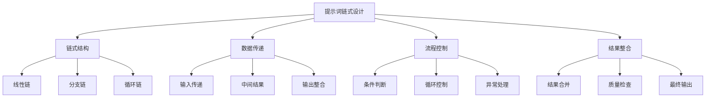
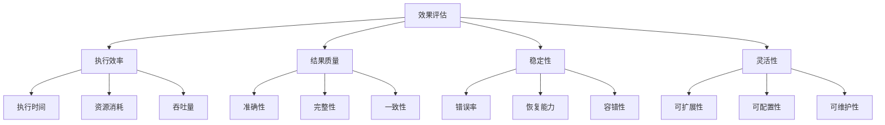

# 提示词链式设计

## 🎯 核心定义

### 什么是提示词链式设计？
提示词链式设计是指将复杂的任务分解为多个相互关联的提示词步骤，通过链式调用和结果传递，实现复杂任务的逐步处理和优化。

### 核心价值
- **任务分解**：将复杂任务分解为可管理的步骤
- **结果传递**：前一步的结果作为后一步的输入
- **逐步优化**：通过多步骤处理提高输出质量
- **灵活控制**：可以动态调整链式流程

## 📊 提示词链式设计框架



## 🔍 设计要素

### 1. 链式结构
| 结构类型 | 设计要点 | 实现方法 | 应用场景 |
|----------|----------|----------|----------|
| **线性链** | 顺序执行，结果传递 | 步骤串联 | 简单流程 |
| **分支链** | 条件分支，并行处理 | 条件判断 | 复杂决策 |
| **循环链** | 重复执行，迭代优化 | 循环控制 | 迭代优化 |

#### 设计模板
```markdown
线性链模板：
请按以下步骤执行任务：
步骤1：[第一个提示词]
步骤2：基于步骤1的结果，[第二个提示词]
步骤3：基于步骤2的结果，[第三个提示词]
...
最终步骤：整合所有结果，[最终提示词]

示例：
请按以下步骤执行任务：
步骤1：分析用户需求，提取关键信息
步骤2：基于需求分析结果，设计解决方案
步骤3：基于解决方案，制定实施计划
步骤4：基于实施计划，评估风险和资源需求
最终步骤：整合所有分析结果，生成完整的项目方案
```

### 2. 数据传递
| 传递类型 | 设计要点 | 实现方法 | 效果保证 |
|----------|----------|----------|----------|
| **输入传递** | 前一步输出作为后一步输入 | 数据连接 | 确保数据连续性 |
| **中间结果** | 保存和处理中间结果 | 结果存储 | 确保结果可用性 |
| **输出整合** | 整合多个步骤的结果 | 结果合并 | 确保输出完整性 |

#### 设计模板
```markdown
数据传递模板：
请设计数据传递机制：
- 输入数据：[输入数据格式]
- 处理步骤：[处理步骤描述]
- 中间结果：[中间结果格式]
- 输出数据：[输出数据格式]
- 传递规则：[传递规则说明]

示例：
请设计数据传递机制：
- 输入数据：用户需求文档（文本格式）
- 处理步骤：需求分析→方案设计→计划制定→风险评估
- 中间结果：需求清单（JSON格式）、方案文档（Markdown格式）
- 输出数据：完整项目方案（结构化文档）
- 传递规则：每步输出作为下一步输入，保留中间结果
```

### 3. 流程控制
| 控制类型 | 设计要点 | 实现方法 | 效果体现 |
|----------|----------|----------|----------|
| **条件判断** | 根据条件选择执行路径 | 条件分支 | 确保逻辑正确 |
| **循环控制** | 重复执行直到满足条件 | 循环机制 | 确保迭代优化 |
| **异常处理** | 处理执行过程中的异常 | 异常捕获 | 确保系统稳定 |

#### 设计模板
```markdown
流程控制模板：
请设计流程控制机制：
- 执行条件：[执行条件设定]
- 分支逻辑：[分支判断逻辑]
- 循环控制：[循环控制条件]
- 异常处理：[异常处理策略]
- 终止条件：[流程终止条件]

示例：
请设计流程控制机制：
- 执行条件：输入数据完整且格式正确
- 分支逻辑：根据需求复杂度选择不同处理路径
- 循环控制：方案质量不达标时重复优化
- 异常处理：数据格式错误时返回错误信息
- 终止条件：输出质量达到预设标准
```

### 4. 结果整合
| 整合类型 | 设计要点 | 实现方法 | 效果保证 |
|----------|----------|----------|----------|
| **结果合并** | 合并多个步骤的结果 | 数据合并 | 确保结果完整 |
| **质量检查** | 检查最终结果质量 | 质量验证 | 确保输出质量 |
| **最终输出** | 生成最终输出结果 | 结果格式化 | 确保输出可用 |

#### 设计模板
```markdown
结果整合模板：
请设计结果整合机制：
- 合并策略：[结果合并方法]
- 质量检查：[质量验证标准]
- 输出格式：[最终输出格式]
- 验证机制：[结果验证方法]
- 优化策略：[结果优化方法]

示例：
请设计结果整合机制：
- 合并策略：按逻辑顺序合并各步骤结果
- 质量检查：检查完整性、准确性、一致性
- 输出格式：结构化文档，包含摘要、详细内容、附录
- 验证机制：自动验证和人工审核相结合
- 优化策略：根据质量检查结果进行优化
```

## 🛠️ 实践技巧

### 技巧1：线性链设计
```markdown
模板：
请设计线性链式流程：
1. [步骤1]：[具体任务]
2. [步骤2]：基于步骤1结果，[具体任务]
3. [步骤3]：基于步骤2结果，[具体任务]
4. [步骤4]：基于步骤3结果，[具体任务]
5. 最终整合：整合所有步骤结果

示例：
请设计线性链式流程：
1. 需求分析：分析用户需求，提取关键信息
2. 方案设计：基于需求分析，设计解决方案
3. 技术选型：基于方案设计，选择合适技术
4. 实施计划：基于技术选型，制定实施计划
5. 最终整合：整合所有分析结果，生成项目方案
```

### 技巧2：分支链设计
```markdown
模板：
请设计分支链式流程：
- 主流程：[主要执行路径]
- 分支条件：[分支判断条件]
- 分支A：[条件A的执行路径]
- 分支B：[条件B的执行路径]
- 结果合并：[分支结果合并方法]

示例：
请设计分支链式流程：
- 主流程：需求分析→方案设计→实施计划
- 分支条件：根据项目复杂度选择处理方式
- 分支A：简单项目→快速方案→基础计划
- 分支B：复杂项目→详细方案→完整计划
- 结果合并：按项目类型整合相应结果
```

### 技巧3：循环链设计
```markdown
模板：
请设计循环链式流程：
- 初始条件：[循环开始条件]
- 循环体：[重复执行的任务]
- 循环条件：[继续循环的条件]
- 终止条件：[循环终止条件]
- 结果输出：[循环结束后的输出]

示例：
请设计循环链式流程：
- 初始条件：接收初始需求
- 循环体：需求分析→方案设计→质量检查
- 循环条件：质量检查不通过
- 终止条件：质量检查通过或达到最大迭代次数
- 结果输出：最终优化后的方案
```

## 📈 效果评估

### 评估维度
| 评估指标 | 评估标准 | 评估方法 | 改进策略 |
|----------|----------|----------|----------|
| **执行效率** | 链式执行是否高效 | 时间统计 | 优化链式结构 |
| **结果质量** | 最终结果质量如何 | 质量评估 | 改进处理步骤 |
| **稳定性** | 链式执行是否稳定 | 稳定性测试 | 加强异常处理 |
| **灵活性** | 链式设计是否灵活 | 灵活性测试 | 优化流程控制 |

### 评估方法


## 🎯 优化策略

### 策略1：链式结构优化
```markdown
优化策略：
1. 结构简化：简化链式结构，减少复杂度
2. 并行处理：识别可并行的步骤，提高效率
3. 缓存机制：缓存中间结果，避免重复计算
4. 动态调整：根据执行情况动态调整链式结构
5. 性能监控：监控链式执行性能，持续优化

实施方法：
- 分析链式结构，识别优化机会
- 实现并行处理机制
- 建立缓存和结果存储机制
- 开发动态调整算法
- 建立性能监控和优化机制
```

### 策略2：数据传递优化
```markdown
优化策略：
1. 数据压缩：压缩传递数据，减少传输开销
2. 格式优化：优化数据格式，提高处理效率
3. 验证机制：加强数据验证，确保数据质量
4. 错误恢复：实现数据错误恢复机制
5. 版本管理：管理数据版本，支持回滚

实施方法：
- 实现数据压缩和优化算法
- 设计高效的数据格式
- 建立数据验证和检查机制
- 开发错误恢复和修复功能
- 实现数据版本管理和控制
```

### 策略3：流程控制优化
```markdown
优化策略：
1. 智能路由：实现智能路由，优化执行路径
2. 负载均衡：实现负载均衡，提高系统性能
3. 故障转移：实现故障转移，提高系统可靠性
4. 资源管理：优化资源管理，提高资源利用率
5. 监控告警：建立监控告警机制，及时发现问题

实施方法：
- 开发智能路由算法
- 实现负载均衡机制
- 建立故障转移和恢复机制
- 优化资源分配和管理
- 建立监控告警系统
```

## ⚠️ 常见问题

### 问题1：链式执行效率低
**表现**：链式执行时间过长，效率不高
**解决**：优化链式结构，实现并行处理
**方法**：分析执行瓶颈，优化关键步骤

### 问题2：数据传递错误
**表现**：数据在传递过程中出现错误
**解决**：加强数据验证，建立错误恢复机制
**方法**：实现数据验证和错误处理机制

### 问题3：流程控制复杂
**表现**：流程控制逻辑过于复杂
**解决**：简化控制逻辑，提高可维护性
**方法**：重构控制逻辑，使用设计模式

## 🎓 学习要点

### 核心理解
- 链式设计是处理复杂任务的有效方法
- 数据传递是链式设计的核心机制
- 流程控制确保链式执行的正确性
- 结果整合保证最终输出的质量

### 实践建议
- 从简单链式开始练习
- 注重数据传递的准确性
- 建立完善的流程控制机制
- 持续优化链式设计效果

## 🔗 相关链接
- [[03-2-2-复杂任务分解]] - 学习复杂任务分解
- [[03-2-1-多轮对话设计]] - 学习多轮对话设计
- [[04-1-2-动态提示词生成]] - 学习动态提示词生成
- [[05-1-1-提示词工程流程]] - 学习工程化流程
