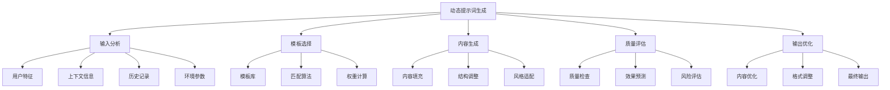
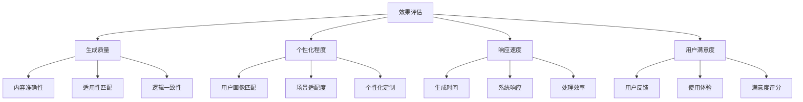

# 动态提示词生成

## 🎯 核心定义

### 什么是动态提示词生成？
动态提示词生成是指根据用户输入、上下文信息、历史记录等动态因素，自动生成和调整提示词内容，以实现个性化、智能化的提示词服务。

### 核心价值
- **个性化定制**：根据用户特征生成个性化提示词
- **上下文感知**：基于上下文信息动态调整内容
- **智能优化**：根据使用效果自动优化提示词
- **实时适应**：实时响应环境变化和用户需求

## 📊 动态生成框架



## 🔍 生成要素

### 1. 输入分析
| 分析维度 | 分析内容 | 分析方法 | 应用价值 |
|----------|----------|----------|----------|
| **用户特征** | 用户类型、偏好、能力 | 用户画像分析 | 个性化定制 |
| **上下文信息** | 当前场景、任务类型 | 上下文理解 | 场景适配 |
| **历史记录** | 使用历史、效果反馈 | 历史数据分析 | 经验学习 |
| **环境参数** | 系统状态、资源限制 | 环境监测 | 资源优化 |

#### 分析模板
```markdown
输入分析模板：
请分析以下输入信息：
- 用户特征：[用户类型、偏好、能力水平]
- 上下文信息：[当前场景、任务类型、时间地点]
- 历史记录：[使用历史、效果反馈、偏好变化]
- 环境参数：[系统状态、资源限制、性能要求]

分析结果：
- 用户画像：[用户特征总结]
- 场景理解：[上下文分析结果]
- 经验总结：[历史数据分析]
- 环境评估：[环境参数分析]

示例：
请分析以下输入信息：
- 用户特征：技术专家、偏好详细分析、高级用户
- 上下文信息：技术开发场景、代码优化任务、工作时间
- 历史记录：偏好技术深度、注重实用性、反馈积极
- 环境参数：高性能系统、充足资源、快速响应要求

分析结果：
- 用户画像：技术专家，需要深度技术分析
- 场景理解：开发环境，需要实用技术方案
- 经验总结：偏好技术深度，注重实际效果
- 环境评估：高性能环境，支持复杂处理
```

### 2. 模板选择
| 选择策略 | 选择方法 | 实现机制 | 效果保证 |
|----------|----------|----------|----------|
| **规则匹配** | 基于规则的模板选择 | 规则引擎 | 确保匹配准确性 |
| **机器学习** | 基于ML的智能选择 | 模型预测 | 提高选择精度 |
| **混合策略** | 规则+ML的混合方法 | 多策略融合 | 平衡准确性和效率 |
| **动态调整** | 根据效果动态调整 | 反馈学习 | 持续优化选择 |

#### 选择模板
```markdown
模板选择模板：
请选择最适合的提示词模板：
- 候选模板：[模板列表]
- 选择标准：[选择标准说明]
- 匹配算法：[匹配算法描述]
- 权重计算：[权重计算方法]
- 最终选择：[选择结果]

示例：
请选择最适合的提示词模板：
- 候选模板：技术分析模板、商业分析模板、创意写作模板
- 选择标准：用户类型匹配度、任务类型匹配度、历史效果
- 匹配算法：加权评分算法
- 权重计算：用户类型40%、任务类型40%、历史效果20%
- 最终选择：技术分析模板（评分最高）
```

### 3. 内容生成
| 生成方式 | 生成方法 | 实现技术 | 质量保证 |
|----------|----------|----------|----------|
| **模板填充** | 基于模板的内容填充 | 模板引擎 | 确保内容结构 |
| **智能生成** | 基于AI的内容生成 | 生成模型 | 提高内容质量 |
| **混合生成** | 模板+AI的混合方法 | 多技术融合 | 平衡效率和质量 |
| **迭代优化** | 多轮生成和优化 | 迭代算法 | 持续改进质量 |

#### 生成模板
```markdown
内容生成模板：
请生成动态提示词内容：
- 基础模板：[选定的基础模板]
- 填充数据：[需要填充的数据]
- 生成规则：[内容生成规则]
- 质量要求：[内容质量要求]
- 输出格式：[输出格式要求]

生成步骤：
1. 分析填充数据
2. 应用生成规则
3. 填充模板内容
4. 质量检查
5. 格式调整
6. 最终输出

示例：
请生成动态提示词内容：
- 基础模板：技术分析模板
- 填充数据：用户=技术专家，任务=代码优化，场景=开发环境
- 生成规则：技术深度优先，实用性导向，详细分析
- 质量要求：准确性、完整性、可操作性
- 输出格式：结构化提示词，包含角色、任务、要求

生成步骤：
1. 分析填充数据：技术专家需要深度技术分析
2. 应用生成规则：强调技术深度和实用性
3. 填充模板内容：生成技术分析提示词
4. 质量检查：检查技术准确性和完整性
5. 格式调整：调整为结构化格式
6. 最终输出：输出最终提示词
```

### 4. 质量评估
| 评估维度 | 评估内容 | 评估方法 | 改进策略 |
|----------|----------|----------|----------|
| **内容质量** | 准确性、完整性、一致性 | 内容分析 | 内容优化 |
| **适用性** | 用户匹配度、场景适配度 | 适用性测试 | 适用性调整 |
| **效果预测** | 预期效果、风险评估 | 效果预测模型 | 效果优化 |
| **用户体验** | 易用性、满意度 | 用户体验测试 | 体验优化 |

#### 评估模板
```markdown
质量评估模板：
请评估生成的提示词质量：
- 内容质量：[准确性、完整性、一致性评估]
- 适用性：[用户匹配度、场景适配度评估]
- 效果预测：[预期效果、风险评估]
- 用户体验：[易用性、满意度评估]

评估结果：
- 质量评分：[综合质量评分]
- 改进建议：[具体改进建议]
- 风险提示：[潜在风险提示]
- 优化方向：[优化方向建议]

示例：
请评估生成的提示词质量：
- 内容质量：技术准确性高，内容完整，逻辑一致
- 适用性：高度匹配技术专家用户，适配开发场景
- 效果预测：预期效果良好，风险较低
- 用户体验：易用性高，预期满意度高

评估结果：
- 质量评分：8.5/10（优秀）
- 改进建议：可增加更多技术细节
- 风险提示：技术复杂度可能过高
- 优化方向：平衡技术深度和易用性
```

## 🛠️ 实践技巧

### 技巧1：用户画像分析
```markdown
模板：
请分析用户画像：
- 基本信息：[年龄、职业、教育背景]
- 技术能力：[技术水平和经验]
- 使用偏好：[偏好类型和风格]
- 行为特征：[使用习惯和行为模式]

分析结果：
- 用户类型：[用户类型分类]
- 能力水平：[能力水平评估]
- 偏好特征：[偏好特征总结]
- 定制需求：[个性化定制需求]

示例：
请分析用户画像：
- 基本信息：30岁、软件工程师、计算机硕士
- 技术能力：高级技术水平，5年开发经验
- 使用偏好：偏好技术深度、注重实用性
- 行为特征：频繁使用、注重效率、反馈积极

分析结果：
- 用户类型：技术专家型用户
- 能力水平：高级技术水平
- 偏好特征：技术深度、实用性、效率
- 定制需求：技术深度分析、实用解决方案
```

### 技巧2：上下文感知生成
```markdown
模板：
请基于上下文生成提示词：
- 当前场景：[场景描述]
- 任务类型：[任务类型说明]
- 时间环境：[时间地点环境]
- 系统状态：[系统状态信息]

生成策略：
- 场景适配：[场景适配策略]
- 任务优化：[任务优化方法]
- 环境考虑：[环境因素考虑]
- 状态响应：[系统状态响应]

示例：
请基于上下文生成提示词：
- 当前场景：软件开发环境，代码审查阶段
- 任务类型：代码质量分析和优化建议
- 时间环境：工作时间，开发团队环境
- 系统状态：高性能系统，充足资源

生成策略：
- 场景适配：适配开发环境，强调代码质量
- 任务优化：优化代码分析任务，提高效率
- 环境考虑：考虑团队协作，注重沟通
- 状态响应：利用高性能系统，提供深度分析
```

### 技巧3：历史学习优化
```markdown
模板：
请基于历史数据优化提示词：
- 使用历史：[历史使用记录]
- 效果反馈：[效果反馈数据]
- 偏好变化：[偏好变化趋势]
- 成功案例：[成功案例总结]

优化策略：
- 经验学习：[从历史中学习的经验]
- 偏好适应：[适应用户偏好变化]
- 效果优化：[基于效果反馈优化]
- 成功复制：[复制成功案例经验]

示例：
请基于历史数据优化提示词：
- 使用历史：频繁使用技术分析类提示词
- 效果反馈：技术深度分析获得好评
- 偏好变化：偏好从基础分析转向深度分析
- 成功案例：代码优化分析获得最佳效果

优化策略：
- 经验学习：技术深度分析更受欢迎
- 偏好适应：适应用户偏好向深度分析转变
- 效果优化：优化技术分析深度和准确性
- 成功复制：复制代码优化分析的成功模式
```

## 📈 效果评估

### 评估维度
| 评估指标 | 评估标准 | 评估方法 | 改进策略 |
|----------|----------|----------|----------|
| **生成质量** | 内容质量、适用性 | 质量评估 | 优化生成算法 |
| **个性化程度** | 用户匹配度、定制化程度 | 个性化测试 | 改进用户分析 |
| **响应速度** | 生成时间、系统响应 | 性能测试 | 优化生成效率 |
| **用户满意度** | 用户反馈、使用体验 | 用户调研 | 改进用户体验 |

### 评估方法


## 🎯 优化策略

### 策略1：生成算法优化
```markdown
优化策略：
1. 算法改进：改进生成算法，提高质量
2. 模型优化：优化生成模型，提高准确性
3. 参数调优：调优生成参数，平衡质量和效率
4. 多模型融合：融合多个模型，提高生成效果
5. 持续学习：建立持续学习机制，不断改进

实施方法：
- 研究和应用最新的生成算法
- 优化和训练生成模型
- 系统化调优生成参数
- 实现多模型融合机制
- 建立持续学习和改进系统
```

### 策略2：个性化优化
```markdown
优化策略：
1. 用户画像优化：改进用户画像分析，提高准确性
2. 偏好学习：学习用户偏好变化，动态调整
3. 场景适配：优化场景适配算法，提高适用性
4. 反馈循环：建立反馈循环，持续优化个性化
5. 隐私保护：在个性化过程中保护用户隐私

实施方法：
- 改进用户画像分析算法
- 实现用户偏好学习和预测
- 优化场景适配和匹配算法
- 建立用户反馈收集和处理机制
- 实现隐私保护和数据安全机制
```

### 策略3：性能优化
```markdown
优化策略：
1. 生成速度优化：优化生成速度，提高响应效率
2. 资源管理：优化资源管理，提高资源利用率
3. 缓存机制：实现缓存机制，减少重复计算
4. 并行处理：实现并行处理，提高处理效率
5. 负载均衡：实现负载均衡，提高系统稳定性

实施方法：
- 优化生成算法和流程
- 改进资源分配和管理策略
- 实现智能缓存和预加载机制
- 开发并行处理和分布式架构
- 建立负载均衡和容错机制
```

## ⚠️ 常见问题

### 问题1：生成质量不稳定
**表现**：生成的提示词质量波动较大
**解决**：优化生成算法，建立质量保证机制
**方法**：实现多轮生成和质量评估

### 问题2：个性化程度不足
**表现**：生成的提示词个性化程度不够
**解决**：改进用户分析，加强个性化定制
**方法**：优化用户画像分析和偏好学习

### 问题3：响应速度慢
**表现**：动态生成响应时间过长
**解决**：优化生成效率，实现并行处理
**方法**：改进算法效率，实现缓存和预加载

## 🎓 学习要点

### 核心理解
- 动态生成是提高提示词效果的重要方法
- 用户分析是动态生成的基础
- 上下文感知是动态生成的关键
- 质量评估是动态生成的保证

### 实践建议
- 建立完善的用户分析机制
- 实现智能的模板选择算法
- 开发高效的内容生成系统
- 建立持续的质量评估和优化机制

## 🔗 相关链接
- [[04-1-1-提示词链式设计]] - 学习链式设计
- [[04-1-3-多模态提示词]] - 学习多模态提示词
- [[04-2-1-效果评估指标]] - 学习效果评估
- [[05-3-1-技术发展趋势]] - 了解技术发展趋势
