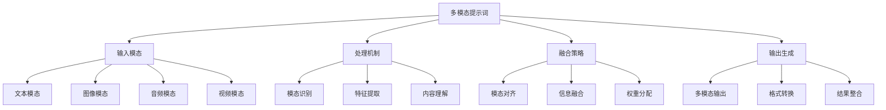
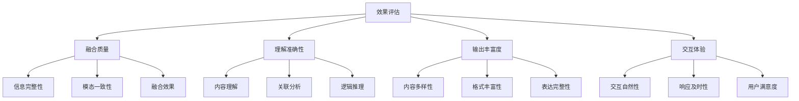

# 多模态提示词

## 🎯 核心定义

### 什么是多模态提示词？
多模态提示词是指能够处理和理解多种数据类型（文本、图像、音频、视频等）的提示词设计，通过整合不同模态的信息，实现更丰富、更准确的AI交互体验。

### 核心价值
- **信息丰富**：整合多种模态信息，提供更全面的输入
- **理解准确**：多模态理解提高AI的准确性和理解能力
- **交互自然**：支持更自然的人机交互方式
- **应用广泛**：适用于更多样化的应用场景

## 📊 多模态框架



## 🔍 设计要素

### 1. 输入模态
| 模态类型 | 数据类型 | 处理特点 | 应用场景 |
|----------|----------|----------|----------|
| **文本模态** | 文字、代码、结构化数据 | 语义理解、逻辑分析 | 文档处理、代码分析 |
| **图像模态** | 图片、图表、设计稿 | 视觉识别、空间理解 | 图像分析、设计审查 |
| **音频模态** | 语音、音乐、环境音 | 声音识别、情感分析 | 语音交互、音频处理 |
| **视频模态** | 视频、动画、直播 | 时序理解、动作识别 | 视频分析、内容创作 |

#### 模态设计模板
```markdown
多模态输入模板：
请处理以下多模态输入：
- 文本内容：[文本内容描述]
- 图像内容：[图像内容描述]
- 音频内容：[音频内容描述]
- 视频内容：[视频内容描述]

处理要求：
- 模态识别：[识别各模态类型]
- 内容理解：[理解各模态内容]
- 关联分析：[分析模态间关联]
- 融合处理：[融合多模态信息]

示例：
请处理以下多模态输入：
- 文本内容：产品需求文档，包含功能描述和技术要求
- 图像内容：产品设计稿，包含界面布局和交互设计
- 音频内容：用户反馈录音，包含使用体验和意见建议
- 视频内容：产品演示视频，展示功能操作流程

处理要求：
- 模态识别：识别文本、图像、音频、视频四种模态
- 内容理解：理解需求、设计、反馈、演示内容
- 关联分析：分析各模态间的逻辑关联和一致性
- 融合处理：融合多模态信息，生成综合分析
```

### 2. 处理机制
| 处理阶段 | 处理内容 | 实现方法 | 质量保证 |
|----------|----------|----------|----------|
| **模态识别** | 识别输入数据类型 | 类型检测算法 | 确保识别准确性 |
| **特征提取** | 提取各模态特征 | 特征提取算法 | 确保特征有效性 |
| **内容理解** | 理解各模态内容 | 理解模型 | 确保理解准确性 |
| **关联分析** | 分析模态间关联 | 关联分析算法 | 确保关联正确性 |

#### 处理模板
```markdown
处理机制模板：
请设计多模态处理机制：
- 识别阶段：[模态识别方法]
- 提取阶段：[特征提取方法]
- 理解阶段：[内容理解方法]
- 关联阶段：[关联分析方法]

实现策略：
- 并行处理：[并行处理策略]
- 串行处理：[串行处理策略]
- 混合处理：[混合处理策略]
- 优化策略：[处理优化策略]

示例：
请设计多模态处理机制：
- 识别阶段：使用类型检测算法识别各模态类型
- 提取阶段：使用专用特征提取算法提取各模态特征
- 理解阶段：使用多模态理解模型理解各模态内容
- 关联阶段：使用关联分析算法分析模态间关联

实现策略：
- 并行处理：同时处理各模态，提高效率
- 串行处理：按依赖关系顺序处理，确保准确性
- 混合处理：结合并行和串行，平衡效率和准确性
- 优化策略：优化处理流程，提高整体性能
```

### 3. 融合策略
| 融合方式 | 融合方法 | 实现技术 | 效果特点 |
|----------|----------|----------|----------|
| **早期融合** | 在特征层面融合 | 特征融合网络 | 信息保留完整 |
| **晚期融合** | 在决策层面融合 | 决策融合算法 | 处理效率高 |
| **混合融合** | 多层次融合 | 混合融合架构 | 平衡效果和效率 |
| **注意力融合** | 基于注意力的融合 | 注意力机制 | 动态权重分配 |

#### 融合模板
```markdown
融合策略模板：
请设计多模态融合策略：
- 融合层次：[融合层次选择]
- 融合方法：[融合方法选择]
- 权重机制：[权重分配机制]
- 优化策略：[融合优化策略]

实现方案：
- 架构设计：[融合架构设计]
- 算法选择：[融合算法选择]
- 参数调优：[参数调优策略]
- 效果评估：[融合效果评估]

示例：
请设计多模态融合策略：
- 融合层次：选择混合融合，结合早期和晚期融合
- 融合方法：使用注意力机制进行动态融合
- 权重机制：根据模态重要性和质量动态分配权重
- 优化策略：优化融合参数，提高融合效果

实现方案：
- 架构设计：设计多层次融合架构
- 算法选择：选择注意力融合算法
- 参数调优：调优融合参数和权重
- 效果评估：评估融合效果和质量
```

### 4. 输出生成
| 输出类型 | 生成方法 | 实现技术 | 应用价值 |
|----------|----------|----------|----------|
| **多模态输出** | 生成多种模态内容 | 多模态生成模型 | 丰富输出内容 |
| **格式转换** | 转换输出格式 | 格式转换算法 | 适配不同需求 |
| **结果整合** | 整合多模态结果 | 结果整合算法 | 确保输出一致性 |
| **质量优化** | 优化输出质量 | 质量优化算法 | 提高输出质量 |

#### 输出模板
```markdown
输出生成模板：
请设计多模态输出生成：
- 输出类型：[输出类型选择]
- 生成方法：[生成方法选择]
- 格式要求：[输出格式要求]
- 质量要求：[输出质量要求]

生成策略：
- 内容生成：[内容生成策略]
- 格式处理：[格式处理策略]
- 质量检查：[质量检查策略]
- 优化调整：[优化调整策略]

示例：
请设计多模态输出生成：
- 输出类型：生成文本、图像、音频多模态输出
- 生成方法：使用多模态生成模型
- 格式要求：结构化输出，包含各模态内容
- 质量要求：内容准确、格式规范、质量高

生成策略：
- 内容生成：基于融合信息生成各模态内容
- 格式处理：按照要求格式化输出内容
- 质量检查：检查输出质量和一致性
- 优化调整：根据质量检查结果优化调整
```

## 🛠️ 实践技巧

### 技巧1：文本-图像融合
```markdown
模板：
请设计文本-图像融合提示词：
- 文本输入：[文本内容描述]
- 图像输入：[图像内容描述]
- 融合目标：[融合目标说明]
- 输出要求：[输出要求说明]

融合策略：
- 内容对齐：[文本图像内容对齐]
- 信息互补：[信息互补策略]
- 一致性检查：[一致性检查方法]
- 质量保证：[质量保证机制]

示例：
请设计文本-图像融合提示词：
- 文本输入：产品功能描述文档
- 图像输入：产品界面设计图
- 融合目标：生成产品功能与界面的一致性分析
- 输出要求：结构化分析报告，包含一致性评估

融合策略：
- 内容对齐：对齐文本描述与图像展示的功能
- 信息互补：结合文本细节与图像视觉效果
- 一致性检查：检查文本描述与图像展示的一致性
- 质量保证：确保分析结果的准确性和完整性
```

### 技巧2：音频-文本融合
```markdown
模板：
请设计音频-文本融合提示词：
- 音频输入：[音频内容描述]
- 文本输入：[文本内容描述]
- 融合目标：[融合目标说明]
- 输出要求：[输出要求说明]

融合策略：
- 语音识别：[语音转文本策略]
- 情感分析：[情感分析策略]
- 内容对比：[内容对比分析]
- 综合评估：[综合评估方法]

示例：
请设计音频-文本融合提示词：
- 音频输入：用户反馈录音
- 文本输入：产品使用手册
- 融合目标：分析用户反馈与产品说明的一致性
- 输出要求：用户反馈分析报告，包含改进建议

融合策略：
- 语音识别：将音频转换为文本
- 情感分析：分析用户情感和态度
- 内容对比：对比用户反馈与产品说明
- 综合评估：综合评估用户满意度和产品改进方向
```

### 技巧3：视频-多模态融合
```markdown
模板：
请设计视频-多模态融合提示词：
- 视频输入：[视频内容描述]
- 其他模态：[其他模态内容]
- 融合目标：[融合目标说明]
- 输出要求：[输出要求说明]

融合策略：
- 时序分析：[视频时序分析]
- 多模态对齐：[多模态时序对齐]
- 内容理解：[多模态内容理解]
- 结果整合：[多模态结果整合]

示例：
请设计视频-多模态融合提示词：
- 视频输入：产品演示视频
- 其他模态：产品文档、用户反馈
- 融合目标：生成产品演示效果评估
- 输出要求：演示效果分析报告，包含改进建议

融合策略：
- 时序分析：分析视频中的关键时序点
- 多模态对齐：对齐视频内容与其他模态信息
- 内容理解：理解多模态内容的一致性和差异性
- 结果整合：整合多模态分析结果，生成综合评估
```

## 📈 效果评估

### 评估维度
| 评估指标 | 评估标准 | 评估方法 | 改进策略 |
|----------|----------|----------|----------|
| **融合质量** | 多模态融合效果 | 融合质量评估 | 优化融合算法 |
| **理解准确性** | 多模态理解准确性 | 准确性测试 | 改进理解模型 |
| **输出丰富度** | 输出内容丰富程度 | 丰富度评估 | 增强输出能力 |
| **交互体验** | 多模态交互体验 | 用户体验测试 | 改进交互设计 |

### 评估方法


## 🎯 优化策略

### 策略1：融合算法优化
```markdown
优化策略：
1. 算法改进：改进融合算法，提高融合质量
2. 模型优化：优化多模态模型，提高理解能力
3. 参数调优：调优融合参数，平衡效果和效率
4. 架构优化：优化融合架构，提高系统性能
5. 持续学习：建立持续学习机制，不断改进

实施方法：
- 研究和应用最新的融合算法
- 优化和训练多模态理解模型
- 系统化调优融合参数
- 优化融合架构和系统设计
- 建立持续学习和改进机制
```

### 策略2：模态扩展优化
```markdown
优化策略：
1. 新模态支持：支持新的模态类型
2. 模态质量：提高各模态处理质量
3. 模态平衡：平衡各模态的重要性
4. 模态优化：优化各模态的处理效率
5. 模态创新：创新模态处理技术

实施方法：
- 开发新模态的支持和处理能力
- 改进各模态的特征提取和理解
- 实现动态的模态权重分配
- 优化各模态的处理算法和流程
- 研究和应用新的模态处理技术
```

### 策略3：用户体验优化
```markdown
优化策略：
1. 交互优化：优化多模态交互体验
2. 响应优化：优化系统响应速度
3. 界面优化：优化用户界面设计
4. 反馈优化：优化用户反馈机制
5. 个性化优化：实现个性化多模态体验

实施方法：
- 改进多模态交互设计和实现
- 优化系统性能和响应速度
- 设计用户友好的界面和交互
- 建立有效的用户反馈收集和处理
- 实现个性化的多模态体验定制
```

## ⚠️ 常见问题

### 问题1：模态融合质量低
**表现**：多模态融合效果不理想
**解决**：优化融合算法，改进融合策略
**方法**：实现更智能的融合机制

### 问题2：处理效率低
**表现**：多模态处理速度慢
**解决**：优化处理流程，实现并行处理
**方法**：改进算法效率，优化系统架构

### 问题3：模态不平衡
**表现**：某些模态处理效果差
**解决**：平衡各模态处理，提高弱模态能力
**方法**：优化弱模态处理算法

## 🎓 学习要点

### 核心理解
- 多模态是AI发展的重要方向
- 融合策略是多模态的核心技术
- 用户体验是多模态的关键因素
- 持续优化是多模态的必然要求

### 实践建议
- 从简单多模态开始练习
- 注重融合策略的设计和优化
- 建立完善的质量评估机制
- 持续关注技术发展和用户需求

## 🔗 相关链接
- [[04-1-1-提示词链式设计]] - 学习链式设计
- [[04-1-2-动态提示词生成]] - 学习动态生成
- [[04-1-4-提示词版本管理]] - 学习版本管理
- [[05-2-1-技术发展趋势]] - 了解技术发展趋势
