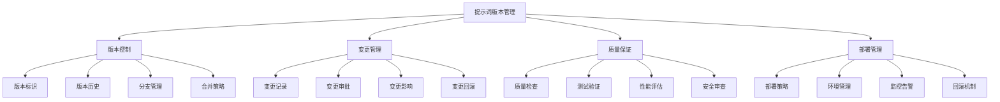
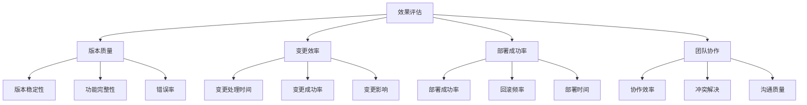

# 提示词版本管理

## 🎯 核心定义

### 什么是提示词版本管理？
提示词版本管理是指对提示词的设计、开发、测试、部署等全生命周期进行版本控制和管理，确保提示词的质量、稳定性和可追溯性。

### 核心价值
- **质量保证**：通过版本控制确保提示词质量
- **变更追踪**：追踪提示词的所有变更历史
- **回滚能力**：支持快速回滚到历史版本
- **协作管理**：支持团队协作和权限管理

## 📊 版本管理框架



## 🔍 管理要素

### 1. 版本控制
| 控制要素 | 控制内容 | 实现方法 | 管理价值 |
|----------|----------|----------|----------|
| **版本标识** | 版本号、标签、描述 | 语义化版本控制 | 清晰标识版本 |
| **版本历史** | 变更记录、时间戳 | 版本历史记录 | 完整追踪历史 |
| **分支管理** | 主分支、开发分支 | Git分支管理 | 支持并行开发 |
| **合并策略** | 合并规则、冲突解决 | 合并策略定义 | 确保合并质量 |

#### 版本控制模板
```markdown
版本控制模板：
请设计提示词版本控制方案：
- 版本标识：[版本号规则、标签规则]
- 版本历史：[历史记录格式、存储方式]
- 分支管理：[分支策略、命名规则]
- 合并策略：[合并规则、冲突解决]

版本规则：
- 主版本号：[重大变更规则]
- 次版本号：[功能变更规则]
- 修订版本号：[修复变更规则]
- 预发布版本：[预发布规则]

示例：
请设计提示词版本控制方案：
- 版本标识：使用语义化版本号（如v1.2.3）
- 版本历史：记录每次变更的详细信息
- 分支管理：主分支（main）、开发分支（develop）、功能分支（feature/*）
- 合并策略：代码审查后合并，解决冲突

版本规则：
- 主版本号：重大架构变更或功能重构
- 次版本号：新功能添加或重要改进
- 修订版本号：错误修复或小幅优化
- 预发布版本：alpha、beta、rc版本
```

### 2. 变更管理
| 管理阶段 | 管理内容 | 实现方法 | 质量保证 |
|----------|----------|----------|----------|
| **变更记录** | 变更原因、内容、影响 | 变更日志系统 | 确保变更可追溯 |
| **变更审批** | 审批流程、权限控制 | 审批工作流 | 确保变更合规 |
| **变更影响** | 影响分析、风险评估 | 影响分析工具 | 确保变更安全 |
| **变更回滚** | 回滚策略、回滚流程 | 回滚机制 | 确保快速恢复 |

#### 变更管理模板
```markdown
变更管理模板：
请设计提示词变更管理流程：
- 变更申请：[申请流程、申请内容]
- 变更审批：[审批流程、审批标准]
- 变更实施：[实施步骤、实施要求]
- 变更验证：[验证方法、验证标准]

变更记录：
- 变更ID：[唯一标识符]
- 变更类型：[类型分类]
- 变更原因：[变更原因说明]
- 变更内容：[具体变更内容]
- 变更影响：[影响范围分析]
- 变更时间：[变更时间记录]

示例：
请设计提示词变更管理流程：
- 变更申请：提交变更申请，说明变更原因和内容
- 变更审批：技术负责人审批，评估变更影响
- 变更实施：在测试环境实施，进行充分测试
- 变更验证：验证变更效果，确认无问题后发布

变更记录：
- 变更ID：CHG-2024-001
- 变更类型：功能增强
- 变更原因：用户反馈需要更精确的提示词
- 变更内容：优化提示词结构，增加具体性要求
- 变更影响：影响所有使用该提示词的功能
- 变更时间：2024-01-15 10:30:00
```

### 3. 质量保证
| 保证环节 | 保证内容 | 实现方法 | 效果验证 |
|----------|----------|----------|----------|
| **质量检查** | 语法检查、逻辑检查 | 自动化检查工具 | 确保基础质量 |
| **测试验证** | 功能测试、性能测试 | 测试框架 | 确保功能正确 |
| **性能评估** | 响应时间、资源消耗 | 性能测试工具 | 确保性能达标 |
| **安全审查** | 安全漏洞、隐私保护 | 安全扫描工具 | 确保安全合规 |

#### 质量保证模板
```markdown
质量保证模板：
请设计提示词质量保证体系：
- 质量检查：[检查项目、检查标准]
- 测试验证：[测试类型、测试方法]
- 性能评估：[性能指标、评估方法]
- 安全审查：[安全要求、审查标准]

质量流程：
- 开发阶段：[开发质量要求]
- 测试阶段：[测试质量要求]
- 发布阶段：[发布质量要求]
- 运行阶段：[运行质量监控]

示例：
请设计提示词质量保证体系：
- 质量检查：语法正确性、逻辑一致性、格式规范性
- 测试验证：功能测试、集成测试、用户验收测试
- 性能评估：响应时间、准确率、资源消耗
- 安全审查：数据安全、隐私保护、合规性检查

质量流程：
- 开发阶段：代码审查、静态分析、单元测试
- 测试阶段：功能测试、性能测试、安全测试
- 发布阶段：发布前检查、发布后验证
- 运行阶段：实时监控、定期评估、持续优化
```

### 4. 部署管理
| 部署阶段 | 部署内容 | 实现方法 | 风险控制 |
|----------|----------|----------|----------|
| **部署策略** | 蓝绿部署、滚动部署 | 部署策略选择 | 确保部署安全 |
| **环境管理** | 开发、测试、生产环境 | 环境隔离管理 | 确保环境一致 |
| **监控告警** | 性能监控、错误告警 | 监控系统 | 确保运行稳定 |
| **回滚机制** | 快速回滚、数据恢复 | 回滚策略 | 确保快速恢复 |

#### 部署管理模板
```markdown
部署管理模板：
请设计提示词部署管理方案：
- 部署策略：[部署方式、部署流程]
- 环境管理：[环境配置、环境隔离]
- 监控告警：[监控指标、告警规则]
- 回滚机制：[回滚策略、回滚流程]

部署流程：
- 准备阶段：[部署准备、环境检查]
- 部署阶段：[部署执行、部署验证]
- 验证阶段：[功能验证、性能验证]
- 监控阶段：[运行监控、问题处理]

示例：
请设计提示词部署管理方案：
- 部署策略：采用蓝绿部署，确保零停机时间
- 环境管理：开发、测试、生产环境完全隔离
- 监控告警：监控响应时间、错误率、资源使用
- 回滚机制：支持一键回滚，5分钟内恢复

部署流程：
- 准备阶段：检查部署环境、准备部署包
- 部署阶段：执行部署脚本、验证部署结果
- 验证阶段：功能测试、性能测试、用户验收
- 监控阶段：实时监控、问题处理、性能优化
```

## 🛠️ 实践技巧

### 技巧1：语义化版本控制
```markdown
模板：
请设计语义化版本控制规则：
- 版本格式：[版本号格式说明]
- 版本规则：[版本号规则说明]
- 标签规则：[标签命名规则]
- 发布规则：[发布流程规则]

版本示例：
- 主版本号：1.0.0（重大变更）
- 次版本号：1.1.0（新功能）
- 修订版本号：1.1.1（错误修复）
- 预发布版本：1.2.0-alpha.1（预发布）

示例：
请设计语义化版本控制规则：
- 版本格式：MAJOR.MINOR.PATCH（主版本.次版本.修订版本）
- 版本规则：主版本号不兼容变更，次版本号向下兼容，修订版本号错误修复
- 标签规则：使用v前缀，如v1.2.3
- 发布规则：主版本号需要团队评审，次版本号需要技术负责人审批

版本示例：
- 主版本号：1.0.0（提示词架构重大变更）
- 次版本号：1.1.0（新增多模态支持）
- 修订版本号：1.1.1（修复语法错误）
- 预发布版本：1.2.0-alpha.1（新功能预发布）
```

### 技巧2：分支管理策略
```markdown
模板：
请设计分支管理策略：
- 主分支：[主分支规则]
- 开发分支：[开发分支规则]
- 功能分支：[功能分支规则]
- 发布分支：[发布分支规则]

分支流程：
- 创建分支：[分支创建规则]
- 开发流程：[开发流程规则]
- 合并流程：[合并流程规则]
- 删除分支：[分支删除规则]

示例：
请设计分支管理策略：
- 主分支：main，保持稳定，只接受经过测试的代码
- 开发分支：develop，集成开发中的功能
- 功能分支：feature/*，开发新功能
- 发布分支：release/*，准备发布版本

分支流程：
- 创建分支：从develop创建feature分支
- 开发流程：在feature分支开发，定期合并到develop
- 合并流程：通过Pull Request合并，需要代码审查
- 删除分支：合并后删除feature分支
```

### 技巧3：自动化部署
```markdown
模板：
请设计自动化部署方案：
- 构建自动化：[构建流程自动化]
- 测试自动化：[测试流程自动化]
- 部署自动化：[部署流程自动化]
- 监控自动化：[监控流程自动化]

自动化工具：
- 构建工具：[构建工具选择]
- 测试工具：[测试工具选择]
- 部署工具：[部署工具选择]
- 监控工具：[监控工具选择]

示例：
请设计自动化部署方案：
- 构建自动化：代码提交后自动构建
- 测试自动化：构建后自动运行测试
- 部署自动化：测试通过后自动部署到测试环境
- 监控自动化：部署后自动启动监控

自动化工具：
- 构建工具：Jenkins、GitHub Actions
- 测试工具：Jest、Pytest
- 部署工具：Docker、Kubernetes
- 监控工具：Prometheus、Grafana
```

## 📈 效果评估

### 评估维度
| 评估指标 | 评估标准 | 评估方法 | 改进策略 |
|----------|----------|----------|----------|
| **版本质量** | 版本稳定性、功能完整性 | 质量评估 | 优化版本控制 |
| **变更效率** | 变更处理时间、变更成功率 | 效率统计 | 优化变更流程 |
| **部署成功率** | 部署成功率、回滚频率 | 成功率统计 | 优化部署策略 |
| **团队协作** | 协作效率、冲突解决 | 协作评估 | 优化协作流程 |

### 评估方法


## 🎯 优化策略

### 策略1：版本控制优化
```markdown
优化策略：
1. 版本规则优化：优化版本号规则，提高可读性
2. 分支策略优化：优化分支管理策略，提高效率
3. 合并策略优化：优化合并策略，减少冲突
4. 历史管理优化：优化版本历史管理，提高查询效率
5. 自动化优化：实现版本控制自动化，减少人工操作

实施方法：
- 制定清晰的版本号规则和命名规范
- 设计高效的分支管理策略和流程
- 实现智能的合并策略和冲突解决
- 优化版本历史存储和查询机制
- 开发自动化版本控制工具和流程
```

### 策略2：变更管理优化
```markdown
优化策略：
1. 流程优化：优化变更管理流程，提高效率
2. 审批优化：优化审批流程，减少等待时间
3. 影响分析优化：优化影响分析，提高准确性
4. 回滚优化：优化回滚机制，提高恢复速度
5. 自动化优化：实现变更管理自动化，减少人工干预

实施方法：
- 简化变更管理流程，减少不必要的环节
- 实现并行审批和快速审批机制
- 开发智能的影响分析工具和算法
- 建立快速回滚和恢复机制
- 实现变更管理的自动化和智能化
```

### 策略3：质量保证优化
```markdown
优化策略：
1. 检查优化：优化质量检查，提高检查效率
2. 测试优化：优化测试策略，提高测试覆盖率
3. 性能优化：优化性能评估，提高评估准确性
4. 安全优化：优化安全审查，提高安全水平
5. 自动化优化：实现质量保证自动化，提高效率

实施方法：
- 改进质量检查工具和检查标准
- 优化测试策略和测试工具
- 改进性能评估方法和工具
- 加强安全审查和防护措施
- 实现质量保证的自动化和智能化
```

## ⚠️ 常见问题

### 问题1：版本冲突频繁
**表现**：版本合并时经常出现冲突
**解决**：优化分支策略，改进合并流程
**方法**：实现智能冲突解决机制

### 问题2：变更流程复杂
**表现**：变更管理流程过于复杂
**解决**：简化变更流程，提高效率
**方法**：实现变更管理自动化

### 问题3：部署失败率高
**表现**：部署过程中经常出现失败
**解决**：优化部署策略，加强测试
**方法**：实现自动化部署和监控

## 🎓 学习要点

### 核心理解
- 版本管理是提示词工程的基础
- 变更管理是版本管理的核心
- 质量保证是版本管理的保障
- 部署管理是版本管理的最终目标

### 实践建议
- 建立完善的版本控制体系
- 实现高效的变更管理流程
- 建立严格的质量保证机制
- 实现自动化的部署管理

## 🔗 相关链接
- [[04-1-1-提示词链式设计]] - 学习链式设计
- [[04-1-2-动态提示词生成]] - 学习动态生成
- [[04-1-3-多模态提示词]] - 学习多模态提示词
- [[05-1-1-提示词工程流程]] - 学习工程化流程
