# 系统整合总结

## 🎯 模块概述

### 系统整合模块核心价值
系统整合模块是提示词工程的最高层次，将前面所有模块的知识、技能、工具和方法进行系统化整合，形成完整的工程化体系，实现从技术到工程、从个人到团队、从项目到产业的全面升级。

### 学习目标达成
- **工程化能力**：掌握完整的提示词工程化流程和方法
- **团队协作**：建立高效的团队协作机制和规范
- **知识管理**：构建完善的知识管理和传承体系
- **质量管控**：建立全面的质量管控和保证体系
- **前沿视野**：了解技术发展趋势和未来展望

## 📊 知识体系回顾

```mermaid
graph TD
    A[系统整合模块] --> B[工程化实践]
    A --> C[前沿趋势]
    
    B --> B1[工程流程]
    B --> B2[团队协作]
    B --> B3[知识管理]
    B --> B4[质量管控]
    
    C --> C1[技术发展]
    C --> C2[新兴应用]
    C --> C3[挑战机遇]
    C --> C4[未来展望]
    
    B1 --> B11[需求分析]
    B1 --> B12[设计开发]
    B1 --> B13[测试验证]
    B1 --> B14[部署运维]
    B1 --> B15[持续优化]
    
    B2 --> B21[沟通规范]
    B2 --> B22[工作流程]
    B2 --> B23[质量标准]
    B2 --> B24[知识管理]
    
    B3 --> B31[知识收集]
    B3 --> B32[知识整理]
    B3 --> B33[知识存储]
    B3 --> B34[知识应用]
    
    B4 --> B41[质量规划]
    B4 --> B42[质量控制]
    B4 --> B43[质量保证]
    B4 --> B44[质量改进]
    
    C1 --> C11[模型技术]
    C1 --> C12[应用技术]
    C1 --> C13[工程技术]
    C1 --> C14[融合技术]
    
    C2 --> C21[垂直行业]
    C2 --> C22[新兴技术]
    C2 --> C23[社会应用]
    C2 --> C24[创新模式]
    
    C3 --> C31[技术挑战]
    C3 --> C32[市场挑战]
    C3 --> C33[社会挑战]
    C3 --> C34[发展机遇]
    
    C4 --> C41[技术展望]
    C4 --> C42[应用展望]
    C4 --> C43[社会展望]
    C4 --> C44[发展展望]
```



## 🔍 核心知识点总结

### 1. 工程化实践维度
| 实践领域 | 核心概念 | 关键技能 | 应用价值 |
|----------|----------|----------|----------|
| **工程流程** | 全生命周期管理、标准化流程 | 流程设计、项目管理 | 确保项目成功交付 |
| **团队协作** | 协作规范、沟通机制、质量标准 | 团队管理、沟通协调 | 提高团队效率和质量 |
| **知识管理** | 知识收集、整理、存储、应用 | 知识管理、经验总结 | 积累和传承团队智慧 |
| **质量管控** | 质量规划、控制、保证、改进 | 质量管理、风险控制 | 确保交付质量和稳定性 |

#### 工程化实践要点总结
```markdown
工程化实践核心要点：

1. 工程流程管理
   - 核心：建立标准化的工程流程体系
   - 关键：需求分析、设计开发、测试验证、部署运维、持续优化
   - 价值：确保项目成功交付，提高开发效率
   - 应用：项目管理、质量控制、风险管控

2. 团队协作规范
   - 核心：建立高效的团队协作机制
   - 关键：沟通规范、工作流程、质量标准、知识管理
   - 价值：提高团队效率，保证协作质量
   - 应用：团队管理、项目协作、知识共享

3. 知识管理体系
   - 核心：构建完善的知识管理体系
   - 关键：知识收集、整理、存储、应用
   - 价值：积累团队智慧，传承最佳实践
   - 应用：经验总结、知识共享、能力提升

4. 质量管控体系
   - 核心：建立全面的质量管控体系
   - 关键：质量规划、质量控制、质量保证、质量改进
   - 价值：确保交付质量，降低项目风险
   - 应用：质量保证、风险控制、持续改进
```

### 2. 前沿趋势维度
| 趋势领域 | 核心概念 | 关键洞察 | 战略价值 |
|----------|----------|----------|----------|
| **技术发展** | 模型技术、应用技术、工程技术、融合技术 | 技术演进趋势和突破方向 | 指导技术投资和发展 |
| **新兴应用** | 垂直行业、新兴技术、社会应用、创新模式 | 新应用场景和商业模式 | 开拓市场机会 |
| **挑战机遇** | 技术挑战、市场挑战、社会挑战、发展机遇 | 风险识别和机遇把握 | 制定应对策略 |
| **未来展望** | 技术展望、应用展望、社会展望、发展展望 | 未来发展趋势和影响 | 制定长期战略 |

#### 前沿趋势要点总结
```markdown
前沿趋势核心要点：

1. 技术发展趋势
   - 核心：把握技术发展方向和趋势
   - 关键：模型技术、应用技术、工程技术、融合技术
   - 价值：指导技术投资，保持技术领先
   - 应用：技术选型、研发投入、战略规划

2. 新兴应用领域
   - 核心：发现新的应用场景和机会
   - 关键：垂直行业、新兴技术、社会应用、创新模式
   - 价值：开拓市场空间，创造商业价值
   - 应用：市场拓展、产品创新、商业模式

3. 挑战与机遇
   - 核心：客观分析挑战和机遇
   - 关键：技术挑战、市场挑战、社会挑战、发展机遇
   - 价值：风险控制，机遇把握
   - 应用：战略制定、风险管控、机会识别

4. 未来展望
   - 核心：前瞻性分析和预测
   - 关键：技术展望、应用展望、社会展望、发展展望
   - 价值：战略指导，决策支持
   - 应用：长期规划、投资决策、战略布局
```

## 🛠️ 系统整合实践

### 整合策略
| 整合维度 | 整合内容 | 整合方法 | 整合效果 |
|----------|----------|----------|----------|
| **知识整合** | 技术知识、管理知识、行业知识 | 知识图谱、知识库、最佳实践 | 形成完整知识体系 |
| **技能整合** | 技术技能、管理技能、沟通技能 | 技能培训、实践锻炼、经验积累 | 提升综合能力 |
| **工具整合** | 开发工具、管理工具、协作工具 | 工具集成、流程优化、自动化 | 提高工作效率 |
| **流程整合** | 开发流程、管理流程、协作流程 | 流程标准化、自动化、持续优化 | 确保流程高效 |

#### 整合实施指南
```markdown
系统整合实施指南：

1. 知识整合实施
   - 建立知识图谱：构建完整的知识体系结构
   - 建设知识库：收集、整理、存储所有相关知识
   - 总结最佳实践：提炼和总结成功经验
   - 建立知识分享机制：促进知识传播和应用

2. 技能整合实施
   - 技能评估：评估当前技能水平和差距
   - 技能培训：制定培训计划，提升技能水平
   - 实践锻炼：通过项目实践锻炼技能
   - 经验积累：积累实践经验，形成技能体系

3. 工具整合实施
   - 工具选型：选择适合的工具和平台
   - 工具集成：实现工具间的集成和协同
   - 流程优化：优化工作流程，提高效率
   - 自动化：实现工作流程的自动化

4. 流程整合实施
   - 流程梳理：梳理现有流程，识别优化点
   - 流程标准化：建立标准化的流程规范
   - 流程自动化：实现流程的自动化执行
   - 持续优化：建立流程持续优化机制
```

### 整合效果评估
| 评估维度 | 评估指标 | 评估方法 | 改进策略 |
|----------|----------|----------|----------|
| **整合程度** | 知识完整性、技能全面性、工具集成度 | 综合评估、对比分析 | 完善整合体系 |
| **效率提升** | 工作效率、协作效率、决策效率 | 效率统计、时间分析 | 优化整合流程 |
| **质量改善** | 交付质量、服务质量、管理质量 | 质量评估、用户反馈 | 提升整合质量 |
| **创新能力** | 创新数量、创新质量、创新应用 | 创新统计、效果评估 | 增强创新能力 |

## 📈 发展路径规划

### 个人发展路径
```markdown
个人发展路径规划：

阶段1：基础建设（0-6个月）
- 掌握基础知识和技能
- 完成基础项目实践
- 建立个人知识体系
- 培养工程化思维

阶段2：能力提升（6-18个月）
- 深入学习高级技术
- 参与复杂项目实践
- 提升团队协作能力
- 建立质量意识

阶段3：专业发展（18-36个月）
- 成为技术专家
- 承担项目负责人角色
- 建立行业影响力
- 培养创新能力

阶段4：领导发展（36个月以上）
- 成为技术领导者
- 建立团队和体系
- 推动行业发展
- 承担社会责任
```

### 团队发展路径
```markdown
团队发展路径规划：

阶段1：团队组建（0-6个月）
- 组建核心团队
- 建立团队规范
- 完成基础建设
- 培养团队文化

阶段2：能力建设（6-18个月）
- 提升团队技能
- 建立协作机制
- 完善工具平台
- 积累项目经验

阶段3：规模扩张（18-36个月）
- 扩大团队规模
- 拓展业务领域
- 建立品牌影响力
- 形成竞争优势

阶段4：生态建设（36个月以上）
- 构建产业生态
- 推动行业发展
- 建立行业标准
- 承担社会责任
```

### 组织发展路径
```markdown
组织发展路径规划：

阶段1：技术积累（0-12个月）
- 建立技术能力
- 积累项目经验
- 培养核心团队
- 建立技术优势

阶段2：市场拓展（12-24个月）
- 拓展市场应用
- 建立客户关系
- 形成商业模式
- 扩大业务规模

阶段3：生态构建（24-36个月）
- 构建产业生态
- 建立合作伙伴
- 推动行业标准
- 形成行业影响力

阶段4：持续发展（36个月以上）
- 持续技术创新
- 推动行业发展
- 承担社会责任
- 实现可持续发展
```

## 🎯 关键成功因素

### 成功要素分析
```markdown
系统整合成功要素：

1. 技术能力
   - 扎实的技术基础
   - 持续的技术学习
   - 丰富的实践经验
   - 创新的技术思维

2. 管理能力
   - 项目管理能力
   - 团队管理能力
   - 质量管理能力
   - 风险管理能力

3. 协作能力
   - 沟通协调能力
   - 团队协作能力
   - 跨部门协作能力
   - 外部合作能力

4. 学习能力
   - 持续学习意识
   - 知识管理能力
   - 经验总结能力
   - 创新能力

5. 领导能力
   - 战略思维能力
   - 决策判断能力
   - 影响力建设能力
   - 责任担当能力
```

### 风险控制策略
```markdown
风险控制策略：

1. 技术风险控制
   - 技术选型风险：多方案对比，渐进式实施
   - 技术更新风险：持续学习，保持技术敏感度
   - 技术依赖风险：建立多技术栈，降低单一依赖

2. 管理风险控制
   - 流程风险：建立标准化流程，定期评估优化
   - 人员风险：加强培训，建立知识传承机制
   - 质量风险：建立质量保证体系，实施严格管控

3. 业务风险控制
   - 需求变化风险：建立敏捷响应机制，快速适应
   - 竞争风险：保持技术领先，建立差异化优势
   - 合规风险：关注法规变化，确保合规运营

4. 社会风险控制
   - 伦理风险：建立伦理框架，确保技术责任
   - 安全风险：加强安全防护，保护用户隐私
   - 社会影响风险：关注社会影响，承担社会责任
```

## 🎓 学习成果总结

### 核心能力提升
```markdown
通过系统整合模块学习，您将获得：

1. 工程化能力
   - 掌握完整的工程化流程和方法
   - 具备项目管理和质量控制能力
   - 能够建立高效的团队协作机制
   - 具备持续改进和优化能力

2. 管理能力
   - 具备团队管理和领导能力
   - 掌握知识管理和经验传承方法
   - 具备风险识别和控制能力
   - 能够制定和执行战略规划

3. 创新能力
   - 具备前瞻性思维和战略眼光
   - 能够识别和把握发展机遇
   - 具备技术创新和业务创新能力
   - 能够推动行业发展和进步

4. 领导能力
   - 具备技术领导力和影响力
   - 能够建立和领导高效团队
   - 具备跨部门协作和外部合作能力
   - 能够承担社会责任和行业使命
```

### 职业发展价值
```markdown
系统整合模块的职业价值：

1. 技术专家
   - 成为提示词工程领域的技术专家
   - 具备解决复杂技术问题的能力
   - 能够指导团队进行技术选型和实施
   - 具备技术创新的能力和影响力

2. 项目管理
   - 具备工程化项目管理能力
   - 能够建立质量保证和风险控制机制
   - 具备团队协作和知识管理能力
   - 能够确保项目成功交付

3. 技术领导
   - 具备技术领导力和战略思维
   - 能够建立和领导技术团队
   - 具备行业影响力和话语权
   - 能够推动技术发展和行业进步

4. 创业创新
   - 具备创业思维和创新能力
   - 能够识别和把握商业机会
   - 具备产品创新和商业模式设计能力
   - 能够创建和运营技术公司
```

## 🔗 相关链接
- [[04-4-进阶优化总结]] - 回顾进阶优化模块
- [[06-1-常见问题FAQ]] - 查看问题解决模块
- [[07-1-学习目标检查清单]] - 进行学习评估
- [[00-学习导航]] - 返回学习导航
