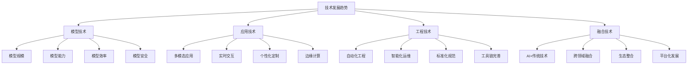

# 技术发展趋势

## 🎯 核心定义

### 什么是技术发展趋势？
技术发展趋势是指提示词工程领域技术发展的方向、趋势和未来展望，包括技术演进、新兴技术、技术融合等方面的发展动态。

### 核心价值
- **前瞻性**：了解技术发展方向，提前布局
- **创新性**：把握技术机遇，推动创新发展
- **竞争性**：保持技术领先，提升竞争优势
- **投资性**：指导技术投资，优化资源配置

## 📊 技术趋势框架



## 🔍 技术趋势详解

### 1. 模型技术趋势
| 趋势方向 | 发展趋势 | 技术特点 | 应用影响 |
|----------|----------|----------|----------|
| **模型规模** | 参数规模持续扩大，能力不断增强 | 万亿级参数，多模态融合 | 处理能力大幅提升 |
| **模型能力** | 理解能力、生成能力、推理能力提升 | 更准确的理解，更自然的生成 | 应用效果显著改善 |
| **模型效率** | 计算效率、推理速度、资源消耗优化 | 更快的推理，更低的成本 | 应用门槛降低 |
| **模型安全** | 安全性、可靠性、可控性增强 | 更安全的输出，更可控的行为 | 应用风险降低 |

#### 模型技术趋势分析
```markdown
模型技术趋势分析：

1. 模型规模发展趋势
   - 当前：GPT-4约1.7万亿参数，PaLM 2约3400亿参数
   - 趋势：参数规模持续扩大，预计达到10万亿级
   - 影响：处理能力大幅提升，支持更复杂的任务
   - 挑战：计算资源需求巨大，训练成本高昂

2. 模型能力发展趋势
   - 理解能力：从文本理解扩展到多模态理解
   - 生成能力：从文本生成扩展到多模态生成
   - 推理能力：从简单推理扩展到复杂逻辑推理
   - 学习能力：从静态模型扩展到持续学习模型

3. 模型效率发展趋势
   - 计算效率：通过模型压缩、量化等技术提升效率
   - 推理速度：通过硬件优化、算法优化提升速度
   - 资源消耗：通过优化算法、硬件设计降低消耗
   - 成本控制：通过技术优化降低使用成本

4. 模型安全发展趋势
   - 输出安全：确保输出内容安全、无害
   - 行为可控：确保模型行为可控、可预测
   - 隐私保护：保护用户隐私和数据安全
   - 伦理合规：确保模型符合伦理和法规要求
```

### 2. 应用技术趋势
| 趋势方向 | 发展趋势 | 技术特点 | 应用影响 |
|----------|----------|----------|----------|
| **多模态应用** | 文本、图像、音频、视频融合应用 | 跨模态理解，统一处理 | 应用场景大幅扩展 |
| **实时交互** | 低延迟、高响应、流畅交互 | 实时处理，即时反馈 | 用户体验显著提升 |
| **个性化定制** | 用户画像、偏好学习、个性化服务 | 智能适配，精准服务 | 服务效果大幅提升 |
| **边缘计算** | 本地部署、边缘推理、离线处理 | 低延迟，隐私保护 | 应用场景扩展 |

#### 应用技术趋势分析
```markdown
应用技术趋势分析：

1. 多模态应用发展趋势
   - 技术融合：文本、图像、音频、视频技术融合
   - 统一处理：多模态数据的统一理解和处理
   - 跨模态生成：支持跨模态的内容生成
   - 应用扩展：从单一模态扩展到多模态应用

2. 实时交互发展趋势
   - 低延迟：响应时间从秒级降低到毫秒级
   - 高并发：支持大规模并发用户访问
   - 流畅体验：提供流畅、自然的交互体验
   - 智能响应：根据上下文提供智能响应

3. 个性化定制发展趋势
   - 用户画像：深度理解用户特征和需求
   - 偏好学习：学习用户偏好和行为模式
   - 个性化服务：提供个性化的服务和内容
   - 动态适配：根据用户变化动态调整服务

4. 边缘计算发展趋势
   - 本地部署：在用户设备上部署模型
   - 边缘推理：在边缘设备上进行推理
   - 离线处理：支持离线环境下的处理
   - 隐私保护：保护用户隐私和数据安全
```

### 3. 工程技术趋势
| 趋势方向 | 发展趋势 | 技术特点 | 应用影响 |
|----------|----------|----------|----------|
| **自动化工程** | 自动化开发、测试、部署、运维 | 全流程自动化，效率提升 | 开发效率大幅提升 |
| **智能化运维** | 智能监控、自动修复、预测维护 | 智能化运维，稳定性提升 | 运维效率显著提升 |
| **标准化规范** | 行业标准、技术规范、最佳实践 | 标准化发展，质量提升 | 行业水平整体提升 |
| **工具链完善** | 开发工具、测试工具、部署工具 | 工具链完善，易用性提升 | 使用门槛大幅降低 |

#### 工程技术趋势分析
```markdown
工程技术趋势分析：

1. 自动化工程发展趋势
   - 开发自动化：从代码生成到系统设计自动化
   - 测试自动化：从单元测试到端到端测试自动化
   - 部署自动化：从手动部署到全自动部署
   - 运维自动化：从手动运维到智能运维

2. 智能化运维发展趋势
   - 智能监控：基于AI的智能监控和告警
   - 自动修复：自动识别和修复问题
   - 预测维护：预测性维护和故障预防
   - 资源优化：智能资源调度和优化

3. 标准化规范发展趋势
   - 行业标准：建立行业技术标准和规范
   - 技术规范：制定技术开发和实施规范
   - 最佳实践：总结和推广最佳实践
   - 质量体系：建立完善的质量管理体系

4. 工具链完善发展趋势
   - 开发工具：提供完整的开发工具链
   - 测试工具：提供全面的测试工具集
   - 部署工具：提供简化的部署工具
   - 监控工具：提供智能的监控工具
```

### 4. 融合技术趋势
| 趋势方向 | 发展趋势 | 技术特点 | 应用影响 |
|----------|----------|----------|----------|
| **AI+传统技术** | AI与传统技术深度融合 | 技术融合，能力增强 | 传统行业数字化转型 |
| **跨领域融合** | 不同领域技术交叉融合 | 跨界创新，应用扩展 | 新兴应用场景涌现 |
| **生态整合** | 技术生态、产业生态整合 | 生态协同，价值提升 | 产业生态更加完善 |
| **平台化发展** | 技术平台化、服务化发展 | 平台化服务，易用性提升 | 使用门槛大幅降低 |

#### 融合技术趋势分析
```markdown
融合技术趋势分析：

1. AI+传统技术融合趋势
   - 技术融合：AI与传统技术的深度融合
   - 能力增强：传统技术能力得到AI增强
   - 应用扩展：传统应用场景得到扩展
   - 价值提升：传统技术价值得到提升

2. 跨领域融合趋势
   - 技术交叉：不同领域技术的交叉融合
   - 创新应用：产生新的应用场景和模式
   - 价值创造：创造新的商业价值
   - 生态扩展：扩展技术应用生态

3. 生态整合趋势
   - 技术生态：技术生态的整合和协同
   - 产业生态：产业生态的整合和协同
   - 价值生态：价值生态的整合和协同
   - 服务生态：服务生态的整合和协同

4. 平台化发展趋势
   - 技术平台：技术能力的平台化
   - 服务平台：服务能力的平台化
   - 生态平台：生态能力的平台化
   - 价值平台：价值创造的平台化
```

## 🛠️ 技术发展预测

### 短期预测（1-2年）
```markdown
短期技术发展预测：

1. 模型技术
   - 参数规模：达到10万亿级参数
   - 多模态：多模态能力显著提升
   - 效率：推理效率提升50%以上
   - 安全：安全性和可控性大幅提升

2. 应用技术
   - 实时交互：响应时间降低到100ms以内
   - 个性化：个性化程度显著提升
   - 边缘计算：边缘部署技术成熟
   - 多模态：多模态应用普及

3. 工程技术
   - 自动化：自动化程度达到80%以上
   - 智能化：智能化运维技术成熟
   - 标准化：行业标准基本建立
   - 工具链：工具链基本完善

4. 融合技术
   - AI+传统：深度融合应用普及
   - 跨领域：跨领域应用增多
   - 生态整合：生态整合加速
   - 平台化：平台化服务成熟
```

### 中期预测（3-5年）
```markdown
中期技术发展预测：

1. 模型技术
   - 参数规模：达到100万亿级参数
   - 通用智能：接近通用人工智能
   - 效率：推理效率提升10倍以上
   - 安全：安全性和可控性达到生产级

2. 应用技术
   - 实时交互：响应时间降低到10ms以内
   - 个性化：完全个性化服务
   - 边缘计算：边缘计算普及
   - 多模态：多模态成为标准

3. 工程技术
   - 自动化：全流程自动化
   - 智能化：完全智能化运维
   - 标准化：国际标准建立
   - 工具链：工具链完全成熟

4. 融合技术
   - AI+传统：深度融合成为常态
   - 跨领域：跨领域创新成为主流
   - 生态整合：生态整合完成
   - 平台化：平台化成为标准
```

### 长期预测（5-10年）
```markdown
长期技术发展预测：

1. 模型技术
   - 参数规模：达到1000万亿级参数
   - 通用智能：实现通用人工智能
   - 效率：推理效率提升100倍以上
   - 安全：安全性和可控性完全可控

2. 应用技术
   - 实时交互：响应时间降低到1ms以内
   - 个性化：完全个性化智能服务
   - 边缘计算：边缘计算成为主流
   - 多模态：多模态成为基础能力

3. 工程技术
   - 自动化：完全自动化工程
   - 智能化：完全智能化系统
   - 标准化：全球统一标准
   - 工具链：工具链完全智能化

4. 融合技术
   - AI+传统：技术边界消失
   - 跨领域：跨领域创新成为常态
   - 生态整合：全球生态整合
   - 平台化：平台化成为基础设施
```

## 📈 技术发展影响

### 对行业的影响
| 影响维度 | 影响内容 | 影响程度 | 应对策略 |
|----------|----------|----------|----------|
| **技术门槛** | 技术门槛降低，应用普及 | 高 | 提升技术能力，保持竞争优势 |
| **应用场景** | 应用场景大幅扩展 | 高 | 拓展应用领域，创新商业模式 |
| **竞争格局** | 竞争加剧，差异化重要 | 中 | 建立差异化优势，提升核心竞争力 |
| **商业模式** | 商业模式创新，服务化趋势 | 中 | 创新商业模式，提供增值服务 |

### 对个人的影响
| 影响维度 | 影响内容 | 影响程度 | 应对策略 |
|----------|----------|----------|----------|
| **技能要求** | 技能要求提升，持续学习重要 | 高 | 持续学习，提升技能水平 |
| **职业发展** | 职业机会增多，发展空间扩大 | 高 | 把握机遇，规划职业发展 |
| **工作方式** | 工作方式改变，协作更重要 | 中 | 适应变化，提升协作能力 |
| **创新能力** | 创新能力要求提升 | 中 | 培养创新思维，提升创新能力 |

## 🎯 发展建议

### 技术发展建议
```markdown
技术发展建议：

1. 技术投入
   - 加大技术研发投入
   - 关注前沿技术发展
   - 建立技术研发团队
   - 与高校和科研机构合作

2. 人才培养
   - 培养技术人才
   - 建立人才梯队
   - 提供培训和学习机会
   - 建立激励机制

3. 生态建设
   - 参与技术生态建设
   - 建立合作伙伴关系
   - 推动行业标准制定
   - 促进技术交流合作

4. 创新实践
   - 鼓励技术创新
   - 支持创新项目
   - 建立创新文化
   - 推动创新应用
```

### 应用发展建议
```markdown
应用发展建议：

1. 应用创新
   - 探索新的应用场景
   - 创新应用模式
   - 提升用户体验
   - 创造商业价值

2. 技术融合
   - 推动技术融合应用
   - 探索跨领域应用
   - 建立技术生态
   - 促进协同发展

3. 标准化
   - 参与标准制定
   - 推广最佳实践
   - 建立行业规范
   - 提升行业水平

4. 可持续发展
   - 关注技术伦理
   - 确保技术安全
   - 促进技术普惠
   - 推动可持续发展
```

## 🎓 学习要点

### 核心理解
- 技术发展趋势是动态变化的，需要持续关注
- 技术发展对行业和个人都有重要影响
- 把握技术趋势需要前瞻性思维和战略眼光
- 技术发展需要与业务需求相结合

### 实践建议
- 持续关注技术发展趋势和动态
- 积极参与技术交流和合作
- 培养技术敏感度和前瞻性思维
- 将技术趋势与业务发展相结合

## 🔗 相关链接
- [[05-2-2-新兴应用领域]] - 了解新兴应用领域
- [[05-2-3-挑战与机遇]] - 了解挑战与机遇
- [[05-2-4-未来展望]] - 了解未来展望
- [[04-1-1-提示词链式设计]] - 学习高级技术
