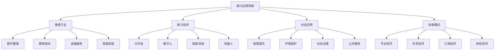

# 新兴应用领域

## 🎯 核心定义

### 什么是新兴应用领域？
新兴应用领域是指提示词工程技术在传统行业和新兴领域中产生的新应用场景和商业模式，通过技术创新和业务创新，创造新的价值和机会。

### 核心价值
- **市场拓展**：开拓新的市场空间和商业机会
- **价值创造**：创造新的商业价值和社会价值
- **创新驱动**：推动技术创新和业务创新
- **生态建设**：构建新的技术生态和产业生态

## 📊 应用领域框架



## 🔍 应用领域详解

### 1. 垂直行业应用
| 行业领域 | 应用场景 | 技术特点 | 商业价值 |
|----------|----------|----------|----------|
| **医疗健康** | 智能诊断、药物发现、健康管理 | 专业性强，准确性要求高 | 提升医疗效率，改善患者体验 |
| **教育培训** | 个性化学习、智能辅导、知识管理 | 个性化程度高，交互性强 | 提高教育质量，降低教育成本 |
| **金融服务** | 智能投顾、风险控制、客户服务 | 安全性要求高，合规性强 | 提升服务效率，降低运营成本 |
| **智能制造** | 生产优化、质量控制、设备维护 | 实时性要求高，可靠性强 | 提高生产效率，降低生产成本 |

#### 垂直行业应用分析
```markdown
垂直行业应用分析：

1. 医疗健康领域
   - 应用场景：智能诊断、药物发现、健康管理、医疗咨询
   - 技术特点：需要专业医学知识，准确性要求极高
   - 商业价值：提升医疗效率，改善患者体验，降低医疗成本
   - 发展前景：市场需求巨大，技术门槛较高，发展潜力巨大

2. 教育培训领域
   - 应用场景：个性化学习、智能辅导、知识管理、技能培训
   - 技术特点：需要教育心理学知识，个性化程度要求高
   - 商业价值：提高教育质量，降低教育成本，扩大教育覆盖
   - 发展前景：教育数字化转型加速，市场空间广阔

3. 金融服务领域
   - 应用场景：智能投顾、风险控制、客户服务、合规管理
   - 技术特点：安全性要求极高，合规性要求严格
   - 商业价值：提升服务效率，降低运营成本，改善客户体验
   - 发展前景：金融科技发展迅速，监管环境逐步完善

4. 智能制造领域
   - 应用场景：生产优化、质量控制、设备维护、供应链管理
   - 技术特点：实时性要求高，可靠性要求强
   - 商业价值：提高生产效率，降低生产成本，提升产品质量
   - 发展前景：工业4.0推进，智能制造需求增长
```

### 2. 新兴技术应用
| 技术领域 | 应用场景 | 技术特点 | 商业价值 |
|----------|----------|----------|----------|
| **元宇宙** | 虚拟世界、数字资产、社交互动 | 沉浸式体验，虚实融合 | 创造新的数字世界和商业机会 |
| **数字人** | 虚拟助手、数字员工、虚拟主播 | 拟人化程度高，交互自然 | 提供24/7服务，降低人力成本 |
| **智能驾驶** | 自动驾驶、智能导航、车联网 | 安全性要求极高，实时性强 | 提升出行安全，改善交通效率 |
| **机器人** | 服务机器人、工业机器人、社交机器人 | 物理交互，环境适应 | 替代人工劳动，提升工作效率 |

#### 新兴技术应用分析
```markdown
新兴技术应用分析：

1. 元宇宙应用
   - 应用场景：虚拟世界、数字资产、社交互动、虚拟办公
   - 技术特点：沉浸式体验，虚实融合，交互自然
   - 商业价值：创造新的数字世界，提供新的商业机会
   - 发展前景：技术逐步成熟，应用场景不断扩展

2. 数字人应用
   - 应用场景：虚拟助手、数字员工、虚拟主播、虚拟客服
   - 技术特点：拟人化程度高，交互自然，情感表达
   - 商业价值：提供24/7服务，降低人力成本，提升用户体验
   - 发展前景：技术快速进步，应用场景广泛

3. 智能驾驶应用
   - 应用场景：自动驾驶、智能导航、车联网、智能交通
   - 技术特点：安全性要求极高，实时性强，环境复杂
   - 商业价值：提升出行安全，改善交通效率，创造新的商业模式
   - 发展前景：技术逐步成熟，商业化进程加速

4. 机器人应用
   - 应用场景：服务机器人、工业机器人、社交机器人、医疗机器人
   - 技术特点：物理交互，环境适应，任务执行
   - 商业价值：替代人工劳动，提升工作效率，降低运营成本
   - 发展前景：技术不断进步，应用场景持续扩展
```

### 3. 社会应用领域
| 应用领域 | 应用场景 | 技术特点 | 社会价值 |
|----------|----------|----------|----------|
| **智慧城市** | 城市管理、公共服务、交通优化 | 系统性强，数据驱动 | 提升城市治理水平，改善市民生活 |
| **环境保护** | 环境监测、污染治理、生态保护 | 数据密集，预测性强 | 保护环境，促进可持续发展 |
| **社会治理** | 公共安全、社会服务、政策制定 | 复杂性高，影响面广 | 提升治理效率，促进社会和谐 |
| **公共服务** | 政务服务、民生服务、社会救助 | 普惠性强，服务面广 | 提升服务质量，促进社会公平 |

#### 社会应用领域分析
```markdown
社会应用领域分析：

1. 智慧城市应用
   - 应用场景：城市管理、公共服务、交通优化、环境监测
   - 技术特点：系统性强，数据驱动，实时响应
   - 社会价值：提升城市治理水平，改善市民生活质量
   - 发展前景：智慧城市建设加速，技术应用不断深化

2. 环境保护应用
   - 应用场景：环境监测、污染治理、生态保护、气候变化
   - 技术特点：数据密集，预测性强，长期监测
   - 社会价值：保护环境，促进可持续发展，应对气候变化
   - 发展前景：环保意识提升，技术应用需求增长

3. 社会治理应用
   - 应用场景：公共安全、社会服务、政策制定、危机应对
   - 技术特点：复杂性高，影响面广，决策支持
   - 社会价值：提升治理效率，促进社会和谐，维护社会稳定
   - 发展前景：社会治理现代化推进，技术应用需求增长

4. 公共服务应用
   - 应用场景：政务服务、民生服务、社会救助、公共咨询
   - 技术特点：普惠性强，服务面广，便民利民
   - 社会价值：提升服务质量，促进社会公平，改善民生
   - 发展前景：公共服务数字化加速，技术应用需求增长
```

### 4. 创新商业模式
| 商业模式 | 应用场景 | 技术特点 | 商业价值 |
|----------|----------|----------|----------|
| **平台经济** | 多边平台、生态服务、数据价值 | 网络效应，规模经济 | 构建生态，创造平台价值 |
| **共享经济** | 资源共享、服务共享、知识共享 | 资源优化，效率提升 | 提高资源利用率，降低使用成本 |
| **订阅经济** | 服务订阅、内容订阅、工具订阅 | 持续服务，用户粘性 | 稳定收入，长期价值 |
| **体验经济** | 个性化体验、沉浸式体验、情感体验 | 体验导向，价值创造 | 提升用户满意度，增强品牌价值 |

#### 创新商业模式分析
```markdown
创新商业模式分析：

1. 平台经济模式
   - 应用场景：多边平台、生态服务、数据价值变现
   - 技术特点：网络效应，规模经济，数据驱动
   - 商业价值：构建生态，创造平台价值，实现多方共赢
   - 发展前景：平台经济快速发展，生态价值凸显

2. 共享经济模式
   - 应用场景：资源共享、服务共享、知识共享
   - 技术特点：资源优化，效率提升，成本降低
   - 商业价值：提高资源利用率，降低使用成本，创造新的价值
   - 发展前景：共享经济模式成熟，应用场景不断扩展

3. 订阅经济模式
   - 应用场景：服务订阅、内容订阅、工具订阅
   - 技术特点：持续服务，用户粘性，稳定收入
   - 商业价值：稳定收入流，长期用户价值，可预测收入
   - 发展前景：订阅经济快速发展，用户接受度提升

4. 体验经济模式
   - 应用场景：个性化体验、沉浸式体验、情感体验
   - 技术特点：体验导向，价值创造，情感连接
   - 商业价值：提升用户满意度，增强品牌价值，差异化竞争
   - 发展前景：体验经济兴起，用户需求升级
```

## 🛠️ 应用发展策略

### 市场进入策略
```markdown
市场进入策略：

1. 市场分析
   - 市场规模：分析目标市场规模和增长潜力
   - 竞争格局：分析竞争对手和市场地位
   - 用户需求：分析用户需求和痛点
   - 技术门槛：分析技术门槛和进入壁垒

2. 产品定位
   - 目标用户：明确目标用户群体
   - 价值主张：明确产品价值主张
   - 差异化：建立差异化竞争优势
   - 商业模式：设计合适的商业模式

3. 技术实现
   - 技术选型：选择合适的技术方案
   - 开发计划：制定详细的开发计划
   - 质量保证：建立质量保证体系
   - 测试验证：进行充分的测试验证

4. 市场推广
   - 营销策略：制定营销推广策略
   - 渠道建设：建立销售和服务渠道
   - 用户教育：进行用户教育和培训
   - 反馈收集：收集用户反馈和改进建议
```

### 技术发展策略
```markdown
技术发展策略：

1. 技术研发
   - 研发投入：加大技术研发投入
   - 人才建设：建设技术研发团队
   - 合作创新：与高校和科研机构合作
   - 知识产权：保护知识产权和技术成果

2. 技术应用
   - 应用场景：探索新的应用场景
   - 技术融合：推动技术融合应用
   - 标准化：参与行业标准制定
   - 生态建设：构建技术应用生态

3. 技术优化
   - 性能优化：持续优化技术性能
   - 成本控制：控制技术应用成本
   - 安全可靠：确保技术安全可靠
   - 用户体验：提升用户体验

4. 技术推广
   - 技术分享：分享技术成果和经验
   - 行业交流：参与行业技术交流
   - 标准推广：推广技术标准和规范
   - 生态合作：促进生态合作发展
```

## 📈 应用发展预测

### 短期预测（1-2年）
```markdown
短期应用发展预测：

1. 垂直行业
   - 医疗健康：智能诊断应用普及，药物发现加速
   - 教育培训：个性化学习普及，智能辅导成熟
   - 金融服务：智能投顾普及，风险控制优化
   - 智能制造：生产优化应用，质量控制提升

2. 新兴技术
   - 元宇宙：虚拟世界应用，数字资产发展
   - 数字人：虚拟助手普及，数字员工应用
   - 智能驾驶：自动驾驶测试，智能导航成熟
   - 机器人：服务机器人普及，工业机器人优化

3. 社会应用
   - 智慧城市：城市管理优化，公共服务提升
   - 环境保护：环境监测普及，污染治理应用
   - 社会治理：公共安全优化，社会服务提升
   - 公共服务：政务服务数字化，民生服务优化

4. 商业模式
   - 平台经济：平台生态完善，数据价值凸显
   - 共享经济：共享模式成熟，应用场景扩展
   - 订阅经济：订阅服务普及，用户接受度提升
   - 体验经济：体验服务兴起，个性化需求增长
```

### 中期预测（3-5年）
```markdown
中期应用发展预测：

1. 垂直行业
   - 医疗健康：智能医疗普及，精准医疗发展
   - 教育培训：智慧教育成熟，终身学习普及
   - 金融服务：智能金融普及，普惠金融发展
   - 智能制造：智能制造成熟，工业4.0实现

2. 新兴技术
   - 元宇宙：元宇宙生态完善，虚拟现实融合
   - 数字人：数字人技术成熟，应用场景广泛
   - 智能驾驶：自动驾驶普及，智能交通实现
   - 机器人：机器人技术成熟，应用场景扩展

3. 社会应用
   - 智慧城市：智慧城市成熟，城市治理优化
   - 环境保护：环境治理智能化，可持续发展
   - 社会治理：社会治理现代化，公共服务优化
   - 公共服务：公共服务数字化，民生服务提升

4. 商业模式
   - 平台经济：平台经济成熟，生态价值凸显
   - 共享经济：共享经济普及，资源优化配置
   - 订阅经济：订阅经济成熟，服务模式创新
   - 体验经济：体验经济兴起，价值创造升级
```

## 🎯 发展建议

### 应用发展建议
```markdown
应用发展建议：

1. 市场导向
   - 深入了解市场需求和用户痛点
   - 关注市场趋势和竞争动态
   - 建立市场反馈机制
   - 持续优化产品和服务

2. 技术创新
   - 加大技术创新投入
   - 关注前沿技术发展
   - 推动技术融合应用
   - 建立技术创新机制

3. 生态建设
   - 构建应用生态体系
   - 建立合作伙伴关系
   - 促进生态协同发展
   - 创造生态价值

4. 可持续发展
   - 关注社会价值和环境责任
   - 确保技术安全和伦理合规
   - 促进技术普惠和公平
   - 推动可持续发展
```

## 🎓 学习要点

### 核心理解
- 新兴应用领域是技术发展的重要方向
- 应用创新需要与市场需求相结合
- 技术应用需要考虑社会价值和伦理责任
- 商业模式创新是应用成功的关键

### 实践建议
- 关注新兴应用领域的发展动态
- 深入了解行业需求和用户痛点
- 积极参与应用创新和实践
- 建立应用生态和合作伙伴关系

## 🔗 相关链接
- [[05-2-1-技术发展趋势]] - 了解技术发展趋势
- [[05-2-3-挑战与机遇]] - 了解挑战与机遇
- [[05-2-4-未来展望]] - 了解未来展望
- [[03-3-1-教育领域案例]] - 学习行业案例
