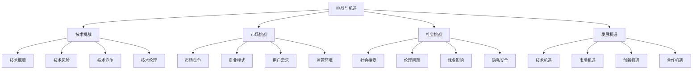

# 挑战与机遇

## 🎯 核心定义

### 什么是挑战与机遇？
挑战与机遇是指提示词工程在发展过程中面临的技术挑战、市场挑战、社会挑战，以及由此产生的技术机遇、市场机遇、创新机遇，需要客观分析并制定应对策略。

### 核心价值
- **风险识别**：识别发展过程中的风险和挑战
- **机遇把握**：发现和把握发展机遇
- **战略规划**：制定应对挑战和把握机遇的战略
- **竞争优势**：建立和保持竞争优势

## 📊 挑战机遇框架



## 🔍 挑战分析

### 1. 技术挑战
| 挑战类型 | 挑战内容 | 影响程度 | 应对策略 |
|----------|----------|----------|----------|
| **技术瓶颈** | 模型能力、计算资源、算法效率 | 高 | 加大研发投入，突破技术瓶颈 |
| **技术风险** | 模型安全、系统稳定、数据质量 | 中 | 建立风险管理体系，确保技术安全 |
| **技术竞争** | 技术同质化、专利竞争、人才竞争 | 中 | 建立技术优势，保护知识产权 |
| **技术伦理** | AI伦理、算法公平、技术责任 | 中 | 建立伦理框架，确保技术责任 |

#### 技术挑战分析
```markdown
技术挑战分析：

1. 技术瓶颈挑战
   - 模型能力：模型理解能力、生成能力、推理能力有限
   - 计算资源：计算资源需求巨大，成本高昂
   - 算法效率：算法效率有待提升，响应速度需要优化
   - 数据质量：数据质量参差不齐，影响模型效果

2. 技术风险挑战
   - 模型安全：模型输出可能包含有害内容
   - 系统稳定：系统稳定性有待提升，故障风险存在
   - 数据质量：数据质量问题可能影响模型效果
   - 隐私保护：用户隐私保护面临挑战

3. 技术竞争挑战
   - 技术同质化：技术方案趋同，差异化困难
   - 专利竞争：专利竞争激烈，知识产权保护重要
   - 人才竞争：技术人才稀缺，竞争激烈
   - 标准竞争：技术标准竞争，话语权重要

4. 技术伦理挑战
   - AI伦理：AI技术伦理问题日益突出
   - 算法公平：算法可能存在偏见和不公平
   - 技术责任：技术责任归属不明确
   - 社会影响：技术对社会的影响需要评估
```

### 2. 市场挑战
| 挑战类型 | 挑战内容 | 影响程度 | 应对策略 |
|----------|----------|----------|----------|
| **市场竞争** | 竞争激烈、价格战、差异化困难 | 高 | 建立差异化优势，提升竞争力 |
| **商业模式** | 商业模式不清晰、盈利困难 | 中 | 创新商业模式，寻找盈利点 |
| **用户需求** | 用户需求多样化、期望值高 | 中 | 深入了解用户需求，提升用户体验 |
| **监管环境** | 监管政策不确定、合规要求高 | 中 | 关注监管动态，确保合规运营 |

#### 市场挑战分析
```markdown
市场挑战分析：

1. 市场竞争挑战
   - 竞争激烈：市场竞争激烈，参与者众多
   - 价格战：价格竞争激烈，利润空间压缩
   - 差异化困难：产品差异化困难，同质化严重
   - 市场饱和：部分市场趋于饱和，增长空间有限

2. 商业模式挑战
   - 商业模式不清晰：商业模式不够清晰，盈利模式不明确
   - 盈利困难：盈利困难，成本控制压力大
   - 用户付费意愿：用户付费意愿不强，变现困难
   - 投资回报：投资回报周期长，风险较高

3. 用户需求挑战
   - 需求多样化：用户需求多样化，个性化要求高
   - 期望值高：用户期望值高，满意度要求严格
   - 使用门槛：技术使用门槛较高，用户接受度有限
   - 信任问题：用户对技术信任度有待提升

4. 监管环境挑战
   - 政策不确定：监管政策不确定，合规风险存在
   - 合规要求高：合规要求高，成本增加
   - 国际差异：不同国家监管要求差异较大
   - 标准缺失：行业标准缺失，规范不统一
```

### 3. 社会挑战
| 挑战类型 | 挑战内容 | 影响程度 | 应对策略 |
|----------|----------|----------|----------|
| **社会接受** | 社会接受度、公众认知、舆论环境 | 中 | 加强科普教育，提升社会认知 |
| **伦理问题** | AI伦理、算法公平、技术责任 | 中 | 建立伦理框架，确保技术责任 |
| **就业影响** | 就业替代、技能要求、职业转型 | 中 | 关注就业影响，促进职业转型 |
| **隐私安全** | 隐私保护、数据安全、信息安全 | 高 | 加强隐私保护，确保数据安全 |

#### 社会挑战分析
```markdown
社会挑战分析：

1. 社会接受挑战
   - 社会接受度：社会对AI技术接受度有待提升
   - 公众认知：公众对技术认知不足，存在误解
   - 舆论环境：舆论环境复杂，负面声音存在
   - 文化差异：不同文化背景接受度差异较大

2. 伦理问题挑战
   - AI伦理：AI技术伦理问题日益突出
   - 算法公平：算法可能存在偏见和不公平
   - 技术责任：技术责任归属不明确
   - 社会影响：技术对社会的影响需要评估

3. 就业影响挑战
   - 就业替代：AI技术可能替代部分工作岗位
   - 技能要求：技能要求提升，职业转型压力大
   - 职业转型：职业转型困难，适应能力要求高
   - 社会公平：技术发展可能加剧社会不平等

4. 隐私安全挑战
   - 隐私保护：用户隐私保护面临挑战
   - 数据安全：数据安全问题日益突出
   - 信息安全：信息安全风险存在
   - 监管要求：隐私保护监管要求日益严格
```

## 🚀 机遇分析

### 1. 技术机遇
| 机遇类型 | 机遇内容 | 机遇价值 | 把握策略 |
|----------|----------|----------|----------|
| **技术突破** | 模型能力提升、算法优化、硬件进步 | 高 | 加大研发投入，推动技术突破 |
| **技术融合** | 多模态融合、跨领域应用、生态整合 | 高 | 推动技术融合，拓展应用场景 |
| **技术标准化** | 行业标准、技术规范、最佳实践 | 中 | 参与标准制定，建立技术优势 |
| **技术开源** | 开源生态、社区建设、协作创新 | 中 | 参与开源生态，促进协作创新 |

#### 技术机遇分析
```markdown
技术机遇分析：

1. 技术突破机遇
   - 模型能力提升：模型能力持续提升，应用效果改善
   - 算法优化：算法不断优化，效率持续提升
   - 硬件进步：硬件技术进步，计算能力提升
   - 成本降低：技术成本持续降低，应用门槛下降

2. 技术融合机遇
   - 多模态融合：多模态技术融合，应用场景扩展
   - 跨领域应用：跨领域技术应用，创新机会增多
   - 生态整合：技术生态整合，协同效应凸显
   - 平台化发展：技术平台化发展，使用门槛降低

3. 技术标准化机遇
   - 行业标准：行业标准逐步建立，规范化发展
   - 技术规范：技术规范不断完善，质量提升
   - 最佳实践：最佳实践不断积累，经验共享
   - 认证体系：技术认证体系建立，质量保证

4. 技术开源机遇
   - 开源生态：开源生态日益完善，协作创新
   - 社区建设：技术社区建设，知识共享
   - 协作创新：协作创新模式，效率提升
   - 人才培养：开源项目培养人才，能力提升
```

### 2. 市场机遇
| 机遇类型 | 机遇内容 | 机遇价值 | 把握策略 |
|----------|----------|----------|----------|
| **市场扩张** | 新市场、新用户、新场景 | 高 | 拓展新市场，开发新用户 |
| **需求增长** | 需求增长、应用普及、价值提升 | 高 | 满足需求增长，提升应用价值 |
| **商业模式创新** | 新商业模式、新盈利点、新价值创造 | 中 | 创新商业模式，寻找新盈利点 |
| **国际合作** | 国际市场、技术合作、资源整合 | 中 | 拓展国际市场，加强国际合作 |

#### 市场机遇分析
```markdown
市场机遇分析：

1. 市场扩张机遇
   - 新市场：新兴市场不断涌现，增长空间巨大
   - 新用户：新用户群体不断增长，需求多样化
   - 新场景：新应用场景不断扩展，价值创造
   - 新领域：新应用领域不断拓展，机会增多

2. 需求增长机遇
   - 需求增长：市场需求持续增长，潜力巨大
   - 应用普及：技术应用不断普及，用户接受度提升
   - 价值提升：应用价值不断提升，商业价值凸显
   - 服务升级：服务需求升级，高端服务需求增长

3. 商业模式创新机遇
   - 新商业模式：新商业模式不断涌现，创新机会
   - 新盈利点：新盈利点不断发现，收入来源多样化
   - 新价值创造：新价值创造模式，价值链条延伸
   - 平台经济：平台经济发展，生态价值凸显

4. 国际合作机遇
   - 国际市场：国际市场机会增多，全球化发展
   - 技术合作：国际技术合作，资源共享
   - 资源整合：国际资源整合，优势互补
   - 标准统一：国际标准统一，市场扩大
```

### 3. 创新机遇
| 机遇类型 | 机遇内容 | 机遇价值 | 把握策略 |
|----------|----------|----------|----------|
| **应用创新** | 新应用、新功能、新体验 | 高 | 推动应用创新，创造新价值 |
| **服务创新** | 新服务、新模式、新体验 | 中 | 创新服务模式，提升用户体验 |
| **生态创新** | 新生态、新合作、新价值 | 中 | 构建新生态，创造协同价值 |
| **社会创新** | 社会价值、公益应用、可持续发展 | 中 | 关注社会价值，促进可持续发展 |

#### 创新机遇分析
```markdown
创新机遇分析：

1. 应用创新机遇
   - 新应用：新应用不断涌现，创新机会增多
   - 新功能：新功能不断开发，用户体验提升
   - 新体验：新用户体验不断创造，价值提升
   - 新场景：新应用场景不断扩展，机会增多

2. 服务创新机遇
   - 新服务：新服务模式不断涌现，价值创造
   - 新模式：新服务模式不断创新，效率提升
   - 新体验：新服务体验不断改善，用户满意度提升
   - 新价值：新服务价值不断创造，商业价值凸显

3. 生态创新机遇
   - 新生态：新生态体系不断构建，协同效应
   - 新合作：新合作模式不断涌现，资源共享
   - 新价值：新生态价值不断创造，价值链条延伸
   - 新机会：新生态机会不断涌现，发展空间扩大

4. 社会创新机遇
   - 社会价值：技术社会价值不断凸显，责任意识提升
   - 公益应用：公益应用不断扩展，社会效益提升
   - 可持续发展：可持续发展需求增长，绿色技术发展
   - 社会影响：技术社会影响日益重要，责任担当
```

## 🛠️ 应对策略

### 挑战应对策略
```markdown
挑战应对策略：

1. 技术挑战应对
   - 加大研发投入：增加技术研发投入，突破技术瓶颈
   - 建立风险管理：建立技术风险管理体系，确保技术安全
   - 保护知识产权：加强知识产权保护，建立技术优势
   - 建立伦理框架：建立技术伦理框架，确保技术责任

2. 市场挑战应对
   - 建立差异化优势：建立产品和服务差异化优势
   - 创新商业模式：创新商业模式，寻找可持续盈利点
   - 深入了解用户：深入了解用户需求，提升用户体验
   - 确保合规运营：关注监管动态，确保合规运营

3. 社会挑战应对
   - 加强科普教育：加强技术科普教育，提升社会认知
   - 建立伦理框架：建立技术伦理框架，确保技术责任
   - 关注就业影响：关注技术对就业的影响，促进职业转型
   - 加强隐私保护：加强用户隐私保护，确保数据安全
```

### 机遇把握策略
```markdown
机遇把握策略：

1. 技术机遇把握
   - 加大研发投入：加大技术研发投入，推动技术突破
   - 推动技术融合：推动技术融合应用，拓展应用场景
   - 参与标准制定：参与行业标准制定，建立技术优势
   - 参与开源生态：参与开源生态建设，促进协作创新

2. 市场机遇把握
   - 拓展新市场：积极拓展新市场，开发新用户群体
   - 满足需求增长：满足市场需求增长，提升应用价值
   - 创新商业模式：创新商业模式，寻找新盈利点
   - 加强国际合作：加强国际合作，拓展国际市场

3. 创新机遇把握
   - 推动应用创新：推动应用创新，创造新价值
   - 创新服务模式：创新服务模式，提升用户体验
   - 构建新生态：构建新生态体系，创造协同价值
   - 关注社会价值：关注技术社会价值，促进可持续发展
```

## 📈 发展建议

### 战略建议
```markdown
发展战略建议：

1. 技术发展战略
   - 加大技术投入：持续加大技术研发投入
   - 突破技术瓶颈：集中资源突破关键技术瓶颈
   - 建立技术优势：建立核心技术优势和壁垒
   - 推动技术融合：推动跨领域技术融合应用

2. 市场发展战略
   - 拓展市场空间：积极拓展新的市场空间
   - 建立竞争优势：建立可持续的竞争优势
   - 创新商业模式：持续创新商业模式
   - 加强国际合作：加强国际市场和合作

3. 创新发展策略
   - 推动应用创新：持续推动应用创新
   - 构建创新生态：构建开放创新生态
   - 培养创新人才：培养和吸引创新人才
   - 建立创新文化：建立鼓励创新的文化

4. 可持续发展策略
   - 关注社会价值：关注技术的社会价值
   - 确保技术安全：确保技术安全和可控
   - 促进技术普惠：促进技术普惠和公平
   - 推动可持续发展：推动技术和社会的可持续发展
```

## 🎓 学习要点

### 核心理解
- 挑战与机遇并存，需要客观分析和应对
- 挑战是发展的动力，机遇是发展的契机
- 应对挑战需要系统性和前瞻性思维
- 把握机遇需要敏锐性和执行力

### 实践建议
- 客观分析面临的挑战和机遇
- 制定系统性的应对和把握策略
- 建立风险管理和机遇管理机制
- 持续关注环境变化，动态调整策略

## 🔗 相关链接
- [[05-2-1-技术发展趋势]] - 了解技术发展趋势
- [[05-2-2-新兴应用领域]] - 了解新兴应用领域
- [[05-2-4-未来展望]] - 了解未来展望
- [[05-1-1-提示词工程流程]] - 学习工程化实践
