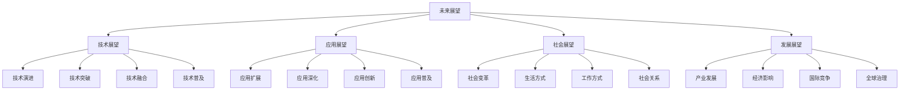

# 未来展望

## 🎯 核心定义

### 什么是未来展望？
未来展望是指对提示词工程未来发展趋势、技术演进、应用前景、社会影响等方面的前瞻性分析和预测，为未来发展提供战略指导和决策支持。

### 核心价值
- **战略指导**：为未来发展提供战略指导
- **决策支持**：为投资和决策提供参考
- **趋势把握**：把握未来发展趋势和机遇
- **风险预警**：预警未来可能的风险和挑战

## 📊 未来展望框架



## 🔍 技术展望

### 1. 技术演进趋势
| 时间维度 | 技术发展 | 关键特征 | 影响程度 |
|----------|----------|----------|----------|
| **短期（1-2年）** | 模型优化、效率提升、应用扩展 | 技术成熟化、应用普及化 | 高 |
| **中期（3-5年）** | 多模态融合、通用智能、边缘计算 | 技术融合化、智能化程度提升 | 极高 |
| **长期（5-10年）** | 通用人工智能、量子计算、脑机接口 | 技术革命化、范式转变 | 极高 |

#### 技术演进分析
```markdown
技术演进分析：

1. 短期技术演进（1-2年）
   - 模型优化：模型性能持续优化，准确性和效率提升
   - 效率提升：推理速度提升，成本降低，应用门槛下降
   - 应用扩展：应用场景不断扩展，垂直领域应用增多
   - 技术成熟：技术逐步成熟，标准化程度提升

2. 中期技术演进（3-5年）
   - 多模态融合：文本、图像、音频、视频深度融合
   - 通用智能：接近通用人工智能水平，能力大幅提升
   - 边缘计算：边缘计算普及，本地化部署成为主流
   - 技术融合：AI与传统技术深度融合，边界模糊

3. 长期技术演进（5-10年）
   - 通用人工智能：实现真正的通用人工智能
   - 量子计算：量子计算与AI结合，计算能力革命性提升
   - 脑机接口：脑机接口技术成熟，人机融合成为可能
   - 技术革命：技术范式根本性转变，新文明形态出现
```

### 2. 技术突破预测
| 突破领域 | 突破内容 | 预期时间 | 影响评估 |
|----------|----------|----------|----------|
| **模型能力** | 万亿级参数、多模态理解、推理能力 | 2-3年 | 极高 |
| **计算效率** | 量子计算、神经形态芯片、光计算 | 5-8年 | 高 |
| **交互方式** | 脑机接口、全息投影、触觉反馈 | 8-10年 | 中 |
| **安全可控** | 可解释AI、可控生成、伦理框架 | 3-5年 | 高 |

#### 技术突破预测
```markdown
技术突破预测：

1. 模型能力突破
   - 参数规模：达到100万亿级参数，接近人脑神经元数量
   - 多模态理解：实现真正的多模态理解和生成
   - 推理能力：具备复杂逻辑推理和创造性思维
   - 学习能力：实现持续学习和自我进化

2. 计算效率突破
   - 量子计算：量子计算与AI结合，计算能力指数级提升
   - 神经形态芯片：模拟人脑结构的芯片，效率大幅提升
   - 光计算：光计算技术成熟，速度和能耗优势明显
   - 边缘计算：边缘计算能力达到云端水平

3. 交互方式突破
   - 脑机接口：直接通过思维与AI交互
   - 全息投影：三维全息投影交互界面
   - 触觉反馈：虚拟触觉和力反馈技术
   - 情感交互：情感识别和情感生成技术

4. 安全可控突破
   - 可解释AI：AI决策过程完全可解释
   - 可控生成：AI生成内容完全可控
   - 伦理框架：完善的AI伦理和法律框架
   - 安全机制：多层次AI安全防护机制
```

## 🚀 应用展望

### 1. 应用扩展预测
| 应用领域 | 扩展内容 | 预期时间 | 市场影响 |
|----------|----------|----------|----------|
| **垂直行业** | 医疗、教育、金融、制造全覆盖 | 2-3年 | 极高 |
| **新兴领域** | 元宇宙、数字人、智能驾驶、机器人 | 3-5年 | 高 |
| **社会应用** | 智慧城市、环境保护、社会治理 | 5-8年 | 中 |
| **个人应用** | 个人助手、智能家居、健康管理 | 1-2年 | 高 |

#### 应用扩展预测
```markdown
应用扩展预测：

1. 垂直行业应用扩展
   - 医疗健康：智能诊断、药物发现、精准医疗普及
   - 教育培训：个性化学习、智能辅导、终身教育
   - 金融服务：智能投顾、风险控制、普惠金融
   - 智能制造：智能生产、质量控制、供应链优化

2. 新兴领域应用扩展
   - 元宇宙：虚拟世界、数字资产、社交互动
   - 数字人：虚拟助手、数字员工、虚拟主播
   - 智能驾驶：自动驾驶、智能交通、车联网
   - 机器人：服务机器人、工业机器人、社交机器人

3. 社会应用扩展
   - 智慧城市：城市管理、公共服务、环境监测
   - 环境保护：环境治理、生态保护、气候变化
   - 社会治理：公共安全、社会服务、政策制定
   - 公共服务：政务服务、民生服务、社会救助

4. 个人应用扩展
   - 个人助手：智能助手、生活管理、健康监测
   - 智能家居：智能控制、环境调节、安全防护
   - 健康管理：健康监测、疾病预防、康复指导
   - 娱乐休闲：游戏娱乐、内容创作、社交互动
```

### 2. 应用深化预测
| 深化维度 | 深化内容 | 预期效果 | 社会影响 |
|----------|----------|----------|----------|
| **个性化程度** | 完全个性化、精准服务、定制化 | 用户体验革命性提升 | 高 |
| **智能化水平** | 自主决策、自我学习、自我优化 | 服务效率和质量大幅提升 | 极高 |
| **集成化程度** | 系统集成、生态整合、平台化 | 应用便利性和效率提升 | 高 |
| **普及化程度** | 全民普及、普惠服务、平等 access | 社会公平和包容性提升 | 极高 |

#### 应用深化预测
```markdown
应用深化预测：

1. 个性化程度深化
   - 完全个性化：根据个人特征提供完全个性化服务
   - 精准服务：精准识别需求，提供精准服务
   - 定制化：根据个人偏好定制产品和服务
   - 动态适应：根据个人变化动态调整服务

2. 智能化水平深化
   - 自主决策：AI系统能够自主做出决策
   - 自我学习：AI系统能够持续学习和改进
   - 自我优化：AI系统能够自我优化和升级
   - 创造性：AI系统具备创造性思维能力

3. 集成化程度深化
   - 系统集成：不同应用系统深度集成
   - 生态整合：应用生态完全整合
   - 平台化：应用完全平台化
   - 无缝体验：提供无缝的用户体验

4. 普及化程度深化
   - 全民普及：技术应用全民普及
   - 普惠服务：提供普惠的技术服务
   - 平等access：确保技术应用的平等性
   - 数字包容：促进数字包容和社会公平
```

## 🌍 社会展望

### 1. 社会变革预测
| 变革领域 | 变革内容 | 预期时间 | 影响程度 |
|----------|----------|----------|----------|
| **生活方式** | 智能化生活、虚拟现实、人机融合 | 5-10年 | 极高 |
| **工作方式** | 远程工作、人机协作、技能转型 | 3-5年 | 高 |
| **教育方式** | 个性化教育、虚拟课堂、终身学习 | 5-8年 | 高 |
| **医疗方式** | 精准医疗、远程医疗、预防医学 | 3-5年 | 高 |

#### 社会变革预测
```markdown
社会变革预测：

1. 生活方式变革
   - 智能化生活：生活完全智能化，AI助手无处不在
   - 虚拟现实：虚拟现实成为生活的重要组成部分
   - 人机融合：人类与AI系统深度融合
   - 数字身份：数字身份成为主要身份形式

2. 工作方式变革
   - 远程工作：远程工作成为主流工作方式
   - 人机协作：人类与AI系统协作工作
   - 技能转型：技能要求发生根本性变化
   - 工作内容：工作内容从执行转向创造

3. 教育方式变革
   - 个性化教育：教育完全个性化
   - 虚拟课堂：虚拟现实课堂普及
   - 终身学习：终身学习成为常态
   - 技能导向：教育更加注重技能培养

4. 医疗方式变革
   - 精准医疗：医疗完全精准化
   - 远程医疗：远程医疗成为主流
   - 预防医学：从治疗转向预防
   - 健康管理：个人健康管理普及
```

### 2. 社会关系预测
| 关系类型 | 关系变化 | 预期影响 | 社会意义 |
|----------|----------|----------|----------|
| **人机关系** | 从工具到伙伴，从服务到协作 | 重新定义人机关系 | 极高 |
| **人际关系** | 虚拟社交、数字社交、情感连接 | 社交方式根本性变化 | 高 |
| **社会关系** | 数字社会、虚拟社区、全球连接 | 社会结构重新组织 | 高 |
| **国际关系** | 技术竞争、合作共赢、全球治理 | 国际关系重新定义 | 中 |

#### 社会关系预测
```markdown
社会关系预测：

1. 人机关系变化
   - 从工具到伙伴：AI从工具变为人类伙伴
   - 从服务到协作：从单向服务变为双向协作
   - 情感连接：人类与AI建立情感连接
   - 共同进化：人类与AI共同进化

2. 人际关系变化
   - 虚拟社交：虚拟社交成为主要社交方式
   - 数字社交：数字身份和数字关系
   - 情感连接：通过技术增强情感连接
   - 社交网络：社交网络重新组织

3. 社会关系变化
   - 数字社会：社会完全数字化
   - 虚拟社区：虚拟社区成为主要社区形式
   - 全球连接：全球社会连接更加紧密
   - 社会结构：社会结构重新组织

4. 国际关系变化
   - 技术竞争：技术成为国际竞争的核心
   - 合作共赢：技术合作成为国际关系主流
   - 全球治理：需要全球技术治理机制
   - 国际秩序：国际秩序重新定义
```

## 📈 发展展望

### 1. 产业发展预测
| 产业领域 | 发展预测 | 预期规模 | 增长潜力 |
|----------|----------|----------|----------|
| **AI产业** | 万亿级市场，核心产业地位 | 10万亿美元 | 极高 |
| **应用产业** | 传统产业AI化，新产业涌现 | 50万亿美元 | 高 |
| **服务产业** | AI服务化，平台经济主导 | 20万亿美元 | 高 |
| **基础设施** | 算力、数据、算法基础设施 | 5万亿美元 | 中 |

#### 产业发展预测
```markdown
产业发展预测：

1. AI产业发展
   - 市场规模：AI产业达到10万亿美元规模
   - 核心地位：AI成为核心产业和基础设施
   - 技术驱动：技术驱动产业发展
   - 生态完善：AI产业生态完全完善

2. 应用产业发展
   - 传统产业AI化：传统产业全面AI化
   - 新产业涌现：基于AI的新产业不断涌现
   - 产业融合：不同产业深度融合
   - 价值重构：产业价值链条重新构建

3. 服务产业发展
   - AI服务化：AI能力完全服务化
   - 平台经济：平台经济成为主导模式
   - 服务创新：服务模式不断创新
   - 价值创造：服务价值不断创造

4. 基础设施发展
   - 算力基础设施：算力成为基础设施
   - 数据基础设施：数据成为战略资源
   - 算法基础设施：算法成为核心能力
   - 网络基础设施：网络连接全球
```

### 2. 经济影响预测
| 影响维度 | 影响内容 | 预期程度 | 社会意义 |
|----------|----------|----------|----------|
| **经济增长** | 新增长点、效率提升、创新驱动 | 极高 | 推动经济持续增长 |
| **就业结构** | 就业替代、新职业、技能要求 | 高 | 就业结构根本性变化 |
| **收入分配** | 数字鸿沟、技能溢价、社会公平 | 中 | 收入分配重新调整 |
| **国际竞争** | 技术竞争、产业竞争、标准竞争 | 高 | 国际竞争格局重塑 |

#### 经济影响预测
```markdown
经济影响预测：

1. 经济增长影响
   - 新增长点：AI成为新的经济增长点
   - 效率提升：全要素生产率大幅提升
   - 创新驱动：创新成为经济增长主要动力
   - 持续增长：推动经济持续高质量增长

2. 就业结构影响
   - 就业替代：部分工作岗位被AI替代
   - 新职业：新的职业和岗位不断涌现
   - 技能要求：技能要求发生根本性变化
   - 就业转型：就业结构根本性转型

3. 收入分配影响
   - 数字鸿沟：数字鸿沟可能加剧
   - 技能溢价：技能溢价更加明显
   - 社会公平：需要关注社会公平问题
   - 收入调整：收入分配结构重新调整

4. 国际竞争影响
   - 技术竞争：技术成为国际竞争核心
   - 产业竞争：产业竞争更加激烈
   - 标准竞争：技术标准竞争激烈
   - 格局重塑：国际竞争格局重新塑造
```

## 🎯 发展建议

### 战略建议
```markdown
未来发展战略建议：

1. 技术发展战略
   - 加大研发投入：持续加大技术研发投入
   - 突破关键技术：集中资源突破关键技术
   - 建立技术优势：建立核心技术优势
   - 推动技术融合：推动跨领域技术融合

2. 产业发展战略
   - 产业升级：推动传统产业AI化升级
   - 新兴产业：培育和发展新兴产业
   - 生态建设：构建完善的产业生态
   - 国际合作：加强国际产业合作

3. 人才培养战略
   - 教育改革：推动教育体系改革
   - 技能培训：加强技能培训和转型
   - 人才引进：吸引和培养高端人才
   - 终身学习：建立终身学习体系

4. 社会治理战略
   - 法规完善：完善相关法律法规
   - 伦理框架：建立AI伦理框架
   - 安全机制：建立安全保障机制
   - 国际合作：加强国际治理合作
```

### 行动建议
```markdown
未来行动建议：

1. 个人层面
   - 持续学习：持续学习新技术和新技能
   - 适应变化：积极适应技术和社会变化
   - 创新思维：培养创新思维和创造力
   - 社会责任：承担技术发展的社会责任

2. 企业层面
   - 技术投入：加大技术研发和投入
   - 人才培养：培养和吸引技术人才
   - 创新实践：积极进行技术创新实践
   - 社会责任：承担企业社会责任

3. 政府层面
   - 政策支持：制定支持技术发展的政策
   - 投资引导：引导社会投资方向
   - 人才培养：加强人才培养和引进
   - 国际合作：加强国际技术合作

4. 社会层面
   - 社会认知：提升社会对技术的认知
   - 伦理讨论：开展技术伦理讨论
   - 公平包容：促进技术公平和包容
   - 可持续发展：推动技术可持续发展
```

## 🎓 学习要点

### 核心理解
- 未来展望需要基于当前趋势进行合理预测
- 技术发展将深刻影响社会各个方面
- 未来发展既有机遇也有挑战
- 需要积极应对变化，把握发展机遇

### 实践建议
- 持续关注技术发展趋势
- 积极适应技术和社会变化
- 培养前瞻性思维和战略眼光
- 承担技术发展的社会责任

## 🔗 相关链接
- [[05-2-1-技术发展趋势]] - 了解技术发展趋势
- [[05-2-2-新兴应用领域]] - 了解新兴应用领域
- [[05-2-3-挑战与机遇]] - 了解挑战与机遇
- [[05-3-系统整合总结]] - 学习系统整合总结
