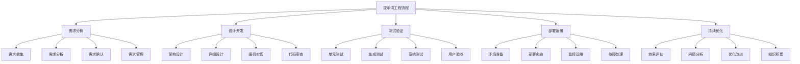

# 提示词工程流程

## 🎯 核心定义

### 什么是提示词工程流程？
提示词工程流程是指将提示词开发、测试、部署、运维等各个环节系统化、标准化，形成完整的工程化流程体系，确保提示词项目的成功交付和持续运营。

### 核心价值
- **标准化**：建立统一的工程标准和规范
- **效率提升**：提高开发效率和交付质量
- **风险控制**：降低项目风险和失败概率
- **持续改进**：建立持续优化和改进机制

## 📊 工程化流程框架



## 🔍 流程阶段详解

### 1. 需求分析阶段
| 活动内容 | 输入 | 输出 | 关键成功因素 |
|----------|------|------|--------------|
| **需求收集** | 业务需求、用户反馈 | 需求文档 | 全面性、准确性 |
| **需求分析** | 需求文档、技术约束 | 分析报告 | 深度分析、可行性评估 |
| **需求确认** | 分析报告、干系人 | 确认需求 | 共识达成、优先级明确 |
| **需求管理** | 确认需求、变更请求 | 需求基线 | 变更控制、版本管理 |

#### 需求分析模板
```markdown
需求分析阶段模板：
请完成需求分析阶段工作：
- 需求收集：[需求来源、收集方法、收集内容]
- 需求分析：[分析方法、分析内容、分析结果]
- 需求确认：[确认流程、确认标准、确认结果]
- 需求管理：[管理方法、变更控制、版本管理]

关键交付物：
- 需求规格说明书
- 需求分析报告
- 需求确认书
- 需求管理计划

示例：
请完成需求分析阶段工作：
- 需求收集：通过用户访谈、问卷调查、竞品分析收集需求
- 需求分析：使用5W1H方法分析需求，评估技术可行性
- 需求确认：与干系人确认需求，明确优先级和验收标准
- 需求管理：建立需求变更控制流程，维护需求基线

关键交付物：
- 需求规格说明书：详细描述功能需求和非功能需求
- 需求分析报告：需求分析结果和可行性评估
- 需求确认书：干系人确认的需求文档
- 需求管理计划：需求管理方法和变更控制流程
```

### 2. 设计开发阶段
| 活动内容 | 输入 | 输出 | 关键成功因素 |
|----------|------|------|--------------|
| **架构设计** | 需求规格、技术约束 | 架构设计文档 | 可扩展性、可维护性 |
| **详细设计** | 架构设计、功能需求 | 详细设计文档 | 完整性、一致性 |
| **编码实现** | 详细设计、编码规范 | 源代码 | 代码质量、功能实现 |
| **代码审查** | 源代码、审查标准 | 审查报告 | 质量保证、知识共享 |

#### 设计开发模板
```markdown
设计开发阶段模板：
请完成设计开发阶段工作：
- 架构设计：[设计原则、架构模式、技术选型]
- 详细设计：[模块设计、接口设计、数据设计]
- 编码实现：[编码规范、实现方法、质量要求]
- 代码审查：[审查标准、审查流程、审查结果]

关键交付物：
- 系统架构设计文档
- 详细设计文档
- 源代码和文档
- 代码审查报告

示例：
请完成设计开发阶段工作：
- 架构设计：采用微服务架构，使用容器化部署
- 详细设计：设计提示词管理、版本控制、测试验证模块
- 编码实现：遵循编码规范，实现单元测试覆盖
- 代码审查：进行同行评审，确保代码质量

关键交付物：
- 系统架构设计文档：系统架构、技术选型、部署方案
- 详细设计文档：模块设计、接口定义、数据结构
- 源代码和文档：完整源代码、API文档、用户手册
- 代码审查报告：审查结果、问题清单、改进建议
```

### 3. 测试验证阶段
| 活动内容 | 输入 | 输出 | 关键成功因素 |
|----------|------|------|--------------|
| **单元测试** | 源代码、测试用例 | 测试报告 | 覆盖率、质量保证 |
| **集成测试** | 模块代码、接口定义 | 集成测试报告 | 接口正确性、系统稳定性 |
| **系统测试** | 完整系统、测试计划 | 系统测试报告 | 功能完整性、性能达标 |
| **用户验收** | 系统功能、验收标准 | 验收报告 | 用户满意度、需求符合性 |

#### 测试验证模板
```markdown
测试验证阶段模板：
请完成测试验证阶段工作：
- 单元测试：[测试策略、测试用例、覆盖率要求]
- 集成测试：[测试方法、测试环境、测试数据]
- 系统测试：[测试计划、测试执行、问题跟踪]
- 用户验收：[验收标准、验收流程、验收结果]

关键交付物：
- 测试计划和用例
- 测试执行报告
- 缺陷跟踪报告
- 用户验收报告

示例：
请完成测试验证阶段工作：
- 单元测试：实现90%以上代码覆盖率，自动化测试
- 集成测试：验证模块间接口，测试系统集成
- 系统测试：功能测试、性能测试、安全测试
- 用户验收：用户参与验收，确认需求符合性

关键交付物：
- 测试计划和用例：详细的测试计划和测试用例
- 测试执行报告：测试执行结果和问题统计
- 缺陷跟踪报告：缺陷发现、修复、验证情况
- 用户验收报告：用户验收结果和满意度评估
```

### 4. 部署运维阶段
| 活动内容 | 输入 | 输出 | 关键成功因素 |
|----------|------|------|--------------|
| **环境准备** | 部署方案、环境要求 | 环境配置 | 环境一致性、安全性 |
| **部署实施** | 部署包、部署脚本 | 部署报告 | 部署成功率、回滚能力 |
| **监控运维** | 监控方案、运维流程 | 运维报告 | 系统稳定性、可用性 |
| **故障处理** | 故障信息、处理流程 | 故障报告 | 响应速度、解决效率 |

#### 部署运维模板
```markdown
部署运维阶段模板：
请完成部署运维阶段工作：
- 环境准备：[环境规划、配置管理、安全设置]
- 部署实施：[部署策略、部署流程、回滚方案]
- 监控运维：[监控体系、运维流程、告警机制]
- 故障处理：[故障响应、处理流程、经验总结]

关键交付物：
- 环境配置文档
- 部署实施报告
- 监控运维手册
- 故障处理记录

示例：
请完成部署运维阶段工作：
- 环境准备：准备开发、测试、生产环境，配置监控
- 部署实施：使用蓝绿部署，实现零停机部署
- 监控运维：建立7x24小时监控，自动告警
- 故障处理：建立故障响应机制，快速恢复服务

关键交付物：
- 环境配置文档：环境配置和部署说明
- 部署实施报告：部署过程和结果记录
- 监控运维手册：监控运维操作指南
- 故障处理记录：故障处理过程和经验总结
```

### 5. 持续优化阶段
| 活动内容 | 输入 | 输出 | 关键成功因素 |
|----------|------|------|--------------|
| **效果评估** | 运行数据、用户反馈 | 评估报告 | 客观评估、数据驱动 |
| **问题分析** | 问题信息、分析工具 | 分析报告 | 根因分析、影响评估 |
| **优化改进** | 分析结果、改进方案 | 改进报告 | 改进效果、持续优化 |
| **知识积累** | 项目经验、最佳实践 | 知识库 | 经验总结、知识共享 |

#### 持续优化模板
```markdown
持续优化阶段模板：
请完成持续优化阶段工作：
- 效果评估：[评估指标、评估方法、评估结果]
- 问题分析：[分析方法、分析工具、分析结果]
- 优化改进：[改进方案、实施计划、效果验证]
- 知识积累：[经验总结、最佳实践、知识分享]

关键交付物：
- 效果评估报告
- 问题分析报告
- 优化改进方案
- 知识积累文档

示例：
请完成持续优化阶段工作：
- 效果评估：评估系统性能、用户满意度、业务价值
- 问题分析：分析性能瓶颈、用户反馈、系统问题
- 优化改进：制定优化方案，实施改进措施
- 知识积累：总结项目经验，建立最佳实践库

关键交付物：
- 效果评估报告：系统效果评估和改进建议
- 问题分析报告：问题分析和解决方案
- 优化改进方案：优化计划和实施结果
- 知识积累文档：项目经验和最佳实践总结
```

## 🛠️ 流程实施指南

### 实施原则
```markdown
流程实施原则：

1. 标准化原则
   - 建立统一的流程标准和规范
   - 确保流程的一致性和可重复性
   - 定期评估和优化流程标准

2. 质量优先原则
   - 在每个阶段都注重质量保证
   - 建立质量检查点和验收标准
   - 持续改进质量保证机制

3. 风险控制原则
   - 识别和评估项目风险
   - 建立风险应对和控制机制
   - 定期监控和更新风险状态

4. 持续改进原则
   - 建立持续改进机制
   - 收集反馈和经验教训
   - 不断优化和完善流程
```

### 实施策略
```markdown
流程实施策略：

1. 分阶段实施
   - 从简单项目开始实施
   - 逐步扩展到复杂项目
   - 积累经验和最佳实践

2. 工具支持
   - 选择合适的工具和平台
   - 建立工具集成和自动化
   - 提供工具培训和支持

3. 团队培训
   - 提供流程培训和教育
   - 建立内部专家和导师
   - 促进知识分享和经验交流

4. 文化建立
   - 建立工程化文化
   - 推广最佳实践
   - 鼓励创新和改进
```

## 📈 流程效果评估

### 评估指标
| 评估维度 | 评估指标 | 评估方法 | 改进策略 |
|----------|----------|----------|----------|
| **效率指标** | 开发周期、交付速度 | 时间统计 | 流程优化、工具改进 |
| **质量指标** | 缺陷率、用户满意度 | 质量分析 | 质量保证、测试改进 |
| **成本指标** | 开发成本、维护成本 | 成本分析 | 成本控制、效率提升 |
| **风险指标** | 项目成功率、风险事件 | 风险统计 | 风险控制、预防措施 |

### 评估方法
```markdown
流程效果评估方法：

1. 定量评估
   - 收集和分析项目数据
   - 计算关键绩效指标
   - 对比历史数据和行业标准

2. 定性评估
   - 收集干系人反馈
   - 分析项目经验和教训
   - 评估流程适用性和有效性

3. 综合评估
   - 结合定量和定性评估结果
   - 分析流程优势和不足
   - 制定改进计划和措施

4. 持续评估
   - 建立定期评估机制
   - 跟踪改进效果
   - 持续优化流程
```

## 🎯 最佳实践

### 实践建议
```markdown
流程实施最佳实践：

1. 流程定制
   - 根据组织特点定制流程
   - 平衡标准化和灵活性
   - 定期评估和调整流程

2. 工具集成
   - 选择支持流程的工具
   - 实现工具间集成和自动化
   - 提供工具培训和支持

3. 团队协作
   - 建立跨职能团队
   - 促进沟通和协作
   - 建立知识分享机制

4. 持续改进
   - 建立改进机制
   - 收集反馈和建议
   - 持续优化流程
```

## ⚠️ 注意事项

### 风险提示
```markdown
流程实施风险提示：

1. 过度流程化风险
   - 风险：流程过于复杂，影响效率
   - 缓解：保持流程简洁，注重实用性

2. 工具依赖风险
   - 风险：过度依赖工具，忽视人员能力
   - 缓解：平衡工具和人员，注重能力建设

3. 变更管理风险
   - 风险：流程变更管理不当
   - 缓解：建立变更控制机制，充分沟通

4. 文化冲突风险
   - 风险：新流程与现有文化冲突
   - 缓解：渐进式实施，注重文化引导
```

## 🎓 学习要点

### 核心理解
- 工程化流程是提示词项目成功的基础
- 流程需要根据项目特点进行定制
- 工具和人员是流程实施的重要支撑
- 持续改进是流程成功的关键

### 实践建议
- 从简单项目开始实施流程
- 注重流程的实用性和可操作性
- 建立流程评估和改进机制
- 培养团队工程化意识和能力

## 🔗 相关链接
- [[05-1-2-团队协作规范]] - 学习团队协作规范
- [[05-1-3-文档知识管理]] - 学习文档知识管理
- [[05-1-4-质量管控体系]] - 学习质量管控体系
- [[04-1-4-提示词版本管理]] - 学习版本管理
