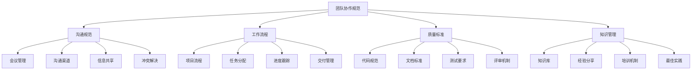

# 团队协作规范

## 🎯 核心定义

### 什么是团队协作规范？
团队协作规范是指为提示词工程团队制定的协作标准、流程和约定，确保团队成员能够高效协作，提高项目成功率和团队生产力。

### 核心价值
- **提高效率**：标准化协作流程，减少沟通成本
- **保证质量**：统一质量标准，确保交付质量
- **促进创新**：营造良好的协作氛围，激发创新
- **知识共享**：建立知识分享机制，提升团队能力

## 📊 协作规范框架



## 🔍 协作规范详解

### 1. 沟通规范
| 规范类型 | 规范内容 | 实施方法 | 效果体现 |
|----------|----------|----------|----------|
| **会议管理** | 会议类型、议程、记录 | 会议模板、时间管理 | 提高会议效率 |
| **沟通渠道** | 渠道选择、使用规范 | 工具配置、使用培训 | 优化沟通效果 |
| **信息共享** | 共享机制、权限管理 | 平台建设、流程设计 | 促进信息流通 |
| **冲突解决** | 冲突处理、调解机制 | 流程建立、培训实施 | 维护团队和谐 |

#### 沟通规范模板
```markdown
沟通规范模板：
请制定团队沟通规范：
- 会议管理：[会议类型、议程要求、记录标准]
- 沟通渠道：[渠道选择、使用规范、响应时间]
- 信息共享：[共享机制、权限管理、更新频率]
- 冲突解决：[处理流程、调解机制、升级规则]

实施要求：
- 会议效率：会议时间控制在1小时内，有明确议程
- 响应时间：紧急问题1小时内响应，一般问题24小时内响应
- 信息透明：重要信息及时共享，决策过程透明
- 冲突处理：及时处理冲突，维护团队和谐

示例：
请制定团队沟通规范：
- 会议管理：每日站会15分钟，周会1小时，月度回顾2小时
- 沟通渠道：紧急问题用电话，一般问题用即时通讯，正式沟通用邮件
- 信息共享：使用协作平台共享文档，建立知识库
- 冲突解决：先私下沟通，无法解决时寻求上级帮助

实施要求：
- 会议效率：会议有明确议程，按时开始和结束
- 响应时间：工作时间内1小时内响应，非工作时间24小时内响应
- 信息透明：项目进展、决策结果及时共享
- 冲突处理：以解决问题为导向，维护团队关系
```

### 2. 工作流程规范
| 规范类型 | 规范内容 | 实施方法 | 效果体现 |
|----------|----------|----------|----------|
| **项目流程** | 项目阶段、里程碑、交付物 | 流程定义、工具支持 | 确保项目进度 |
| **任务分配** | 任务分解、责任分配、优先级 | 任务管理工具、流程规范 | 提高任务执行效率 |
| **进度跟踪** | 进度报告、风险识别、问题跟踪 | 跟踪机制、报告模板 | 及时发现问题 |
| **交付管理** | 交付标准、验收流程、版本管理 | 标准制定、流程执行 | 确保交付质量 |

#### 工作流程规范模板
```markdown
工作流程规范模板：
请制定团队工作流程规范：
- 项目流程：[项目阶段、里程碑、交付物]
- 任务分配：[任务分解、责任分配、优先级管理]
- 进度跟踪：[跟踪机制、报告要求、问题处理]
- 交付管理：[交付标准、验收流程、版本控制]

流程要求：
- 项目规划：明确项目目标、范围、时间、资源
- 任务管理：任务分解到可执行级别，明确责任人和时间
- 进度监控：每日跟踪进度，每周报告状态
- 质量保证：每个交付物都有明确的验收标准

示例：
请制定团队工作流程规范：
- 项目流程：需求分析→设计开发→测试验证→部署运维→持续优化
- 任务分配：使用项目管理工具，任务分解到2-4小时级别
- 进度跟踪：每日站会跟踪进度，周报总结状态和问题
- 交付管理：每个阶段有明确交付物和验收标准

流程要求：
- 项目规划：项目启动时明确目标、范围、时间、资源
- 任务管理：任务有明确描述、验收标准、时间要求
- 进度监控：实时跟踪任务状态，及时识别风险和问题
- 质量保证：建立质量检查点，确保交付质量
```

### 3. 质量标准规范
| 规范类型 | 规范内容 | 实施方法 | 效果体现 |
|----------|----------|----------|----------|
| **代码规范** | 编码标准、命名规范、注释要求 | 规范制定、工具检查 | 提高代码质量 |
| **文档标准** | 文档模板、编写规范、更新要求 | 模板提供、培训实施 | 确保文档质量 |
| **测试要求** | 测试覆盖率、测试标准、测试流程 | 标准制定、工具支持 | 保证测试质量 |
| **评审机制** | 评审流程、评审标准、评审记录 | 流程建立、培训实施 | 提高评审效果 |

#### 质量标准规范模板
```markdown
质量标准规范模板：
请制定团队质量标准规范：
- 代码规范：[编码标准、命名规范、注释要求]
- 文档标准：[文档模板、编写规范、更新要求]
- 测试要求：[测试覆盖率、测试标准、测试流程]
- 评审机制：[评审流程、评审标准、评审记录]

质量要求：
- 代码质量：遵循编码规范，代码审查通过率100%
- 文档质量：文档完整、准确、及时更新
- 测试质量：单元测试覆盖率>80%，集成测试通过率100%
- 评审质量：所有交付物都经过评审，评审问题及时解决

示例：
请制定团队质量标准规范：
- 代码规范：使用统一的编码规范，命名清晰，注释完整
- 文档标准：使用标准模板，内容准确，及时更新
- 测试要求：单元测试覆盖率>80%，所有测试用例通过
- 评审机制：代码审查、设计评审、文档评审

质量要求：
- 代码质量：代码符合规范，通过静态检查，评审无重大问题
- 文档质量：文档结构清晰，内容准确，版本控制规范
- 测试质量：测试用例完整，测试结果可靠，缺陷及时修复
- 评审质量：评审过程规范，问题跟踪到位，改进措施有效
```

### 4. 知识管理规范
| 规范类型 | 规范内容 | 实施方法 | 效果体现 |
|----------|----------|----------|----------|
| **知识库** | 知识分类、存储结构、检索机制 | 平台建设、分类体系 | 提高知识利用率 |
| **经验分享** | 分享机制、分享内容、分享频率 | 活动组织、激励机制 | 促进经验传播 |
| **培训机制** | 培训计划、培训内容、培训评估 | 计划制定、实施执行 | 提升团队能力 |
| **最佳实践** | 实践总结、实践推广、实践更新 | 总结机制、推广策略 | 提升整体水平 |

#### 知识管理规范模板
```markdown
知识管理规范模板：
请制定团队知识管理规范：
- 知识库：[知识分类、存储结构、检索机制]
- 经验分享：[分享机制、分享内容、分享频率]
- 培训机制：[培训计划、培训内容、培训评估]
- 最佳实践：[实践总结、实践推广、实践更新]

管理要求：
- 知识积累：及时记录和整理项目经验和知识
- 知识共享：定期分享经验和最佳实践
- 能力提升：持续学习和技能提升
- 知识更新：及时更新过时的知识和信息

示例：
请制定团队知识管理规范：
- 知识库：按技术、流程、工具分类，建立检索和标签系统
- 经验分享：每周技术分享，每月项目回顾，每季度最佳实践分享
- 培训机制：新员工培训、技能提升培训、外部培训
- 最佳实践：项目结束后总结，定期更新和推广

管理要求：
- 知识积累：项目过程中及时记录，项目结束后系统总结
- 知识共享：主动分享经验，积极参与讨论
- 能力提升：制定个人学习计划，参与培训和学习
- 知识更新：定期审查和更新知识库内容
```

## 🛠️ 协作工具和平台

### 工具选择指南
| 工具类型 | 推荐工具 | 主要功能 | 适用场景 |
|----------|----------|----------|----------|
| **项目管理** | Jira、Trello、Asana | 任务管理、进度跟踪 | 项目协作 |
| **沟通协作** | Slack、Teams、钉钉 | 即时通讯、文件共享 | 日常沟通 |
| **文档协作** | Confluence、Notion、语雀 | 文档管理、知识库 | 知识管理 |
| **代码协作** | GitHub、GitLab、Bitbucket | 版本控制、代码审查 | 开发协作 |

#### 工具配置模板
```markdown
协作工具配置模板：
请配置团队协作工具：
- 项目管理工具：[工具选择、配置要求、使用规范]
- 沟通协作工具：[工具选择、频道设置、使用规范]
- 文档协作工具：[工具选择、结构设计、权限管理]
- 代码协作工具：[工具选择、仓库管理、流程规范]

配置要求：
- 工具集成：工具间能够有效集成，数据能够共享
- 权限管理：合理的权限设置，确保信息安全
- 使用培训：提供工具使用培训，确保团队熟练使用
- 维护更新：定期维护和更新工具配置

示例：
请配置团队协作工具：
- 项目管理工具：使用Jira管理任务，配置工作流和字段
- 沟通协作工具：使用Slack进行日常沟通，设置项目频道
- 文档协作工具：使用Confluence管理文档，建立知识库结构
- 代码协作工具：使用GitHub管理代码，配置分支策略

配置要求：
- 工具集成：Jira与Slack集成，GitHub与Confluence集成
- 权限管理：按角色设置权限，保护敏感信息
- 使用培训：提供工具使用培训，建立使用规范
- 维护更新：定期检查工具配置，及时更新
```

## 📈 协作效果评估

### 评估指标
| 评估维度 | 评估指标 | 评估方法 | 改进策略 |
|----------|----------|----------|----------|
| **沟通效率** | 响应时间、会议效率、信息传递 | 时间统计、满意度调查 | 优化沟通流程 |
| **协作质量** | 任务完成率、质量达标率、冲突解决 | 质量分析、问题统计 | 提高协作标准 |
| **知识共享** | 知识利用率、分享频率、学习效果 | 使用统计、效果评估 | 促进知识传播 |
| **团队满意度** | 工作满意度、团队氛围、个人成长 | 满意度调查、反馈收集 | 改善工作环境 |

### 评估方法
```markdown
协作效果评估方法：

1. 定量评估
   - 收集协作数据：响应时间、任务完成率、质量指标
   - 分析工具使用情况：使用频率、使用效果
   - 统计项目指标：进度、质量、成本

2. 定性评估
   - 团队满意度调查：工作环境、协作体验、个人成长
   - 干系人反馈：客户反馈、管理层评价
   - 团队氛围评估：沟通质量、冲突处理、创新氛围

3. 综合评估
   - 结合定量和定性评估结果
   - 分析协作优势和不足
   - 制定改进计划和措施

4. 持续评估
   - 建立定期评估机制
   - 跟踪改进效果
   - 持续优化协作规范
```

## 🎯 最佳实践

### 实践建议
```markdown
团队协作最佳实践：

1. 建立信任
   - 透明沟通，及时分享信息
   - 尊重差异，包容不同观点
   - 承担责任，主动解决问题
   - 支持他人，共同成长

2. 有效沟通
   - 明确沟通目标，选择合适的沟通方式
   - 倾听他人意见，理解不同观点
   - 及时反馈，避免信息滞后
   - 处理冲突，维护团队和谐

3. 知识共享
   - 主动分享经验和知识
   - 积极参与讨论和学习
   - 建立知识库，积累团队智慧
   - 持续学习，提升个人能力

4. 持续改进
   - 定期评估协作效果
   - 收集反馈和建议
   - 优化协作流程和工具
   - 建立改进文化
```

## ⚠️ 注意事项

### 风险提示
```markdown
团队协作风险提示：

1. 沟通风险
   - 风险：沟通不畅，信息传递错误
   - 缓解：建立沟通规范，使用合适的工具

2. 冲突风险
   - 风险：团队冲突，影响协作效果
   - 缓解：建立冲突处理机制，及时调解

3. 知识风险
   - 风险：知识孤岛，经验无法共享
   - 缓解：建立知识管理机制，促进分享

4. 工具风险
   - 风险：工具使用不当，影响效率
   - 缓解：提供工具培训，建立使用规范
```

## 🎓 学习要点

### 核心理解
- 团队协作是项目成功的关键因素
- 协作规范需要根据团队特点定制
- 工具和流程是协作的重要支撑
- 持续改进是协作成功的关键

### 实践建议
- 从团队实际情况出发制定规范
- 注重规范的可操作性和实用性
- 建立协作效果评估和改进机制
- 培养团队协作文化和意识

## 🔗 相关链接
- [[05-1-1-提示词工程流程]] - 学习工程流程
- [[05-1-3-文档知识管理]] - 学习文档知识管理
- [[05-1-4-质量管控体系]] - 学习质量管控体系
- [[04-3-2-提示词管理工具]] - 学习管理工具
