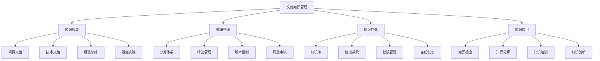

# 文档知识管理

## 🎯 核心定义

### 什么是文档知识管理？
文档知识管理是指对提示词工程相关的文档、知识、经验进行系统化收集、整理、存储、分享和应用，建立完整的知识管理体系，提升团队知识利用效率和创新能力。

### 核心价值
- **知识积累**：系统化积累项目经验和最佳实践
- **知识共享**：促进团队内部知识传播和复用
- **效率提升**：减少重复工作，提高开发效率
- **能力建设**：提升团队整体技术水平和创新能力

## 📊 知识管理框架



## 🔍 管理要素详解

### 1. 知识收集
| 收集类型 | 收集内容 | 收集方法 | 质量要求 |
|----------|----------|----------|----------|
| **项目文档** | 需求文档、设计文档、测试文档 | 项目过程中收集 | 完整性、准确性 |
| **技术文档** | API文档、架构文档、操作手册 | 开发过程中维护 | 及时性、实用性 |
| **经验总结** | 项目经验、问题解决、教训总结 | 项目结束后总结 | 深度性、可操作性 |
| **最佳实践** | 成功案例、优化方法、工具使用 | 持续积累和更新 | 有效性、可复制性 |

#### 知识收集模板
```markdown
知识收集模板：
请制定知识收集规范：
- 项目文档：[收集范围、收集时机、收集方法]
- 技术文档：[文档类型、维护要求、更新频率]
- 经验总结：[总结内容、总结方法、总结时机]
- 最佳实践：[实践类型、验证方法、推广策略]

收集要求：
- 及时性：项目过程中及时收集和记录
- 完整性：确保重要信息不遗漏
- 准确性：信息准确，避免错误和误导
- 实用性：内容实用，能够指导实际工作

示例：
请制定知识收集规范：
- 项目文档：收集需求、设计、测试、部署等全生命周期文档
- 技术文档：维护API文档、架构文档、操作手册等
- 经验总结：项目结束后总结成功经验、失败教训、改进建议
- 最佳实践：收集和验证有效的技术方案、工具使用、流程优化

收集要求：
- 及时性：项目过程中实时收集，避免事后补记
- 完整性：覆盖项目全生命周期，确保信息完整
- 准确性：信息经过验证，确保准确可靠
- 实用性：内容能够指导实际工作，具有可操作性
```

### 2. 知识整理
| 整理类型 | 整理内容 | 整理方法 | 整理标准 |
|----------|----------|----------|----------|
| **分类体系** | 知识分类、层级结构、关系映射 | 分类设计、结构规划 | 逻辑性、可扩展性 |
| **标签管理** | 标签体系、标签规则、标签应用 | 标签设计、规则制定 | 一致性、灵活性 |
| **版本控制** | 版本管理、变更记录、历史追踪 | 版本策略、变更管理 | 可追溯性、完整性 |
| **质量审核** | 内容审核、格式检查、质量评估 | 审核流程、质量标准 | 准确性、规范性 |

#### 知识整理模板
```markdown
知识整理模板：
请制定知识整理规范：
- 分类体系：[分类原则、分类结构、分类规则]
- 标签管理：[标签体系、标签规则、标签应用]
- 版本控制：[版本策略、变更管理、历史追踪]
- 质量审核：[审核流程、质量标准、审核要求]

整理要求：
- 逻辑性：分类和标签逻辑清晰，便于理解
- 一致性：整理标准一致，避免混乱
- 可扩展性：体系能够适应未来发展
- 易用性：便于检索和使用

示例：
请制定知识整理规范：
- 分类体系：按技术领域、项目类型、文档类型分类
- 标签管理：使用技术标签、项目标签、状态标签
- 版本控制：使用语义化版本，记录变更历史
- 质量审核：内容审核、格式检查、质量评估

整理要求：
- 逻辑性：分类体系逻辑清晰，层级合理
- 一致性：标签使用一致，命名规范统一
- 可扩展性：分类和标签体系能够扩展
- 易用性：便于用户检索和浏览
```

### 3. 知识存储
| 存储类型 | 存储内容 | 存储方法 | 存储要求 |
|----------|----------|----------|----------|
| **知识库** | 知识库结构、存储架构、数据模型 | 平台选择、架构设计 | 可靠性、可扩展性 |
| **检索系统** | 检索功能、索引机制、搜索算法 | 检索设计、性能优化 | 准确性、高效性 |
| **权限管理** | 访问控制、权限设置、安全策略 | 权限设计、安全实施 | 安全性、灵活性 |
| **备份恢复** | 备份策略、恢复机制、灾难恢复 | 备份方案、恢复测试 | 可靠性、完整性 |

#### 知识存储模板
```markdown
知识存储模板：
请制定知识存储规范：
- 知识库：[库结构、存储架构、数据模型]
- 检索系统：[检索功能、索引机制、搜索算法]
- 权限管理：[访问控制、权限设置、安全策略]
- 备份恢复：[备份策略、恢复机制、灾难恢复]

存储要求：
- 可靠性：数据存储可靠，避免丢失
- 性能：检索和访问性能良好
- 安全性：数据安全，权限控制有效
- 可维护性：系统易于维护和升级

示例：
请制定知识存储规范：
- 知识库：使用Confluence或Notion建立知识库
- 检索系统：支持全文检索、标签检索、分类浏览
- 权限管理：按角色设置权限，保护敏感信息
- 备份恢复：定期备份，建立恢复机制

存储要求：
- 可靠性：数据多重备份，确保不丢失
- 性能：检索响应时间<2秒，支持并发访问
- 安全性：数据加密存储，访问日志记录
- 可维护性：系统架构清晰，便于维护升级
```

### 4. 知识应用
| 应用类型 | 应用内容 | 应用方法 | 应用效果 |
|----------|----------|----------|----------|
| **知识检索** | 检索功能、检索技巧、检索优化 | 检索培训、使用指导 | 提高检索效率 |
| **知识分享** | 分享机制、分享内容、分享频率 | 分享活动、激励机制 | 促进知识传播 |
| **知识培训** | 培训计划、培训内容、培训方法 | 培训实施、效果评估 | 提升团队能力 |
| **知识创新** | 创新机制、创新方法、创新应用 | 创新激励、成果转化 | 推动创新发展 |

#### 知识应用模板
```markdown
知识应用模板：
请制定知识应用规范：
- 知识检索：[检索功能、检索技巧、检索优化]
- 知识分享：[分享机制、分享内容、分享频率]
- 知识培训：[培训计划、培训内容、培训方法]
- 知识创新：[创新机制、创新方法、创新应用]

应用要求：
- 易用性：检索和使用简单易用
- 有效性：知识应用能够产生实际价值
- 持续性：建立持续应用和改进机制
- 创新性：鼓励知识创新和应用

示例：
请制定知识应用规范：
- 知识检索：提供多种检索方式，支持智能推荐
- 知识分享：定期技术分享，建立分享文化
- 知识培训：新员工培训，技能提升培训
- 知识创新：鼓励创新，建立创新激励机制

应用要求：
- 易用性：界面友好，操作简单，学习成本低
- 有效性：知识应用能够解决实际问题
- 持续性：建立长期应用和改进机制
- 创新性：鼓励基于现有知识的创新应用
```

## 🛠️ 知识管理工具

### 工具选择指南
| 工具类型 | 推荐工具 | 主要功能 | 适用场景 |
|----------|----------|----------|----------|
| **知识库平台** | Confluence、Notion、语雀 | 文档管理、协作编辑 | 团队知识管理 |
| **版本控制** | Git、SVN、Mercurial | 版本管理、变更追踪 | 文档版本控制 |
| **检索系统** | Elasticsearch、Solr、Algolia | 全文检索、智能搜索 | 知识检索 |
| **协作平台** | SharePoint、Google Workspace | 协作编辑、权限管理 | 团队协作 |

#### 工具配置模板
```markdown
知识管理工具配置模板：
请配置知识管理工具：
- 知识库平台：[平台选择、结构设计、功能配置]
- 版本控制：[工具选择、策略配置、流程规范]
- 检索系统：[系统选择、索引配置、性能优化]
- 协作平台：[平台选择、权限设置、集成配置]

配置要求：
- 功能完整：满足知识管理全流程需求
- 易于使用：界面友好，操作简单
- 性能良好：响应速度快，支持并发
- 安全可靠：数据安全，系统稳定

示例：
请配置知识管理工具：
- 知识库平台：使用Confluence，设计分层知识结构
- 版本控制：使用Git管理文档版本，建立分支策略
- 检索系统：集成Elasticsearch，支持全文检索
- 协作平台：使用Slack集成，支持实时协作

配置要求：
- 功能完整：支持文档创建、编辑、版本控制、检索
- 易于使用：提供模板和向导，降低使用门槛
- 性能良好：检索响应时间<2秒，支持100+并发用户
- 安全可靠：数据加密，权限控制，定期备份
```

## 📈 知识管理效果评估

### 评估指标
| 评估维度 | 评估指标 | 评估方法 | 改进策略 |
|----------|----------|----------|----------|
| **知识积累** | 知识数量、知识质量、更新频率 | 统计分析、质量评估 | 提高积累质量 |
| **知识利用** | 检索频率、使用效果、满意度 | 使用统计、效果评估 | 优化检索体验 |
| **知识分享** | 分享频率、分享质量、参与度 | 活动统计、质量评估 | 促进知识分享 |
| **知识创新** | 创新数量、创新质量、应用效果 | 创新统计、效果评估 | 鼓励知识创新 |

### 评估方法
```markdown
知识管理效果评估方法：

1. 定量评估
   - 知识数量统计：文档数量、知识条目数量
   - 使用情况统计：检索次数、下载次数、访问量
   - 分享活动统计：分享次数、参与人数、反馈质量
   - 创新成果统计：创新项目数量、应用效果

2. 定性评估
   - 知识质量评估：内容准确性、实用性、完整性
   - 用户体验评估：易用性、满意度、改进建议
   - 团队能力评估：知识应用能力、创新能力
   - 业务价值评估：对业务发展的贡献

3. 综合评估
   - 结合定量和定性评估结果
   - 分析知识管理优势和不足
   - 制定改进计划和措施

4. 持续评估
   - 建立定期评估机制
   - 跟踪改进效果
   - 持续优化知识管理体系
```

## 🎯 最佳实践

### 实践建议
```markdown
知识管理最佳实践：

1. 建立知识文化
   - 营造知识分享的文化氛围
   - 鼓励团队成员主动分享知识
   - 建立知识分享的激励机制
   - 培养知识管理和应用能力

2. 优化知识结构
   - 设计清晰的知识分类体系
   - 建立有效的标签和检索机制
   - 定期整理和优化知识结构
   - 保持知识体系的逻辑性和一致性

3. 提高知识质量
   - 建立知识质量审核机制
   - 鼓励高质量的知识贡献
   - 定期更新和验证知识内容
   - 建立知识质量评估标准

4. 促进知识应用
   - 提供便捷的知识检索功能
   - 组织定期的知识分享活动
   - 建立知识应用的培训机制
   - 鼓励基于知识的创新应用
```

## ⚠️ 注意事项

### 风险提示
```markdown
知识管理风险提示：

1. 知识质量风险
   - 风险：知识内容质量参差不齐
   - 缓解：建立质量审核机制，提供质量指导

2. 知识孤岛风险
   - 风险：知识分散，难以共享
   - 缓解：建立统一的知识平台，促进知识共享

3. 知识过时风险
   - 风险：知识内容过时，影响使用效果
   - 缓解：建立知识更新机制，定期审查和更新

4. 知识安全风险
   - 风险：敏感知识泄露，影响安全
   - 缓解：建立权限管理机制，保护敏感信息
```

## 🎓 学习要点

### 核心理解
- 知识管理是团队能力建设的重要基础
- 知识管理需要系统化、标准化的方法
- 工具和平台是知识管理的重要支撑
- 持续改进是知识管理成功的关键

### 实践建议
- 从团队实际需求出发建立知识管理体系
- 注重知识质量和实用性
- 建立知识分享和应用的激励机制
- 持续优化知识管理工具和流程

## 🔗 相关链接
- [[05-1-1-提示词工程流程]] - 学习工程流程
- [[05-1-2-团队协作规范]] - 学习团队协作规范
- [[05-1-4-质量管控体系]] - 学习质量管控体系
- [[04-3-2-提示词管理工具]] - 学习管理工具
