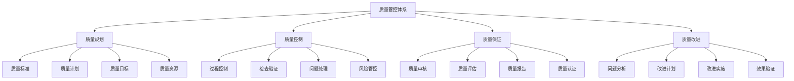

# 质量管控体系

## 🎯 核心定义

### 什么是质量管控体系？
质量管控体系是指为确保提示词工程项目的质量而建立的一套系统化、标准化的质量管理体系，包括质量规划、质量控制、质量保证和质量改进等全流程的质量管理活动。

### 核心价值
- **质量保证**：确保项目交付质量符合预期标准
- **风险控制**：降低质量风险，提高项目成功率
- **效率提升**：通过标准化流程提高工作效率
- **持续改进**：建立持续改进机制，不断提升质量水平

## 📊 质量管控框架



## 🔍 管控要素详解

### 1. 质量规划
| 规划要素 | 规划内容 | 实施方法 | 质量要求 |
|----------|----------|----------|----------|
| **质量标准** | 质量定义、质量指标、质量基准 | 标准制定、指标设计 | 明确性、可测量性 |
| **质量计划** | 质量活动、时间安排、资源分配 | 计划制定、资源规划 | 完整性、可执行性 |
| **质量目标** | 目标设定、目标分解、目标跟踪 | 目标管理、进度跟踪 | 可达成性、可衡量性 |
| **质量资源** | 人员配置、工具选择、预算安排 | 资源规划、资源配置 | 充足性、有效性 |

#### 质量规划模板
```markdown
质量规划模板：
请制定质量管控规划：
- 质量标准：[质量定义、质量指标、质量基准]
- 质量计划：[质量活动、时间安排、资源分配]
- 质量目标：[目标设定、目标分解、目标跟踪]
- 质量资源：[人员配置、工具选择、预算安排]

规划要求：
- 全面性：覆盖项目全生命周期
- 可操作性：计划具体可执行
- 可衡量性：目标明确可测量
- 可调整性：能够根据实际情况调整

示例：
请制定质量管控规划：
- 质量标准：功能正确性>99%，性能响应时间<2秒，用户满意度>8.5分
- 质量计划：设计阶段质量检查，开发阶段质量控制，测试阶段质量验证
- 质量目标：零重大缺陷，用户满意度>8.5分，项目按时交付率>95%
- 质量资源：质量工程师2名，测试人员3名，质量工具和平台

规划要求：
- 全面性：覆盖需求、设计、开发、测试、部署全流程
- 可操作性：每个质量活动都有具体的执行方法
- 可衡量性：所有质量目标都有明确的衡量标准
- 可调整性：根据项目进展和实际情况调整计划
```

### 2. 质量控制
| 控制要素 | 控制内容 | 控制方法 | 控制效果 |
|----------|----------|----------|----------|
| **过程控制** | 开发过程、测试过程、部署过程 | 过程监控、流程管理 | 确保过程合规 |
| **检查验证** | 代码检查、文档检查、测试验证 | 检查工具、验证方法 | 确保质量达标 |
| **问题处理** | 问题识别、问题分析、问题解决 | 问题管理、根因分析 | 及时解决问题 |
| **风险管控** | 风险识别、风险评估、风险应对 | 风险管理、预防措施 | 降低质量风险 |

#### 质量控制模板
```markdown
质量控制模板：
请制定质量控制方案：
- 过程控制：[控制点设置、控制方法、控制标准]
- 检查验证：[检查内容、检查方法、验证标准]
- 问题处理：[问题识别、问题分析、问题解决]
- 风险管控：[风险识别、风险评估、风险应对]

控制要求：
- 及时性：问题及时发现和处理
- 有效性：控制措施有效，能够预防问题
- 全面性：覆盖所有关键过程和环节
- 持续性：建立持续控制机制

示例：
请制定质量控制方案：
- 过程控制：在关键节点设置质量检查点，使用检查清单
- 检查验证：代码审查、文档检查、测试验证、用户验收
- 问题处理：建立问题跟踪系统，分级处理，及时解决
- 风险管控：识别质量风险，制定应对措施，持续监控

控制要求：
- 及时性：问题在24小时内识别，72小时内解决
- 有效性：控制措施能够有效预防和解决问题
- 全面性：覆盖开发、测试、部署全流程
- 持续性：建立日常质量控制机制
```

### 3. 质量保证
| 保证要素 | 保证内容 | 保证方法 | 保证效果 |
|----------|----------|----------|----------|
| **质量审核** | 过程审核、产品审核、体系审核 | 审核计划、审核执行 | 确保质量合规 |
| **质量评估** | 质量测量、质量分析、质量报告 | 评估方法、评估工具 | 客观评估质量 |
| **质量报告** | 质量状态、质量趋势、质量建议 | 报告模板、报告机制 | 提供质量信息 |
| **质量认证** | 质量认证、质量认可、质量标志 | 认证流程、认证标准 | 获得质量认可 |

#### 质量保证模板
```markdown
质量保证模板：
请制定质量保证方案：
- 质量审核：[审核计划、审核内容、审核方法]
- 质量评估：[评估指标、评估方法、评估频率]
- 质量报告：[报告内容、报告格式、报告频率]
- 质量认证：[认证标准、认证流程、认证要求]

保证要求：
- 客观性：评估客观公正，基于事实和数据
- 及时性：及时提供质量信息和报告
- 完整性：覆盖所有质量方面和环节
- 有效性：保证措施有效，能够提升质量

示例：
请制定质量保证方案：
- 质量审核：每月进行过程审核，每季度进行产品审核
- 质量评估：使用质量指标评估，每月评估一次
- 质量报告：生成月度质量报告，包含质量状态和趋势
- 质量认证：通过ISO 9001质量体系认证

保证要求：
- 客观性：基于客观数据和事实进行评估
- 及时性：质量报告每月5日前提供
- 完整性：覆盖功能、性能、安全、用户体验
- 有效性：保证措施能够有效提升质量水平
```

### 4. 质量改进
| 改进要素 | 改进内容 | 改进方法 | 改进效果 |
|----------|----------|----------|----------|
| **问题分析** | 问题识别、根因分析、影响评估 | 分析方法、分析工具 | 深入理解问题 |
| **改进计划** | 改进目标、改进措施、实施计划 | 计划制定、资源规划 | 系统化改进 |
| **改进实施** | 措施实施、进度跟踪、效果监控 | 实施管理、过程控制 | 确保改进效果 |
| **效果验证** | 效果测量、效果分析、效果确认 | 验证方法、验证工具 | 确认改进成功 |

#### 质量改进模板
```markdown
质量改进模板：
请制定质量改进方案：
- 问题分析：[问题识别、根因分析、影响评估]
- 改进计划：[改进目标、改进措施、实施计划]
- 改进实施：[措施实施、进度跟踪、效果监控]
- 效果验证：[效果测量、效果分析、效果确认]

改进要求：
- 系统性：改进措施系统化，覆盖根本原因
- 可操作性：改进计划具体可执行
- 可衡量性：改进效果可测量和验证
- 持续性：建立持续改进机制

示例：
请制定质量改进方案：
- 问题分析：使用5Why方法分析根因，评估问题影响
- 改进计划：制定改进目标，设计改进措施，安排实施计划
- 改进实施：按计划实施改进措施，跟踪实施进度
- 效果验证：测量改进效果，分析改进成果，确认改进成功

改进要求：
- 系统性：从根本原因出发，系统化解决问题
- 可操作性：改进措施具体明确，便于执行
- 可衡量性：改进效果有明确的衡量标准
- 持续性：建立持续改进的文化和机制
```

## 🛠️ 质量管控工具

### 工具选择指南
| 工具类型 | 推荐工具 | 主要功能 | 适用场景 |
|----------|----------|----------|----------|
| **质量规划** | Jira、Trello、Asana | 计划管理、任务跟踪 | 质量活动规划 |
| **质量控制** | SonarQube、ESLint、Checkstyle | 代码检查、质量分析 | 代码质量控制 |
| **质量测试** | Selenium、Jest、Pytest | 自动化测试、测试管理 | 质量测试验证 |
| **质量监控** | Grafana、Prometheus、ELK | 监控告警、数据分析 | 质量状态监控 |

#### 工具配置模板
```markdown
质量管控工具配置模板：
请配置质量管控工具：
- 质量规划工具：[工具选择、配置要求、使用规范]
- 质量控制工具：[工具选择、规则配置、集成方案]
- 质量测试工具：[工具选择、测试配置、自动化方案]
- 质量监控工具：[工具选择、监控配置、告警设置]

配置要求：
- 功能完整：满足质量管控全流程需求
- 易于使用：界面友好，操作简单
- 集成性好：工具间能够有效集成
- 性能稳定：工具稳定可靠，性能良好

示例：
请配置质量管控工具：
- 质量规划工具：使用Jira管理质量活动，配置工作流
- 质量控制工具：集成SonarQube进行代码质量检查
- 质量测试工具：使用Selenium进行自动化测试
- 质量监控工具：使用Grafana监控质量指标

配置要求：
- 功能完整：支持质量规划、控制、测试、监控全流程
- 易于使用：提供模板和向导，降低使用门槛
- 集成性好：工具间数据能够共享和集成
- 性能稳定：支持大规模项目，响应速度快
```

## 📈 质量管控效果评估

### 评估指标
| 评估维度 | 评估指标 | 评估方法 | 改进策略 |
|----------|----------|----------|----------|
| **质量水平** | 缺陷率、用户满意度、质量指标 | 质量测量、用户调研 | 提升质量水平 |
| **管控效率** | 管控成本、管控时间、管控效果 | 效率分析、成本统计 | 提高管控效率 |
| **风险控制** | 风险识别率、风险应对效果 | 风险分析、效果评估 | 加强风险控制 |
| **持续改进** | 改进数量、改进效果、改进文化 | 改进统计、效果评估 | 促进持续改进 |

### 评估方法
```markdown
质量管控效果评估方法：

1. 定量评估
   - 质量指标统计：缺陷率、用户满意度、质量得分
   - 效率指标统计：管控成本、管控时间、资源利用率
   - 风险指标统计：风险识别率、风险应对成功率
   - 改进指标统计：改进项目数量、改进效果

2. 定性评估
   - 质量文化评估：质量意识、质量行为、质量氛围
   - 管控效果评估：管控措施有效性、管控流程合理性
   - 团队能力评估：质量管控能力、问题解决能力
   - 客户满意度评估：客户反馈、客户评价

3. 综合评估
   - 结合定量和定性评估结果
   - 分析质量管控优势和不足
   - 制定改进计划和措施

4. 持续评估
   - 建立定期评估机制
   - 跟踪改进效果
   - 持续优化质量管控体系
```

## 🎯 最佳实践

### 实践建议
```markdown
质量管控最佳实践：

1. 建立质量文化
   - 营造质量第一的文化氛围
   - 培养全员质量意识
   - 建立质量激励机制
   - 推广质量最佳实践

2. 系统化管控
   - 建立完整的质量管控体系
   - 覆盖项目全生命周期
   - 实现质量管控标准化
   - 建立质量管控流程

3. 数据驱动决策
   - 建立质量数据收集机制
   - 使用数据分析指导决策
   - 建立质量趋势分析
   - 实现质量预测和预警

4. 持续改进
   - 建立持续改进机制
   - 鼓励质量改进创新
   - 分享质量改进经验
   - 建立质量改进文化
```

## ⚠️ 注意事项

### 风险提示
```markdown
质量管控风险提示：

1. 过度管控风险
   - 风险：管控过度，影响效率
   - 缓解：平衡质量和效率，注重实用性

2. 管控不足风险
   - 风险：管控不足，质量无法保证
   - 缓解：建立适当的管控机制，确保质量

3. 工具依赖风险
   - 风险：过度依赖工具，忽视人员能力
   - 缓解：平衡工具和人员，注重能力建设

4. 文化冲突风险
   - 风险：质量文化与现有文化冲突
   - 缓解：渐进式推进，注重文化引导
```

## 🎓 学习要点

### 核心理解
- 质量管控是项目成功的重要保障
- 质量管控需要系统化、标准化的方法
- 工具和人员是质量管控的重要支撑
- 持续改进是质量管控成功的关键

### 实践建议
- 从项目实际情况出发建立质量管控体系
- 注重质量管控的实用性和可操作性
- 建立质量管控效果评估和改进机制
- 培养团队质量意识和管控能力

## 🔗 相关链接
- [[05-1-1-提示词工程流程]] - 学习工程流程
- [[05-1-2-团队协作规范]] - 学习团队协作规范
- [[05-1-3-文档知识管理]] - 学习文档知识管理
- [[04-2-3-质量保证流程]] - 学习质量保证流程
