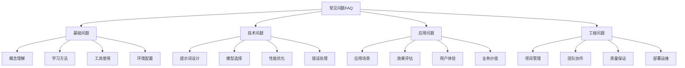

# 常见问题FAQ

## 🎯 核心定义

### 什么是常见问题FAQ？
常见问题FAQ是指提示词工程学习和实践过程中经常遇到的问题及其解答，通过系统化整理和分类，为学习者提供快速的问题解决指导。

### 核心价值
- **快速解决**：提供常见问题的快速解答
- **经验积累**：积累问题解决经验和最佳实践
- **学习指导**：为学习者提供实用的学习指导
- **知识传承**：传承问题解决的知识和方法

## 📊 FAQ分类框架



## 🔍 基础问题FAQ

### 1. 概念理解问题
| 问题类型 | 常见问题 | 问题解答 | 相关链接 |
|----------|----------|----------|----------|
| **基础概念** | 什么是提示词工程？ | 提示词工程是设计和优化AI模型输入的技术... | [[01-1-概念理解]] |
| **核心原理** | 提示词为什么有效？ | 提示词通过提供上下文和指导信息... | [[01-2-基本原理]] |
| **发展历程** | 提示词工程是如何发展的？ | 从简单的文本输入到复杂的结构化提示... | [[01-3-发展历程]] |
| **应用价值** | 提示词工程有什么价值？ | 提高AI模型性能、降低使用门槛... | [[01-4-基础认知总结]] |

#### 概念理解问题详解
```markdown
概念理解问题详解：

Q1: 什么是提示词工程？
A1: 提示词工程是设计和优化AI模型输入的技术，通过精心设计的提示词来引导AI模型产生期望的输出。它包括提示词的设计、优化、测试和部署等全流程。

Q2: 提示词为什么有效？
A2: 提示词有效的原因包括：
- 提供上下文信息，帮助模型理解任务
- 设定角色和场景，引导模型行为
- 提供示例和格式，规范输出结果
- 利用模型的预训练知识，激活相关能力

Q3: 提示词工程与传统编程有什么区别？
A3: 主要区别包括：
- 传统编程：明确的逻辑和算法
- 提示词工程：通过自然语言指导AI行为
- 传统编程：结果可预测和确定
- 提示词工程：结果有一定随机性
- 传统编程：需要编程技能
- 提示词工程：需要语言表达和设计能力

Q4: 提示词工程适用于哪些场景？
A4: 适用于以下场景：
- 文本生成和创作
- 问答和对话系统
- 代码生成和调试
- 数据分析和处理
- 创意设计和策划
- 教育和培训
```

### 2. 学习方法问题
| 问题类型 | 常见问题 | 问题解答 | 相关链接 |
|----------|----------|----------|----------|
| **学习路径** | 如何开始学习提示词工程？ | 建议从基础概念开始，逐步深入... | [[00-学习导航]] |
| **学习方法** | 有什么好的学习方法？ | 理论学习+实践练习+项目应用... | [[00-快速入门]] |
| **学习资源** | 有哪些学习资源推荐？ | 官方文档、教程、案例、工具... | [[资源库]] |
| **学习进度** | 如何评估学习进度？ | 通过项目实践和技能测试... | [[07-1-学习目标检查清单]] |

#### 学习方法问题详解
```markdown
学习方法问题详解：

Q1: 如何开始学习提示词工程？
A1: 建议的学习路径：
1. 学习基础概念和原理
2. 掌握基本的设计技巧
3. 进行实践练习
4. 参与实际项目
5. 持续学习和改进

Q2: 有什么好的学习方法？
A2: 推荐的学习方法：
- 理论学习：系统学习相关概念和原理
- 实践练习：通过实际项目练习技能
- 案例分析：学习成功案例和最佳实践
- 社区交流：参与社区讨论和经验分享
- 持续改进：不断优化和改进方法

Q3: 需要什么背景知识？
A3: 建议的背景知识：
- 基本的计算机和网络知识
- 一定的语言表达和逻辑思维能力
- 对AI技术的基本了解
- 相关领域的专业知识（根据应用场景）

Q4: 学习周期大概多长？
A4: 学习周期建议：
- 基础阶段：1-2个月
- 实践阶段：2-3个月
- 进阶阶段：3-6个月
- 专家阶段：6个月以上
```

### 3. 工具使用问题
| 问题类型 | 常见问题 | 问题解答 | 相关链接 |
|----------|----------|----------|----------|
| **工具选择** | 如何选择合适的工具？ | 根据需求、预算、技术栈选择... | [[04-3-1-主流AI平台对比]] |
| **工具配置** | 如何配置开发环境？ | 安装工具、配置参数、测试连接... | [[04-3-2-提示词管理工具]] |
| **工具使用** | 如何使用各种工具？ | 学习工具文档、实践操作... | [[04-3-3-自动化测试工具]] |
| **工具问题** | 工具使用中遇到问题怎么办？ | 查看文档、搜索解决方案... | [[06-2-错误诊断与修复]] |

#### 工具使用问题详解
```markdown
工具使用问题详解：

Q1: 如何选择合适的AI平台？
A1: 选择考虑因素：
- 功能需求：根据具体需求选择功能
- 性能要求：考虑响应速度和准确性
- 成本预算：平衡功能和成本
- 技术支持：考虑技术支持和文档质量
- 生态集成：考虑与现有系统的集成

Q2: 如何配置开发环境？
A2: 配置步骤：
1. 安装必要的工具和软件
2. 配置API密钥和访问权限
3. 设置开发环境和参数
4. 测试连接和功能
5. 配置版本控制和协作工具

Q3: 工具使用中遇到问题怎么办？
A3: 问题解决步骤：
1. 查看官方文档和帮助
2. 搜索相关问题和解决方案
3. 检查配置和参数设置
4. 尝试不同的方法和工具
5. 寻求社区帮助和支持

Q4: 如何提高工具使用效率？
A4: 提高效率的方法：
- 熟练掌握工具功能
- 建立工作流程和模板
- 使用自动化和脚本
- 参与培训和交流
- 持续学习和改进
```

## 🛠️ 技术问题FAQ

### 1. 提示词设计问题
| 问题类型 | 常见问题 | 问题解答 | 相关链接 |
|----------|----------|----------|----------|
| **设计原则** | 如何设计好的提示词？ | 遵循清晰性、具体性、上下文等原则... | [[02-1-1-清晰性原则]] |
| **结构设计** | 提示词应该包含哪些要素？ | Role、Task、Context、Format、Constraints... | [[02-2-1-Role角色设定]] |
| **优化技巧** | 如何优化提示词效果？ | 迭代优化、A/B测试、效果评估... | [[04-2-4-持续优化策略]] |
| **常见错误** | 提示词设计中的常见错误？ | 模糊不清、缺乏上下文、格式不规范... | [[06-2-错误诊断与修复]] |

#### 提示词设计问题详解
```markdown
提示词设计问题详解：

Q1: 如何设计好的提示词？
A1: 设计原则：
- 清晰性：表达清晰，避免歧义
- 具体性：提供具体的任务和要求
- 上下文：提供足够的上下文信息
- 格式：指定输出格式和结构
- 约束：设定必要的约束条件

Q2: 提示词应该包含哪些要素？
A2: 基本要素：
- Role：设定AI的角色和身份
- Task：明确具体的任务和要求
- Context：提供相关的上下文信息
- Format：指定输出的格式和结构
- Constraints：设定约束条件和限制

Q3: 如何优化提示词效果？
A3: 优化方法：
- 迭代优化：不断改进和调整
- A/B测试：对比不同版本的效果
- 效果评估：建立评估指标和标准
- 用户反馈：收集和分析用户反馈
- 持续改进：建立持续改进机制

Q4: 提示词设计中的常见错误？
A4: 常见错误：
- 任务描述模糊不清
- 缺乏必要的上下文信息
- 输出格式要求不明确
- 约束条件设置不当
- 角色设定不准确
```

### 2. 模型选择问题
| 问题类型 | 常见问题 | 问题解答 | 相关链接 |
|----------|----------|----------|----------|
| **模型对比** | 如何选择合适的模型？ | 根据任务类型、性能要求、成本考虑... | [[04-3-1-主流AI平台对比]] |
| **性能评估** | 如何评估模型性能？ | 准确性、响应时间、成本等指标... | [[04-2-1-效果评估指标]] |
| **模型切换** | 如何在不同模型间切换？ | 适配不同模型的API和参数... | [[04-1-2-动态提示词生成]] |
| **模型优化** | 如何优化模型使用？ | 参数调优、提示词优化、缓存策略... | [[04-1-4-提示词版本管理]] |

#### 模型选择问题详解
```markdown
模型选择问题详解：

Q1: 如何选择合适的AI模型？
A1: 选择考虑因素：
- 任务类型：根据具体任务选择适合的模型
- 性能要求：考虑准确性、速度、成本
- 数据规模：根据数据量选择模型规模
- 预算限制：平衡性能和成本
- 技术栈：考虑与现有系统的兼容性

Q2: 如何评估模型性能？
A2: 评估指标：
- 准确性：输出结果的正确性
- 完整性：输出结果的完整性
- 一致性：多次输出的一致性
- 响应时间：处理请求的时间
- 成本：使用成本和资源消耗

Q3: 如何在不同模型间切换？
A3: 切换策略：
- 统一接口：使用统一的API接口
- 参数适配：适配不同模型的参数
- 提示词调整：根据模型特点调整提示词
- 测试验证：充分测试和验证
- 渐进切换：采用渐进式切换策略

Q4: 如何优化模型使用？
A4: 优化方法：
- 参数调优：优化模型参数设置
- 提示词优化：改进提示词设计
- 缓存策略：实现结果缓存
- 批处理：使用批处理提高效率
- 负载均衡：实现负载均衡
```

### 3. 性能优化问题
| 问题类型 | 常见问题 | 问题解答 | 相关链接 |
|----------|----------|----------|----------|
| **响应速度** | 如何提高响应速度？ | 优化提示词、使用缓存、并行处理... | [[04-1-1-提示词链式设计]] |
| **准确性提升** | 如何提高输出准确性？ | 改进提示词设计、增加上下文... | [[04-2-3-质量保证流程]] |
| **成本控制** | 如何控制使用成本？ | 优化提示词长度、使用缓存... | [[04-2-4-持续优化策略]] |
| **资源管理** | 如何管理计算资源？ | 负载均衡、资源监控、自动扩缩容... | [[05-1-4-质量管控体系]] |

#### 性能优化问题详解
```markdown
性能优化问题详解：

Q1: 如何提高响应速度？
A1: 优化策略：
- 优化提示词：减少不必要的长度
- 使用缓存：缓存常用结果
- 并行处理：实现并行处理
- 模型选择：选择响应速度快的模型
- 网络优化：优化网络连接和传输

Q2: 如何提高输出准确性？
A2: 提升方法：
- 改进提示词设计：更清晰、更具体
- 增加上下文信息：提供更多背景
- 使用示例：提供好的示例
- 迭代优化：持续改进和优化
- 质量检查：建立质量检查机制

Q3: 如何控制使用成本？
A3: 成本控制：
- 优化提示词长度：减少token使用
- 使用缓存：避免重复计算
- 批量处理：提高处理效率
- 模型选择：选择性价比高的模型
- 监控使用：监控和限制使用量

Q4: 如何管理计算资源？
A4: 资源管理：
- 负载均衡：分散计算负载
- 资源监控：实时监控资源使用
- 自动扩缩容：根据负载自动调整
- 资源池化：共享和复用资源
- 成本优化：优化资源使用成本
```

## 📈 应用问题FAQ

### 1. 应用场景问题
| 问题类型 | 常见问题 | 问题解答 | 相关链接 |
|----------|----------|----------|----------|
| **场景选择** | 如何选择合适的应用场景？ | 根据需求、技术可行性、商业价值... | [[03-1-1-文本生成应用]] |
| **场景适配** | 如何适配不同应用场景？ | 调整提示词、优化流程、定制功能... | [[03-2-1-多轮对话设计]] |
| **场景扩展** | 如何扩展应用场景？ | 功能扩展、用户扩展、市场扩展... | [[05-2-2-新兴应用领域]] |
| **场景评估** | 如何评估应用场景效果？ | 用户反馈、业务指标、技术指标... | [[04-2-1-效果评估指标]] |

#### 应用场景问题详解
```markdown
应用场景问题详解：

Q1: 如何选择合适的应用场景？
A1: 选择考虑因素：
- 需求明确：有明确的需求和痛点
- 技术可行：技术方案可行
- 商业价值：有商业价值和市场前景
- 资源匹配：有足够的资源支持
- 风险可控：风险在可控范围内

Q2: 如何适配不同应用场景？
A2: 适配策略：
- 需求分析：深入分析具体需求
- 提示词调整：根据场景调整提示词
- 流程优化：优化处理流程
- 功能定制：定制特定功能
- 测试验证：充分测试和验证

Q3: 如何扩展应用场景？
A3: 扩展方法：
- 功能扩展：增加新功能
- 用户扩展：拓展用户群体
- 市场扩展：进入新市场
- 技术扩展：应用新技术
- 合作扩展：建立合作伙伴关系

Q4: 如何评估应用场景效果？
A4: 评估维度：
- 用户满意度：用户反馈和评价
- 业务指标：业务价值和效果
- 技术指标：技术性能和稳定性
- 成本效益：投入产出比
- 市场表现：市场接受度和竞争力
```

### 2. 效果评估问题
| 问题类型 | 常见问题 | 问题解答 | 相关链接 |
|----------|----------|----------|----------|
| **评估指标** | 如何设定评估指标？ | 根据业务目标、用户需求、技术特点... | [[04-2-1-效果评估指标]] |
| **评估方法** | 如何实施效果评估？ | 定量评估、定性评估、综合评估... | [[04-2-2-AB测试方法]] |
| **评估工具** | 使用什么工具进行评估？ | 自动化工具、统计分析工具、用户调研... | [[04-3-3-自动化测试工具]] |
| **评估优化** | 如何优化评估效果？ | 改进评估方法、优化评估工具... | [[04-2-4-持续优化策略]] |

#### 效果评估问题详解
```markdown
效果评估问题详解：

Q1: 如何设定评估指标？
A1: 指标设定原则：
- 业务导向：与业务目标对齐
- 用户中心：关注用户体验
- 技术可行：技术上可测量
- 全面覆盖：覆盖关键方面
- 动态调整：根据情况调整

Q2: 如何实施效果评估？
A2: 评估方法：
- 定量评估：使用数据和指标
- 定性评估：收集用户反馈
- 对比评估：与基准对比
- 长期评估：跟踪长期效果
- 综合评估：结合多种方法

Q3: 使用什么工具进行评估？
A3: 评估工具：
- 自动化工具：自动化测试和监控
- 统计分析：数据分析和统计
- 用户调研：用户访谈和问卷
- 专家评估：专家评审和评估
- 第三方工具：使用专业工具

Q4: 如何优化评估效果？
A4: 优化策略：
- 改进方法：优化评估方法
- 完善工具：改进评估工具
- 增加样本：扩大评估样本
- 提高频率：增加评估频率
- 持续改进：建立改进机制
```

## 🎯 工程问题FAQ

### 1. 项目管理问题
| 问题类型 | 常见问题 | 问题解答 | 相关链接 |
|----------|----------|----------|----------|
| **项目规划** | 如何规划提示词工程项目？ | 需求分析、资源规划、时间安排... | [[05-1-1-提示词工程流程]] |
| **进度控制** | 如何控制项目进度？ | 里程碑管理、风险控制、资源调配... | [[05-1-2-团队协作规范]] |
| **质量控制** | 如何保证项目质量？ | 质量标准、检查机制、改进流程... | [[05-1-4-质量管控体系]] |
| **风险管控** | 如何管控项目风险？ | 风险识别、评估、应对、监控... | [[05-2-3-挑战与机遇]] |

#### 项目管理问题详解
```markdown
项目管理问题详解：

Q1: 如何规划提示词工程项目？
A1: 规划要素：
- 需求分析：深入分析用户需求
- 技术方案：设计技术解决方案
- 资源规划：规划人力、时间、预算
- 时间安排：制定详细的时间计划
- 风险识别：识别潜在风险

Q2: 如何控制项目进度？
A2: 控制方法：
- 里程碑管理：设定关键里程碑
- 进度跟踪：定期跟踪进度
- 风险控制：及时识别和应对风险
- 资源调配：合理调配资源
- 沟通协调：加强团队沟通

Q3: 如何保证项目质量？
A3: 质量保证：
- 质量标准：建立质量标准
- 检查机制：建立质量检查机制
- 测试验证：充分测试和验证
- 用户反馈：收集用户反馈
- 持续改进：建立改进机制

Q4: 如何管控项目风险？
A4: 风险管控：
- 风险识别：全面识别风险
- 风险评估：评估风险影响
- 风险应对：制定应对策略
- 风险监控：持续监控风险
- 风险沟通：及时沟通风险
```

### 2. 团队协作问题
| 问题类型 | 常见问题 | 问题解答 | 相关链接 |
|----------|----------|----------|----------|
| **团队建设** | 如何建设高效团队？ | 人员配置、技能培训、文化建设... | [[05-1-2-团队协作规范]] |
| **沟通协作** | 如何提高沟通效率？ | 沟通规范、工具使用、流程优化... | [[05-1-2-团队协作规范]] |
| **知识管理** | 如何管理团队知识？ | 知识收集、整理、分享、应用... | [[05-1-3-文档知识管理]] |
| **冲突解决** | 如何解决团队冲突？ | 冲突识别、分析、解决、预防... | [[05-1-2-团队协作规范]] |

#### 团队协作问题详解
```markdown
团队协作问题详解：

Q1: 如何建设高效团队？
A1: 建设要素：
- 人员配置：合理配置团队成员
- 技能培训：提供技能培训
- 文化建设：建立团队文化
- 激励机制：建立激励机制
- 持续改进：持续改进团队

Q2: 如何提高沟通效率？
A2: 提高方法：
- 沟通规范：建立沟通规范
- 工具使用：使用合适的工具
- 流程优化：优化沟通流程
- 培训教育：提供沟通培训
- 反馈机制：建立反馈机制

Q3: 如何管理团队知识？
A3: 管理方法：
- 知识收集：系统收集知识
- 知识整理：分类整理知识
- 知识分享：促进知识分享
- 知识应用：推动知识应用
- 知识更新：持续更新知识

Q4: 如何解决团队冲突？
A4: 解决方法：
- 冲突识别：及时识别冲突
- 冲突分析：分析冲突原因
- 冲突解决：采用合适方法解决
- 冲突预防：建立预防机制
- 经验总结：总结解决经验
```

## 🎓 学习要点

### 核心理解
- FAQ是问题解决的重要资源
- 系统化整理FAQ有助于快速解决问题
- 持续更新FAQ保持内容的时效性
- 结合实践不断完善FAQ内容

### 实践建议
- 建立个人FAQ库
- 积极参与社区问答
- 总结问题解决经验
- 分享最佳实践

## 🔗 相关链接
- [[06-2-错误诊断与修复]] - 学习错误诊断
- [[06-3-性能问题排查]] - 学习性能排查
- [[06-4-最佳实践建议]] - 学习最佳实践
- [[07-1-学习目标检查清单]] - 进行学习评估
