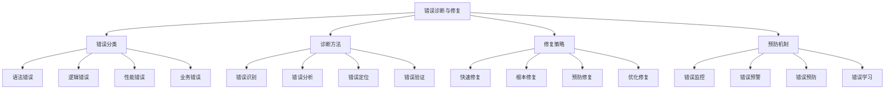

# 错误诊断与修复

## 🎯 核心定义

### 什么是错误诊断与修复？
错误诊断与修复是指对提示词工程中出现的各种错误进行系统化识别、分析、定位和修复的过程，通过建立完善的错误处理机制，确保系统的稳定性和可靠性。

### 核心价值
- **问题解决**：快速识别和解决各种错误
- **系统稳定**：提高系统稳定性和可靠性
- **经验积累**：积累错误处理经验和最佳实践
- **预防机制**：建立错误预防和预警机制

## 📊 错误分类框架



## 🔍 错误分类详解

### 1. 语法错误
| 错误类型 | 错误表现 | 错误原因 | 修复方法 |
|----------|----------|----------|----------|
| **格式错误** | 提示词格式不正确 | 格式规范不熟悉 | 学习格式规范，使用模板 |
| **语法错误** | 提示词语法错误 | 语言表达不准确 | 检查语法，优化表达 |
| **结构错误** | 提示词结构混乱 | 逻辑结构不清晰 | 重新设计结构，理清逻辑 |
| **编码错误** | 字符编码问题 | 编码设置不当 | 统一编码格式，检查字符 |

#### 语法错误诊断模板
```markdown
语法错误诊断模板：
请诊断以下语法错误：
- 错误现象：[具体错误表现]
- 错误位置：[错误发生位置]
- 错误类型：[语法错误类型]
- 错误原因：[可能的原因分析]

诊断步骤：
1. 检查格式规范
2. 验证语法正确性
3. 分析结构逻辑
4. 检查编码格式

修复建议：
- 格式修复：[具体修复方法]
- 语法修复：[语法修正建议]
- 结构修复：[结构优化建议]
- 编码修复：[编码问题解决]

示例：
请诊断以下语法错误：
- 错误现象：提示词无法被正确解析
- 错误位置：角色设定部分
- 错误类型：格式错误
- 错误原因：缺少必要的格式标记

诊断步骤：
1. 检查格式规范：确认是否遵循标准格式
2. 验证语法正确性：检查语法是否正确
3. 分析结构逻辑：确认结构是否合理
4. 检查编码格式：确认编码是否正确

修复建议：
- 格式修复：添加必要的格式标记
- 语法修复：修正语法错误
- 结构修复：优化结构设计
- 编码修复：统一编码格式
```

### 2. 逻辑错误
| 错误类型 | 错误表现 | 错误原因 | 修复方法 |
|----------|----------|----------|----------|
| **逻辑矛盾** | 提示词内部逻辑冲突 | 逻辑设计不当 | 重新设计逻辑，消除矛盾 |
| **逻辑缺失** | 缺少关键逻辑步骤 | 逻辑设计不完整 | 补充缺失逻辑，完善设计 |
| **逻辑混乱** | 逻辑顺序混乱 | 逻辑结构不清晰 | 重新组织逻辑，理清顺序 |
| **逻辑错误** | 逻辑推理错误 | 逻辑思维错误 | 修正逻辑错误，重新推理 |

#### 逻辑错误诊断模板
```markdown
逻辑错误诊断模板：
请诊断以下逻辑错误：
- 错误现象：[具体错误表现]
- 错误类型：[逻辑错误类型]
- 错误影响：[对系统的影响]
- 错误原因：[根本原因分析]

诊断方法：
1. 逻辑分析：分析逻辑结构和流程
2. 矛盾识别：识别逻辑矛盾和冲突
3. 缺失检查：检查逻辑缺失和漏洞
4. 验证测试：通过测试验证逻辑

修复策略：
- 矛盾解决：[解决逻辑矛盾的方法]
- 缺失补充：[补充逻辑缺失的方法]
- 结构优化：[优化逻辑结构的方法]
- 验证加强：[加强逻辑验证的方法]

示例：
请诊断以下逻辑错误：
- 错误现象：输出结果不符合预期
- 错误类型：逻辑矛盾
- 错误影响：影响系统功能和用户体验
- 错误原因：提示词中存在相互矛盾的指令

诊断方法：
1. 逻辑分析：分析提示词的逻辑结构
2. 矛盾识别：识别相互矛盾的指令
3. 缺失检查：检查逻辑缺失和漏洞
4. 验证测试：通过测试验证逻辑正确性

修复策略：
- 矛盾解决：消除相互矛盾的指令
- 缺失补充：补充必要的逻辑步骤
- 结构优化：优化逻辑结构设计
- 验证加强：加强逻辑验证机制
```

### 3. 性能错误
| 错误类型 | 错误表现 | 错误原因 | 修复方法 |
|----------|----------|----------|----------|
| **响应超时** | 请求响应时间过长 | 提示词过于复杂 | 优化提示词，简化逻辑 |
| **内存溢出** | 内存使用超出限制 | 数据量过大 | 优化数据处理，分批处理 |
| **CPU过载** | CPU使用率过高 | 计算复杂度高 | 优化算法，降低复杂度 |
| **网络错误** | 网络连接问题 | 网络不稳定 | 增加重试机制，优化网络 |

#### 性能错误诊断模板
```markdown
性能错误诊断模板：
请诊断以下性能错误：
- 错误现象：[具体性能问题]
- 性能指标：[相关性能指标]
- 影响范围：[影响的范围和程度]
- 根本原因：[性能问题的根本原因]

诊断工具：
1. 性能监控：使用性能监控工具
2. 日志分析：分析系统日志
3. 资源检查：检查系统资源使用
4. 压力测试：进行压力测试

优化策略：
- 算法优化：[优化算法的方法]
- 资源优化：[优化资源使用的方法]
- 架构优化：[优化系统架构的方法]
- 配置优化：[优化配置参数的方法]

示例：
请诊断以下性能错误：
- 错误现象：响应时间超过10秒
- 性能指标：平均响应时间12秒，超时率15%
- 影响范围：影响所有用户，用户体验严重下降
- 根本原因：提示词过于复杂，计算量过大

诊断工具：
1. 性能监控：使用APM工具监控性能
2. 日志分析：分析应用日志和错误日志
3. 资源检查：检查CPU、内存、网络使用情况
4. 压力测试：进行负载测试和压力测试

优化策略：
- 算法优化：简化提示词逻辑，减少计算量
- 资源优化：优化内存使用，减少资源消耗
- 架构优化：采用缓存机制，提高响应速度
- 配置优化：调整超时参数，优化配置
```

### 4. 业务错误
| 错误类型 | 错误表现 | 错误原因 | 修复方法 |
|----------|----------|----------|----------|
| **业务逻辑错误** | 业务规则实现错误 | 业务理解不准确 | 重新理解业务，修正逻辑 |
| **数据错误** | 输入输出数据错误 | 数据验证不充分 | 加强数据验证，修正数据 |
| **权限错误** | 权限控制错误 | 权限设计不当 | 重新设计权限，修正控制 |
| **流程错误** | 业务流程错误 | 流程设计不当 | 重新设计流程，修正步骤 |

#### 业务错误诊断模板
```markdown
业务错误诊断模板：
请诊断以下业务错误：
- 错误现象：[具体业务问题]
- 业务影响：[对业务的影响]
- 用户影响：[对用户的影响]
- 根本原因：[业务错误的根本原因]

诊断方法：
1. 业务分析：分析业务逻辑和流程
2. 数据验证：验证输入输出数据
3. 权限检查：检查权限控制逻辑
4. 流程验证：验证业务流程正确性

修复方案：
- 逻辑修正：[修正业务逻辑的方法]
- 数据修复：[修复数据问题的方法]
- 权限调整：[调整权限控制的方法]
- 流程优化：[优化业务流程的方法]

示例：
请诊断以下业务错误：
- 错误现象：用户无法完成特定操作
- 业务影响：影响业务流程，降低业务效率
- 用户影响：用户体验差，用户满意度下降
- 根本原因：业务逻辑实现错误，权限控制不当

诊断方法：
1. 业务分析：分析业务逻辑和实现
2. 数据验证：验证相关数据的正确性
3. 权限检查：检查权限控制逻辑
4. 流程验证：验证业务流程的完整性

修复方案：
- 逻辑修正：修正业务逻辑实现
- 数据修复：修复相关数据问题
- 权限调整：调整权限控制策略
- 流程优化：优化业务流程设计
```

## 🛠️ 诊断方法

### 1. 错误识别方法
| 识别方法 | 方法描述 | 适用场景 | 实施步骤 |
|----------|----------|----------|----------|
| **日志分析** | 分析系统日志和错误日志 | 系统错误、性能问题 | 收集日志、分析模式、定位问题 |
| **监控告警** | 使用监控系统发现错误 | 实时错误、性能异常 | 设置监控、配置告警、响应处理 |
| **用户反馈** | 收集用户反馈和投诉 | 用户体验问题、业务错误 | 收集反馈、分析问题、跟踪处理 |
| **测试发现** | 通过测试发现错误 | 功能错误、逻辑错误 | 设计测试、执行测试、分析结果 |

#### 错误识别实施指南
```markdown
错误识别实施指南：

1. 日志分析方法
   - 日志收集：建立完善的日志收集机制
   - 日志分析：使用工具分析日志模式
   - 问题定位：通过日志定位问题根源
   - 趋势分析：分析错误趋势和规律

2. 监控告警方法
   - 监控设置：设置关键指标监控
   - 告警配置：配置合理的告警阈值
   - 告警响应：建立告警响应机制
   - 告警分析：分析告警原因和影响

3. 用户反馈方法
   - 反馈收集：建立用户反馈收集机制
   - 反馈分析：分析用户反馈内容
   - 问题分类：对反馈问题进行分类
   - 跟踪处理：跟踪问题处理进度

4. 测试发现方法
   - 测试设计：设计全面的测试用例
   - 测试执行：执行自动化测试
   - 结果分析：分析测试结果
   - 问题跟踪：跟踪问题修复进度
```

### 2. 错误分析方法
| 分析方法 | 方法描述 | 分析内容 | 分析工具 |
|----------|----------|----------|----------|
| **根因分析** | 分析错误的根本原因 | 错误原因、影响链条 | 5Why分析、鱼骨图 |
| **影响分析** | 分析错误的影响范围 | 影响范围、影响程度 | 影响矩阵、风险评估 |
| **趋势分析** | 分析错误的发展趋势 | 错误趋势、变化规律 | 时间序列分析、统计图表 |
| **对比分析** | 对比不同时期的错误 | 错误对比、改进效果 | 对比分析、基准测试 |

#### 错误分析实施指南
```markdown
错误分析实施指南：

1. 根因分析方法
   - 问题描述：清晰描述问题现象
   - 原因分析：使用5Why方法分析原因
   - 影响链条：分析错误的影响链条
   - 根本原因：确定错误的根本原因

2. 影响分析方法
   - 影响识别：识别错误的影响范围
   - 影响评估：评估影响的程度和严重性
   - 风险评估：评估错误的风险等级
   - 优先级排序：根据影响程度排序

3. 趋势分析方法
   - 数据收集：收集历史错误数据
   - 趋势识别：识别错误发展趋势
   - 规律分析：分析错误发生规律
   - 预测分析：预测未来错误趋势

4. 对比分析方法
   - 基准设定：设定对比基准
   - 数据对比：对比不同时期数据
   - 差异分析：分析差异原因
   - 改进评估：评估改进效果
```

## 🔧 修复策略

### 1. 快速修复策略
| 修复类型 | 修复方法 | 修复时间 | 修复效果 |
|----------|----------|----------|----------|
| **临时修复** | 快速解决表面问题 | 分钟级 | 临时解决，治标不治本 |
| **应急修复** | 紧急处理关键问题 | 小时级 | 快速恢复，保证可用性 |
| **补丁修复** | 发布补丁修复问题 | 天级 | 部分解决，需要后续优化 |
| **回滚修复** | 回滚到稳定版本 | 小时级 | 快速恢复，避免更大损失 |

#### 快速修复实施指南
```markdown
快速修复实施指南：

1. 临时修复策略
   - 问题识别：快速识别问题现象
   - 临时方案：制定临时解决方案
   - 快速实施：快速实施临时方案
   - 效果验证：验证临时方案效果

2. 应急修复策略
   - 应急响应：启动应急响应机制
   - 问题隔离：隔离问题影响范围
   - 快速修复：快速修复关键问题
   - 服务恢复：尽快恢复服务

3. 补丁修复策略
   - 补丁开发：快速开发修复补丁
   - 补丁测试：进行补丁测试验证
   - 补丁发布：发布补丁到生产环境
   - 效果监控：监控补丁修复效果

4. 回滚修复策略
   - 回滚决策：评估回滚的必要性
   - 回滚准备：准备回滚方案和资源
   - 回滚执行：执行回滚操作
   - 回滚验证：验证回滚效果
```

### 2. 根本修复策略
| 修复类型 | 修复方法 | 修复时间 | 修复效果 |
|----------|----------|----------|----------|
| **架构修复** | 修复系统架构问题 | 周级 | 根本解决，长期稳定 |
| **设计修复** | 修复设计缺陷 | 天级 | 解决根本问题，提升质量 |
| **代码修复** | 修复代码错误 | 天级 | 解决具体问题，提高稳定性 |
| **流程修复** | 修复流程问题 | 周级 | 优化流程，提高效率 |

#### 根本修复实施指南
```markdown
根本修复实施指南：

1. 架构修复策略
   - 架构分析：分析架构问题和缺陷
   - 架构设计：重新设计系统架构
   - 架构实施：实施新的架构方案
   - 架构验证：验证架构修复效果

2. 设计修复策略
   - 设计分析：分析设计问题和缺陷
   - 设计优化：优化系统设计
   - 设计实施：实施设计优化方案
   - 设计验证：验证设计修复效果

3. 代码修复策略
   - 代码分析：分析代码问题和错误
   - 代码重构：重构问题代码
   - 代码测试：进行代码测试验证
   - 代码部署：部署修复后的代码

4. 流程修复策略
   - 流程分析：分析流程问题和缺陷
   - 流程优化：优化业务流程
   - 流程实施：实施流程优化方案
   - 流程验证：验证流程修复效果
```

## 🛡️ 预防机制

### 1. 错误监控机制
| 监控类型 | 监控内容 | 监控方法 | 监控工具 |
|----------|----------|----------|----------|
| **实时监控** | 系统状态、性能指标 | 自动化监控 | APM工具、监控平台 |
| **日志监控** | 错误日志、异常日志 | 日志分析 | ELK Stack、日志分析工具 |
| **业务监控** | 业务指标、用户行为 | 业务分析 | 业务监控平台、数据分析工具 |
| **安全监控** | 安全事件、威胁检测 | 安全分析 | 安全监控工具、威胁检测系统 |

#### 错误监控实施指南
```markdown
错误监控实施指南：

1. 实时监控机制
   - 监控指标：定义关键监控指标
   - 监控阈值：设置合理的监控阈值
   - 告警规则：配置告警规则和通知
   - 响应流程：建立告警响应流程

2. 日志监控机制
   - 日志收集：建立日志收集机制
   - 日志分析：使用工具分析日志
   - 异常检测：检测日志中的异常
   - 趋势分析：分析日志趋势和模式

3. 业务监控机制
   - 业务指标：定义关键业务指标
   - 数据收集：收集业务数据
   - 数据分析：分析业务数据
   - 异常告警：设置业务异常告警

4. 安全监控机制
   - 安全事件：监控安全事件
   - 威胁检测：检测安全威胁
   - 风险评估：评估安全风险
   - 应急响应：建立安全应急响应
```

### 2. 错误预警机制
| 预警类型 | 预警内容 | 预警方法 | 预警工具 |
|----------|----------|----------|----------|
| **趋势预警** | 错误趋势、性能趋势 | 趋势分析 | 时间序列分析、机器学习 |
| **阈值预警** | 指标超阈值、异常值 | 阈值检测 | 监控系统、告警平台 |
| **模式预警** | 错误模式、异常模式 | 模式识别 | 机器学习、异常检测 |
| **预测预警** | 未来错误、风险预测 | 预测分析 | 预测模型、风险评估 |

#### 错误预警实施指南
```markdown
错误预警实施指南：

1. 趋势预警机制
   - 趋势分析：分析历史趋势数据
   - 趋势预测：预测未来趋势
   - 预警触发：设置趋势预警触发条件
   - 预警处理：建立预警处理流程

2. 阈值预警机制
   - 阈值设定：设定合理的预警阈值
   - 阈值检测：实时检测指标值
   - 预警触发：超阈值时触发预警
   - 预警处理：及时处理预警信息

3. 模式预警机制
   - 模式识别：识别错误和异常模式
   - 模式学习：学习历史模式数据
   - 模式匹配：匹配当前模式
   - 预警触发：匹配到异常模式时预警

4. 预测预警机制
   - 预测模型：建立预测模型
   - 数据输入：输入历史数据
   - 预测分析：进行预测分析
   - 预警触发：预测到风险时预警
```

## 🎓 学习要点

### 核心理解
- 错误诊断与修复是系统稳定性的重要保障
- 建立完善的错误处理机制是必要的
- 预防胜于治疗，建立预防机制更重要
- 持续学习和改进是提高错误处理能力的关键

### 实践建议
- 建立完善的错误监控和预警机制
- 积累错误处理经验和最佳实践
- 定期进行错误分析和总结
- 持续优化错误处理流程

## 🔗 相关链接
- [[06-1-常见问题FAQ]] - 查看常见问题
- [[06-3-性能问题排查]] - 学习性能排查
- [[06-4-最佳实践建议]] - 学习最佳实践
- [[04-2-3-质量保证流程]] - 学习质量保证
